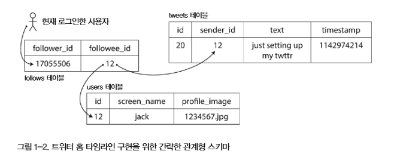
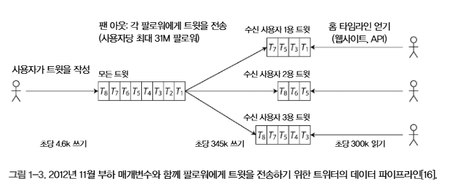
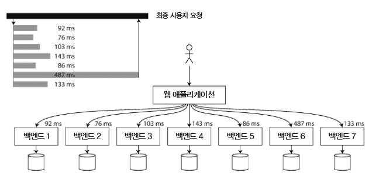

# 🔴 신뢰할 수 있고 확장 가능하며 유지보수하기 쉬운 애플리케이션

오늘날 많은 애플리케이션은 계산 중심과는 다르게 _데이터 중심적_ 이다.

애플리케이션에서 주요한 고려사항은 CPU 성능이 아닌 데이터의 양, 데이터의 복잡도, 데이터의 변화 속도이다.

데이터 중심 애플리케이션은 공통으로 필요하는 기능을 제공하는 표준 구성 요소로 만든다.

- `데이터베이스(database)` : 데이터를 저장
- `캐시(cache)` : 읽기 속도 향상을 위해 기억
- `검색 색인(search index)` : 검색 데이터를 필터링 제공
- `스트림 처리(stream processing)` : 비동기 처리를 위해 메세지 처리
- `일괄 처리(batch processing)` : 대량 데이터 일괄 분석

이러한 부분들은 너무 뻔하게 들리지만 그만큼 데이터 시스템이 성공적으로 추상화되어 많은 개발자들이 사용하고 있다는 말이기도 하다.

하지만 애플리케이션마다 요구사항이 다르기에 DB 시스템 또한 다양한 특성을 가지고 있고 캐싱, 검색 색인을 구축하는 여러가지 방법이 있다.

애플리케이션을 만들 때 어떤 방법이 작업에 가장 적합한지 생각해야 한다.

이 책은 데이터 시스템의 원칙(principle)과 실용성(practicality), 그리고 이를 활용한 데이터 중심 애플리케이션을 개발하는 방법을 담고 있다.

## 🟠 데이터 시스템에 대한 생각

데이터 시스템은 데이터베이스, 큐, 캐시 등을 모두 포괄적 용어로 묶어야 한다.

1. 데이터 저장 처리를 위한 새로운 도구들은 최근에 만들어졌고 더 이상 전통적인 분류에 맞지 않는다.
    - 예를 들어 메세지 큐로 사용하는 데이터스토어인 Redis가 있고 DB처럼 지속성을 보장하는 큐로 Kafka가 있다.
    - 데이터베이스, 큐, 캐시의 경계가 흐려지고 있다.
2. 애플리케이션의 요구사항을 만족하기 위해서는 단일 도구로는 만족할 수 없고 다양한 도구들은 코드로 연결된다.
    - 예를 들어 데이터베이스와 캐시 계층, 전문 검색 서버의 경우 보통 애플리케이션의 코드를 통해 관리되고 있다.
3. 그렇기에 개발자는 애플리케이션 개발자일 뿐만 아니라 데이터 시스템 설계자이기도 하다.

이 책에서는 소프트웨어 시스템에서 중요하게 여기는 세 가지 관심사에 중점을 둔다.

1. `신뢰성(Reliability)`
    - 시스템은 어떠한 문제 상황에서도 올바르게 동작해야 한다.
2. `확장성(Scalability)`
    - 시스템의 데이터, 트래픽, 복잡도가 증가하면서 이를 처리할 수 있는 방법이 있어야 한다.
3. `유지보수성(Maintainability)`
    - 모든 개발자가 시스템 상에서 생산적으로 작업할 수 있게 해야 한다.

```text
✅ 요약 
데이터는 DB, Cache, Queue등으로 분리하여 생각하기도 하지만 실제론 모두 코드로 연결되고 구현되고 있다.
이를 구현하는 개발자는 애플리케이션 개발이기도 하지만 실제론 데이터 시스템을 개발하는 것이나 다름 없다.
데이터 시스템을 구현하는데 중요한 3가지 요소에 대해 앞으로 설명하겠다.
```

## 🟠 신뢰성

소프트웨어에서 기대하는 신뢰성은 다음과 같다.

1. 애플리케이션은 사용자가 기대한 기능을 수행한다.
2. 시스템은 사용자가 범한 실수나 예상치 못한 소프트웨어 사용법을 허용할 수 있다.
3. 시스템 성능은 예상된 부하와 데이터 양에서 필수적인 사용 사례를 충분히 만족한다.
4. 시스템은 허가되지 않은 접근과 오남용을 방지한다.

신뢰성을 위해서는 `잘못되더라도 올바르게 동작함`을 신뢰성의 의미로 해석할 수 있다.

`결함(fault)`을 잘못될 수 있는 일이라 부르며, 결함을 예측하고 대처할 수 있는 시스템을 내결함성(fault-tolerant) or 탄력성(resilient)를 지녔다고 한다.

다만 `장애(failure)`는 결함과 다르다. 시스템 전체가 멈추는 경우를 장애라고 한다.

### 🟢 하드웨어 결함

하드 고장, 램 결함, 정전 사태 등으로 인해 시스템에 결함이 발생하는 것을 하드웨어 결함이라 한다.

하드웨어 결함을 대응하기 위해서 사용하는 대응으로는 `중복(redundancy)`을 추가하는 것이 일반적인 방법이다.

한대에 장비에만 의존한다면 시스템이 전체 중단되는 것은 당연한 일이다. 그렇기 때문에 현재의 시스템 구성은 대부분 중복을 필수적으로 적용하고 있다.

이런 시스템은 운영상 장점이 있는데, 시스템의 패치를 적용하는 경우 시스템 중단 없이 한번에 한 노드씩 패치를 진행할 수 있다.

### 🟢 소프트웨어 결함

1. 잘못된 특정 입력이 있을 때 모든 애플리케이션 서버가 죽는 버그
2. CPU 시간, 메모리, 디스크 공간, 네트워크 대역폭 처럼 공유 자원을 과도하게 사용하는 프로세스
3. 시스템 속도가 느려져 반응이 없거나 잘못된 응답을 반환하는 서비스
4. 한 구성 요소의 결함이 다른 구성 요소의 결함을 야기하여 차례로 더 많은 결함이 발생하는 연쇄 장애

이 같은 소프트웨어 결함을 유발하는 버그는 특정 상황이 발생하기 전까지는 알 수 없다.

이를 대응하기 위해서는

1. 시스템 상호작용에 대해 주의 깊게 생각하기
2. 빈틈없는 테스트
3. 프로세스 격리
4. 죽은 프로세스의 재시작 허용
5. 프로덕션 환경에서 시스템 측정, 모니터링, 분석하기
6. 알림 시스템

와 같은 일들이 문제 해결에 도움을 줄 수 있다.

### 🟢 인적 오류

사람은 시스템을 설계하고 구축하며, 운영한다. 실수하지 않으려고 노력하지만 사람은 결함을 만들 수 밖에 없다.

하지만 사람이 결함을 만들지 않기 위해 노력할 수 있는데 최고의 시스템은 다양한 접근 방식을 사용한다.

1. 오류의 가능성을 최소화하는 방향으로 시스템을 설계하라.
    - 예를 들어 잘 설계된 interface는 개발자가 해야할 일을 쉽게 알고 구현할 수 있다.
2. 사람이 가장 많이 실수하는 부분에서 사람의 실수로 장애가 발생할 수 있는 부분을 분리하라
    - 실제 사용자에게 영향이 없는 dev 환경을 구축하여 안전하게 테스트할 수 있다.
3. 단위 테스트부터 전체 통합 테스트와 수동 테스트까지 모든 수준에서 철저하게 테스트 하라.
4. 장애 발생의 영향을 최소화하기 위해 인적 오류를 빠르고 쉽게 복구할 수 있게 하라.
5. 성능 지표와 오류율 같은 상세하고 명확한 모니터링 대책을 마련하라.
6. 조기 교육과 실습을 시행하라.

### 🟢 신뢰성은 얼마나 중요할까?

신뢰성의 저하는 사용자에게 부정적인 경험을 제공하고 그러한 경험은 부정적인 이미지를 제공한다.

```text
✅ 요약 
신뢰성이란 말은 결함이 없는 시스템을 말할 수 있다.
결함의 종류로는 하드웨어, 소프트웨어, 인적 결함이 존재하고 이러한 결함들을 방지하기 위한 방법들이 존재한다.
```

## 🟠 확장성

`확장성`은 증가하는 부하에 대처하는 시스템 능력을 말한다.

### 🟢 부하 기술하기

시스템의 부하를 간결하게 기술해야 한다. 부하는 load parameter(부하 매개변수)라 부르는 몇개의 숫자로 나타낼 수 있다.

1. 웹 서버의 초당 요청 수
2. DB의 읽기 vs 쓰기 비율
3. 대화방의 동시 활성 사용자(active user)
4. 캐시 적중률

평균적인 데이터가 중요할 수도 있고 최소, 최대의 경우가 중요할 수도 있다.

예시로 트위터의 사례를 살펴보자. 트위터는 주요 두가지 동작이 있다.

1. 트윗 작성
    - 사용자는 팔로워에게 새로운 메세지를 게시할 수 있다.

2. 홈 타임라인
    - 사용자는 팔로우한 사람이 작성한 트윗을 볼 수 있다.

트위터의 문제는 주로 fan-out 때문이다. 개별 사용자는 많은 사람을 팔로우하고 또한 많은 사람이 개별 사용자를 팔로우한다.

이를 구현하는 방법은 크게 두가지 이다.

1. 트윗 테이블에 데이터를 넣고 사용자가 자신의 홈 타임라인을 요청하면 팔로우하는 모든 사람을 찾고, 이 사람들의 모든 트윗을 찾아 시간순으로 정렬하여 합친다.
2. 각 수신 사용자용 트윗 우편함처럼 개별 사용자의 홈 타임라인 캐시를 유지한다. 사용자가 트윗을 작성하면 해당 사용자를 팔로우 하는 사람을 모두 찾고 홈 타임라인 캐시에 트윗을 삽입한다.
    - 홈 타임라인의 읽기 요청은 요청 결과를 미리 계산해두어 캐싱해두었기 때문에 비용이 저렴해진다.




평균적으로 `트윗 게시 요청량`이 `홈 타임라인 읽기 요청량`에 비해 수백 배 적기 때문에 2번 방식이 훨씬 유리하다.

그래서 이 경우에는 쓰기 시점에 더 많은 일을 처리하고, 읽기 시점에 적은 일을 처리하는게 바람직하다.

하지만 접근 방식 2의 불리한 점은 트윗 작성이 많은 부가 작업을 필료오 한다는 점이다.

그래서 현재는 대부분의 사용자들은 2번 방식의 접근을 사용하고 사용자가 팔로우한 유명인의 트윗은 별도로 가져와 접근 방식 1번처럼 읽는 시점에 홈 타임라인에 가져와 합치는 방법을 적용하고 있다.

### 🟢 성능 기술하기

부하를 기술하면 부하가 증가할 때 어떤 일이 일어나는지 알 수 있다.

1. 부하 매개변수를 증가시키고 시스템 자원은 변경하지 않고 유지하면 시스템 성능은 어떻게 영향을 받을까?
2. 부하 매개변수를 증가시켰을 때, 성능이 변하지 않고 유지되길 원한다면 자원을 얼마나 많이 늘려야 할까?

두 질문 모두 성능 수치가 필요하다. 시스템 성능에 대해 알아보자.

하둡과 같은 일괄 처리 시스템은 처리량(throughput)에 관심을 가진다. 반면 온라인 시스템에서는 응답 시간(response time)에 관심을 가진다.

사용자가 반복해서 요청을 한다면 매번 응답 시간은 다르다. 그러므로 응답 시간은 단일 숫자가 아닌 측정 가능한 분포로 생각해야 한다.

`p50(=50분위 중앙값)` : 사용자가 보통 얼마나 오랫동안 기다려 하는지 알고 싶다면 좋은 지표

`p95, p99, p999` : 보통이 아닌 그 외의 요청은 얼마나 오랫동안 기다려야 하는지 알고 싶다면 좋은 지표

`꼬리 지연 시간(tail latency)`은 서비스의 사용자 경험에 직접 영향을 주기 때문에 중요하다. 평균 응답 시간이 아무리 빨라도 꼬리 지연 시간이 느리다면 사용자의 경험이 부정적일 수 있다.

그렇기 때문에 `p50`의 평균값이 아닌 `p95, p99, p999`와 같은 꼬리지연을 확인할 수 있는 지표를 참고하는 것이 중요하다.



### 🟢 부하 대응 접근 방식

부하 대응에 대해 확장성과 관련하여 2가지로 구분하여 말한다.

1. `용량 확장(scaling up), 수직 확장(vertical scaling)` : 강력한 장비로 이동
2. `규모 확장(scaling out), 수평 확장(horizontal scaling)` : 다수의 낮은 사양 장비로 부하를 분산
    - 다수의 장비에 부하를 분산하는 아키텍처를 비공유(shared-nothing) 아키텍처라고 부른다.

현실적으로 좋은 아키텍처는 실용적인 접근 방식의 조합이 필요하다. 예를 들어 적절한 사양의 장비 몇 대가 다량의 낮은 사양 장비보다 훨씬 저렴하고 간단하기 때문이다.

또한 시스템 부하에 따른 확장에 결정은 다음과 같다.

1. 부하 증가 감지시 컴퓨팅 자원을 자동 추가(=탄력적(elastic))
2. 사람이 수동으로 분석하고 장비를 추가

탄력적인 시스템은 부하를 예측할 수 없을 만큼 높은 경우 유용하지만 수동으로 확장하는 시스템이 더 간단하고 운영상 예상치 못한 일이 일어날 경우가 적다.

분산 시스템을 위한 도구와 추상화(=개발자들의 사용성)가 좋아지면서 앞으로는 분산 데이터 시스템이 기본 아키텍처로 자리 잡을 가능성이 있다.

```text
✅ 요약 
확장성을 위해 부하를 기술하여 부하 매개변수를 파악하여 어떤 부분이 문제인지 빠르게 파악한다. 
성능을 기술하여 성능상 문제가 있을 부분을 파악한다. 웹 서비스에서 중요한 성능은 응답 시간이다.
부하에 대응 방식으로는 scaling up, out이 있으며 해당 방식은 앞으로 기본 아키텍처로 자리 잡을 가능성이 있다.
```

## 🟠 유지보수성

시스템은 한 번 만들고 끝나는 것이 아니라, 지속적으로 수정·개선되며 시간이 지남에 따라 유지보수 비용이 점점 커진다.
따라서 시스템은 개발자와 운영자가 오랜 기간에도 쉽게 이해하고, 수정하고, 발전시킬 수 있도록 설계되어야 한다.

이를 위해 고려해야 할 3가지 관점이 있다.

1. 운용성(Operability) – 운영하기 쉽게
2. 단순성(Simplicity) – 불필요한 복잡도 줄이기
3. 발전성(Evolvability) – 변화에 잘 적응하기

### 🟢 운용성 : 운영의 편리함 만들기

시스템을 지속해서 원활하게 작동하려면 운영은 필수다.

좋은 운영을 위한 자동화 방법은 아래와 같다.

1. 시스템 상태를 모니터링하고 상태가 좋지 않다면 빠르게 서비스 복원
2. 시스템 장애, 성능 저하 등의 문제의 원인을 추적
3. 소프트웨어와 플랫폼을 최신 상태로 유지
4. 다른 시스템이 서로 어떻게 영향을 주는지 확인해 문제가 생길 수 있는 변경 사항을 사전에 차단
5. 미래에 발생 가능한 문제를 예측해 문제가 발생하기 전에 해결
6. 배포, 설정 관리 등을 위한 모범 사례와 도구 마련
7. 애플리케이션을 특정 다른 플랫폼으로 이동하는 등 복잡한 유지보수 태스크 수행
8. 설정 변경으로 생기는 시스템 보안 유지보수
9. 예측 가능한 운영과 안정적인 서비스 환경 유지를 위한 절차 정의
10. 개인 인사 이동에도 시스템에 대한 조직이 지식은 보존

좋은 운영을 위한 반복 업무를 하는 방법은 아래와 같다.

1. 좋은 모니터링 런타임 동작과 시스템 내부에 대한 가시성 제공
2. 표준 도구를 이용해 자동화와 통합을 위한 우수한 지원을 제공
3. 개별 장비 의존성을 회피, 유지보수를 위해 장비를 내려도 전체 시스템에 영향을 주지 않고 지속적 운영 가능
4. 좋은 무서와 이해하기 쉬운 운영 모델 제공
5. 만족할 만한 기본 동작을 제공하고, 필요할 때 기본값을 다시 정의할 수 있는 자유를 관리자에게 부여
6. 적절하게 자기 회복이 가능할 뿐 아니라 필요에 따라 관리자가 시스템을 수동으로 제어
7. 예측 가능하게 동작하고 예기치 않은 상황을 최소화

### 🟢 단순성 : 복잡도 관리

복잡도의 증가는 다양한 증상으로 나타난다.

1. 상태 공간의 급증
2. 강한 커플링
3. 복잡한 의존성
4. 일관성 없는 명명 규칙
5. 성능 문제 해결을 목표로 한 해킹
6. 임시방편으로 문제를 해결한 사례

시스템의 복잡도로 인해 유지보수가 어려워질 때 소프트웨어에서 버그가 생길 위험이 더 크고 비용도 증가한다.

시스템 복잡도를 낮추는 가장 좋은 도구는 추상화이다. 예를 들어 고수준 프로그래밍언어는 기계어, CPU 레지스터, 시스템 호출을 숨긴 추상화다.

## 🟢 발전성 : 변화를 쉽게

시스템의 요구사항은 끊임없이 변한다. 조직 프로세스 측면에서 애자일 작업 패턴은 변화에 적응하기 위한 프레임워크를 제공한다.
TDD, 리팩토링 같이 자주 변화하는 환경에서 소프트웨어를 개발할 때 도움이 되는 기술 도구와 패턴을 개발한다.
간단하고 이해하기 쉬운 시스템은 복잡한 시스템보다 수정하기 쉽다. 그렇기에 시스템의 단순성은 발전성과 연관이 있다.

```text
✅ 요약 
시스템을 유지보수하기 좋게 만들기 위해서는 운용성, 단순성, 발전성을 고려해야한다.
```