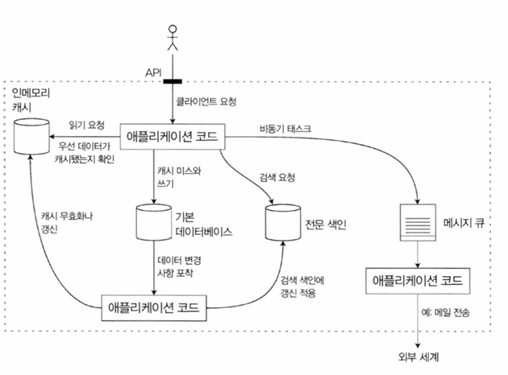

# 신뢰할 수 있고 확장 가능하며 유지보수하기 쉬운 애플리케이션

오늘날 많은 애플리케이션은 계산 중심 → 데이터 중심적

- CPU 성능은 애플리케이션을 제한하는 요소가 아님
- 데이터의 양, 복잡도, 변화 속도

일반적인 데이터 중심 애플리케이션의 표준 구성 요소

- 데이터 베이스
- 캐시
- 검색 색인
- 스트림 처리
- 일괄 처리

## 데이터 시스템에 대한 생각

- 데이터베이스, 큐, 캐시 등은 매우 다른 범주에 속하는 도구들
- 하지만 왜 **데이터 시스템** 이라는 포괄적 용어로 묶어야 하는가 ?
    - MQ 로 사용가능한 레디스도 있고, 지속성을 가진 카프카도 있다. 분류간 경계가 흐려지고 있음
    - 단일 도구 만으로는 처리와 저장 모두를 만족시킬 수 없다
- 작업은 단일 도구에서 효율 적으로 수행가능한 테스크로 나누고, 여러 도구들을 이용해 연결 하는 방식으로 처리한다

- 소프트웨어 시스템에서 중요하게 여기는 세 가지 관심사를 이후에 다룸
    - 신뢰성
    - 확장성
    - 유지보수성

## 신뢰성

- 소프트웨어의 일반적인 기대치
    - 애플리케이션은 사용자가 기대한 기능을 수행
    - 시스템은 사용자가 범한 실수나 예상치 못한 소프트웨어 사용법을 허용할 수 있음
    - 시스템 성능은 예상된 부하와 데이터 양에서 필수적인 사용사례를 충분히 만족함
    - 시스템은 허가되지 않은 접근과 오남용을 방지함
- 신뢰성 → 무언가 잘못되더라도 지속적으로 올바르게 동작한다
- 결함 → 잘못될 수 있는 일
- 결함을 예측하고 대처가능한 시스템 → **내결함성 (fault-tolerant)** 또는 **탄력성(resilient)** 을 지녔다고 말함
- 결함 ≠ 장애
- 장애 → 사용자에게 필요한 서비스를 제공하지 못하고 시스템 전체가 멈춘 경우
- 결함 확률을 0 으로 만드는 것은 불가능하지만, 결함으로 인해 장애가 발생하지 않게끔 내결함성 구조를 설계하는 것이 가장 좋음
- 실제 많은 중대한 버그는 미흡한 오류 처리에 기인한다
- 고의적으로 결함을 유도해 내결함성 시스템을 훈련하고, 올바르게 대처가능하도록 한다
    - 넷플릭스의 **카오스 몽키**

### 하드웨어 결함

- 시스템 장애 원인 → 하드웨어 결함인 경우도 종종 발생
- 대규모 정전, 화재 등..
- 하드디스크 평균 장애시간은 10 ~ 50년.
- 즉 10,000 개 디스크로 구성된 클러스터는 평균 하루에 한 개의 디스크가 죽는다고 예상해야 함
- 시스템 장애율을 줄이기 위한 방법 → 각 구성요소에 중복 요소를 추가한다
    - RAID
    - 이중 전원 디바이스, 핫스왑 CPU
    - 예비 전원, 발전기 등
- 새 장비에 빠르게 복원이 가능하다면, 장애 발생시 다운타임은 대부분 치명적이지 않다
    - 고가용성은 절대적으로 필요한 소수 애플리케이션에만 필요했다
- 데이터양과 애플리케이션 계싼 요구가 늘어나며, 수 많은 장비를 사용하게 되고
- 이와 비례하여 하드웨어 결함도 증가했다

### 소프트웨어 오류

- 보통 하드웨어 결함은 무작위적이고 서로 독립적이라고 생각함
- 또 다른 부류의 결함은 시스템 내 체계적 오류
    - 예상하기 어렵고, 노드간 상관관계때문에 하드웨어 결함보다 오히려 오류를 더욱 많이 유발하는 경향이 있다
    - 잘못된 특정 입력이 있을 때 모든 애플리케이션 서버 인스턴스가 죽는 소프트웨어 버그. 예를 들어 리눅스 커널의 버그로
    인해 많은 애플리케이션이 일제히 멈춰버린 원인이 된 2012년 6월 30일 윤초
    - CPU 시간, 메모리, 디스크 공간 네트워크 대역폭 처럼 공유 자원을 과도하게 사용하는 일부 프로세스
    - 시스템의 속도가 느려져 반응이 없거나 잘못된 응답을 반환하는 서비스
    - 한 구성 요소의 작은 결함이 다른 구성요소의 결함을 야기하기 차례차례 더 많은 결함이 발생하는 연쇄 장애
- 소프트웨어 결함을 유발하는 버그는, 특정 상황이 발생하기 전까지 나타나지 않음
- 이 문제는 신속한 해결책이 없다
- 테스트, 프로세스 격리 등 지속적으로 확인 해야 함

### 인적 오류

- 운영자의 설정 오류가 중단의 주요 원인이지만, 하드웨어는 10 ~ 25% 정도
- 사람이 미덥지 않아도 시스템을 신뢰성 있기 만드는 방법 ?
    - 오류의 가능성을 최소화하는 방향으로 시스템을 설계하라
        - 잘 추상회된 API, 인터페이스를 사용.
        - 지나치게 제한적이면 이를 피해 작업하게 될 수도 있다
    - 사람이 가장 많이 실수하는 장소(부분)에서 사람의 실수로 장애가 발생할 수 있는 부분을 분리하라
        - 실제 사용자에게 영향 없는 비 프로덕션 샌드박스 사용
    - 단위 테스트부터 전체 시스템 통합 테스트와 수동 테스트까지 모든 수준에서 철저하게 테스트하라
        - 특히 정상적인 동작에서는 거의 발생하지 안흔 코너 케이스를 다루는데 유용함
    - 장애 발생의 영향을 최소화하기 위해 인적 오류를 빠르고 쉽게 복구할 수 있게 하라
        - 설정 내역을 빠르게 롤백하고, 새로운 코드를 서서히 롤아웃 하게 만들어라
    - 성능 지표와 오류율 같은 상세하고 명확한 모니터링 대책을 마련하라
        - 모니터링은 조기에 경고 신호를 보내줄 수 있고 특정 가정이나 제한을 벗어나는지 확인할 수 있게 한다
        - 문제가 발생했을 때 메트릭은 문제 분석시 매우 중요하다

## 확장성

- 현재 안정적으로 시스템이 동작하더라도, 미래에도 동일하다는 보장은 없다
- 성능 저하를 유발하는 흔한 이유 → 부하 증가
- 확장성 → 증가한 부하에 대처하는 시스템 능력
    - 시스템에 부여하는 일차원적 표식이 아니다
- 확장성을 논한다는 것
    - 시스템이 특정 방식으로 커지면 이에 대처하기 위한 선택은 무엇인가 ?
    - 추가 부하를 다루기 위해 자원을 어떻게 투입할까 ?

### 부하 기술하기

- 시스템의 현재 부하를 간결하게 기술해야 한다
- 부하 ⇒ 부하 매개변수라 부르는 몇 개의 숫자로 나타낼 수 있음
    - 가장 적합한 부하 매개변수 선택은 시스템 설계에 따라 달라짐
    - 웹 서버 초당 요청수
    - 데이터 베이스 읽기 쓰기 비율
    - 대화방의 동시 활성 사용자
    - 캐시 적중률

`트위터 예시`

- 트위터의 확장성 문제는 트윗 양이 아닌 팬 아웃 문제
- 개별 사용자는 많은 사람을 팔로우하고, 많은 사람이 개별 사용자를 팔로우 한다
- 이를 구현하는 방식은 크게 두가지
    1. **새로운 트윗을 전역 컬렉션에 삽입**
        - 홈 타임라인을 요청하면, 팔로우 하는 모든 사람을 찾아 실시간으로 트윗을 정렬해 합친다
    2. 각 수신자용 트윗 우편함 처럼 **개별 타임라인 캐시**를 유지
        1. 트윗 작성시 팔로우 하는 사람들을 찾고 각자 타임라인 캐시에 이를 삽입한다

- 1번 방식을 기존에 사용했으나, 부하 문제로 2번으로 전환 했다
- 읽기 요청 > 쓰기 요청 이기 때문에 훨 씬 잘 동작했음
- 하지만 2 번 방식은 트윗 작성이 많은 부가 작업을 필요로 한다
- 최종 방식은 다음과 같다
    - 접근 1과 2를 하이브리드로 변경함
    - 대부분의 사용자의 경우 작성시 홈 타임라인에 작성되지만, 팔로워가 매우 많은 경우 팬 아웃에서 제외됨
    - 유명인의 트윗은 별도로 가져와 1번 방식처럼 읽는 시점에 홈 타임라인에 합친다

### 성능 기술하기

- 시스템 부하를 기술하면, 부하가 증가할 때 어떤일이 일어나는지 조사가 가능하다
    - 부하 매개변수를 증가시키고, 시스템 자원을 유지하면 시스템 성능은 어떻게 영향 받을까 ?
    - 부하 매개변수를 증가시켰을때, 성능이 변하지 않고 유지되길 원한다면 얼마나 많은 자원을 늘려야 할까 ?
- 하둡 과 같은 일괄 처리 시스템 → 보통 처리량 (Throughtpuh) 에 관심을 가진다
- 온라인 시스템에서 더 중요한 사항 → 서비스 응답 시간
    - 클라이언트가 몇번이고 반복해서 동일 요청을 하더라도 매번 응답시간이 다르다
    - 응답 시간은 단일 숫자가 아닌 **측정 가능한 값의 분포**로 생각해야 함
- 모든 요청에 동일한 시간이 걸린다고 생각하는 상황에도 다양한 값을 얻게 됨
    - 컨텍스트 스위칭
    - 네트워크 패킷 손실과 TCP 재전송
    - 가비지 컬렉션 휴지
    - 디스크 읽기를 강제하는 페이지 폴트
    - 서버 랙의 기계적인 진동 등
- 평균 보다 백분위를 사용하는 편이 좋다
    - 사용자가 보통 얼마나 기다려야 하는지 알고 싶다 → 중앙값이 좋은 지표
- **꼬리 지연 시간 (tail latency)**
    - 상위 백분위 응답 시간
    - 서비스의 사용자 경험에 직접 영향을 준다
    - 보통 응답시간이 가장 느린 고객은 많은 구매를 해서 가장 소중한 고객들이다
    - 아마존은 응답 시간이 100밀리초 증가하면 판매량이 1% 줄어들고, 1초가 늘어지면 만족도 지표는 16% 줄어드는 현상을 관찰했다
- 백분위는 서비스 수준 목표(SLO) 와 서비스 수준 협약서 (SLA) 에 자주 사용한다
- **선두 차단 (head-of-line blocking)**
    - 소수의 느린 요청 처리만으로 후속 요청 처리가 지체된다
    - 큐 대기 지연 과 같은 케이스
    - 이 떄문에 클라이언트는 전체적으로 응답이 느리다고 생각한다
- 이런 문제들 때문에 클라이언트 응답 시간 측정이 중요함
- **꼬리 지연 증폭 (tail latency amplification)**
    - 백엔드에서 병렬적으로 호출하더라도 최종 사용자 요청은, 병렬 호출 중 가장 느린 호출이 완료되기를 기다려야 한다

### 부하 대응 접근 방식

- 용량 확장, 수직 확장, 규모 확장, 수평 확장 등 확장성과 관련해 구분해서 말하곤 한다
- 다수의 장비에 부하를 분산하는 아키텍처 → 비공유 아키텍처
- 다수의 장비에 stateless 서비스를 배포하는 일은 간단하다
    - 단일 노드에 상태 유지 데이터 시스템을 분산 설치하는 것은 아주 많은 복잡도가 추가 발생한다
- 확장 비용이나 데이터베이스를 분산으로 만들어야 하는 고가용성 요구가 있을 때까지 **단일 노드에 데이터베이스를 유지하는 것 (용량 확장)** 이 최근까지의 통념
- 아키텍처를 결정하는 요소 → 읽기, 쓰기, 저장할 데이터, 복잡도, 응답시간, 접근 패턴 등이 있다
- 스타트업 초기 단계나 검증되지 않은 제품의 경우 미래를 가정한 부하에 대비해 확장하기 보다 빠르게 반복해 제품 기능을 개선하는 작업이 좀 더 중요하다

## 유지보수성

- 버그 수정, 시스템 운영 유지, 장애 조사, 신규 플랫폼 적응, 새 사용사례를 위한 변경, 기술 부채 , 신규 기능 추가 등이 있다
- 고통을 최소화하고 레거시를 직접 만들지 않게끔 소프트웨어를 설계 해야한다
    - 운용성
        - 운영팀이 시스템을 원할하게 운영할 수 있게 쉽게 만들어라
    - 단순성
        - 시스템에서 복잡도를 최대한 제거해 새로운 엔지니어가 시스템을 이해하기 쉽게 만들어라
    - 발전성
        - 엔지니어가 이후에 시스템을 쉽게 변경할 수 있게 해라
        - 그래야 요구사항 변경과 같은 예기치 않은 사용 사례를 적용하기 쉽다
        - 이 속성은 유연성, 수정 가능성, 적응성으로 알려져 있다
- 신뢰성, 확장성을 달성하기 위한 쉬운 해결책은 없다. **운용성, 단순성, 발전성을 염두에 두고 시스템을 생각하려 노력**해야 한다

### 운용성 : 운영의 편리함 만들기

- 좋은 운영팀은 다른과 같은 작업을 책임진다
    - 시스템 상태를 모니터링하고 상태가 좋지 않다면 빠르게 서비스를 복원
    - 시스템 장애. 성능 저하 등의 문제의 원인을 추적
    - 보안 패치를 포함해 소프트웨어와 플랫폼을 최신 상태로 유지
    - 다른 시스템이 서로 어떻게 영향을 주는지 확인해 문제가 생길 수 있는 변경 사항을 손상을 입히기 전에 차단
    - 미래에 발생 가능한 문제를 예측해 문제가 발생하기 전에 해결(예를 들어 용량 계획)
    - 배포. 설정 관리 등을 위한 모범 사례와 도구를 마련
    - 애플리케이션을 특정 플랫폼에서 다른 플랫폼으로 이동하는 등 복잡한 유지보수 태스크를 수행
    - 설정 변경으로 생기는 시스템 보안 유자보수- 예측 가능한 운영과 안정적인 서비스 환경을 유지하기 위한 절차 정의
    - 개인 인사 이동에도 시스템에 대한 조직의 지식을 보존
- 좋은 운영성이란 **동일하게 반복되는 테스크를 쉽게 수행하게 만들어 고부가가치 활동**에 노력을 집중한다
    - 좋은 모니터링으로 런타임(runtime) 동작과 시스템의 내부에 대한 가시성 제공
    - 표준 도구를 이용해 자동화와 통합을 위한 우수한 지원을 제공
    - 개별 장비 의존성을 회피. 유지보수를 위해 장비를 내리더라도 시스템 전체에 영향을 주지 않고 계속해서 운영 가능해야 함.
    - 좋은 문서와 이해하기 쉬운 운영 모델(예를 들어 “X를 하면 Y가 발생한다”) 제공
    - 만족할 만한 기본 동작을 제공하고, 필요할 때 기본값을 다시 정의할 수 있는 자유를 관리자에게 부여
    - 적절하게 자기 회복(self나sealing)이 가능할 뿐 아니라 필요에 따라 관리자가 시스템 상태를 수동으로 제어할 수 있게 함
    - 예측 가능하게 동작하고 예기치 않은 상황을 최소화

### 단순성 : 복잡도 관리

- 복잡도는 같은 시스템에서 작업 해야 하는 모든 사람의 진행을 느리게 하고 나아가 유지보수 비용이 증가한다
- 복잡도 수렁에 빠진 프로젝트를 때론 **커다란 진흙 덩어리** 로 묘사한다
- **복잡도의 다양한 증상**
    - 상태 공간의 급증
    - 모듈 간 강한 커플링
    - 복잡한 의존성
    - 일관성 없는 명명과 용어
    - 성능 문제 해결을 목표로 한 해킹
    - 임시방편으로 문제를 해결한 특수 사례 등
- 시스템을 단순하게 만드는 일이 반드시 기능을 줄인다는 의미는 아니다
- 우발적 복잡도 (accidental complexity) 를 줄인다는 뜻일 수도 있다
    - 이를 제거하기 위한 최상의 도구 → 추상화
    - 좋은 추상화는 깔끔하고 직관적인 외관 아래 많은 세부 구현을 숨길 수 있다
    - 또한 재사용 성이 좋아 고품질 소프트웨어로 이어진다

### 발전성 : 변화를 쉽게 만들기

- 시스템의 요구사항은 끊임없이 변할 가능성이 훨씬 크다
- 비즈니스 우선순위가 바뀌고 새로운 기능 요청, 새로운 플랫폼이 기존 플랫폼 변경 등 이런 요구사항에 해당한다
- 조직 프로세스 측면에서 애자일 작업 패턴은 변화에 적응하기 위한 프레임 워크를 제공한다

## 정리

- 신뢰성은 결함이 발생해도 시스템이 올바르게 동작하게 만든다는 의미다
- 결함은 하드웨어와 소프트웨어 버그와 사람에게 있을 수 있다
- 내결함성 기술은 최종 사용자에게 특정 유형의 결
함을 숨길 수 있게 해준다
- 확장성은 부하가 증가해도 좋은 성능을 유지하기 위한 전략을 의미한다.
- 유지보수성에는 많은 측면이 있지만 유지보수성의 본질은 시스템에서 작업하는 엔지니어와 운영 팀
의 삶을 개선하는 데 있다.
- 좋은 추상화는 복잡도를 줄이고 쉽게 시스템을 변경할 수 있게 하며 새로운 사용 사례에 적용하는 데 도움이 된다
- 좋은 운용성이란 시스템의 건강 상태를 잘 관찰할 수 있고 시스템을 효율적으로 관리하는 방법을 보유한다는 의미다

