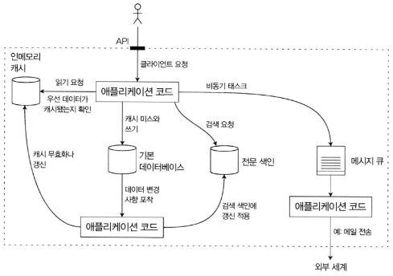

# 1장. 신뢰할 수 있고 확장 가능하며 유지보수하기 쉬운 애플리케이션

- 오늘날 많은 애플리케이션은 데이터 중심(data-intensive)
    - 표준 구성 요소: 데이터베이스, 캐시, 검색 색인, 스트림 처리, 배치 처리

## 데이터 시스템에 대한 생각

---

그림 1-1. 다양한 구성 요소를 결합한 데이터 시스템 아키텍처의 예

- 복합 데이터 시스템(composite data system): 외부 클라이언트가 일관된 결과를 볼 수 있게끔 쓰기에서 캐시를 올바르게 무효화하거나 업데이트하는 등의 특정 보장 기능을 제공할 수 있다.

❗개발자는 애플리케이션 개발자뿐만 아니라 데이터 시스템 설계자이기도 하다.

- 소프트웨어 시스템 관심사
    - 신뢰성(Reliability): 하드웨어나 소프트웨어 결함, 심지어 휴먼 에러 같은 역경에 직면하더라도 시스템은 지속적으로 올바르게 동작해야 한다.
    - 확장성(Scalability): 시스템의 데이터 양, 트래픽 양, 복잡도가 증가하면서 이를 처리할 수 있는 적절한 방법이 있어야 한다.
    - 유지보수성(Maintainability): 시간이 지남에 따라 여러 다양한 사람들이 시스템 상에서 작업할 것이기 때문에 모든 사용자가 시스템 상에서 생산적으로 작업할 수 있게 해야 한다.

## 신뢰성

---

- 의미: 하드웨어, 소프트웨어, 인적 오류에도 올바르게 지속 동작.
    - 하드웨어 결함 (디스크, 서버, 네트워크 고장)
    - 소프트웨어 오류 (체계적 오류, 연쇄 장애)
    - 인적 오류 (설정 실수, 배포 문제 등)

- 결함(Fault): 잘못될 수 있는 일
    - 결함을 예측하고 대처할 수 있는 시스템: 내결함성(Fault-tolerant), 탄력성(Resilient)을 지녔다.
- 장애(Failure): 사용자에게 필요한 서비스를 제공하지 못하고 시스템 전체가 멈춘 경우

### 하드웨어 결함

---

- 하드디스크 고장, 램 결함, 대규모 정전 사태, 네트워크 케이블을 잘못 뽑는 것 등
- 하드디스크의 평균 장애 시간: 약 10~50년
    - 1만개 디스크로 구성된 저장 클러스터는 평균적으로 하루에 한 개의 디스크가 죽는다고 예상해야 한다.
- 시스템 장애율을 줄이기 위한 대응: 각 하드웨어 구성 요소에 중복을 추가하는 방법
- 무작위적이고 서로 독립적이다.
    - 한 장비의 디스크에 장애가 있다고 해서 다른 장비의 디스크에 장애가 발생하지는 않는다.
- 전체 장애 중 10~25% 차지

### 소프트웨어 오류

---

- 예상하기가 더 어렵고 노드 간 상관관계 때문에 상관관계 없는 하드웨어 결함보다 오히려 시스템 오류를 더욱 많이 유발하는 경향이 있다.
    - 특정 상황에 의해 발생하기 전까지 오랫동안 나타나지 않는다.
- 신속한 해결책이 없다.
    - 시스템의 가정
    - 상호작용에 대해 주의 깊게 생각하기
    - 빈틈없는 테스트
    - 프로세스 격리
    - 죽은 프로세스의 재시작 허용
    - 프로덕션 환경에서 시스템 동작의 측정
    - 모니터링
    - 분석하기
    - 지속적으로 확인해 차이가 생기는 경우 경고를 발생시킨다.

### 인적 오류

---

- 설정 실수, 배포 과정 문제, 운영 실수 등. 장애의 주요 원인
- 해결책
    - 오류 가능성을 최소화하는 시스템 설계 (추상화, 제한된 인터페이스)
    - 안전한 테스트 환경(샌드박스) 제공
    - 단위 테스트, 통합 테스트, 수동 테스트, 자동 테스트
    - 빠른 롤백 기능
    - 원격 측정(telemetry)과 모니터링으로 조기 감지
    - 조작 교육과 실습

### 신뢰성은 얼마나 중요할까?

---

- 비즈니스 애플리케이션에서 버그는 생산성 저하의 원인이고 전자 상거래 사이트의 중단은 매출에 손실이 발생하고 명성에 타격을 준다.

## 확장성

---

- 부하 증가에도 성능을 유지하는 능력

### 부하 기술하기

---

- 부하: 부하 매개변수(load parameter)로 나타낼 수 있다.
    - 웹 서버의 초당 요청 수
    - 데이터베이스의 읽기 대 쓰기 비율
    - 대화방의 동시 active user
    - 캐시 적중률 등

### 성능 기술하기

---

- 시스템 성능
    - 처리량(throughput): 초당 처리할 수 있는 레코드 수나 일정 크기의 데이터 집합으로 작업을 수행할 때 걸리는 전체 시간
    - 응답 시간(response time): 클라이언트가 요청을 보내고 응답을 받는 사이의 시간 → 단일 값이 아니라 분포로 이해해야 함
        
        
        
        그림 1-4. 평균과 백분위 예시: 서비스에 대한 100건의 샘플 요청에 대한 응답 시간
        
        - 평균(mean)만으로는 부족 → 백분위(percentile) 사용 권장
            - 중앙값(median, p50), 95분위(p95), 99분위(p99), 꼬리 지연 시간(tail latency)
        - 꼬리 지연 시간: 사용자 경험에 큰 영향 → 99.9% 요청이 느려지면 전체 서비스 품질 악화
        - 백분위: 서비스 수준 목표(SLO)와 서비스 수준 협약(SLA)에 자주 등장한다.
            
            
            
            그림 1-5. 요청을 처리하기 위해 여러 번 백엔드 호출이 필요한 상황에서 단 하나의 느린 백엔드 요청이 전체 최종 사용자 요청을 느리게 한다.
            
    - 지연 시간(latency): 요청이 처리되길 기다리는 시간. 서비스를 기다리며 휴지 상태인 시간

### 부하 대응 접근 방식

---

- 확장성
    - 수직 확장(Vertical scaling, scale up): 더 강력한 장비 사용
    - 수평 확장(Horizontal scaling, scale out): 여러 장비를 병렬로 사용 (비공유 아키텍처, shared-nothing)
- 탄력적(elastic) 시스템: 부하 증가 시 자원을 자동으로 추가/회수
- 상태 비저장(stateless) 서비스는 확장 쉬움, 상태 저장(stateful) 시스템은 확장 어려움 → 분산 데이터베이스가 대표적

- 아키텍처를 결정하는 요소: 읽기의 양, 쓰기의 양, 저장할 데이터의 양, 데이터의 복잡도, 응답 시간 요구사항, 접근 패턴 등

## 유지보수성

---

- 유지보수: 버그 수정, 시스템 운영 유지, 장애 조사, 새로운 플랫폼 적응, 새 사용 사례를 위한 변경, 기술 채무 상환, 새로운 기능 추가 등 지속적 비용 발생
- 엔지니어들은 반복적이고 힘든 유지보수 업무를 싫어함 → 좋은 시스템은 유지보수 부담을 줄여야 함

- 소프트웨어 시스템 설계 원칙
    - 운용성(Operability): 운영팀이 시스템을 쉽게 운영할 수 있어야 함
    - 단순성(Simplicity): 불필요한 복잡성 제거
    - 발전성(Evolvability): 요구사항 변화에 쉽게 대응

### 운용성: 운영의 편리함 만들기

---

- 좋은 운영의 조건
    
    
    
- 운영성: 시스템이 지속적이고 예측 가능하게 동작하도록 보장
    
    
    

### 단순성: 복잡도 관리

---

- 복잡도: 유지보수 비용을 증가시키고 장애를 유발
    - 커다란 진흙 덩어리(Big Ball of Mud): 복잡성이 누적된 소프트웨어의 전형
- 해결책: 추상화(abstraction)를 통해 불필요한 세부 구현 제거

### 발전성: 변화를 쉽게 만들기

---

- 시스템은 반드시 변화에 대응 가능해야 함
- 요구사항 변화, 비즈니스 모델 변화, 규제 변경 → 빠른 적용 필요
- 방법: 애자일 작업 패턴, 테스트 주도 개발(TDD), 리팩토링

## 정리

---

- 데이터 중심 애플리케이션의 핵심 3대 요소
    - 신뢰성: 결함에도 지속적으로 동작
    - 확장성: 부하 증가에도 좋은 성능 유지
    - 유지보수성: 엔지니어들이 생산적으로 작업 가능

→ 애플리케이션을 신뢰할 수 있고 확장 가능하며 유지보수하기 쉽게 만들어준다.
