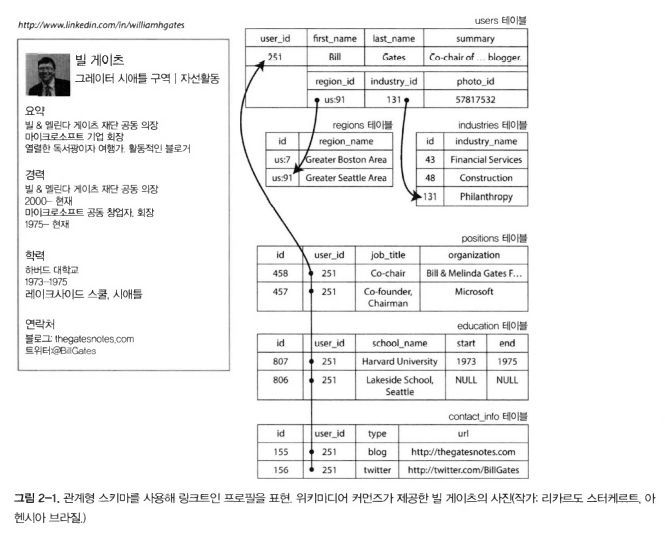
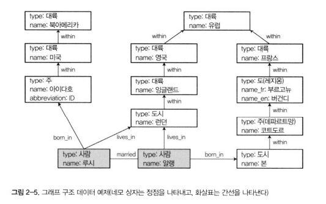
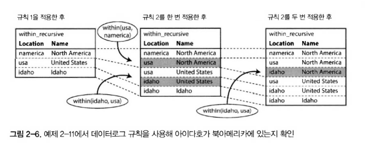

# 🔴 데이터 모델과 질의 언어

데이터 모델은 소프트웨어 개발에서 제일 중요한 부분이다.

데이터 모델을 표현하는 다양한 방법이 있는데

- 애플리케이션 개발자는 현실 객체나 데이터 구조, 그리고 이러한 데이터 구조를 다루는 API를 모델링 한다.
    - 보통의 애플리케이션 특화
- 데이터 구조를 저장할 때는 JSON, XML, RDB table, Graph 같은 범용 데이터 모델로 표현한다.
- JSON/XML/RDB/Graph 데이터를 메모리나 디스크 또는 네트워크 상 바이트 단위로 표현하는 방법을 결정한다.
    - 이를 통해 데이터를 질의, 탐색, 조작, 처리할 수 있게 한다.
- 더 낮은 수준에서 하드웨어 엔지니어는 전류, 빛의 파동, 자기장 등의 관점에서 바이트를 표현한다.

데이터 저장과 질의를 위한 다양한 범용 모델에 대해 살펴본다.

관계형 모델(relational model), 문서 모델(document model), 그래프 기반 모델(graph-based data model)을 비교하고 다양한 잘의 언어에 대해서도 알아보자.

```text
✅ 요약 
데이터를 표현하는 방법으로는 관계형 모델, 문서 모델, 그래프 기반 모델 등 다양한 모델이 있다.
```

## 🟠 관계형 모델과 문서 모델

### 🟢 관계형 모델

현재 가장 잘 알려지고 쓰이는 데이터 모델은 1970년 에드가 코드(Edgar Codd)가 제안한 관계형 모델이다.

데이터는 관계(relation)로 구성되고 각 row(=tuple)의 모음이다.

관계형 모델의 초기에는 이론적 제안이었고 많은 사람들이 효율적으로 구현할 수 있을지에 대해 의문을 가졌지만, 1980년대 중반부터 RDB와 SQL은 정규화된 구조로 데이터를 저장하고 질의해야하는 개발자들이 대부분 선택하는 도구가 되었다.

RDB의 근원은 1960년대와 1970년대에 비즈니스 데이터 처리에 있다. 보통 트랜잭션 처리(은행 거래, 항공 예약, 창고 보관)과 일괄 처리(송장 작성, 급여 지불, 보고)를 주로 처리하였다.

수년 동안 RDB와 다른 데이터 모델들이 경쟁을 했지만 결국 RDB가 우위를 차지했고 오늘날에는 비즈니스 뿐 아니라 대부분의 서비스(SNS, 전사 상거래, 게임, SaaS 등)에서 채택되고 있다.

```text
✅ 요약 
1970년 비즈니스 모델을 위해 탄생한 RDB는 현재까지도 가장 많은 영역에서 사용되고 있다.
```

### 🟢 NoSQL의 탄생

현대에 NoSQL은 RDB와 경쟁하는 최신 시도이다. NoSQL은 RDB에 비해 장점이 있었는데

1. 대규모 데이터셋이나 매우 높은 쓰기 처리량을 RDB보다 쉽게 할수 있는 뛰어난 확장성
2. 상용 데이터베이스 제품이 아닌 무료 오픈소스
3. RDB에서 지원하지 않는 특수 질의 동작
4. RDB 스키마 제한에 대한 불만과 더욱 동적이고 표현력이 풍부한 데이터 모델에 대한 바람

애플리케이션 마다 요구사항이 다르다. 그에 맞게 RDB와 NoSql을 함께 사용하게 될것이다. 이런 개념을 `다중 저장소 시속성(polyglot persistence)`라고 한다.

```text
✅ 요약 
최근 RDB와 경쟁하는 최신 시도이며 RDB가 가지지 못한 다른 장점들이 있다.
```

### 🟢 객체 관계형 불일치

객체지향 언어와 RDB는 코드와 데이터베이스 모델 객체 사이에 거추장스러운 전환 계층이 필요하다. 이런 모델 사이의 분리를 `임피던스 불일치(impedance mismatch)`라고 한다.

ORM을 통해 문제를 해결하려 하지만 두 모델 간의 차이를 완벽하기 숨기기엔 어려움이 있다.

예를 들어 이력서를 RDB로 저장한다면 아래와 같이 OneToMany의 관계를 가진다



이러한 관계는 RDB에서는 다양한 방법으로 나타낼 수 있다.

- 전통적인 SQL 모델에서 가장 일반적인 정규화 표현은 직위, 학력, 연락처, 정보를 개별 테이블에 넣고, 외래키로 users 테이블을 참조하는 방식이다.
- SQL 표준 마지막 버전에서 구조화된 datatype과 xml 데이터에 대한 지원을 추가했다.
  - 단일 로우에 다중 값을 저장할 수 있고 문서 내 질의와 색인이 가능해졌다.
  - 오라클, IBM DB2, MS SQL, Postgre 같은 DB마다 다양한 형태로 지원한다.
  - MySql의 경우도 JSON 타입을 저장할 수 있도록 지원하고 있다.
  
하지만 이력서와 같은 데이터는 JSON 표현이 더욱 잘 표현할 수 있다. 아래 예시 JSON 데이터를 보자.

(MongoDB, RethinkDB, CouchDB, Espresso와 같은 문서 지향 데이터베이스는 JSON 모델을 지원한다.)

```json
{
  "user_id": 251,
  "first_name": "Bill",
  "last_name": "Gates",
  "summary": "Co-chair of the Bill & Melinda Gates... Active blogger.",
  "region_id": "us:91",
  "industry_id": 131,
  "photo_url": "/p/7/000/253/05b/308dd6e.jpg",
  "positions": [
    { "job_title": "Co-chair", "organization": "Bill & Melinda Gates Foundation" },
    { "job_title": "Co-founder, Chairman", "organization": "Microsoft" }
  ],
  "education": [
    { "school_name": "Harvard University", "start": 1973, "end": 1975 },
    { "school_name": "Lakeside School, Seattle", "start": null, "end": null }
  ],
  "contact_info": {
    "blog": "http://thegatesnotes.com",
    "twitter": "http://twitter.com/BillGates"
  }
}
```

RDB에서는 여러 테이블을 join하여 가져와야 하지만 JSON 타입의 데이터는 모든 관련 정보가 한 곳에 있어 질의 하나로 충분하다.

이러한 일대다 관계는 데이터 트리 구조와 같다. 


```text
✅ 요약 
특정 데이터들은 RDB보다 문서형 데이터베이스 모델로 표현할 때 더 쉽고 사람이 읽기 쉽게 표현된다.
```

### 🟢 다대일과 대다다 관계

앞의 예시에서 region_id, industry_id는 평문인 지역이름, 활동이름이 아닌 ID로 주어졌다 왜일까? 평문보다 ID를 사용하는 것이 장점이 존재한다.

- 일관된 스타일과 철자(도시 이름 표기 통일)
- 모호함 회피(동일한 이름의 여러 도시 방지)
- 갱신의 편의성(도시 이름이 바뀌는 경우 ID로 찾아 이름만 수정하면 됨)
- 현지화 지원(국가별 다르게 표시 가능)
- 더 나은 검색(id값으로 더 정확하거나 확장성 있게 검색 가능)
  - ex) 성남을 검색하면 성남이 경기도 내에 속해 있고 데이터 상 연결되어 있다면 경기도까지 확장해서 검색이 가능

id로 저장함으로서 문자열 중복의 문제를 해결할 수 있고 id 자체적으로는 의미가 없기 때문에 다른 정보를 변경하기에 문제가 없어진다.

- RDB는 Join이 쉽기 때문에 다른 테이블의 로우를 참조하는 방식이 일반적이다.
- 문서 데이터베이스는 일대다 트리 구조를 위해 조인이 필요하지 않지만 조인에 대한 지원이 약하다.
- DB에서 Join을 지원하지 않으면 다중 질의를 만들어 코드 레벨에서 데이터를 조합하여 처리해야 한다.
- 애플리케이션 초기 버전이 문서 데이터베이스가 적합할지라도 점차 시간이 지날 수록 데어타는 점차 상호 연결되는 경향이 있다.
- 만약 이력서 예제에서 몇가지 변경사항이 있다 가정해보자.
  - 이력서에 있는 회사, 학교 정보가 entity로서 id로 연결되면 어떻게 될까? 회사, 학교는 각 웹페이지 링크, 로고, 누스 피드 등이 포함될 수 있다.
  - 이력서에 새로운 기능으로 추천서 기능을 추가한다면 추천인에 대한 프로필을 참조해야 한다 또한 추천서는 내가 많은 사람을 추천할 수 있고 많은 사람들에게 내가 추천 받을 수 있는 다대다 관계이다.

```text
✅ 요약 
기존에 문서 데이터베이스에서 간단한 문자열 데이터로 시작하기 좋아 보이지만 시간이 지나면서 기능이 추가되고 수정되며 데이터간의 상호작용이 커지면 entity로 진화하며 데이터의 연관관계가 생길 수 밖에 없다.
```
 
### 🟢  문서데이터베이스는 역사를 반복하고 있나?

RDB는 다대다 관계를 쉽게 Join으로 해결하고 있다. 하지만 문서 데이터베이스와 NoSQL은 DB에서 다대다 관계를 표현하는 제일 좋은 방법에 대해 아직 찾지 못하고 있다.

이러한 문제는 사실 NoSQL보다 훨씬 더 오래되었고 가장 초기의 전산화 데이터베이스 시스템부터 논쟁이 있었다.

1970년대 비즈니스 데이터 처리를 위해 가장 많이 사용한 데이터베이스는 IBM의 IMS(Information Management System)으로 아폴로 우주 프로그램 재고 관리를 위해 개발됐고 1968년 상업용으로 처음 출시되었다.

IMS는 `계층 모델`이라 부르는 데이터 모델을 사용하였는데 이는 문서형 데이터베이스에서 사용하는 `JSON`과 상당히 비슷하다. 모든 데이터를 레코드 내에 중첩된 레코드 트리로 표현한다.

IMS도 일대다 관계는 잘 풀어낸다. 하지만 다대다 관계를 표현하기 위한 Join이 지원하지 않았고 개발자들은 데이터를 중복해서 입력할지 다른 레코드의 참조를 수동으로(=코드 레벨에서) 해결해야할지 결정해야 했다.

이런 문제는 오늘날 문서 데이터베이스를 사용하는 개발자들이 겪는 어려움과 매우 비슷하다.

이러한 문제를 해결하기 위해 다양한 해결책이 제안되었는데 RDB와 네트워크 모델이다. 

```text
✅ 요약
DB 초창기 모델인 IMS는 다대다 관계를 풀언내는데 어려움이 있었고 현재 문서형 데이터베이스 또한 동일한 문제를 겪고 있다.
다대다 관계를 풀어내기 위한 해결책으로는 RDB, 네트워크 모델이 있다.
```

### 🟢 네트워크 모델

네트워크 모델은 코다실 모델이라고도 부른다.

계층 모델과 비교했을 때, 계층 모델은 모든 레코드는 정확하게 하나의 부모만을 가진다. 하지만 네트워크 모델에서 모든 레코드는 다중 부모를 가질 수 있다.

예를 들어 경기도 지역을 위한 하나의 레코드는 이 지역에 사는 모든 사용자에 연결될 수 있다. 코다실 모델은 다대일과 대다다 관계를 모델링 할 수 있다.

네트워크 모델에서 레코드 간 연결은 외래 키 개념보단 프로그래밍에서의 포인터와 더 비슷하다.

레코드에 접근하는 방법은 최상위 레코드(root record)에서부터 연속된 연결 경로를 탐색하는 방법이다.(=접근 경로)

하지만 다대다 관계에서는 다양한 다른 경로가 같은 레코드로 이어지는 경우가 있고 프로그래머는 root 경로부터 이런 다양한 접근 경로를 계속 추적해야 한다.

코다실에서 질의는 레코드 목록을 반복해 접근 경로를 따라 DB 끝에서 끝까지 커서를 움직여 수행한다. 만약 레코드가 다중 부모를 가진다면 애플리케이션 코드는 다양한 관계를 모두 추적해야 한다.(코다실 위원회도 이 방식이 n차원 데이터 공간을 항해하는 것 같다고 인정했다.)

이렇게 다대다 구현은 가능했지만 DB 질의를 위한 코드가 복잡하고 유연하지 못한 문제가 있었고 만약 원하는 데이터를 찾지 못했다면 수 많은 DB 질의 코드를 다시 살펴보고 재작성해야 했다.

```text
✅ 요약
네트워크 모델은 IMS의 트리구조에 비해 자식 또한 다중 부모를 가질 수 있어 일대다, 다대다를 표현할 순 있었지만 다대다를 표현함으로서 발생하는 코드의 복잡성과 유연성 문제가 개발자들을 힘들게 했다. 
```

### 🟢 관계형 모델

RDB는 테이블에 단순히 튜플(=row)를 배치한다는 것이 전부다. 다른 DB처럼 복잡한 접근 경로를 설정하는 것이 아닌 개발자가 원하는 조건에 일치하는 테이블의 row를 선택해 읽는 것이 전부다.

RDB에서 질의 최적화기(query optimizer)는 질의의 어느 부분을 어떤 순서로 실행할지 자동으로 결정하고 index 또한 자동으로 결정한다. 다른 DB는 개발자가 직접 경로를 탐색하고 코드로 작성해야했지만 RDB는 optimizer가 자동으로 선택한다. 

optimizer는 복잡해서 수년 간의 연구와 개발 노력이 들어가는데 비해 RDB는 질의 최적화기를 한번 만들어 놓으면 애플리케이션에서 모두 혜택을 받을 수 있다.

```text
✅ 요약
RDB의 구조는 table과 row 구조로 간단한 구조이다. 거기에 자동화된 query optimizer를 통해 자동으로 가장 빠른 탐색을 지원해준다. 
```

### 🟢 문서 데이터베이스와 비교

문서 데이터베이스는 이전에 계층 모델과 비슷한 점이 있다. 별도의 테이블이 아닌 상위 레코드 내에 중첩된 레코드를 저장하는 것이다.

하지만 다대일, 다대다 관계를 표현할 때 RDB와 문서 데이터베이스는 근본적으로 다르지 않다. 둘다 고유 식별자(id)로 참조한다. RDB에서는 외래키라 부르고 문서 모델에서는 문서 참조(document reference)라 부른다.

이런 부분을 통해 조인이나 후속 질의를 통해 참조하는 데이터를 가져올 수 있도록 한다. 현재까지 문서 데이터베이스는 코다실의 전철을 밟지 않고 있다.

```text
✅ 요약
문서 데이터베이스는 이전에 계층 모델처럼 데이터를 저장하는 것은 비슷하다. 
하지만 다대일, 다대다 관계를 표현할 때는 관계형 데이터베이스와 동일하게 고유 식별자를 통해 join이나 후속 질의를 통해 데이터를 가져오고 있다.
코다실과 똑같은 전철을 밟고 있지 않다. 
```

---

```text
✅ 총 요약
데이터를 표현하는 방법으로 관계형, 문서, 그래프 등 다양한 모델이 있다.
그중 관계형은 현재 가장 많이 사용되고 있다.
하지만 최근 문서형 데이터베이스도 많이 사용되는 추세인데 그에 대한 특징으로는
1. 이전 관계형 모델과 비슷한 형식이다.
2. RDB에서 사용하는 다대일, 다대다 관계 표현이 가능하다.
등이 있다.
```

---

## 🟠 관계형 데이터베이스와 오늘날의 문서 데이터베이스

RDB와 문서 데이터베이스를 비교하는 경우 내결함성과 동시성 처리를 포함해 고려할 차이점이 많다.

이번장에서는 데이터 모델의 차이점에만 집중한다.

| **RDB**                   | **문서 데이터베이스**      |
|---------------------------|--------------------|
| 조인, 다대일, 다대다 관계를 더 잘 지원함  | 스키마 유연성, 지역성       |
|                           | 애플리케이션 데이터 구조에 가까움 |

- 문서 데이터베이스는 RDB에 비해 JSON 처럼 데이터를 자유롭게 추가하고(유연성) 필요한 데이터가 한 레코드 안에 모여 있다(지역성)
- 내결함성은 시스템이 고장나더라도 멈추지 않고 계속 동작할 수 있는 능력을 말한다.
  - master가 죽더라도 slave(replica)를 master로 승격하여 재시동하는 원리 

```text
✅ 요약
RDB와 문서 데이터베이스에 차이점에 대해 자세히 알아보자.
```

### 🟢 어떤 데이터 모델이 애플리케이션 코드를 더 간단하게 할까?

애플리케이션에서 데이터가 문서와 비슷한 구조라면 문서 모델을 사용하는 것이 좋다. 문서와 비슷한 구조인데 RDB를 사용한다면 여러 테이블로 찢는(shredding) 관계형 기법은 오히려 더 복잡한 애플리케이션 코드를 발생시킨다.

하지만 문서 모델에는 제한이 있다. 예를 들어 "사용자 251의 직위 목록의 두 번째 항목"과 같이 표현해야 한다. 하지만 문서가 너무 깊게 중첩되지 않으면 문제가 되진 않는다.

애플리케이션에서 다대다 관계가 중요하지 않은 경우, 예를 들면 이벤트를 기록하여 다대다 관계가 필요하지 않은 애플리케이션에서는 문서 데이터베이스로 충분하다.

하지만 다대다 관계를 사용하는 애플리케이션에서는 문서 모델에서 미흡한 join의 지원은 문제가 될 수 있다.

비정규화를 통해 join의 필요성을 줄일 수는 있지만 애플리케이션 코드는 비정규화된 데이터의 일관성을 유지하기 위해 추가적인 작업을 해야 한다.

혹은 애플리케이션에서 다중 요청을 통해 join을 흉내낼 수 있지만 애플리케이션 자체적인 복잡도가 증가할 뿐만 아니라 대부분 DB의 join보다 코드 레벨에서 join을 흉내낸 경우가 성능적으로 느리다.

이런 경우 문서 모델을 사용하는 것보다 RDB를 사용하는 것이 성능적인 측면에서 좋다.

어떤 데이터 모델이 애플리케이션 코드를 더 간단하게 한다고 말할 수 없다. 데이터간 관계에 따라 다르다. 

상호 연결이 많은 경우에 DB의 적합성은 아래와 같다.

| **문서 데이터베이스** | **RDB** | **그래프 데이터베이스** |
|---------|---------------|----------------|
| 불리함     | 보통            | 자연스러움          |


```text
✅ 요약
어떤 데이터 모델이 애플리케이션 코드를 더 간단하게 만든다고 말하긴 어렵다. 데이터 관계에 따라 적절히 선택하는 것이 필요하다. 
```

### 🟢 문서 모델에서의 스키마 유연성

문서 데이터베이스는 데이터에 스키마를 강요하지 않는다. 스키마가 없다는 뜻은 임의의 키와 값을 문서에 추가할 수 있고 읽을 때 클라이언트는 문서에 포함된 필드의 존재 여부를 보장하지 않는다는 의미이다.

문서 데이터베이스는 스키마리스(schemaless)로 불리지만 오해의 소지가 있다. 데이터를 읽는 코드는 보퉁 구조의 유형을 어느 정도 가정한다.(= 모델링)

즉 암묵적인 스키마가 있지만 데이터베이스에서는 이를 강요하지 않는다는 말이다.

`쓰기 스키마(schema-on-write)`
- RDB처럼 DB에 쓰기 전에 스키마 검사, 잘못된 데이터면 거부
- 정적 타입 확인(컴파일 타임)과 비슷

`읽기 스키마(schema-on-read)`
- 문서 데이터베이스처럼 쓸때는 마음대로 저장, 읽을 때 애플리케이션에서 구조를 해석
- 동적 타입 확인(런타임)과 비슷

이에 대해 많은 논쟁의 여지가 있지만 일반적으로 옳고 그른것은 없다.

이러한 차이는 애플리케이션에서 데이터 타입을 변경하고자 할 때 뚜렷하게 나타난다. 예를 들어 현재 필드에 사용자 이름 전체를 저장하고 있지만 성과 이름을 분리해서 저장한다 가정해보자.

문서 데이터 베이스의 경우 새로운 데이터부터 성과 이름을 분리해서 넣고 애플리케이션에서 성과 이름을 한번에 쓰는 경우를 분리해주는 코드를 처리해주면 된다.

반면 RDB의 경우 마이그레이션(migration)을 수행해야 한다.

```sql
ALTER TABLE users ADD COLUMN first_name text;
UPDATE users SET first_name = split_part(name, ' ', 1); -- PostgreSQL
UPDATE users SET first_name = substring_index(name, ' ', 1); -- MySQL
```

이러한 스키마의 변경은 느리고 애플리케이션을 중단해야할 수도 있기 때문에 개발자들이 선호하지 않는다.

그렇지만 대부분의 RDB는 이러한 동작을 ms 안에 처리한다. MySQL만 예외적이다.

MySQL은 `ALTER TABLE`을 할 경우 전체 테이블을 복사한다. 이는 큰 테이블을 변경할 때 수 분 ~ 수 시간까지 걸릴 수 있다는 의미이다.

또한 큰 테이블에 `UPDATE`문을 실행하면 모든 로우가 재작성할 수도 있고 그런 경우 어떤 데이터베이스는 시간이 오래 걸릴 수 있다.
(이러한 부분을 회피하기 위해서 처음에는 null로 채우고 문서 데이터베이스처럼 읽는 시점에 채울 수도 있긴 하다.)

문서 데이터베이스는 모두 동일한 구조가 아닐때 유리하다.
  - 서로 다른 유형의 오브젝트가 있을 때
    - 한 컬렉션에 사람 문서, 학교 문서, 회사 문서등 정해지지 않은 다른 유형의 오브젝트가 들어가야할 경우 
  - 데이터 구조가 외부 시스템에 의해 결정될 때
    - 외부 API가 전달하는 데이터를 일방적으로 저장해야하는 경우

```text
✅ 요약
문서 데이터베이스는 읽기 스키마로서 유연하게 데이터를 저장하는데 유리하다.
반면 RDB의 경우는 쓰기 스미카로서 스키마의 변경은 시스템에 영향을 줄 수 있는 큰 문제가 된다.
```

### 🟢 질의를 위한 데이터 지역성

만약 이력서와 같은 데이터가 다중 테이블로 나눠졌으면 전체를 검색하기 위해 다중 색인 검색이 필요하다. 이 경우 더 많은 디스크 탐색과 시간이 소요된다.

지역성의 이점은 한 번에 해당 많은 데이터를 필요로 하는 경우 적용된다. 데이터베이스는 대게 문서의 작은 부분에만 접근해도 전체 문서를 다시 저장해야 하기에 큰 문서에서는 낭비일 수 있다.

이런 이유로 문서를 아주 작게 유지하면서 문서의 크기가 증가하지 않도록 권장한다. 지역성은 문서 DB의 장점이지만 데이터가 커지면 성능이 저하되는 원인이 되기도 한다.

또한 이런 지역성은 문서 데이터에만 국한되는 개념이 아니다.

`구글의 스패너(Spanner)`: 부모 테이블 내에 테이블의 로우를 교차 배치되게끔 선언하는 스키마를 허용해 지역성을 제공한다.

`오라클`: 다중 테이블 색인 클러스터 테이블(multi-table index cluster table) 기능을 사용해 지역성을 제공한다.

`빅테이블(Big table)`: 컬럼 패밀리(column-family) 개념을 통해 지역성을 제공한다.

```text
✅ 요약
문서 데이터의 장점은 지역성이다. 하지만 데이터의 크기가 커진다면 오히려 성능의 저하를 불러올 수 있다.
또한 지역성은 RDB에서도 지원하고 있다.
```

### 🟢 문서 데이터베이스와 관계형 데이터베이스의 통합

RDB에서는 XML, JSON 타입(문서 타입)을 지원한다. 또한 문서 데이터베이스는 join을 지원하고 있다.

관계형 데이터베이스와 문서형 데이터베이스는 시간이 지남에 따라 점점 비슷해지고 있다. 이런 현상은 긍정적이다. 서로 부족한 부분을 보완해 나가고 있기 때문이다.

만약 데이터베이스에서 데이터를 문서처럼 다룰 수 있고 관계형처럼 질의할 수 있다면 애플리케이션은 가장 적합한 기능을 조합해서 사용하면 된다. 관계형과 문서의 혼합 모델은 미래 데이터베이스들이 가야할 바른 길이다. 

```text
✅ 요약
RDB는 문서 타입을 지원하고 문서 데이터베이스는 RDB의 join을 지원한다. 점점 서로 닮아가며 보완해가고 있다. 앞으로 혼합 모델로 가는 것이 올바른 길이라 생각한다. 
```

---

```text
✅ 총 요약
관계형 데이터베이스와 문서형 데이터베이스는 서로 누가 더 좋은 데이터베이스라 하기 어렵다.
서로 장단점이 있고 단점을 보완하기 위해 서로 닮아가고 있다. 이러한 부분은 미래에 혼합 모델로 가는 방향이라 생각한다.
```

---

## 🟠 데이터를 위한 질의 언어

관계형 모델이 등장했을 때 데이터를 질의하는 새로운 방법이 함께 등장했다.

SQL은 선언형 질의어인 반면 IMS와 코다실은 명령형 코드를 사용해 데이터 베이스에 질의한다.

IMS와 코다실에서 사용된 질의어는 `명령형`으로 다음과 같다.

```js
function getSharks() {
  var sharks = [];
  for (var i = 0; i < animals.length; i++) {
    if (animals[i].family === "Sharks") {
      sharks.push(animals[i]);
    }
  }
  return sharks;
}
```

반면 SQL은 관계 대수의 구조를 상당히 유사하게 따라한 구조인데

```sql
SELECT * 
FROM animals 
WHERE family = 'Sharks';
```

다음과 같이 `선언형` 질의한다.

`명령형` 언어는 순서대로 연산을 수행하게끔 컴퓨터에 지시한다. 예시 코드와 같이 한줄씩 단계별로 실행하고 조건을 확인하고 변수를 갱신하고 차례대로 진행을 하며 결과를 찾는다.

반면 SQL이나 `선언형` 질의어는 목표를 달성하기 위한 방법이 아니라 알고자하는 데이터의 패턴, 즉 반환 받고자 하는 데이터에 대한 조건과 어떻게 변환할지를 지정하기만 하면 된다.

어떤 순서로 할지 어떤 index로 진행할지, 어떤 조인 함수를 사용할지 등을 결정하는 일은 DB 시스템의 질의 최적화(query optimizer)가 할 일이다.

선언형 질의 언어는 일반적으로 명령형보다 더 간결하고 쉽게 작업할 수 있기 때문에 매력적이다. 하지만 더 중요한 것은 데이터베이스 엔진의 상세 구현이 숨겨져 있어 질의를 변경하지 않고 DB 시스템의 성능을 향상 시킬 수 있다는 것이다.

예를 들어 예시 코드에는 동물 목록이 특정 순서로 나타나며 sharks를 찾고 있다. 만약 데이터베이스 내부적으로 데이터를 옮긴다면 동물이 나타나는 순서가 바뀌고 명령형의 경우에는 코드가 순서에 의존하고 있는지 아닌지 확신할 수 없다. 반면 선언형의 경우는 데이터베이스 자체적으로 자동으로 최적화하여 답을 찾기 때문에 문제가 되지 않는다.

마지막으로 선언형 언어는 병령 실행에 더 유리하다. 오늘날 CPU는 이전보다 훨씬 더 높은 클록 속도로 실행하고 더 많은 코어를 추가하여 빨라지고 있다. `명령형`의 경우 병렬 실행을 수행하게끔 코드로 작성하여 지정하여야 하기 때문에 이후 추가적인 병렬처리를 위해서는 코드 수정이 필요하다.
하지만 `선언형`의 경우 내부 동작은 데이터베이스에서 알아서 처리하기 때문에 개발자는 편하게 더 빠른 병렬 처리를 경험할 수 있다. 

```text
✅ 요약
SQL은 명령형과 선언형 질의어가 있다.
선언형으로 질의할 경우 내가 찾고자 하는 데이터의 조건과 변환 등을 입력만 해주면 query optimizer를 통해 자동으로 처리되어진다.
이러한 부분은 내부적인 데이터 구조나 더 빠른 처리를 위한 병렬 처리 등에서 유리하다.
```

### 🟢 웹에서의 선언형 질의

선언형 질의는 데이터베이스에서만 사용되는 것이 아니다.

바다에 사는 동물에 대한 웹사이트가 있다고 가정해 보자. 사용자는 현재 상어에 대한 페이즈를 보고, 상어 네이게이션 항목을 표시하려고 한다.

```html
<ul>
  <li class="selected">
    <p>Sharks</p>
    <ul>
      <li>Great White Shark</li>
      <li>Tiger Shark</li>
      <li>Hammerhead Shark</li>
    </ul>
  </li>
  <li>
    <p>Whales</p>
    <ul>
      <li>Blue Whale</li>
      <li>Humpback Whale</li>
      <li>Fin Whale</li>
    </ul>
  </li>
</ul>
```

현재 페이지에서 제목을 파란색 배경으로 표시하고 시각적으로 강조하고 싶다고 하자 이는 css로는 아래와 같이 표현할 수 있다.

```css
li.selected > p {
  background-color: blue;
}
```

여기서 css 선택자(selector)를 통해 `li.selected > p`는 파란 스타일을 적용하라고 선언한다.

css 대신 xsl를 사용해 비슷하게 적용할 수 있다.

```xml
<xsl:template match="li[@class='selected']/p">
  <fo:block background-color="blue">
    <xsl:apply-templates/>
  </fo:block>
</xsl:template>
```

XPath 표현식 `li[@class='selected']/p`는 위 css에서 `li.selected > p`와 동일하다. css와 xsl은 스타일을 지정하기 위한 선언형이라는 공통점이 있다.

만약 명령형으로 접근하기 위해 js에서 코어 DOM(Document Object Model) API를 사용한다면 아래와 같다.

```js
var liElements = document.getElementsByTagName("li");
for (var i = 0; i < liElements.length; i++) {
  if (liElements[i].className === "selected") {
    var children = liElements[i].childNodes;
    for (var j = 0; j < children.length; j++) {
      var child = children[j];
      if (child.nodeType === Node.ELEMENT_NODE && child.tagName === "P") {
        child.setAttribute("style", "background-color: blue;");
      }
    }
  }
}
```

js코드는 css와 xsl보다 이해하는데 더 오래 걸리고 어려울 뿐만 아니라 몇가지 문제점도 있다.
- 명령형 코드로 sharks에 직접 blue 속성을 준다면 이후에 selected 상태가 사라져도 스타일은 계속 남아 있는다.
- Document.getElementsByClassName("selected")나 document.evaluate() 같은 새로운 API도 성능을 높일 수 있지만, 개발자가 직접 코드를 작성해야 한다

웹 브라우저에서 선언형 CSS 스타일을 사용하는 편이 js 명령형으로 스타일을 다루기보다 훨씬 낫다. 마찬가지로 데이터베이스에서는 SQL 같은 선언형 질의 언어가 명령형 질의 API보다 좋다.

```text
✅ 요약
웹 브라우저에서도 선언형 질의어가 있다. 그 종류로는 css와 xsl가 있고 만약 명령형으로 css를 처리한다면 더욱 복잡한 문제를 해결해야 되는 상황이 펼쳐진다.
```

### 🟢 맵리듀스 질의(MapReduce)

맵리듀스(MapReduce)는 많은 컴퓨터에서 대량의 데이터를 처리하기 위한 프로그래밍 모델로 구글에 의해 널리 알려졌다.

NoSQL 저장소는 읽기 전용 질의를 수행할 때 제한된 형태의 맵리듀스를 지원한다.

예를 들어 해양 생물학자가 되어 바다에서 동물을 볼 때마다 데이터베이스에 관찰 기록을 추가한다고 해보자. 지금부터 한달에 얼마나 자주 상어를 발견하는지 보고서를 작성하려고 한다.

`RDB`에서는 다음과 같이 질의할 수 있다.

```sql
SELECT date_trunc('month', observation_timestamp) AS observation_month,
       sum(num_animals) AS total_animals
FROM observations
WHERE family = 'Sharks'
GROUP BY observation_month;
```

- `date_trunc('month', observation_timestamp)`은 month를 기준으로 1일로 내림한다. 즉 2025-08-23 이란 데이터는 2025-08-01로 처리된다.

상어를 조건으로 월별로 그룹화한 후 동물의 수를 합치는 것으로 결과를 얻을 수 있다.

같은 내용을 `NoSQL(Mongo DB)`의 맵리듀스 기능을 이용한다면 아래와 같다.

```js
db.observations.mapReduce(
  function map() {
    var year = this.observationTimestamp.getFullYear();
    var month = this.observationTimestamp.getMonth() + 1;
    emit(year + "-" + month, this.numAnimals);
  },
  function reduce(key, values) {
    return Array.sum(values);
  },
  {
    query: { family: "Sharks" },
    out: "monthlySharkReport"
  }
);
```
1. 상어만 필터한다.
2. 질의와 일치하는 모든 문서에 대해 한번씩 map을 호출하며 this 는 문서 객체로 설정된다.
3. map 함수는 `2025-08-01`과 같이 값을 만들어서 emit(방출)한다.
4. map이 방출한 key-value 는 key를 기준으로 그룹화 된다.
5. 같은 키를 같은 모든 key-value는 reduce 함수를 한번 호출한다.
6. reduce는 특정 월의 동물 수를 합친다.
7. 최종 출력은 monthlySharkReport 컬렉션에 기록한다.

예를 들어 observations 컬렉션에 두 데이터가 있다 가정해보자.

```json
{
  "observationTimestamp": "Mon, 25 Dec 1995 12:34:56 GMT",
  "family": "Sharks",
  "species": "Carcharodon carcharias",
  "numAnimals": 3
}
{
  "observationTimestamp": "Tue, 12 Dec 1995 16:17:18 GMT",
  "family": "Sharks",
  "species": "Carcharhias taurus",
  "numAnimals": 4
}
```

1. map이 호출되면 emit("1995-12", 3), emit("1995-12", 4)가 실행된다.
2. emit으로 인해 reduce("1995-12", [3,4])로 호출되고 7을 반환한다.

다음과 같이 실행되는 것이다.

몽고DB의 map과 reduce 함수는 수행할 때 제약 사항이 있다. 두 함수는 순수(pure) 함수여야한다.
- pure 함수란 입력으로 전달된 데이터만 사용하고 추가적인 데이터베이스 질의를 수행할 수 없어야 하며 side effect가 없어야 한다.
- 이러한 제약으로 인해 DB가 함수를 여러번, 임의의 순서로 사용해도 동일한 결과를 반환할 수 있다.

하지만 맵리듀스 자체는 SQL에 비하면 저수준 프로그래밍 모델이라 js 함수인 map, reduce를 직접 작성해야 한다.

그리고 SQL도 경웨 따라 js같은 사용자 정의 함수를 사용할 수 있다. 즉 js 함수를 쓸 수 있다는 것은 맵리듀스만의 장점이라 보긴 어렵다.

맵리듀스의 사용성 문제는 js 함수를 개발자가 직접 신중하게 작성해야 한다는 것인데 이는 하나의 질의를 작성하는 것보다 더 어려운 문제가 되기도 한다. 또한 SQL은 query optimizer를 통해 더욱 좋은 성능을 제공하기도 한다.

이러한 이유로 몽고 DB는 집계 파이프라인(aggregation pipeline)이라 부르는 선언형 질의 언어 지원을 추가하였다.

```js
db.observations.aggregate([
  { $match: { family: "Sharks" } },
  { $group: {
      _id: {
        year: { $year: "$observationTimestamp" },
        month: { $month: "$observationTimestamp" }
      },
      totalAnimals: { $sum: "$numAnimals" }
  }}
]);
```

집계 파이프라인 언어는 표현 측면에서 SQL의 부분 집합과 유사하지만 SQL의 영어 문장 스타일보다는 JSON 기반 구문을 사용한다. 이를 통해 NoSQL 시스템은 뜻하지 않게 선언형 질의문을 개발하고 있는 것이다.


```text
✅ 요약
MapReduce는 NoSQL에서 대량의 데이터를 처리하기 위해 지원하고 있다.
하지만 선언형 질의어에 비해 복잡하고 개발자가 직접 구현해야하는 어려움이 있다.
이를 해결하기 위해 `집계 파이프라인`이라는 선언형 질의어 지원을 추가하였고, NoSQL에서 선언형 질의어를 개발하고 있는 상황이 만들어졌다.
```

---

```text
✅ 총 요약
데이터를 위한 질의어는 선언형(RDB), 명령형(NoSQL)로 나눌 수 있다.
선언형은 명령형에 비해 값을 가져옴에 있어 성능적, 복잡도 적으로 유리하다.
하지만 선언형의 경우 DB에서만 사용되는 것이 아닌 웹(CSS)에서도 사용이 되고 비슷한 장점을 가진다.
또한 명령형 질의어에서 대용량 데이터 처리를 위한 MapReduce가 있는데 명령형의 단점을 그대로 가지고 있다. 이를 개선하기 위해 적용된 집계 파이프라인은 아이러니하게도 선언형 질의 언어를 재개발하게 되었다. 
```

---

## 🟠 그래프형 데이터 모델

앞서 다대다 관계가 다양한 데이터 모델을 구별하는 중요한 부분임을 살펴봤다. 애플리케이션이 주로 일대다 관계이거나 관계가 없다면 문서 모델이 적합했다.

하지만 데이터에서 다대다 관계가 매우 일반적이라면 어떤 모델이 좋을까? 관계형 모델은 단순한 다대다 관계를 다룰 수 있지만 데이터간 연결이 더욱 복잡해지면 그래프로 데이터를 모델링하는 것이 더 자연스럽다.

그래프는 두 유형의 객체로 이뤄진다. `정점(vertex)(= node)(= entity)`과 `간선(edge)(= 관계)(= 호(arc))`이다.

그래프 모델링 데이터 예시로는

- 소셜 그래프
  - 정점은 사람, 간선은 사람들이 서로 알고 있음을 나타탬
- 웹 그래프
  - 정점은 웹 페이지, 간선은 다른 웹페이지들에 대한 링크
- 도로나 철도 네트워크
  - 정점은 교차로, 간선은 교차로 간 도로나 철로 선

자동차 네비게이션은 도로 네트워크에서 두 지점 간 최단 경로를 탐색해서 알려주고, 페이지랭크는 웹 그래프를 사용하여 인기 검색어 순위를 결정한다.

또한 그래프 모델은 같은 데이터에 국한되지 않는다. 예를 들어 페이스북은 다른 여러 유형의 정점과 간선을 단일 그래프로 유지한다.

정점은 사람, 장소, 이벤트, 체크인, 사용자가 작성한 코멘트를 나타낸다.

간선은 어떤 사람이 서로 친구인지, 어떤 위치에서 체크인 했는지, 누가 어떤 글에 코멘트를 했는지, 누가 이벤트에 참석 했는지 등을 나타낸다.

그래프에서 데이터를 구조화하고 질의하는 몇가지 방법이 있다. 속성 그래프 모델(Neo4j, Titan, InfiniteGraph)와 트리플 저장소 모델(Datomic, Allegrograpth)를 설명하고 그래프용 선언형 질의 언어(Cypher, SPARQL, Datalog)를 살펴본다. 이 밖에도 Gremlin과 같은 명령형 그래프 언어와 Pregel 같은 그래프 처리 프레임워크가 있다.



이번 절에서는 위의 예제를 사용한다. 아이다호 출신인 루시와 프랑스 본 출신인 알랭 두사람에 대한 데이터이다. 둘은 결혼해서 런던에 살고 있다.


```text
✅ 요약
다대다 관계를 가장 자연스럽게 표현하는 데이터 모델은 그래프 데이터 모델이다.
그래프는 정점과 간선으로 이루어져 있다.
정점과 간선은 하나의 의미로 국한되지 않고 여러 의미를 가질 수도 있다.
그래프 모델에서 질의하는 여러 방법도 존재하는데 이제부터 알아보자.
```

### 🟢 속성 그래프

| **정점**             | **간선**                 |
|--------------------|------------------------|
| 고유한 식별자(id)        | 고유한 식별자(id)            |
| 유출(outgoing) 간선 집합 | 간선이 시작하는 정점(꼬리 정점)     |
| 유입(incoming) 간선 집합 | 간선이 종료되는 정점(머리 정점)     |
| 속성 컬렉션(key-value)  | 두 정점 간 관계 유형을 설명하는 레이블 |
| | 속성 컬렉션(key-value)      |

속성 그래프 모델에서 정점과 간선은 다음과 같은 요소로 구성된다.

RDB를 사용해서 속성 그래프를 표현해본다면

```sql
CREATE TABLE vertices (
  vertex_id integer PRIMARY KEY,
  properties json
);

CREATE TABLE edges (
  edge_id integer PRIMARY KEY,
  tail_vertex integer REFERENCES vertices (vertex_id),
  head_vertex integer REFERENCES vertices (vertex_id),
  label text,
  properties json
);

CREATE INDEX edges_tails ON edges (tail_vertex);
CREATE INDEX edges_heads ON edges (head_vertex);
```

1. 정점은 다른 정점과 간선으로 연결된다. 특정 유형과 관련 여부를 제한하는 스키마는 없다.
2. 정점이 주어지면 관련된 모든 간선을 따라가면서 탐색할 수 있다.
3. 다양한 관계를 그래프 안에서 공존시킬 수 있다.

이런 기능을 통해 그래프는 데이터 모델링을 위한 많은 유연성을 제공한다.

위의 예시는 RDB에서 표현하기 어려운 사례 몇가지를 보여준다. 예를 들어 국가마다 지역 구조가 다르다.(프랑스에서는 주, 도인 반면 미국은 군, 주)

국가 안에 국가처럼 역사의 굴곡이 있는 경우도 있고, 데이터 세분화도 가지각색이다.

또 예를 들어 음식 알레르기를 나타내고 어떤 음식에 어떤물질이 포함됐는지 보여주는 정점 집합과 간선을 연결할 수 있다. 그러면 각 사람들이 먹을 수 있는 안전한 음식이 무엇인지 알아내는 질의 작성이 가능해 진다.

그래프는 발전성이 좋아서 애플리케이션에 기능을 추가하는 경우 데이터 구조 변경을 수용하게끔 쉽게 확장할 수 있다.

```text
✅ 요약
속성 그래프의 정점과 간선에 구성 요소를 알아봤다.
그래프 데이터 모델링은 관계형 데이터베이스보다 더 많은 유연성을 제공한다.
또한 애플리케이션의 기능이 추가되는 경우에도 유연하고 쉽게 확장할 수 있다.
```

### 🟢 사이퍼 질의 언어(Cypher)

사이퍼는 속성 그래프를 위한 선언형 질의 언어로, Neo4j에서 그래프 데이터베이스용으로 만들어졌다.(사이퍼는 영화 매트릭스에 나오는 등장인물 이름을 따왔다.)

```sql
CREATE
  (NAmerica:Location {name:'North America', type:'continent'}),
  (USA:Location {name:'United States', type:'country'}),
  (Idaho:Location {name:'Idaho', type:'state'}),
  (Lucy:Person {name:'Lucy'}),
  (Idaho)-[:WITHIN]->(USA)-[:WITHIN]->(NAmerica),
  (Lucy)-[:BORN_IN]->(Idaho)
```

실제 사이퍼를 통해 데이터를 만들었다. 

각 정점에는 USA, Idaho와 같은 나라 이름으로 지정되었고, 정정간의 간선을 화살표 표기를 통해 만들었다.

`(Idaho)-[:WITHIN]->(USA)` 다음 표현은 아래와 같은 의미를 가진다.

- 꼬리 노드는 Idaho
- 머리 노드는 USA
- WITHIN 레이블의 간선

이러한 데이터를 통해 미국에서 유럽으로 이민 온 모든 사람들의 이름 찾기와 같은 질의어를 만들어낼 수 있다.

```sql
MATCH 
  (person)-[:BORN_IN]->(us:Location {name:'United States'}),
  (person)-[:LIVES_IN]->(eu:Location {name:'Europe'})
RETURN person.name;
```

1. person은 어떤 정점을 향하는 BORN_IN 유출 간선을 가진다. 이 정점에서 name 속성이 "United States"인 Location 유형의 정점에 도달할 때까지 WITHIN 유출 간선을 탐색한다.
2. 같은 person 정점은 LIVES_IN 유출 간선도 가진다. 이 간선과 WITHIN 유출 간선을 탐색하면 결국 name 속성이 "Europe"인 Locatio 유형의 정점에 도달한다.
3. 각 person마다 name 속성을 반환한다.

이러한 표현방법도 있고 반대로 name 속성에서 색인이 있다면 미국과 유럽을 나타내는 두개의 정점을 탐색하고 각각의 WITHIN 유입 간선을 따라 미국와 유럽의 모든 위치 찾기를 진행한 후 BORN_IN이나 LIVES_IN 유입 간선을 통해 발견된 사람들을 구할 수 있다.

보통 선언형 질의 언어는 질의를 작성할 때 수행에 대해 자세히 지정할 필요가 없다. query optimizer가 가장 효율적이라고 예측한 전략을 자동으로 선택하므로 작성자는 나머지 코드만 작성하면 된다.

```text
✅ 요약
사이퍼 질의 언어는 그래프를 위한 선언형 언어이다.

---
정점(Vertex) = () 괄호로 표현
간선(Edge) = -- 또는 -[:관계명]-> 로 표현
속성(Properties) = {키:값} 으로 표현
---

RDB의 선언형과 같이 query optimizer를 통해 자동으로 최적화하여 처리해준다.
```

### 🟢 SQL의 그래프 질의

위에서 RDB에서 그래프 데이터를 표현할 수 있음을 보여줬다. 그렇다면 그래프 데이터를 관계형 구조로 넣어도 RDB를 사용해 질의할 수 있을까? 대답은 "예"지만 약간 복잡하다.

관계형 데이터베이스에서는 대개 질의에 필요한 조인을 미리 알고 있다. 하지만 그래프 질의에서는 찾고자 하는 정점을 찾기 위해 가변적인 여러 간선을 순회한다. 즉, 미리 필요 조인 수를 알수가 없다.

사이퍼 질의 `() -[:WITHIN*0..]-> ()`는 person의 LIVES_IN 간선은 우치 유형을 가리킨다. 도시->군, 군->주, 주->국가 WITHIN 간선으로 이어진다.

SQL:1999 이후로 가변 순회 경로에 대한 질의 개념으로 재귀 공통 테이블 식(recursive common table expression)(= WITH RECURSIVE 문)을 사용해 표현할 수 있다.

```sql
WITH RECURSIVE
in_usa(vertex_id) AS (
  SELECT vertex_id FROM vertices WHERE properties->>'name' = 'United States'
  UNION
  SELECT edges.tail_vertex FROM edges
  JOIN in_usa ON edges.head_vertex = in_usa.vertex_id
  WHERE edges.label = 'within'
),
in_europe(vertex_id) AS (
  SELECT vertex_id FROM vertices WHERE properties->>'name' = 'Europe'
  UNION
  SELECT edges.tail_vertex FROM edges
  JOIN in_europe ON edges.head_vertex = in_europe.vertex_id
  WHERE edges.label = 'within'
),
born_in_usa(vertex_id) AS (
  SELECT edges.tail_vertex FROM edges
  JOIN in_usa ON edges.head_vertex = in_usa.vertex_id
  WHERE edges.label = 'born_in'
),
lives_in_europe(vertex_id) AS (
  SELECT edges.tail_vertex FROM edges
  JOIN in_europe ON edges.head_vertex = in_europe.vertex_id
  WHERE edges.label = 'lives_in'
)
SELECT vertices.properties->>'name'
FROM vertices
JOIN born_in_usa ON vertices.vertex_id = born_in_usa.vertex_id
JOIN lives_in_europe ON vertices.vertex_id = lives_in_europe.vertex_id;
```

1. name 속성이 "United States"인 정점을 찾아 in_usa 정점 집합의 첫번째 엘리먼트로 만든다.
2. in_usa 집합의 정점들은 모든 within 유입 간선을 따라가 같은 집합에 추가한다. 모든 within 간선을 방문할 때까지 수행한다.
3. name 속성이 "Euproe"인 정점을 시작으로 동일하게 수행해 in_euproe 집합을 만든다.
4. 미국에서 태어난 사람을 찾기 위해 in_usa 집합의 각 정점에 대해 born_in 유입 간선을 탐색한다.
5. 유럽에 사는 사람을 찾기 위해 in_europe 집합의 각 정점에 대해 lives_in 유입 간선을 탐색한다.
6. 마지막으로 조인을 이용해 미국에서 태어난 사람 집합과 유럽에서 사는 사람 집합의 교집합을 구한다.

동일한 질의를 사이퍼는 4줄로 RDB는 29줄로 작성해야 한다. 이는 다양한 데이터 모델이 서로 다른 사용처를 위해 설계되었다는 것을 보여준다. 따라서 애플리케이션에 적합한 데이터 모델을 선택하는 작업은 중요하다.

```text
✅ 요약
RDB에서도 그래프 모델 질의언어처럼 질의할 수 있다. 하지만 문서형에서 다대다를 표현하기 어려웠던 것과 같이 RDB 또한 그래프 모델을 표현하기 어려움이 있다.
이러한 부분을 통해 다양한 데이터 모델은 각 요구사항에 맞춰 설계되었고 개발자는 이를 고려하여 애플리케이션에 알맞은 데이터베이스 모델을 선택하는 것이 중요하다.
```

### 🟢 트리플 저장소와 스파클

트리플 저장소 모델은 속성 그래프 모델과 비슷하다. 트리플 저장소에서는 모든 정보를 `subject(주어), predicate(서술어), object(목적어)`로 매우 간단한 세 구문(three-part statements) 형식으로 저장한다.

예를 들어 
- (짐, 좋아하다, 바나나)
- 주어 = 짐
- 서술어 = 좋아하다
- 목적어 = 바나나

다음과 같이 Notation3의 터틀(Turtle) 형식으로 표현할 수 있다. 트리플에서 주어는 그래프의 정점과 비슷하고, 목적어는 정점도 되고 간선도 될 수 있다.

```text
@prefix : <urn:example:> .
_:lucy a :Person .
_:lucy :name "Lucy" .
_:lucy :bornIn :idaho .
_:idaho a :Location .
_:idaho :name "Idaho" .
_:idaho :type "state" .
_:idaho :within :usa .
_:usa a :Location .
_:usa :name "United States" .
_:usa :type "country" .
_:usa :within :namerica .
_:namerica a :Location .
_:namerica :name "North America" .
_:namerica :type "continent" .
```

해당 퀼에서 그래프 정점을 `_:someName`방식으로 썼다. 그냥 임시로 쓸때 사용하는 방식이다. 

서술어가 간선이라면 목적어는 정점이 된다. ex) `_:idaho, :within _:usa`

서술어가 속성이라면 목적어는 문자열럴이 된다. ex) `_:usa :name "United Status"`

위의 예시 쿼리는 동일한 주어를 반복하는 단순 반복 작업이고 트리플은 세미콜론을 사용해 동일한 주어에 대해 여러 경우를 표현할 수 있다.

아래와 같이 줄여서 표현할 수 있다.

```sql
@prefix : <urn:example:> .

:lucy a :Person ; :name "Lucy" ; :bornIn :idaho .

:idaho a :Location ; :name "Idaho" ; :type "state" ; :within :usa .

:usa a :Location ; :name "United States" ; :type "country" ; :within :namerica .

:namerica a :Location ; :name "North America" ; :type "continent" .
```

```text
✅ 요약
트리플은 주어, 서술어, 목적어 3가지로 이루어져 있다.
트리플을 표현할 수 있는 방법으로는 Notation3의 Turtle 방식이 있다. 
```

### 🟢 시맨틱 웹

트리플에 대한 내용을 읽다보면 `시맨틱 웹`과 밀접한 내용이 있다고 생각하게 된다. 하지만 트리플과 시멘틱 웹은 완전히 다른 얘기다.

실제로 트리플 저장소 모델을 사용하는 데이토믹은 시맨팁 웹과의 어떤 관계도 주장하지 않는다. 하지만 사람들은 트리플 저장소와 시맨틱 웹이 매우 밀접한 관계가 있다고 생각하기에 논의할 필요가 있다.

시맨틱 웹은 웹사이트는 사람이 읽을 수 있는 텍스트와 그림으로 정보를 게시하고 있으니 컴퓨터도 읽을 수 있는 데이터로 정보를 게시하는 건 어떨까? 라는 그저 개념이다.

RDF(자원 기술 프레임워크-Resource Description Framework)는 서로 다른 웹사이트가 일관된 형식으로 데이터를 게시하는 방법을 제안한다. 그렇게 되면 서로 다른 웹사이트가 database of everything인 web of data로 표준화된 방식으로 데이터를 공유할 수 있게 되는 것이다.

2000년대 초반 시맨틱 웹은 과대평가 되었다. 너무 복잡하고 실현이 어렵고 지금까지 현실에서 실현된 적도 없다. 시맨틱 웹의 개념은 실현되지 못했지만 트리플 저장소 모델의 훌륭한 애플리케이션의 데이터 모델이 될 수 있다.

```text
✅ 요약
시맨틱 웹은 트리플과 비슷한 개념을 가지고 있지만 사실 둘은 전혀 관련이 없다. 하지만 사람들은 둘이 매우 밀접하게 관련이 있다고 생각하기에 논의할 필요는 있다.
시맨틱 웹은 사람이 읽을 수 있는 웹사이트를 표준화하여 컴퓨터도 서로 읽을 수 있게하여서 web of data로 웹 네트워크 망을 실현하려고 했지만 너무 복잡하여서 실패했다.
시맨틱 웹을 실현하기 위해 필요한 기술인 트리플 저장소는 시맨틱 웹이 실패했다고 해서 실패한 저장소 모델이 아니다. 트리플 저장소는 애플리케이션을 위한 훌륭한 데이터 모델로 사용될 수 있다.
```

### 🟢 RDF 데이터 모델

위에서 터틀 언어를 사용하여 RDF 데이터 형식을 표현했었다. RDF는 XML 형식으로도 쓰기도 한다.

사람이 읽기에는 터틀이 좋지만 기계가 읽기에는 XML 형식이 좋다.

```xml
<rdf:RDF xmlns="urn:example:"
         xmlns:rdf="http://www.w3.org/1999/02/22-rdf-syntax-ns#">

  <Location rdf:nodeID="idaho">
    <name>Idaho</name>
    <type>state</type>
    <within>
      <Location rdf:nodeID="usa">
        <name>United States</name>
        <type>country</type>
        <within>
          <Location rdf:nodeID="namerica">
            <name>North America</name>
            <type>continent</type>
          </Location>
        </within>
      </Location>
    </within>
  </Location>

  <Person rdf:nodeID="lucy">
    <name>Lucy</name>
    <bornIn rdf:nodeID="idaho"/>
  </Person>

</rdf:RDF>
```

XML로 표현한 RDF 데이터는 위와 같이 표현되고 아파치 제나(Jena)와 같은 도구로 다른 RDF 언어로 자동 변환할 수 있다.

RDF는 웹에서 표준화된 데이터 교환을 설계했기 때문에 트리플의 주어, 서술어, 목적어는 주로 URI 데이터를 가진다.

예를 들어 서술어는 위의 예시처럼 WITHIN이나 LIVES_IN이 아니라 `http://my-company.com/namespace#within` 이거나 `http://my-company.com/namespace#lives_in` 같은 데이터이다.

이런 설계를 하게된 이유는 다른 사람의 데이터와 충돌이 없어야 하기 때문이다. 만약 within이나 lives_in 단어에 URI를 붙이면 `http://other.org/foo#within`, `http://other.org/foo#lives_in` 과 같이 서로 충돌되지 않고 위에 my-company와도 충돌하지 않는다.

URL은 반드시 실제로 접속 가능한 주소일 필요는 없다. RDF 관점에서는 단순한 네임스페이스로서의 역할일 뿐이다.

```text
✅ 요약
RDF 모델은 터틀 언어만 표현할 수 있는게 아닌 XML 형식도 있다.(사람이 읽기에는 터틀을 선호하고 컴퓨터는 XML 형식을 선호한다.)
apache jena를 통해 RDF끼리 자동으로 변환하여 사용할 수도 있다.
RDF는 주로 `http://my-company.com/namespace#within`와 같은 형태의 데이터로 URL을 사용하여 저장되며 그 이유는 다른 웹사이트와의 충돌을 피하기 위함이다.
URL은 실제로 접속 가능한 주소일 필요까진 없고 단순한 네임 스페이스로서의 역할만 한다.
```

### 🟢 스파클 질의 언어(SPARQL)

트리플 저장소를 위한 질의어로 스파클(SPARQL)이 있다. 스파클은 사이퍼보다 먼저 만들어졌고 사이퍼에서 스파클을 참고했기 때문에 둘은 매우 유사해보인다.

```sparksql
PREFIX : <urn:example:>

SELECT ?personName WHERE {
  ?person :name ?personName .
  ?person :bornIn / :within* / :name "United States" .
  ?person :livesIn / :within* / :name "Europe" .
}
```

```text
(person)-[:BORN_IN]->() -[:WITHIN*0..]->(location)   # 사이퍼
?person :bornIn / :within* ?location .              # 스파클
```

두개의 언어 구조는 매우 유사하다.

```text
Cypher → (usa {name:"United States"})
SPARQL → ?usa :name "United States"
```

스파클은 시맨틱 웹의 개념이 아니더라도 애플리케이션이 사용할 수 있는 데이터 모델로서 훌륭한 도구가 될 수 있다.


```text
✅ 요약
트리플 저장소를 위한 질의어로는 스파클이 있다. 스파클은 사이퍼보다 먼저 만들어졌고 둘은 매우 유사한 형태를 가진다.
```

### 🟢 그래프 데이터베이스와 네트워크 모델의 비교

언뜻 보면 코다실의 네트워크 모델은 그래프 모델과 유사해 보인다. 어쩌면 그래프 데이터베이스로 위장한 코다실이 다시 등장한게 아닐까?

결론은 아니다. 그래프 데이터에이스와 코다실은 몇가지 중요한 점에서 다르다.

| **코다실**                                                    | **그래프**                                                          |
|------------------------------------------------------------|------------------------------------------------------------------|
| 다른 레코드 타입과 중첩 가능한 레코드 타입을 미리 지정해야 한다.                  | 모든 정점은 다른 정점으로 가는 간선을 가질 수 있고 제한이 없다.                            |
| 레코드에 도달하기 위해서는 경로 탐색을 해야한다.                                | 고유 ID를 가지고 임의 정점을 참조하거나 색인을 통해 query optimizer를 통해 빠르게 탐색할 수 있다. |
| 명령형이다.                                                     | 선언형이다.                                                           |
| 모든 데이터가 정렬된 순서로 저장되기 때문에 새로운 데이터를 넣을 때 기존 데이터 순서를 고려해야 한다. | 모든 데이터는 정점과 간점으로만 연결되어 있어 새로운 데이터 삽입에 있어 고려할 부분이 없다.             |


```text
✅ 요약
그래프 데이터베이스는 네트워크 모델과 다르다.
```

### 🟢 초석: 데이터 로그(Datalog)

데이터로그는 1980년대에 연구된 언어로 위에서 소개된 사이퍼, 스파클보다 오래된 언어이다. 이 언어가 중요한 이유는 이후 사이퍼, 스파클 언어의 기반이 되는 초석을 제공하기 때문이다.

또한 일부 데이터 시스템에서 데이터로그를 사용하기도 한다. 예를 들면 데이토믹, 캐스캘로그(Cascalog) 하둡에서 질의 언어로 사용되기도 한다.

데이터로그의 데이터 모델은 트리플 저장소 모델과 유사하지만 조금 더 프로그래밍 언어에 가깝다.

```prolog
name(namerica, 'North America').
type(namerica, continent).

name(usa, 'United States').
type(usa, country).
within(usa, namerica).

name(idaho, 'Idaho').
type(idaho, state).
within(idaho, usa).

name(lucy, 'Lucy').
born_in(lucy, idaho).
```

트리플에서는 `(주어, 서술어, 목적어)` 순서였다면 데이터 로그는 `서술어(주어, 목적어)`로 작성한다.

```text
within_recursive(Location, Name) :- name(Location, Name).   /* 규칙 1 */
within_recursive(Location, Name) :- within(Location, Via),  /* 규칙 2 */
    within_recursive(Via, Name).

within_recursive(Name, BornIn, LivingIn) :- name(Person, Name),     /* 규칙 3 */
    born_in(Person, BornLoc),
    within_recursive(BornLoc, BornIn),
    lives_in(Person, LivingLoc),
    within_recursive(LivingLoc, LivingIn).
    
?- migrated(Who, 'United States', 'Europe').
```

위에 데이터에 질의를 잘성한다면 다음과 같다. 사이퍼나 스파클 질의어보다는 복잡해 보인다.

사이퍼와 스파클은 SELECT로 질의를 시작하는 반면 데이터로그는 단계를 나눠 한번에 조금씩 질의하는 방법으로 진행한다.

먼저 새로운 서술어를 데이터베이스에 전달하는 규칙을 정의한다. 예시에는 `within_recursive`와 `migrated` 두개의 서술어 규칙을 정의했다.

또한 대문자로 시작하는 단어는 변수다. 그리고 서술어는 사이퍼와 스파클의 서술어와 동일하다.

`:-` 연산자의 오른편에 있는 모든 서술어의 규칙에 맞는 데이터를 찾으면 규칙이 적용된다. 규칙이 적용될 때 `:-` 왼편에 데이터베이스에 추가된다.

1. 데이터베이스에 `name(namerica, 'North America')`가 존재하면 규칙 1을 적용한다.
   1. 규칙 1은 `within_recursive(namerica, 'North America')`를 생성한다.
2. 데이터베이스에 `within(usa, namerica)`가 존재하고 이전 단계에서 `within_recursive(namerica, 'North America')`를 생성했으면 규칙 2를 적용한다. 
   1. 규칙2는 `within_resursive(usa, 'North America')`를 생성한다.
3. 데이터베이스에 `within(idaho, usa)`가 존재하고 이전 단계에서 `within(usa, 'North America')`를 생성했으면 규칙2를 적용한다.
   1. 규칙2는 `within_resursive(idaho, 'North America')`를 생성한다.
  
`within_recursive` 서술어는 규칙1과 2를 반복 적용해 데이터베이스에 포함된 북아메리카의 모든 위치를 찾을 수 있다.



이제 규칙3으로 특정 LivingIn 장소에 살면서 특정 BornIn 장송에 태어난 사람을 찾을 수 있다. 

질의는 `BornIn = 'United States'`와 `LibingIn = 'Europe'`이고 변수 Who에 사람을 남기게 한 다음 데이터 로그에 어떤 값이 Who로 반환될 수 잇는지 물어본다면 최종적으로 이전에 사이퍼와 스파클에서 질의한 같은 답을 얻을 수 있다.

데이터로그는 사이퍼와 스파클과는 다른 사고가 필요하다. 하지만 다른 질의의 규칙을 결합하거나 재귀하여 사용할 수 있기 때문에 매우 강력한 질의 방식이다. 간단히 일회성으로 사용하기엔 어렵지만 데이터가 복잡하면 효과적으로 사용할 수 있다.

```text
✅ 요약
1980년에 연구되어진 데이터로그는 사이퍼와 스파클의 초석을 만든 질의언어이다.
사이퍼와 스파클과는 다르게 조금 더 프로그래밍 언어쪽에 가까운 특징이 있다.
규칙과 재귀를 통해 데이터를 반환할 수 있는데 이러한 부분은 일회성 질의로 사용되기엔 복잡하지만 대량의 데이터를 처리함에 있어서는 매우 강력한 방법이 된다.
```


---

```text
✅ 총 요약
그래프형 데이터 모델은 정점, 간선으로 이루어진다.
그래프형 데이터 모델로는 속성 그래프(사이퍼), 트리플(스파클)이 있다.
속성 그래프는 정점, 간선으로만 이루어진 데이터를 저장한다.

트리플 자장소는 주어, 서술어, 목적어 3 구문 형식으로 데이터를 저장한다.
SQL에서도 그래프형 데이터를 따라할 순 있지만 훨씬 복잡하고 어렵다.
시맨틱 웹이라는 실패한 개념을 위해서 트리플 저장소는 필요한 데이터 저장 방법이지만 둘은 관련이 없다.
RDF 데이터 모델로는 터틀, XML 방식이 있고 터틀은 고차원 언어에 가깝고 XML은 프로그래밍 언어에 가깝다. 둘은 jena를 통해 전환이 가능하다.

그래프형 모델의 질의어인 사이퍼, 스파클의 초석을 다진 질의어는 데이터로그가 있다.
현재도 대용량 데이터를 다루기 위해서 사용된다.
단순 질의어로는 복잡한 구조이지만 여러 규칙을 결합하거나 재귀가 필요한 대용량 데이터를 처리함에 있어서는 매우 강력한 도구가 된다. 
```

---

### 🟢 정리

데이터 모델은 광범위한 주제다. 이번 장에서는 다양한 종류의 데이터 모델에 대해 간략하게 살펴봤다. 각 모델의 모든 세부 사항을 담지는 못했지만 애플리케이션의 요구사항에 맞춰 적합한 데이터 모델을 찾아야 한다는 의미를 이해했을거라 생각한다.

역사적으로는 데이터를 하나의 큰 트리(계층 모델)에 표현하려고 했지만 다대다 관계를 표현하기에는 적절치 않았다. 이를 해결하기 위해 관계형 모델이 고안되었지만, 최근 개발자들은 관계형 모델도 적합하지 않은 애플리케이션이 있다는 사실을 발견했다. 이에 맞춰 새롭게 등장한 NoSQL이 있다.
- `문서 데이터베이스`: 데이터가 문서 자체에 포함되어 있으면서 하나의 문서와 다른 문서 간 관계가 거의 없는 경우
- `그래프 데이터베이스`: 모든 데이터가 잠재적으로 관계가 있다 가정되는 경우

관계형, 문서형, 그래프 데이터 모두 현재 널리 사용되고 있으며 각자의 단점을 보완하기 위해 다른 모델을 참고하여 적용하지만 그 결과는 대부분 좋지 않다. 이것이 바로 단일 만능 솔루션이 아닌 각 목적에 맞는 다양한 시스템을 사용해야하는 이유이다.

각 데이터 모델은 고유한 질의 언어나 프레임워크를 제공한다. 
- `관계형`: SQL
- `문서형`: MapReduce, 집계 파이프라인
- `그래프`: 사이퍼, 스파클, 데이터로그

또한 데이터 모델 뿐 아닌 CSS와 XSL/XPath도 질의언어를 통해 문제를 해결하고 있음을 알 수 있었다. 이 외에도 아직 언급되지 않는 데이터 모델이 남아 있다.

- 게놈 데이터 모델: DNA 연구에 사용, 대규모 sequence 비교 필요.
- 물리학 데이터 모델: 입자 물리학 같은 빅데이터 분석 (페타바이트 단위), 비용과 성능 고려 필요.
- 전문(Full-text) 검색: 문서 검색 전용 모델 (이 책에서는 3장에서 다룸).

다음장에는 이번 장에서 설명한 데이터 모델을 `구현`할 때 발생할 수 있는 trade off를 살펴본다.


```text
✅ 요약
지금까지 다양한 종류의 데이터 모델, 질의어에 대해 살펴보았다.
지금까지 살펴본 데이터 모델 외에도 다른 모델들도 있다.
다음 장에서는 이번장에서 살펴본 데이터 모델을 구현할때 발생하는 trade off에 대해 살펴보자.
```
