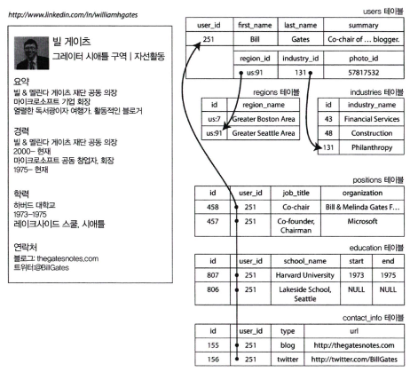

# 2장. 데이터 모델과 질의 언어

- 데이터 모델은 소프트웨어 개발에서 제일 중요한 부분
    - 문제를 어떻게 생각해야 하는지에 대해서도 지대한 영향을 미치기 때문

## 관계형 모델과 문서 모델

---

- 관계형 모델 (Relational Model)
    - 1970년 에드가 코드(Edgar Codd)가 제안
    - 데이터를 테이블(관계)로 구성 → 행(Row, Tuple) 단위 저장
    - SQL 기반 RDBMS가 표준으로 자리잡음
    - 장점: 단순성, 일관성, 25~30년 정도 주요 기술로 사용됨

### NoSQL의 탄생

---

- 2010년대 이후, 관계형 DB의 한계를 보완하기 위해 확산
- 배경
    - 대규모 데이터셋이나 매우 높은 쓰기 처리량 달성을 데이터베이스보다 쉽게 할 수 있는 뛰어난 확장성의 필요
    - 상용 데이터베이스 제품보다 무료 오픈소스 소프트웨어에 대한 선호도 확산
    - 관계형 모델에서 지원하지 않는 특수 질의 동작
    - 관계형 스키마의 제한에 대한 불만과 더욱 동적이고 표현력이 풍부한 데이터 모델에 대한 바람
- 다중 저장소 지속성(polyglot persistence): 관계형 데이터베이스가 폭넓은 다양함을 가진 비관계형 데이터스토어와 함께 사용되는 것

### 객체 관계형 불일치

---

- 임피던스 불일치: 애플리케이션 코드와 데이터베이스 모델 객체 사이의 간극
    - ex> 객체(User 클래스) ↔ 테이블(users) 변환 필요
    
    → ORM (Hibernate, ActiveRecord 등)으로 어느 정도 완화 가능
    
- 하지만 스키마 차이와 조인(Join) 필요성 때문에 여전히 불일치 존재
    
    
    
    그림 2-1. 관계형 스키마를 사용해 링크드인 프로필을 표현. 위키미디어 커먼즈가 제공한 빌 게이츠의 사진
    

- JSON은 XML보다 단순하고 직관적 → 문서 데이터 모델에서 선호
- ex> LinkedIn 프로필을 JSON 문서로 표현 (사용자 정보, 경력, 학력 등)
    
    ```json
    {
      "user_id": 251,
      "first_name": "Bill",
      "last_name": "Gates",
      "summary": "Co-chair of the Bill & Melinda Gates... Active blogger.",
      "region_id": "us:91",
      "industry_id": 131,
      "photo_url": "/p/7/000/253/05b/308dde.jpg",
      "positions": [
        {
          "job_title": "Co-chair",
          "organization": "Bill & Melinda Gates Foundation"
        },
        {
          "job_title": "Co-founder, Chairman",
          "organization": "Microsoft"
        }
      ],
      "education": [
        {
          "school_name": "Harvard University",
          "start": 1973,
          "end": 1975
        },
        {
          "school_name": "Lakeside School, Seattle",
          "start": null,
          "end": null
        }
      ],
      "contact_info": {
        "blog": "http://thegatesnotes.com",
        "twitter": "http://twitter.com/BillGates"
      }
    }
    ```
    
- 장점:
    - 데이터 구조와 애플리케이션 객체 구조의 유사성
    - 다중 테이블 스키마보다 더 나은 지역성을 갖는다.
        - 하위 테이블 간에 난잡한 다중 조인 불필요
    - 트리 구조 직관적 표현

### 다대일과 다대다 관계

---

- 다대일(many-to-one)
    - 예: 사용자 → 지역, 업계
    - ID 기반 참조를 사용해 데이터 중복 최소화
- 다대다(many-to-many)
    - 예: 사용자 ↔ 추천서, 사용자 ↔ 조직
    - 문서 모델에서는 조인 대신 중첩 문서나 참조를 활용

### 문서 데이터베이스는 역사를 반복하고 있나?

---

- IBM IMS (1968): 초기 계층형 모델
    - 하지만 조인과 복잡한 질의가 어려웠음

- 네트워크 모델
    - 코다실(Conference on Data Systems Languages) 위원회에서 표준화했다.
    - 계층형과 달리 그래프 구조 기반. 다중 부모가 있을 수 있다.
    - 데이터 간 다대다 관계를 명시적으로 표현 가능
    - 하지만 사용이 복잡하여 관계형 모델에 밀려 사라짐
- 관계형 모델
    - 테이블(관계), 튜플(행), 속성(열) 기반
    - 질의 최적화기가 실행 계획 자동 선택
    - 새로운 질의 추가 용이, 수십 년간 주류
- 문서 데이터베이스와의 비교
    - 다대일과 다대다 관계를 표현할 때
        - 관계형 모델: 외래 키로 처리
        - 문서 모델: 문서 참조(document reference)로 처리
            - 문서 데이터베이스가 코다실의 전철을 밟지 않고 있다.

### 관계형 데이터베이스와 오늘날의 문서 데이터베이스

---

- 문서 데이터 모델: 스키마 유연성, 지역성에 기인한 더 나은 성능. 일부 애플리케이션의 경우 사용하는 데이터 구조와 더 가깝다.
- 관계형 모델: 조인, 다대일, 다대다 관계를 더 잘 지원함

- 어떤 데이터 모델이 애플리케이션 코드를 더 간단하게 할까?
    - 문서 모델: 전체 문서 한 번에 조회 → 코드 단순
    - 관계형 모델: 조인 강력, 세밀한 질의 용이

- 문서 모델에서의 스키마 유연성
    - 문서 DB: 스키마리스(schema-on-read), 마이그레이션 불필요
        - 읽기 스키마: 데이터 구조는 암묵적이고 데이터를 읽을 때만 해석된다.
    - 관계형 DB: 고정 스키마, `ALTER TABLE` 필요

- 질의를 위한 데이터 지역성
    - 문서 DB: 관련 데이터 함께 저장 → 조인 비용 감소
    - 단점: 크기 변경·부분 수정 어려움

- 문서 데이터베이스와 관계형 데이터베이스의 통합
    - 최신 RDB(PostgreSQL, MySQL, DB2 등) JSON 지원
    - 관계형+문서형 혼합(Hybrid) 모델 확산되는 중

## 데이터를 위한 질의 언어

---

- 관계형 DB: 선언형(SQL), 최적화·병렬 처리 강점
- 계층/네트워크 DB: 명령형, 복잡·비효율

### 웹에서의 선언형 질의

---

- CSS/XSL: 선언형 스타일링
    
    
    
- JS DOM 조작: 명령형, 복잡
    
    
    

→ 선언형 접근이 단순성과 확장성에서 우위

### 맵리듀스 질의

---

- 맵리듀스(MapReduce): 대량 데이터 처리를 위한 프로그래밍 모델. NoSQL 데이터 저장소(몽고DB, 카우치DB 등)에서 제한된 형태로 지원한다. 주로 읽기 전용 질의에 사용.
    - 선언형 SQL보다는 불완전한 명령형 API 수준
    - 함수형 언어의 `map`, `reduce` 함수를 기반으로 한다.
    - ex> 바다에서 상어 관측 수를 월별 집계
        - SQL: `GROUP BY`와 집계 함수 사용
            
            ```sql
            SELECT date_trunc('month', observation_timestamp) AS observation_month,
                   sum(num_animals) AS total_animals
            FROM observations
            WHERE family = 'Sharks'
            GROUP BY observation_month;
            ```
            
        - MongoDB: `map`으로 월별 키 방출 → `reduce`로 합산 → 컬렉션에 저장
            
            ```powershell
            db.observations.mapReduce(
              function map() {
                var year = this.observationTimestamp.getFullYear();
                var month = this.observationTimestamp.getMonth() + 1;
                emit(year + "-" + month, this.numAnimals);
              },
              function reduce(key, values) {
                return Array.sum(values);
              },
              {
                query: { family: "Sharks" },
                out: "monthlySharkReport"
              }
            );
            ```
            
            - `map`에서 월별 키와 개체 수를 방출하고, `reduce`에서 같은 키의 개체 수를 합산하여 `monthlySharkReport` 컬렉션에 저장한다.
- 제약: `map`/`reduce`는 순수 함수여야 함. 부수효과 없이 데이터 계산만 해야 한다.
- 사용성 문제: 자바스크립트 함수 작성 필요 → 복잡.
- MongoDB 2.2: 집계 파이프라인(`aggregation pipeline`) 도입. SQL과 유사하게 선언형 질의 지원.
    
    
    

## 그래프형 데이터 모델

---

- 관계가 복잡할 때 적합하다.
- 그래프 구성 요소: 정점(vertex, 노드), 간선(edge, 관계)
    - ex>
        - 소셜 그래프(사람 ↔ 사람),
        - 웹 그래프(웹페이지 ↔ 링크),
        - 교통 네트워크(교차로 ↔ 도로).
- 그래프 알고리즘: 최단경로, 페이지랭크 등.


그림 2-5. 그래프 구조 데이터 예제(네모 상자는 정점을 나타내고, 화살표는 간선을 나타낸다)

### 속성 그래프

---

- 정점(vertex)과 간선(edge)에 속성(key-value)을 부여하는 그래프 모델.
- 정점 요소
    - 고유한 식별자
    - 유출(outgoing) 간선 집합
    - 유입(incoming) 간선 집합
    - 속성 컬렉션(키-값 쌍)
- 간선 요소
    - 고유한 식별자
    - 간선이 시작하는 정점(꼬리 정점)
    - 간선이 끝나는 정점(머리 정점)
    - 두 정점 간 관계 유형을 설명하는 레이블
    - 속성 컬렉션(키-값 쌍)

### 사이퍼 질의 언어

---

- 사이퍼(Cypher): Neo4j에서 만든 속성 그래프용 선언형 질의 언어
    
    ```sql
    CREATE
      (NAmerica:Location {name:'North America', type:'continent'}),
      (USA:Location     {name:'United States', type:'country' }),
      (Idaho:Location   {name:'Idaho', type:'state' }),
    
      (Lucy:Person      {name:'Lucy' }),
      (Idaho)-[:WITHIN]->(USA)-[:WITHIN]->(NAmerica),
      (Lucy)-[:BORN_IN]->(Idaho);
    ```
    
- `MATCH`와 패턴 매칭 방식으로 질의 작성
    
    ```sql
    MATCH
      (person)-[:BORN_IN]->()-[:WITHIN*0..]->(us:Location {name:'United States'}),
      (person)-[:LIVES_IN]->()-[:WITHIN*0..]->(eu:Location {name:'Europe'})
    RETURN person.name
    ```
    
    - 다음 두 가지 조건을 만족하는 정점(person)
        1. person은 어떤 정점을 향하는 BORN_IN 유출 간선을 가진다.
        2. 같은 person 정점은 LIVES_IN 유출 간선도 가진다.

👉 선언형 질의는 질의를 작성할 때 이처럼 수행에 대해 자세히 지정할 필요가 없다. 질의 최적화기가 가장 효율적이라고 예측한 전략을 자동으로 선택한다.

### SQL의 그래프 질의

---

- 관계형 DB에서도 그래프 데이터를 SQL로 표현 가능.
    - 가변 순회 경로에 대한 질의 개념은 재귀 공통 테이블 식(`WITH RECURSIVE`)을 사용해서 표현할 수 있다.
        
        ```sql
        WITH RECURSIVE
        
        -- in_usa는 미국 내 모든 지역의 정점 ID 집합이다.
        in_usa(vertex_id) AS (
          SELECT vertex_id FROM vertices WHERE properties->>'name' = 'United States'
          UNION
          SELECT edges.tail_vertex FROM edges
          JOIN in_usa ON edges.head_vertex = in_usa.vertex_id
          WHERE edges.label = 'within'
        ),
        
        -- in_europe는 유럽 내 모든 지역의 정점 ID 집합이다.
        in_europe(vertex_id) AS (
          SELECT vertex_id FROM vertices WHERE properties->>'name' = 'Europe'
          UNION
          SELECT edges.tail_vertex FROM edges
          JOIN in_europe ON edges.head_vertex = in_europe.vertex_id
          WHERE edges.label = 'within'
        ),
        
        -- born_in_usa는 미국에서 태어난 모든 사람의 정점 ID 집합이다.
        born_in_usa(vertex_id) AS (
          SELECT edges.tail_vertex FROM edges
          JOIN in_usa ON edges.head_vertex = in_usa.vertex_id
          WHERE edges.label = 'born_in'
        ),
        
        -- lives_in_europe는 유럽에서 사는 모든 사람의 정점 ID 집합이다.
        lives_in_europe(vertex_id) AS (
          SELECT edges.tail_vertex FROM edges
          JOIN in_europe ON edges.head_vertex = in_europe.vertex_id
          WHERE edges.label = 'lives_in'
        )
        
        SELECT vertices.properties->>'name'
        FROM vertices
        -- 미국에서 태어나 유럽에서 자란 사람을 찾아 조인한다.
        JOIN born_in_usa    ON vertices.vertex_id = born_in_usa.vertex_id
        JOIN lives_in_europe ON vertices.vertex_id = lives_in_europe.vertex_id;
        ```
        
- 하지만 Cypher보다 문법이 복잡하고 직관성이 떨어짐.

### 트리플 저장소와 스파클

---

- 트리플 저장소: `(주어, 서술어, 목적어)` 구조로 데이터를 저장한다.
    - 주어 = 정점, 서술어 = 간선, 목적어 = 값 또는 다른 정점

- 시맨틱 웹
    - 웹 전반의 데이터를 연결하려는 비전.
    - 자원 기술 프레임워크(Resource Description Framework) 사용: 데이터 간 일관성 있는 연결 지원.
    - 현실적으로는 복잡성과 표준 문제로 과도한 기대에 못 미침.
    - 하지만 RDF는 여전히 내부 데이터 모델로 유용.

- RDF 데이터 모델
    - RDF는 XML이나 Turtle(N3) 등 다양한 표현 방식 지원
        
        ```sql
        <rdf:RDF xmlns="urn:example:"
                 xmlns:rdf="http://www.w3.org/1999/02/22-rdf-syntax-ns#">
        
          <Location rdf:nodeID="idaho">
            <name>Idaho</name>
            <type>state</type>
            <within>
              <Location rdf:nodeID="usa">
                <name>United States</name>
                <type>country</type>
                <within>
                  <Location rdf:nodeID="namerica">
                    <name>North America</name>
                    <type>continent</type>
                  </Location>
                </within>
              </Location>
            </within>
          </Location>
        
          <Person rdf:nodeID="lucy">
            <name>Lucy</name>
            <bornIn rdf:nodeID="idaho"/>
          </Person>
        
        </rdf:RDF>
        ```
        
    - URI 기반으로 주어·서술어·목적어를 식별 → 다른 데이터와 결합 가능.

- 스파클 질의 언어
    - 스파클(SPARQL): RDF 데이터 모델을 사용한 트리플 저장소 선언형 질의 언어
    - 사이퍼와 유사하지만 RDF 특화 (`MATCH` vs `SELECT ... WHERE`)
        
        
        
        
        

- 그래프 DB와 네트워크 모델 비교
    - 네트워크 모델(코다실 계열)과 유사해 보이지만 차이가 있음:
        - 그래프 DB는 스키마 강제성이 낮음.
        - 경로 탐색, 동적 쿼리에 더 유리.
        - 명령형 코드 없이도 선언형 질의 가능.

### 초석: 데이터로그

---

- 1980년대부터 연구된 오래된 질의 언어.
- 규칙(rule) 기반: 프로로그와 유사.
- `(주어, 서술어, 목적어)` 대신 `(서술어(주어, 목적어))` 형태.
    
    ```sql
    /* 규칙 1 */
    within_recursive(Location, Name) :-
        name(Location, Name).
    
    /* 규칙 2 */
    within_recursive(Location, Name) :-
        within(Location, Via),
        within_recursive(Via, Name).
    
    /* 규칙 3 */
    migrated(Name, BornIn, LivingIn) :-
        name(Person, Name),
        born_in(Person, BornLoc),
        within_recursive(BornLoc, BornIn),
        lives_in(Person, LivingLoc),
        within_recursive(LivingLoc, LivingIn).
    
    ?- migrated(Who, 'United States', 'Europe').
    
    /* Who = '루시'. */
    ```
    
    
    
    그림 2-6. 예제 2-11에서 데이터로그 규칙을 사용해 아이다호가 북아메리카에 있는지 확인
    
- 장점: 복잡한 질의를 규칙 조합으로 단순화 가능.

## 정리

---

- 데이터 모델은 문서, 관계형, 그래프 등 다양한 방식 존재.
- 문서 DB → 문서 자체 저장, 관계 적음.
- 그래프 DB → 복잡한 다대다 관계 표현 유리.
- 공통점: 스키마 강제성이 약해 애플리케이션 요구에 유연.
- 질의 언어: SQL, 맵리듀스, 사이퍼, 스파클, 데이터로그 등.
- 추가적인 데이터 모델 연구:
    - 게놈 데이터베이스 (유사 서열 검색)
    - 입자 물리 빅데이터 (페타바이트급)
    - 전문(full-text) 검색
