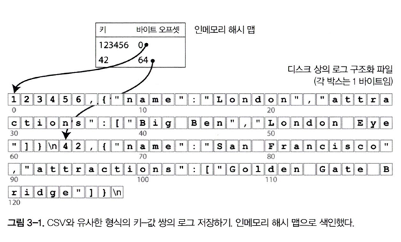

# 3장 저장소와 검색

- 간단 키워드
    - 로그구조 저장
    - LSM-Tree
    - B-Tree
    - SSTable
    - 칼럼지향 저장

## 데이터베이스를 강력하게 만드는 데이터 구조

### 로그 구조와 색인

`로그 구조 저장`

- 단순한 로그형 key-value 예제
- 애플리케이션에서 말하는 로그와 다르다
- 좀 더 일반적인 의미로 연속된 레코드 (Append Only)
- 쓰기 비용이 저렴하고, 빠른 순차 읽기라 효율적이지만, **읽기는 파일 전체를 대상으로 스캔**하기 때문에 레코드가 많아질수록 느려진다
- 조회가 비효율적이기 때문에 **색인** 이 필요하다

`색인`

- 색인 → 원본 데이터를 위치를 **빨리 찾기 위한 부가적인 메타데이터**
- 데이터베이스의 내용에는 영향 을 미치지 않지만 WRITE 오버헤드가 생긴다
- 색인을 어떻게 설계하는가 → **저장소 시스템에서 중요한 트레이드 오프**

`해시 색인`

- 키-값  저장소는 대부분 **프로그래밍 언어에서 볼수 있는 dict type 과 매우 유사**하다
    - 해시맵 또는 해시 테이블로 구현되어 있다

- 메모리에 해시맵 (key → 파일 바이트 오프셋) 을 둔다
    - set
        - 로그 가장 마지막에 (key, value) 를 작성
        - 파일 오프셋을 해시 맵에 업데이트 (동일 키의 오래된 offset 은 버린다)
    - get
        - 해시 맵에서 오프셋을 찾아, 한 번의 디스크 접근으로 읽는다
- Bitcask 가 이 방식을 사용하고 있다
- 해시 맵을 모두 메모리에 유지하기에, 메모리에 모든 키가 저장된다는 전재 조건으로 고성능 읽기/쓰기 를 보장한다
- **키의 수가 많지 않고, 동일 키가 자주 갱신되는 워크로드**에 적합해 보임

`세그먼트와 컴팩션`

- 무지성 Append 만 하면, 디스크가 불어나므로 로그를 **세그먼트**로 나누고, 임계치 마다  **새로운 세그먼트로 rollover**
- **컴펙션 (compaction)**
    - 오리된 세그먼트들을 읽어 **키 별 최신 값만 남기고** (삭제는 tombstone 처리) 나머지를 버려 **작게 재생성 하는 과정**

- 컴펙션 과정 설명 예시 (그림 3-2)
    - 고양이 이벤트 로그에서, **각 키의 최신 항목만 유지** 하도록 컴펙션 처리

- 세그먼트 병합 과정 설명 예시 (그림 3-3)
    - **여러 세그먼트를 병합해 더 큰 새 세그먼트**로 만들고, 완료이후 새로운 세그먼트를 사용하게끔 전환
- **세그먼트 조회 경로**
    - **각 세그먼트 마다 인 메모리 해시 맵을 유지**하고, 가장 최신 세그먼트 부터 조회 → 다음 세그먼트 조회
    - 세그먼트 수를 적게 유지하면 확인 해야 할 해시 맵의 개수도 줄어듦
- **실제 구현시 고려사항**
    - **파일 형식**: CSV보다 **바이너리 형식**이 보통 더 단순·견고(바이트 길이 보존, 이스케이프 문제 회피)
    - **레코드 삭제**: 바로 지우지 않고 **tombstone(삭제 레코드)** 를 기록 → 컴팩션 때 이전 값을 무시/정리
    - **크래시 복구**: 재시작 시 세그먼트 파일을 처음부터 읽어 **해시 맵을 재구성**해야 함(힌트 파일 같은 최적화로 가속 가능)
    - **부분적 쓰기**: 로그 끝에 **불완전한 레코드**가 남을 수 있어 검출·무시 필요
    - **동시성 제어**: 추가 전용 파일과 **불변(immutable) 세그먼트** 덕분에 보통 **단일 쓰기 스레드 + 다중 읽기** 구조로 간단히 처리 가능

`로그 구조 저장과 해시 색인 장단점`

- 장점
    - 로그 구조 → 쓰기 성능이 좋고, 구현이 단순하다
    - 해시 색인 조회 → 메모리 해시맵. 빠름
- 제약사항
    - 해시 색인 →
        - 모든 키 메타데이터를 메모리에 유지해야 하므로 키가 너무 많으면 문제 발생 여지 있음
        - 범위/정렬 검색에 적합하지 않다
        - 디스크 해시 테이블로 확장하려면 충돌 처리/랜덤IO 등 복잡도 증가

### SSTable 과 LSM 트리

`SSTable`

- SSTable → 로그 세그먼트를 키 기준으로 정렬해 저장한 파일
    - Sorted String Table

- 병합 정렬 방식으로 여러 파일을 효율적으로 병합한다
- 병합 “정렬” 이기 때문에 **결과 파일도 키 순서가 유지**된다

- **희소 색인 (sparse) 방식**을 사용함
    - 메모리에 모든 키를 들고 있을 필요가 없다
    - 대표 키 → 바이트 오프셋만 저장하고, 그 지점부터 짧은 순차 스캔으로 값을 찾는다
    - handbag ↔ handworkd 사이를 스캔함
- **디스크에 쓸 때 레코드를 블록으로 묶어 압축**하고, 인메모리 **색인에는 각 압축 블록 시작 오프셋만 저장**한다
    - 디스크 공간 절약 및 I/O 대역폭 사용도 줄어듦

`SSTable 생성과 유지`

- 메모리에는 균형 트리 (레드블랙/AVL) 과 같은 정렬 가능한 구조를 두고 여기에 먼저 쓴다 → 흔히 **멤 테이블(memtable)** 이라고 함
- 멤 테이블이 임계치를 넘어서면 SSTable 로 플러시 한다 (디스크 저장)
- 읽기 요청 : 멤 테이블 → 최신 SSTable → 오래된 SSTable 순으로 탐색
- 백그라운드에서 병합/컴펙션을 수행해 중복/삭제된 키를 정리해 파일 수를 줄인다
- 멤 테이블에만 있던 최신 쓰기는 유실될 수 있어, 매 쓰기전 분리 로그 (Write-Ahead Log) 도 함께 기록해둔다
    - 재시작시 다시 읽음

`LSM 트리`

- Log-Structured Merge-Tree
- 위에서 살펴본 멤 테이블 + SSTable + 백그라운드 병합 방식을 적용한 저장소 엔진 구조
- Level DB, RocksDB 가 이를 구현하고 있고, 구글 **Bigtable** 논문, **Cassandra/HBase** 등(키-값 저장 라이브러리/분산 DB들이 채택)

`루씬`

- 엘라스틱서치, 솔라에서 사용하는 전문 검색 엔진
- **용어 사전(term dictionary)** + **포스팅 리스트(postings list)** 구조도 “키-값” 색인의 특수형태
- 이 사전/리스트를 SSTable과 유사한 **정렬 파일**로 유지하고, 필요에 따라 **백그라운드 병합**을 수행한다

`성능 최적화`

- Bloom Filter
    - **존재하지 않는 키를 빠르게 걸러** 불필요한 파일/블록 읽기를 줄인다
    - 오래된 SSTable 까지 내려가기 전에 필터링 함
- SSTable 컴펙션 전략
    - 크기 계층
        - 좀 더 새롭고 작은 SSTable 을 오래되고 큰 SSTable 에 연이어 병합
    - 레벨
        - 키 범위를 더 작은 SSTable 로 나누고, **오래된 테이블은 개별 레벨**로 이동
            - 파일을 레벨 별로 나눈다
        - 읽기/공간 효율이 좋아지지만 쓰기 증폭이 커질 수 있다
    - LevelDB, RocksDB 는 레벨링, HBase 는 크기 계층, 카산드라는 둘다 지원
- LSM 트리의 기본 개념 → 백그라운드에서 연쇄적으로 **SSTable 을 지속적으로 병합**하는 것

`LSM 트리의 장단점`

- 장점
    - 순차 쓰기로 인해 쓰기 처리량이 높음
    - 파일이 정렬되어, 범위 스캔이 가능함
    - 블록압축/희소색인/BloomFilter 로 읽기 최적화 수행
- 단점
    - 다수의 SSTable 때문에 **읽기/컴펙션 증폭이나 컴펙션 타이밍에 tail latency 스파이크가 발생**할 수 있음
    - IO 대역폭, 컴펙션 처리 속도, 전략 튜닝 등을 고려해야 함

`B 트리`

- 1970년대 도입되어 지금까지 가장 널리 사용되는 색인 표준
- 관계형 뿐 아닌 많은 비관계형 DB 에도 사용된다
- 디스크의 고정 크기 블록 단위로 데이터를 읽고 쓴다 (보통 4kb)

- 페이지 들로 구성된 트리 이고, 조회시 루트에서 시작해 키 범위에 맞는 하위 페이지로 내려간다
    - 최종적으로 리프에서 값 또는 레코드의 위치를 찾음

- 분기 계수 (branching factor)
    - 한 페이지가 참조하는 하위 페이지의 수
    - 키/경계/포인터를 저장할 수 있는 공간에 좌우됨
    - 보통 수십/수백개에 달한다
    - 팬 애웃이 커서 트리 높이가 매우 낮다 (보통 3-4 레벨 정도면 충분함)
- 리프 페이지에 키를 넣고 여유 공간이 없다면 페이지를 분할 한다
    - 경계를 상위에 전파에 트리의 균형을 유지함
- 위 설명된 알고리즘은 트리가 계쏙 균형을 유지하는 것을 보장한다

`신뢰할 수 있는 B 트리 만들기`

- 제자리 갱신 특성
    - 기존 페이지를 덮어쓰기 때문에 **하드웨어 동작과 충돌시** 부분 기록/찢어진 페이지 (torn write), 고아페이지 (orphan page) 위험이 있다
- WAL (Write-Ahead Log)
    - **페이지 변경을 적용하기 전에 로그에 먼저 기록**해 크래시 발생 이후에도 복구할 수 있게 한다
- 동시성 제어
    - 페이지 단위 래치 를 사용해 일관성 보장

`B 트리 최적화`

- 일부 시스템 (LMDB) 은 WAL 대신 Copy-On-Write 방식으로 새 페이지 버전을 만들어 참조를 교체한다
- 리프 페이지를 디스크에 가급적 연속되게 배치해 범위 스캔에 유리하다
    - 트리가 커지면 연속성 유지가 힘듦
- 리프 간 **양방향 링크를 둬 상위로 올라가지 않고 순차 스캔**을 할 수 있게 한다
- 프랙탈 트리와 같은 변형으로 디스크 탐색 수를 줄이기 위한 변형이 존재함

`B 트리와 LSM 트리 비교`

- 읽기 성능
    - B 트리 → **낮은 트리 높이 + 단일 구조** → **짧고 일정한 지연**
    - LSM 트리 → 여러 SSTable/레벨을 거치고 compaction 간섭 가능 → **읽기/지연 변동**이 커질 수 있음
- 쓰기 성능 증폭
    - B 트리 → **랜덤 쓰기 + 페이지 분할/병합 + WAL** → 쓰기 증폭과 락 경합
    - LSM 트리 → **순차 쓰기 + 배치 병합** → **고쓰기 처리량** 유리. 대신 **write-amplification 존재**
- 범위 스캔
    - B 트리, LSM 트리 모두 가능함
- 디스크 공간
    - B 트리 → 페이지 단편화, 재배치 이슈가 있을 수 있음
    - LSM 트리 → 전략에 따른 공간/읽기/쓰기 트레이드 오프 및 관리가 필요함
- 쓰기 처리량이 중요하고 로그성 데이터 → LSM
- 짧은 지연의 트랜잭션 처리 → B 트리

### 기타 색인 구조

- 기본키와 보조 색인
    - 기본키는 레코드를 고유하게 식별한다
    - 보조 색인은 CREATE INDEX 로 여러개를 만들 수 있고, 조인 필터시 결정적 역할을 한다
    - 보조 색인은 같은 키가 여러 레코드를 가리킬 수 있음
- 보조 색인의 저장 방식 두가지
    1. 색인의 각 값으로 행 ID 목록을 저장
        1. 전문 색인의 포스팅 목록과 동일
    2. 키에 행 ID 를 붙여 하나의 긴 키로 저장
- 색인 안에 값 저장하기
    - 일반적으로 **힙 파일에 실제 레코드를 저장**하고, 색인은 힙 포인터만 가지고 있다
        - 갱신이 쉽지만, 중복 인덱스 탐색비용 과 추가 I/O 발생 가능함
    - 클러스터드 색인
        - 테이블 데이터를 리프에 함께 저장하는 방식
        - InnoDB 기본 전략
    - 커버링/포함 컬럼 (Index with included columns)
        - 색인에 일부 컬럼을 함께 저장해서 테이블 접근 없이 처리한다
        - 클러스터와 비클러스터의 절충안
- 다중 컬럼 색인
    - 결합 (Concatenated) 색인
        - 성, 이름 과 같이 **선두 컬럼 순서가 중요**하다
    - 다차원 색인 (지리 정보 등)
        - 단순 결합 색인 으로는 **사각형 범위 질의**를 동시에 만족시키기 어렵다
            1. 공간 채움 곡선 으로 단일숫자 매핑후 일반 B-Tree 사용하는 대안
            2. 전문 공간 색인 (R-Tree, PostgreSQL GiST/PostGIS 등) 대안

### 전문 검색과 퍼지 색인

- 지금까지 색인으로는 철자가 틀린 단어 처럼 **유사한 키에 대해서는 검색이 불가능**하다.
    - 애매 모호한 질의에는 다른 기술이 필요함
    - → 전문 검색과 퍼지 색인
- 전문 검색 기본 구조
    - 용어 사전 + 포스팅 리스트
    - Lucene 은 사전/포스팅을 정렬된 파일로 유지하고 백그라운드 에서 병합한다
- 퍼지 색인
    - 편집 거리 (edit distance) 기반 **유사 단어 검색**
    - **유한 오토마톤 (FSA) , 트라이 (Trie**) 를 활용해 사전에서 후보를 빠르게 찾고, **레벤슈타인 오토마톤**으로 범위를 제어한다

### 인메모리 DB

- 디스크는 지속성.저비용의 장점을 가짐
- 메모리는 지연/대역폭에서 월등하다. **메모리 단가 하락**으로 인해 전체 또는 대부분을 메모리에 두는 설계가 가능해짐
- 메모리 DB 의 내구성 확보
    - 로그 기록 (WAL/REDO), 스냅샷, 복제로 크래시 이후 상태를 복원
    - 특수 하드웨어 또는 디스크에 주기적으로 스냅샷/로그를 남겨 내구성을 확보
- Volt, MemSQL, Oracle TimesTen → 관계형 인메모리 DB
    - 디스크 오버헤드 제거로 성능을 크게 개선했다고 주장함
- RAMCLoud → 지속성을 위해 로그를 디스크나 다른 노드에 기록한다
- Redis, CouchBase → 메모리 중심이지만 디스크에 비동기로 기록하여 약한 지속성을 제공한다
- OS 패키지 캐시로도 디스크 DB 가 빨라졌지만, 충분한 RAM 이 있다면 디스크 접근 자체를 회패해 더 낮은 지연 속도를 보장
- 안티 캐싱 → 메모리 부족시 콜드 데이터를 디스크로 보내고, 필요시 다시 메모리로 올린다
    - OS 스왑과 유사하지만 DB가 **레코드 단위**로 관리해 더 효율적임
    - 하지만 여전히 전체 색인이 전체 메모리에 있어야 하낟
- NVM (휘발성 메모리)
    - 보급시 저장소 엔진 설계가 변할 가능성이 있다

## 트랜잭션 처리와 분석

- 트랜잭션 처리 (OLTP)
    - 짧은 지연으로 소량의 행을 자주 읽고 쓴다 (주문, 결제, 재고 차감 등)
    - 키 기반 조회, 인덱스 활용, 동시성과 가용성이 중시됨
    - 데이터: **현재 상태** 중심(정규화),  **GB–TB**
- 트랜잭션 분석 (OLAP)
    - 의사 결정을 지원하는 것이 목적이고, 대량의 데이터를 읽어 집계처리함 (합/평균/카운트 등)
    - 배치, 대용량처리, 범위.그룹 집계 및 조인이 많다
    - 데이터 : **시간이 지난 이력** 중심 데이터, **TB-PB**
- 초창기엔 하나의 DB 로 모두 처리했지만, 점차 역할을 분리해 나갔음
    - 분석 전용 저장소 (데이터 웨어하우스) 가 탄생

### 데이터 웨어하우스

- 여러 OLTP 시스템의 데이터를 읽기 전용 분석용으로 복제한 별도 데이터베이스
- 분석 쿼리가 운영 TX 에 영향을 주지 않고, 분석 요구사항에 맞춰 스키마/인덱스/파티셔닝 구성이 가능하다
- OLTP 에서 데이터 추출 → 변환 → 적재 하는 **ETL(Extract-Transform-Load)** 파이프라인으로 구성된다

### OLTP DB 와 데이터 웨어하우스의 차이

- OLTP 는 보통 정규화를 한 **관계형 모델** 중심 / 웨어하우스는 **차원 모델링** 중심 (집계.탐색.최적화)
- 둘은 표면적으로 SQL 질의 인터페이스를 지원하기 때문에 비슷해 보이지만 내부는 매우 다름
- 웨어하우스는 **드릴다운·슬라이싱·다이싱** 같은 다차원 분석을 지원한다

### 차원 모델링

- 많은 데이터 웨어하우스는 **별모양 스키마/차원모델링** 이라고 알려진 정형화된 방식을 사용한다
- 이벤트를 담는 **사실 (Fact) 테이블**과, 분석 축 (누가/무엇/언제/어디) 을 담는 **차원 (Demension) 테이블**을 분리하는 것이 핵심 아이디어
- → 분석 쿼리 는 fact (fk) 여러 demnsion 의 조인후 집계가 이뤄진다
- 사실 (Fact) 테이블
    - **이벤트를 행 하나로 기록**
    - 수치에 대한 지표 (매출액, 수량 등) 와 차원키 들로 구성
- 차원 (Dimension) 테이블
    - 사람.상품.매장.날짜 등 **분석 축을 설명하는 큰 테이블 (이벤트의 속성)**

## 칼럼 지향 저장소

- 웨어 하우스 는 사실테이블에서 **수백만행을 스캔하지만, 한 번에 쓰는 칼럼은 몇개** 되지 않는다 (보통 4 ~ 5개)
- 로우 지향은 한 **로우의 모든 컬럼을 함께 읽어야 하기 때문에 I/O 낭비**
- 칼럼 지향 → 칼럼별로 별도 파일/세그먼트에 저장이후 **필요한 칼럼만 읽기 때문에 I/O 측면에서 효율적**
    - 모든 값을 하나의 로우에 함께 저장하지 않음
    - 각 칼럼별로 모든 값을 함께 저장

- 같은 로우 순서를 모든 칼럼 파일이 공유하므로, 필요시 **동일 인덱스 번째 를 모아 로우를 재구성**할 수 있다

### 칼럼 압축

- 같은 칼럼에는 값 반복 패턴이 많아 압축 효율이 좋음
- 대표적인 기법
    - 비트맵 인코딩 : 각 고유값 마다 0/1 비트열
    - 런렝스(RLE) : 비트맵의 연속 구간 길이만 저장해 공간 절감
    - 아래 그림이 예시

- Cassandra/HBase의 **컬럼 패밀리**는 저장 형식 의미의 “칼럼 지향”이 아님(로우 중심 + 유연 칼럼) 이고 칼럼 압축을 사용하지 않음

### 메모리 대역폭과 벡터화

- 수백만 로우를 스캔해야하는 데이터 웨어하우스 질의 특성상, **메모리로 데이터를 가져오는 대역폭이 가장 큰 병목**
- 대역폭을 효율적으로 사용하고, CPU 캐시/ 분기 / SIMD 명령을 사용하게끔 신경써야함
- 벡터 : 수십 ~ 수천행의 묶음
- 벡터화 : **벡터** 를 메모리로 가져와 **같은 연산을 한 덩어리로** 처리
- 칼럼지향 저장은 같은 칼럼의 값들이 연속된 메모리 공간에 모여 있기때문에 CPU 캐시 / SIMD 명령을 활용하기 좋다

### 칼럼 저장소의 정렬

- 칼럼 저장소도 테이블 전체는 **특정 기준으로 정렬을 해두는 것이 유리**하다
    - 1차 정렬 키를 date_key 로 두면 “지난달” 에 대한 질의가 연속 영역만 스캔한다
    - 2차 로 product_sk 등을 붙여두면 그루핑 또는 필터링 에도 이득
    - 정렬을 하면 칼럼 압축에 도움이 됨
        - 기본 정렬 칼럼 값이 고유 값이 별로 없다면, 연속해서 같은 값이 반복 되기 때문에
        - 런렝스 부호화 등을 이용해 칼럼을 압축할 수 있음
- 칼럼 자정소에서 여러 정렬 순서를 가지는 것은 로우 지향에서 여러 개의 2차 색인을 하는 것과 유사하다

### 칼럼 저장소의 쓰기

- 일반적으로 **압축된 칼럼 파일은 제자리 갱신이 불가능** 하다
- 중간에 로우를 삽입하고 싶다면 모든 파일을 재작성 해야함
    - LSM 트리에서 제시한 해결책
        - 인메모리 버퍼에 우선 적재
        - 임계치 도달시 칼럼 파일로 배치 플러시 처리
        - 백그라운드에서 병합/컴펙션 과정 수행

### 구체화 집계와 구체화 뷰

- 구체화 집계 (materialized aggregate) : 자주 사용하는 집계를 미리 계산해 저장해 두고 재사용 한다
    - COUNT/SUM/AVG/MIN/MAX
- 구체화 뷰 (materialied view)
    - 일반 뷰가 쿼리 정의만 가지고 잇는 것과 달리, 실제 결과를 디스크에 복사해둔 테이블 형태의 캐시
    - 원본 데이터가 바뀌면 갱신이 필요하다

### 데이터 큐브

- 구체화 뷰의 특수한 형태
- 여러 차원 (date, product, store ) 조합별 집계값을 다차원 테이블로 저장한다
- 각 셀에 조합의 합계/건수 등 집계가 들어가, 드릴다운/롤업이 빠르다
- 장점 → 특정 반복된 질의에 대해 빠른 응답을 가진다
- 단점 → 원시 데이터에 질의하는 것과 동일하게 유연성이 없다

## 정리

- 저장 및 검색 설계는 크게 두 갈래임
- 트랜잭션 최적화 (OLTP) → 낮은 지연, 소량 행, 인덱스 중심
- 분석 최적화 (OLAP) → 대량 스캔·집계, **SSTable/LSM, 칼럼 지향, 벡터화, 블룸필터, 압축** 등으로 처리량 극대화
- **로그 구조 계열**(Bitcask/LSM/SSTable): 순차 쓰기 강점, 컴팩션으로 정리, 블룸필터·희소 색인으로 읽기 보완.
- **B-트리 계열**: 낮은 깊이·안정적 지연, 범용 OLTP에 적합. WAL/래치 등으로 일관성 보장.
- **색인 다양화**: 해시 색인, 보조/다중칼럼, 공간(GiST), 전문 검색(사전+포스팅+오토마톤), 인메모리 DB의 내구성 전략
- **데이터 웨어하우스**: 여러 OLTP에서 **ETL**로 모아 차원 모델(사실/차원, 스타/스노우플레이크)로 분석 최적화
    
    칼럼 저장 + 압축(비트맵/RLE/사전) + **벡터화 실행**이 핵심. 필요 시 **구체화 뷰/데이터 큐브**로 자주 쓰는 집계를 캐시
