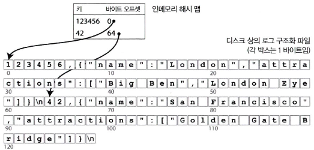

# 3장. 저장소와 검색

## 데이터베이스를 강력하게 만드는 데이터 구조

---

- 가장 단순한 DB: `db_set(key, value)` / `db_get(key)` 함수로 구현된 키-값 저장소.
    - `db_set`: key와 value를 데이터베이스에 저장
        - 구현은 간단히 추가 전용(append-only) 로그 파일을 사용한다.
        - 새로운 값이 들어오면 계속 파일 끝에 추가 → 과거 값은 무시되고 마지막 값이 최신 값.
    - `db_get`: key를 주면 가장 최근의 value 반환
        - 읽기(`db_get`)는 모든 파일을 스캔해야 하므로 비효율적 → 색인 필요.
        - 색인(index) 은 메타데이터로, 특정 key의 위치를 빠르게 찾도록 도와준다.
    
    ```powershell
    $ db_set 123456 '{"name":"London","attractions":["Big Ben","London Eye"]}'
    $ db_get 123456
    {"name":"London","attractions":["Big Ben","London Eye"]}
    ```
    

- 색인: 기본 데이터(primary data)에서 파생된 추가적인 구조
    - 대개 쓰기 속도를 느리게 만든다. 데이터를 쓸 때마다 매번 색인도 갱신해야 하기 때문이다.

### 해시 색인

---

- 키-값 데이터 색인. 일반적이고 더욱 복잡한 색인을 위한 구성 요소로 유용하다.
- 해시맵(해시 테이블)로 구현한다.
    - 키를 해시맵에 저장하고, 값은 파일의 오프셋(offset)에 저장한다.
    - 조회 시 해시 맵 데이터 파일에서 오프셋을 찾아 해당 위치를 구하고 값을 읽는다.
    
    
    
    그림 3-1. CSV와 유사한 형식의 키-값 쌍의 로그 저장하기. 인메모리 해시 맵으로 색인했다.
    
- 키의 값이 자주 갱신되는 상황에 매우 적합하다.
    - ex> 고양이 동영상 URL : 비디오 재생된 횟수
- 장점: 빠른 읽기 성능
- 단점: 범위 질의(range query) 지원이 어렵다.
    - 해시 색인은 키를 해시 함수로 변환해 위치를 찾기 때문에, 키의 정렬 순서를 보존하지 않는다.
    - "kitty00000" 부터 "kitty99999" 사이 모든 키를 검색하려면 색인에 등록된 모든 키를 일일이 확인해야 한다.

- 세그먼트와 컴팩션
    - 파일은 세그먼트(segment) 단위로 나뉘어 저장됨
        - 시간이 지나면 세그먼트가 많아져 중복된 키가 발생
    - 이를 해결하기 위해 컴팩션(compaction) 수행 → 중복된 키를 삭제하고 최신 값만 유지하는 것
        
        
        
        그림 3-2. 키-값 갱신 로그를 컴팩션하고(모든 고양이 동영상이 재생된 횟수를 더함) 각 키의 최신 값만을 유지
        
    - 최종적으로 각 키의 최신 값만 남아 공간 절약과 읽기 성능 향상
        
        
        
        그림 3-3. 컴팩션과 세그먼트 병합을 동시에 수행
        

### SS테이블과 LSM 트리

---

- SS테이블(정렬된 문자열 테이블, Sorted String Table)
    - 세그먼트 파일 키-값 쌍을 정렬(키로 정렬)하여 저장한 것
    - 병합정렬 방식으로 세그먼트를 병합 → 새로운 세그먼트도 키로 정렬됨
        
        
        
        그림 3-4. 여러 SS테이블 세그먼트를 병합하고 각 키의 최신 값만 유지한다.
        
    - 메모리에 모든 키 색인을 유지할 필요 없이 희소 색인(sparse index) 으로도 충분하다.
        - 희소 색인(Sparse Index): 일정 간격마다 샘플 키만 유지. 이 샘플 키를 통해 해당 블록 위치를 빠르게 찾아 디스크 접근을 최소화한다.
        
        
        
        그림 3-5. 인메모리 색인을 가진 SS테이블
        
    - 장점
        1. 메모리에 가능한 키 범위만 유지 → 디스크 I/O 줄임
        2. 여러 카-값 쌍을 블록 단위로 압축하여 기록 가능 → 저장소 효율↑
        3. 최신 값 유지 가능, 오래된 세그먼트는 버림

- Memtable
    - 인메모리 균형 트리(Balanced Tree, ex> 레드 블랙 트리)
    - 쓰기가 들어오면 Memtable에 추가 → 디스크에 SS테이블로 기록한다.
    - 일정 크기 도달 시 새 SS테이블 생성
    - 백그라운드에서 컴팩션(compaction) 수행 → 중복 키 제거, 최신 값 유지

- LSM(Log-Structured Merge) 트리
    - SS테이블 파일 병합과 컴팩션 원리를 기반으로 하는 저장소 엔진
    - 대표 구현: LevelDB, RocksDB 등
    - 기본 원리: 로그 구조화 저장소 + 트리의 정렬된 구조 결합

- 성능 최적화
    - 블룸 필터(Bloom Filter): 존재하지 않는 키를 빠르게 알려줌 → 디스크 접근 최소화
        - "존재하지 않음"은 확실하게 알려주고, "존재할 수 있음"만 디스크를 확인한다.
    - 컴팩션 전략
        - 크기 계층 컴팩션(size-tiered compaction): 새롭고 작은 SS테이블을 오래됐고 큰 SS 테이블에 연이어 병합한다.
        - 레벨 컴팩션(leveled compaction): 데이터 크기에 따라 레벨로 나눠서 관리, 오래된 데이터는 더 깊은 레벨로 이동한다.

### B 트리

---

- 등장: 1970년대부터 사용된 전통적인 색인 구조
- 구조: 고정 크기 페이지(보통 4KB) 단위로 분리하여 디스크에 저장
    
    
    
    그림 3-6. B 트리 색인을 이용한 키 검색
    
- 장점: 키-값 정렬된 상태 유지, 범위 질의(range query)에 효율적이다.
- 단점: 쓰기 시 디스크 블록 갱신 필요 → 랜덤 I/O 발생
- 특징
    - 루트(root) → 중간 페이지 → 리프 페이지(leaf page) 구조
    - 분기 계수(branching factor)가 커서 트리의 깊이는 얕음
        - 분기 계수(branching factor): 하나의 페이지가 가리키는 하위 페이지 개수. 보통 수백 개 이상이라 트리의 깊이가 얕아지고, 키 검색은 `O(log n)`에 수렴한다.
    - 신뢰성을 위해 WAL(Write-Ahead Log, 재실행 로그) 사용
        - 트리 페이지에 변경된 내용을 적용하기 전에 모든 B 트리의 변경 사항을 기록하는 추가 전용 파일
        - DB 고장 이후 복구될 때 일관성 있는 상태로 B 트리를 다시 복원하는 데 사용한다.

### B 트리와 LSM 트리 비교

---

- B 트리
    - 장점: 각 키가 한 곳에만 정확히 존재, 트랜잭션 격리와 잘 맞음
    - 단점: 쓰기 시 랜덤 I/O 발생, 디스크 효율 낮음
- LSM 트리
    - 장점: 쓰기 효율이 높음, 순차 쓰기 기반이라 SSD에 유리
    - 단점: 컴팩션으로 읽기 성능 저하 가능, 디스크 용량 추가 사용(write amplification)

- LSM 트리의 장점
    - 로그 구조와 병합(compaction)으로 쓰기 효율↑
    - 쓰기 증폭(write amplification) 은 있지만 순차 쓰기 덕분에 SSD에 적합
    - 디스크 공간 효율 높음 (낭비되는 영역 줄임)
    - 레벨 컴팩션을 통해 오버헤드 완화 가능

- LSM 트리의 단점
    - 컴팩션 과정이 진행 중인 읽기/쓰기 성능에 영향을 준다.
    - 쓰기 처리량이 높으면 디스크 I/O 병목 발생
    - 세그먼트 파일이 많아지면 읽기 느려짐
    - 동일 키가 여러 세그먼트에 중복 존재 → 트랜잭션 격리에는 불리

### 기타 색인 구조

---

1. 기본키 색인
    - 관계형 모델의 기본키(primary key)
    - 하나의 테이블(문서 DB에서는 문서, 그래프 DB에서는 정점)을 고유하게 식별
    - 주로 기본 ID(문서 ID) 로 로우/문서/정점을 찾을 때 사용
2. 보조 색인 (Secondary Index)
    - `CREATE INDEX` 명령어를 통해 생성
    - 기본키 외에도 다양한 컬럼으로 색인을 만들 수 있음
        - ex> `user_id` 로 보조 색인 생성 시, 동일 사용자에 속한 로우를 빠르게 찾을 수 있음
    - 문제점: 키가 고유하지 않은 경우(중복된 값이 많은 경우) 발생
        - 해결책 1: 색인 값에 로우 식별자들의 목록(list) 저장
        - 해결책 2: 색인 키에 로우 식별자(row ID) 를 함께 붙여 고유하게 만든다
3. 색인 안에 값 저장하기
    - 힙 파일(Heap file) : 색인 값은 위치만 가리키고, 실제 데이터는 힙 파일에 저장
    - 클러스터드 색인(Clustered Index) : 색인 안에 직접 로우를 저장
        - InnoDB(MySQL)에서는 기본키가 클러스터드 색인
        - MS SQL Server는 테이블당 하나를 선택 가능
    - 추가 변형:
        - 커버링 색인(Covering Index): 색인 안에 일부 컬럼을 포함
        - Included column index: 쿼리에 필요한 컬럼을 함께 저장
4. 다중 칼럼 색인
    - 하나의 키가 아닌 여러 필드 결합(concatenated index).
        - ex> `(성, 이름)` 색인
            - "성+이름"으로 특정 사람을 찾을 때 유용
            - "이름"만으로 찾는 경우엔 한계
        - ex> `(위도, 경도)` 색인
            - 특정 범위 질의에는 비효율적
            - 공간 채움 곡선(space-filling curve)이나 특수 색인(예: PostGIS의 R-트리) 활용
5. 전문 검색과 퍼지 색인
    - 정확히 일치하지 않는 질의 → 퍼지 색인 필요
    - 루씬(Lucene): 텍스트를 단어(용어) 단위로 분리하고, 각 단어를 포함하는 문서 ID 목록을 저장하는 역색인(inverted index) 방식.
    - 트라이(Trie), 레벤슈타인 오토마톤(Levenshtein automaton) 등을 이용해 유사한 단어 검색 가능
        - 트라이(Trie): 문자열 접두사를 빠르게 탐색할 수 있는 자료구조
        - 레벤슈타인 오토마톤(Levenshtein Automaton): 편집 거리(edit distance)를 계산해 `"kitten"`과 `"sitten"`처럼 비슷한 단어도 검색할 수 있도록 지원.

- 메모리 기반 저장소
    - 디스크 대신 인메모리 데이터베이스 활용
    - 장점: 디스크 I/O 제거 → 빠름
        - ex> VoltDB, MemSQL, Oracle TimesTen, Redis, Couchbase
    - 단점: 서버 장애 시 데이터 손실 위험 → 비휘발성 메모리(NVM) 연구가 대안

## 트랜잭션 처리나 분석?

---

- 트랜잭션 처리(OLTP): 짧고 빈번한 질의, 소수 레코드
- 분석 처리(OLAP): 대규모 레코드 스캔, 집계 중심
    
    
    
    표 3-1. 트랜잭션 처리와 분석 시스템의 특성 비교
    

### 데이터 웨어하우징

---

- 데이터 웨어하우스(Data Warehouse): OLTP와 별도로 분석 전용 시스템
    - ETL(Extract, Transform, Load) 과정 필요
        1. 추출(Extract): 운영 DB, 로그 등에서 데이터 가져오기
        2. 변환(Transform): 정제, 정규화, 코드 매핑, 데이터 품질 개선
        3. 적재(Load): 데이터 웨어하우스로 로딩
    
    
    
    그림 3-8. 데이터 웨어하우스에 대한 ETL의 간략한 개요
    

- OLTP 데이터베이스와 데이터 웨어하우스의 차이점
    - OLTP: 트랜잭션 처리에 최적화, 짧은 지연 시간, 주로 소량의 레코드 조회
    - 데이터 웨어하우스: 분석 질의에 최적화, 대량 데이터 처리, 다양한 통계·집계 지원
    - 두 시스템 모두 SQL 인터페이스를 사용하지만, 질의 패턴에 맞게 내부 구조가 다르게 설계됨

### 분석용 스키마: 별 모양 스키마와 눈꽃송이 모양 스키마

---

- 별 모양 스키마 (Star Schema): 사실 테이블(fact table) + 차원 테이블(dimension table)
    
    
    
    그림 3-9. 데이터 웨어하우스에서 사용하는 별 모양 스키마 예제
    
    - 사실 테이블: 이벤트 기록 (누가, 언제, 어디서, 무엇을, 어떻게, 왜)
    - 차원 테이블: 외래 키 참조, 제품·시간·고객·지역 등 속성 저장
- 눈꽃송이 스키마 (Snowflake Schema): 차원 테이블을 더 세분화하여 정규화한 구조
    - 장점: 데이터 중복 줄임
    - 단점: 질의가 복잡해짐 → 분석가는 보통 별 모양 스키마 선호

## 칼럼 지향 저장소

---

- 로우 지향: OLTP에 적합, 한 로우의 모든 값을 함께 저장
    - 문서 데이터베이스와 유사하다.
- 칼럼 지향: 칼럼별로 모든 값을 함께 저장
    - 각 칼럼을 개별 파일에 저장하면 질의에 사용되는 칼럼만 읽고 구문 분석하면 된다 → 디스크 I/O 줄임
    
    
    
    그림 3-10. 관계형 데이터를 로우 단위가 아닌 칼럼 단위로 저장
    
    - ex> Parquet, 구글 Dremel

### 칼럼 압축

---

- 칼럼 값은 중복이 많아 압축 효율이 높음
- 비트맵 부호화 (Bitmap Encoding):
    
    
    
    그림 3-11. 압축된 단일 컬럼의 비트맵 색인 저장소
    
    - 각 고유 값에 대해 비트맵을 만들고, 로우 존재 여부를 비트로 표현
    - `OR`, `AND` 연산으로 집합 질의를 빠르게 수행 가능
    - ex> `WHERE product_sk IN (30, 68, 69)` → 각 비트맵을 `OR` 연산

- 메모리 대역폭과 벡터화 처리
    - 분석 질의는 디스크보다 메모리 병목이 많음
        - CPU에서 단일 명령 다중 데이터(Single Instruction Multi Data) 명령을 사용하게끔 신경 써야 한다.
    - 벡터화 처리 (Vectorized Processing):
        - 여러 값을 한 번에 처리, 성능 향상

### 칼럼 저장소의 순서 정렬

---

- 칼럼 저장소도 정렬된 순서 유지 가능
- 특정 질의(ex> 날짜 범위 조회)에 최적화 → 필터링 성능 향상
- 다만 모든 칼럼이 같은 순서로 정렬되지는 않음 → 압축 및 성능은 상황에 따라 다름

### 칼럼 지향 저장소에 쓰기

---

- 배경: 데이터 웨어하우스 질의는 대량 읽기 전용. → 칼럼 지향 저장소, 압축, 정렬이 효과적
- 문제: 쓰기는 어렵다.
    - B 트리: `update-in-place`로 기존 로우에 삽입 가능
    - 칼럼 저장소: 모든 칼럼 파일을 갱신해야 하므로 비효율
- 대안: LSM 트리 방식 차용
    - 메모리 버퍼(예: Memtable)에 먼저 저장 → 정렬 후 디스크 기록
    - 충분히 쌓이면 칼럼 파일 단위 병합(compaction)
    - **버퍼링 + 배치쓰기** 구조

### 집계: 데이터 큐브와 구체화 뷰

---

- 구체화 집계(Materialized Aggregate)
    - `COUNT, SUM, AVG, MIN, MAX` 같은 집계를 미리 계산해 저장
    - 동일한 집계 반복 실행 시 성능 향상
- 구체화 뷰(Materialized View)
    - 빠른 조회가 장점이지만, 원본 데이터가 변경되면 뷰를 갱신해야 하므로 갱신 비용이 크다.
    - 뷰(View)의 확장판. 단순 가상 뷰와 달리 실제 데이터 복사본을 저장
- 데이터 큐브(Data Cube, OLAP 큐브)
    
    
    
    그림 3-12. 합으로 데이터를 집계한 2차원 데이터 큐브
    
    - 구체화 뷰의 특수 형태
    - 다차원(ex> 날짜, 제품, 매장, 고객 등) 집계 테이블
    - 장점: 미리 요약된 값으로 질의 속도 획기적 향상
    - 단점: 차원이 늘어날수록 필요한 조합(하이퍼큐브)이 기하급수적으로 증가 → 저장 공간과 계산량 폭증

## 정리

---

- 저장소 엔진의 두 축
    1. OLTP 최적화
        - 다수 사용자, 소량 질의, 빠른 응답
        - 로그 구조, B 트리, LSM 트리 기반
    2. OLAP 최적화
        - 소수 사용자, 대량 질의, 복잡 집계
        - 칼럼 저장소, 구체화 뷰, 데이터 큐브 활용
- 차이점 요약
    - OLTP: 짧은 시간 내 특정 로우를 빠르게 찾기
    - OLAP: 대량 스캔과 집계 최적화
    - 따라서 서로 다른 아키텍처 설계 필요
