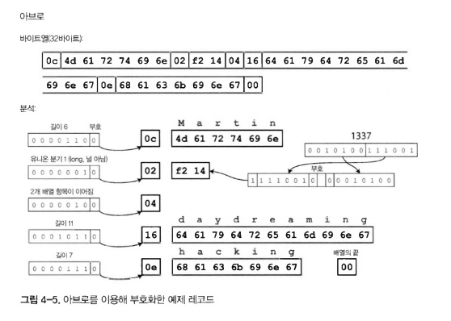

# 🔴 부호화와 발전

애플리케이션은 시간이 지남에 따라 필연적으로 변경된다.

대부분의 경우 기능이 변경됨에 따라 데이터도 변경해야 한다.

2장에서 설명한 데이터 모델에는 이러한 변화에 대처하는 다양한 방법이 있다.

- RDB는 `alter`를 통해 변경이 된다.
- NoSQL은 이전에 쓰여진 데이터와 새롭게 변경된 데이터가 함께 사용 된다.

이렇게 DB의 스키마가 변경된다면 코드도 변경되어야 한다.

하지만 대규모 애플리케이션의 코드 변경은 대게 즉시 반영할 수 없다.

- `rolling upgrade` 순회식 업그레이드를 통해 새로운 버전이 원활히 실행되는지 확인한 이후에 순차적으로 업데이트를 한다. or 롤백을 진행한다. 

하지만 코드 변경이 되어도 사용자가 어플리케이션을 업데이트 하지 않는 문제가 있다.

- `하위 호환성`
  - 새 코드가 이전 코드가 기록한 데이터를 읽을 수 있어야 함. (쉬움)
- `상위 호환성`
  - 이전 코드가 새 코드가 기록한 데이터를 읽을 수 있어야 함. (어려움)

이번 장에서는 JSON, XML, Protocol Buffers, Thrift, Avro를 비롯하여 데이터 부호화를 위한 다양한 형식을 살펴본다.
- 특히 어떻게 스키마를 변경하고 이전 버전과 호환성을 지원하는지 설명한다.

그 다음엔 웹서비스에서 REST, 원격 프로시저 호출, 메세지 큐 같은 시스템에서 데이터 부호화 형식이 어떻게 저장되고 통신되는지 살펴본다.

## 🟠 데이터 부호화 형식

`참고` 부호화는 직렬화 단어로도 표현되지만 7장에서 트랜잭션 직렬화와 단어가 중복되어 이장에서는 부호화로 표현한다.

프로그램에서 데이터는 객체, 구조체, list, array, hash, tree 등 CPU에 효율적인 구조로 최적화 된다.

네트워크 상에서 데이터는 바이트열(JSON과 같은 형태)로 부호화 해야한다. 그 이유는 포인터 같은 부분은 다른 컴퓨터가 이해할 수 없기 때문이다.

그래서 데이터 변환 필요하다.

- `부호화` 
  - 인메모리 표현에서 바이트열로 변경하는 것
  - 직렬화나 마샬링
- `복호화`
  - 파싱, 역직렬화, 언마샬링

### 🟢 언어별 형식

프로그래밍 언어는 부호화 기능을 내장하고 있어 편리하다.

- `java`
  - Serializable
  - Kryo(라이브러리)
- `ruby`
  - Marshal
- `python`
  - pickle

하지만 내장된 부호화 기능은 문제점이 있다.

1. 다른 언어에서 데이터를 읽기 매우 어렵다.
2. 역직렬화 과정에서 임의의 클래스를 인스턴스화 할수 있음.
   - 보안 취약점 발생 가능
   - 공격자가 전송한 악의적인 데이터가 역직렬화 과정에서 원하지 않는 코드를 실행하도록 유도할 수 있음
3. 버전 관리
   - 버전에 따라 부호화와 역직렬화 데이터가 호환되지 않는 문제 발생
4. 효율성
   - 특히 java serializable은 성능이 좋지 않기로 유명

이러한 이유로 내장된 부호화 기능은 사용하지 않는 것이 좋다.

### 🟢 JSON과 XML, 이진 변형

많은 프로그래밍 언어에서 쓸 수 있는 표준화된 부호화

- XML
  - 많이 사용됨
  - 불필요하게 복잡함
- JSON
  - 많이 사용됨
  - XML 대비 단순
- CSV
  - 강력하진 않지만 인기있음

장점도 있지만 단점도 존재한다.
1. CSV, XML은 123과 "123"을 구분하지 못하는 애매함이 있다. JSON은 문자열과 수를 구분 하지만 정밀하지 않다.
2. 1번의 애매함은 큰 수를 다룰때 문제가 된다.
   - 예를 들어 지수 표현을 저장할 수 없다.
3. JSON과 XML은 이진 문자열(바이트열, 사람이 읽기 어려운 문자)을 지원하지 않는다.
   - Base64를 통해 회피할 순 있지만 데이터 크기가 33프로 증가하는 단점이 있다.
4. JSON은 스키마를 지원하지만 사용을 강제하지 않아 문제가 된다.
   - 반면 XML은 스키마(데이터 구조에 대한 제약 조건)로 강제되어 데이터를 명확히 정의할 수 있음.
   - 그래서 JSON은 역직렬화 로직을 개발자가 직접 하드코딩하는 경우가 많다.
5. CSV는 그냥 쉼표로만 구분된 값일 뿐 어떤 컬럼이 어떤 의미를 가지는지 알수 없다.

이러한 결점들이 있어도 JSON, XML, CSV는 부호화 부분, 특히 데이터 교환 형식에서 인기가 계속될 것이다.

_**이진 부호화**_

조직 내에서만 사용하는 데이터라면 최소공통분모 부호화 형식(lowest-common-denominator encoding format)을 사용한다.
- `최소공통분모 부호화 형식`: 여러 시스템 환경에서 이애할 수 있는 가장 단순한 방식

```json
{
  "userName": "Martin",
  "favoriteNumber": 1337,
  "interests": ["daydreaming", "hacking"]
}
```
예를 들어 JSON 같은 형식을 선택할 수 있다. 하지만 데이터가 커진다면 JSON, XML과 같은 형식은 많은 저장 공간을 차지하기 때문에 다른 저장 방법을 고려할만 하다.

그래서 이진 부호화를 고려하게 된다.
- `JSON`
  - MessagePack, BSON, UBJSON, BISON, Smile
- `XML`
  - WBXML, Fast Infoset

이 방식들은 일부 틈새 시장에서는 쓰였지만 JSON, XML과 같이 범용적으로 사용되진 못했다.


1. 0x83 → 객체에 3개 필드가 있음을 의미
2. 0xa8 → 다음 필드 이름 길이가 8바이트임을 의미
3. 이어서 "userName" 문자열을 부호화
4. 그 다음 "Martin" 같은 값도 바이트로 표현

### 🟢 스리프트와 프로토콜 버퍼

- 스리프트(Thrift)
  - 페이스북 개발
  - 2007 ~ 2008년 오픈소스로 공개
  - 이진 부호화를 위한 스키마 필요
    - 스리프트 인터페이스 정의(interface definition language, IDL)
    ```text
    struct Person {
      1: required string userName,
      2: optional i64 favoriteNumber,
      3: optional list<string> interests
    }
    ```
- 프로토콜 버퍼(Protocol Buffers)
  - 구글 개발
  - 2007 ~ 2008년 오픈소스로 공개
  - 이진 부호화를 위한 스키마 필요
    - 스리프트 인터페이스와 매우 유사함
    ```text
    message Person {
        required string user_name = 1;
        optional int64 favorite_number = 2;
        repeated string interests = 3;
    }
    ```

이 스키마를 부호화한 데이터를 살펴보자. 스피르트는 바이너리프로토콜(BinaryProtocol)과 컴팩트프로토콜(CompactProtocol) 두가지를 지원한다.


1. 바이너리 프로토콜(BinaryProtocol)
   - 직관적으로 단순히 데이터를 바이너리 값 그대로 기록하는 방식.
   - 예시 데이터(JSON의 Person)를 59바이트로 부호화.
   - 각 필드에는 타입 정보 + 길이 + 값이 포함됨.


2. 컴팩트 프로토콜(CompactProtocol)
   - 필드 이름이 없고 숫자로 표시되는 필드 태그를 포함한다.
   - 같은 데이터라도 더 적은 바이트로 표현 가능.
     - 예: 같은 Person 데이터를 34바이트만 사용.
   - 정수를 가변 길이 인코딩(variable-length integer)으로 부호화. 
     - 숫자를 더 줄여서 작게 표현


3. 프로토콜 버퍼(Protocol Buffer)
   - 프로토콜 버퍼도 스리프트 컴팩트 프로토콜과 비슷함.
   - 예시 Person 데이터를 33바이트로 부호화.
   - 필드에 required / optional 지정 가능하지만, 실제 부호화 방식에는 차이가 없음.

_**필드 태그와 스키마 발전**_

스키마는 필연적으로 시간이 지남에 따라 변한다. 이를 스키마 발전(schema evolution)이라 부른다.

스리프트와 프로토콜 버퍼는 어떻게 하위, 상위 호환성을 유지하면서 스키마를 변경하는지 알아보자.

1. 부호화 레코드와 필드 태그
   - 부호화된 데이터는 결국 필드의 연결 집합일 뿐임.
   - 각 필드에는 태그 숫자(예: 1, 2, 3)와 데이터 타입(문자열, 정수 등)이 붙음.
   - 필드 이름자체로 저장되지 않고 태그(숫자)로만 저장 됨 → 이름은 바뀌어도 문제 없음.
   - 하지만 태그 숫자(순서)는 절대 바뀌면 안 됨 → 기존 데이터와 호환 불가가 되기 때문.
2. 새로운 필드 추가
   - 새로운 필드를 추가할 때는 새로운 태그 번호를 붙이면 됨.
   - 예전 코드는 새로운 태그를 모름 → 무시 가능.
   - 새 코드에서는 새로운 필드까지 읽어들임 → 즉, 상위 호환성 유지.
3. 하위 호환성
   - 필드 태그가 유지되면, 예전 코드도 새로운 데이터를 읽을 수 있음.
   - 단, 새로운 필드가 필수(required)라면 문제가 생김.
   - 따라서 새로운 필드는 기본적으로 optional로 추가하는 것이 원칙.
4. 필드 삭제
   - 필드 삭제 시에도 주의 필요
   - optional 필드는 삭제 가능.
   - required 필드는 삭제 불가 
     - 예전 코드에서 해당 필드를 무조건 요구하기 때문.
   - 삭제한 필드의 태그 번호는 절대 재사용하면 안 됨. (나중에 새 코드가 예전 데이터를 잘못 해석할 수 있음)

_**데이터타입과 스키마 발전**_

필드의 데이터타입을 변경하는게 가능할까? 값이 정확하지 않거나 잘릴 위험이 있다.
  - 예를 들어 32비트 정수를 64비트로 바꾼다고 가정하자
  - 새로운 코드는 32비트를 읽고 나머지는 0으로 채운다. (문제 없음)
  - 이전 코드는 새로운 코드에서 생성된 64비트를 읽을때 32비트가 잘린다. (문제 발생)

프로토콜 버퍼의 repeated 데이터 타입
- list나 array 데이터 타입은 없지만 `repeated`라는 타입이 있음.
- 단순히 동일한 필드 태그가 여러번 반복
- optional(단일값)을 repeated(다중값)으로 변경해도 문제가 없다.
  - 단 이전 단일 값을 읽는 코드는 반복되는 목록에서 가장 마지막 엘리먼트만 볼 수 있다.

스리프트 목록 데이터 타입
- 프로토콜 버퍼와 달리 단일 값을 다중 값으로 변경을 허용하지 않음
- 목록 안에 목록을 중첩해서 지원하는 장점이 있음.

### 🟢 아브로

2009년 하둡의 프로젝트인 아파치 아브로는 프로토콜 버퍼와 스리프트에 대적할 만한 또 하나의 이진 부호화 형식이다.

- 아브로 스키마
  - IDL(Avro IDL)
    - 사람이 읽고 작성하기 쉽다.
    ```avro
    record Person {
        string userName;
        union { null, long } favoriteNumber = null;
        array<string> interests;
    }
    ```
 - JSON
   - 기계가 읽고 작성하기 쉽다.
   ```json
    {
        "type": "record",
        "name": "Person",
        "fields": [
            {"name": "userName", "type": "string"},
            {"name": "favoriteNumber", "type": ["null", "long"], "default": null},
            {"name": "interests", "type": {"type": "array", "items": "string"}}
        ]
    }
    ```


- 아브로 특징
  - 예시 데이터를 부호화하면 길이는 32바이트로 모든 부호화중 가장 짧다.
  - 스키마에 태그 번호가 없다.
  - 데이터 타입 식별 정보도 없다.
  - 단순히 연결된 값으로만 구성된다.
  - 데이터 타입이 없기 때문에 정확히 같은 스키마를 사용해야 한다.
    - 개발자가 쓰기에 사용된 스키마와 읽기에 사용될 스키마를 미리 알고 써야 한다.

이러한 특징이 있는 아브로는 어떻게 스키마 발전을 제공할까?(스키마의 변경에 대응할까?)

_**쓰기 스키마와 읽기 스키마**_


- 쓰기 스키마
  - 애플리케이션이 데이터를 파일이나 DB에 저장하거나 네트워크 전송할 때, 부호화한다면 어떤 스키마로 부호화하는지 알아야 한다.
- 읽기 스키마
  - 애플리케이션이 파일이나 DB, 네트워크 수신 등으로 읽은 데이터를 복호화하길 원한다면 어떤 스키마로 복호화하는지 알아야 한다.

- 핵심 아이디어
  - 읽기 스키마와 쓰기 스키마가 동일하지 않아도 되며 단지 호환되면 됨
  - 데이터를 복호화할 때 쓰기 스키마를 읽기 스키마와 함께 읽어낸 후 읽기 스키마로 데이터를 변환하여 차이를 해소한다.
    - 네트워크 전달시 쓰기 스키마에 대한 데이터를 함께 전달한다.
  - 위에 예시처럼 필드의 순서가 달라도 상관이 없다.
    - 필드를 일치시켜 매칭하기 때문

_**스키마 발전 규칙**_

- 아브로에서 호환성
  - 상위 호환성은 새로운 버전의 쓰기 스키마와 이전 버전의 읽기 스키마를 가질 수 있음을 의미
    - 새로 작성된 데이터를 예전 프로그램으로도 읽을 수 있는 상태
  - 하위 호환성은 새로운 버전의 읽기 스키마와 예전 버전의 쓰기 스키마를 가질 수 있음을 의미
    - 옛날에 작성된 데이터를 새로운 읽기 스키마로도 읽을 수 있는 상태

- 호환성을 유지하는 방법
  - 기본값이 있는 필드는 추가하거나 삭제할 수 있다.
    - 예시의 favoriteNumber 필드는 기본값이 null이다.
    - favoriteNumber와 같이 새로운 필드를 추가했을 때 이전에 작성된 데이터를 새로운 스키마로 읽었을 때 값이 누락되어 있다면 기본값(null)으로 채워진다.
  - 기본값이 없는 필드를 추가하면 새로운 읽기는 예전 쓰기에 기록된 데이터를 읽을 수 없다.
    - 하위 호환성이 깨진다.
  - 기반값이 없는 필드를 삭제하면 예전 읽기는 새로운 쓰기 스키마를 통한 데이터를 읽을 수 없다.
    - 상위 호환성이 깨진다.

- 유니온 타입
  - 일반 프로그래밍 언어에서는 변수에 기본값을 허용하지만, 아브로는 그렇지 않다.
    - 대신 유니온 타입(union type) 을 사용해 널을 명시해야 한다.
    - 예륻들어 `union { null, long, string } field` field는 null일 수도 있고 문자열 또는 숫자일 수 있다.
  - 아브로는 프로토콜 버퍼, 스리프트와 달리 optional/required 표시가 없다.
  - 유니온 타입은 가능한 값의 집합이 명확하기 때문에 디버깅과 오류 방지에 유리
    
_**그러면 쓰기 스키마는 무엇인가?**_

모든 레코드에 전체 스키마를 포함할 수 없다. 그러면 이진 부호화로 절약한 공간이 소용없어진다.

읽기는 특정 뎅터를 부호화한 쓰기 스키마를 어떻게 알 수 있을까?

정답은 아브로를 사용하는 상황에 따라 다르다.

1. 많은 레코드가 있는 대용량 파일
   - 아브로의 일반적인 용도에서는 하나의 큰 파일에 다수의 레코드를 저장한다.
     - 이 경우 모든 레코드는 동일한 쓰기 스키마로 부호화된다.
     - 따라서 파일의 시작 부분에 한 번만 쓰기 스키마를 기록하면 된다.
   - 아브로는 이런 파일 형식을 객체 컨테이너 파일(object container file) 이라고 부른다.

2. 개별적으로 기록된 레코드를 가진 데이터베이스
   - 데이터베이스에는 서로 다른 쓰기 스키마를 사용해 쓰인 레코드가 함께 있을 수 있다.
     - 즉, 모든 레코드가 동일한 스키마를 가진다고 가정할 수 없다.
   - 해결책
     - 각 레코드의 시작 부분에 버전 번호(version number) 를 포함시킨다.
     - 쓰기 버전 번호를 통해 읽는 쪽은 해당 버전에 맞는 쓰기 스키마를 불러올 수 있다.
     - 이 방식은 에스프레소에서 사용된다.

3. 네트워크 연결을 통해 레코드 보내기
   - 두 프로세스가 네트워크 연결을 통해 데이터를 주고받는 경우, 연결 설정 단계에서 쓰기 스키마 버전 합의를 할 수 있다.
   - 이후에는 연결이 유지되는 동안 합의된 스키마를 사용해 데이터를 주고받는다.
   - 아브로 RPC 프로토콜이 이 방식을 따른다.

DB에서는 스키마 버전을 사용하는 것이 유용한다. 스키마 버전들이 설명서처럼 스키마 호환성 체크를 직접할 수 있기 때문이다.
- 버전은 보통 정수나 해시를 사용한다.

_**동적 생성 스키마**_

프로토콜 버퍼와 스리프트에 비해 아브로는 스키마에 태그 번호가 포함되지 않는다. 이점이 어떤 장점이 있을까?

이 차이는 아브로가 `동적 생성 스키마`에 유리하다는 것이다.

- 동적 스키마
  - 스키마 생성
    - 예를 들어 RDB에서 데이터를 파일로 덤프할 때, JSON, CSV, XML로 진행한다면 비효율 적이다.
    - 아브로를 사용하면 RDB 스키마를 아브로 스키마로 쉽게 생성할 수 있다.
    - 생선된 아브로 스키마를 이용해 DB 내용을 부호화하고 아브로 객체 컨테이너 파일로 모두 덤프할 수 있다.
  - 스키마 변경
    - DB 스키마가 변경되면 그에 맞게 새로운 아브로 스키마를 생성하면 된다.
    - 데이터를 내보낼 때 변경된 스키마에 맞는 새로운 아브로 스키마를 사용하면 되므로 변경에 신경 쓸 필요가 없다.
    - 데이터 파일을 읽는 사람은 스키마를 알 필요 없다. 필드 이름으로 매칭하기 때문에 변경되지 않은 스키마들은 여전히 매칭된다.
- 스리프트, 프로토콜 버퍼와 비교
  - 위 예시와 같이 동작하려면 필드 태그를 수동으로 할당해야 한다.
  - DB가 변경될 때마다 개발자가 DB 컬럼 이름과 필드 태그의 매핑을 신경 써줘야한다.
  - 아브로는 동적 생성 스키마를 고려한 설계했고 스리프트와 프로토콜 버퍼는 동적 스키마 생성이 설계 목표가 아니었을 뿐이다.

_**코드 생성과 동적 타입 언어**_

리프트(Thrift), 프로토콜 버퍼(Protocol Buffers) 는 코드 생성에 의존한다.

- 정적 타입 언어
  - 이 방식은 정적 타입 언어(Java, C++, C# 등)에 유리하다.
  - 미리 class로 만들어두고 매핑
  - 복호화된 데이터를 효율적으로 다루기 위해 인메모리 구조를 활용하는 것도 장점
  - 데이터 구조에 접근할 때 IDE에서 타입 검사와 자동 완성을 지원하기 때문
- 동적 타입 언어
  - 자바스크립트, 루비, 파이썬 같은 동적 타입 언어에서는 코드 생성을 굳이 할 필요가 없다.
  - map처럼 데이터를 모두 받아낼 수 있음
  - 런타임에 타입 검사가 이뤄지므로, 명시적 코드 생성이 불필요하다.
  - 코드 생성은 오히려 중복된 작업처럼 여겨질 수 있다.
  - 특히 데이터베이스 테이블에서 생성된 아브로 스키마의 경우, 코드 생성은 불필요한 장애물이다.

아브로는 정적 타입 언어를 위해 선택적으로 코드 생성을 제공한다. 하지만 꼭 사용하지 않아도 된다.

객체 컨테이너 파일이 있다면 아브로 라이브러리를 통해 JSON 파일을 보듯이 데이터 파일을 확인할 수 있다.
- 이 파일은 필요한 메타데이터를 모두 포함하기 때문에 `자기 기술적(self-describing)`이다.


### 🟢 스키마의 장점

프로토콜 버퍼, 스리프트, 아브로는 스키마를 사용해 이진 부호화 형식을 구현한다.
- XML, JSON 같은 스키마 기반이 아닌 텍스트 형식보다 훨씬 간단하고 효율적이다.
- XML, JSON이 지원하지 않는 유효성 검사 규칙도 지원한다.
  - 예를 들어 "이 필드의 문자열 값은 정규 표현식에 일치해야 한다." or "이 필드 값은 0과 100 사이여야 한다." 
- 프로토콜 버퍼, 스리프트, 아브로는 구현과 사용이 간단하므로 상당히 광범위한 프로그래밍 언어를 지원하는 방향으로 성장 중이다.

- ASN.1
  - 1984년 처음으로 표준화된 스키마 정의 언어
  - 이진 부호화 기반 아이디어는 새로운 개념이 아니다.
  - 다양한 네트워크 프로토콜 정의에 사용됨
  - 이진 부호화 형식인 DER은 SSL 인증서(X.509)에서 여전히 사용 중
  - ASN.1도 프로토콜 버퍼, 스리프트처럼 태그 번호 기반 방식
  - 너무 복잡하고 문서화가 부족해서 새로운 애플리케이션에는 잘 안 쓰임

- DB 시스템 독자적인 이진 부호화 구현
  - RDB는 DB와 애플리케이션 통신을 위해 자체 네트워크 프로토콜을 사용한다.
  - 이 프로토콜들은 DB에 특화되어 있어 DB 마다 다름
    - 예: ODBC, JDBC 드라이버가 이런 역할을 담당

- 텍스트 포맷(JSON, XML, CSV) vs 아브로
  - 텍스트 포맷은 널리 쓰이지만, 스키마 기반 이진 부호화 형식도 좋은 선택일 수 있다.
  - 작은 크기: 필드 이름을 생략할 수 있어 크기가 훨씬 작다.
  - 최신성 보장: 스키마와 함께 저장되므로, 항상 최신 구조를 확실히 알 수 있다.
  - 호환성 관리: 스키마를 유지하면 상위/하위 호환성을 검증할 수 있다.
  - 정적 타입 언어 지원: 코드 생성을 통한 IDE 자동완성과 컴파일 시점 타입 체크 가능

## 🟠 데이터플로 모드

앞서 네트워크를 통해 데이터를 보내거나 파일에 기록하기 위한 다양한 부호화 방법, 상위/하위 호환성에 대해 얘기했다.

이번 장에서는 누가 데이터를 부호화하고 그것을 복호화할까? 즉 프로세스 간 데이터를 전달하는 가장 보편적인 방법을 살펴본다.

1. 데이터베이스를 통한 전달
2. 서비스 호출을 통한 전달
3. 비동기 메세지를 통한 전달

### 🟢 데이터베이스를 통한 데이터플로

- DB에 부호화하고 복호화
  - 데이터를 기록하는 프로세스는 DB에 데이터를 부호화해서 저장.
  - 데이터를 읽는 프로세스는 DB에서 데이터를 복호화해서 가져옴.
  - 단일 프로세스라면 단순히 자기 자신에게 메시지를 보내는 것과 유사.
    - 즉, 지금 저장하는 데이터가 미래의 자기 자신에게 전달될 수도 있다는 의미.
  - 여기서 하위 호환성이 필요하다. 그렇지 않으면 이전에 기록한 내용을 미래의 내가 복호화할 수 없기 때문이다.

- 다중 프로세스 환경에서 문제점
  - 여러 프로세스가 동시에 같은 DB에 접근할 수 있다.
    - 다양한 어플리케이션 서비스가 접근하는 경우가 있다.
    - 단순히 동일한 어플리케이션 서비스가 여러 인스턴스로 접근하는 경우도 있다.
  - 이런 환경에서 발생할 수 있는 문제
    - 일부 프로세스는 새 코드 실행 중, 다른 프로세스는 옛 코드 실행 중일 수 있다.
      - 이것은 DB내 값이 새로운 버전의 코드로 기록되고 예전 버전의 코드로 읽을 가능성이 있다는 의미
      - 따라서 DB에서도 호환성이 필요하다.


- 스키마 변경에 문제점
  - 예를들어 DB에 새 스키마를 추가하고 코드도 새로운 필드를 추가한다.
    - 이전 버전의 코드가 새로운 데이터를 읽고 다시 저장할때 새로운 필드를 모르더라도 필드는 그대로 유지하는 것이 바람직하다.
    - 앞에서 설명한 부호화 형식은 이런 unknown 필드 보존을 지원하지만 예시 그림과 같이 개발자가 신경써줘야 하는 사례도 있다.
      - photoURL 데이터가 새로 생겼지만 예전 코드에는 없는 필드라 데이터가 유실됨

_**다양한 시점에 기록된 다양한 값**_

- 데이터베이스에는 언제 기록되었을지 모르는 값들이 기록되어 있다.
  - 일부 값은 5초 전에 기록되었을 수 있고 또 일부는 5년 전 기록일 수 있다.
- 애플리케이션 코드는 새 버전으로 즉시 교체되지만 데이터베이스에 저장된 데이터들은 그렇지 않다.
  - 데이터를 수정하지 않는 한 원래 부호화 상태 그대로 저장되어 있다.
  - 이러한 상황을 데이터가 코드보다 더 오래 산다(data outlives code)라고 한다.
- 데이터를 마이그레이션하는 작업도 분명 가능하다.
  - 하지만 대용량 데이터 대상으로 비싼 작업이기 때문에 대부분의 데이터베이스는 가능하면 하지 않는다.
  - RDB에서는 기존 데이터를 수정하지 않고 null을 기본값으로 하는 새로운 컬럼을 추가하는 간단한 스키마 변경을 사용한다.
    - MySQL은 예외이다.
  - 링크드인의 문서 데이터베이스인 에스프레소는 아브로를 사용하여 문제를 해결하고 있다.

_**보관 저장소**_

백업이나 데이터 웨어하우스로 적재하기 위해 DB의 스냅샷을 만든다고 가정해보자.
- 데이터 덤프는 보통 최신 스키마를 사용해 부호화 한다.
- 원본 DB에는 다양한 시점의 스키마 버전이 섞여 있을 수 있지만, 덤프 과정에서 데이터를 복사하므로 일관되게 부호화하는게 낫다.

데이터 덤프는 한 번에 기록하고 이후에는 변하지 않으므로 아브로 객체 컨테이너 파일과 같은 형식이 적합하다.
- 파케이와 같은 컬럼 지향 형식으로 데이터를 부호화하기 좋다.

### 🟢 서비스를 통한 데이터플로:REST와 RPC

- 네트워크 통신과 서비스
  - 네트워크로 데이터를 주고받아야 할 때 가장 일반적인 방법은 클라이언트와 서버 모델
  - 서버는 API를 공개하고, 클라이언트는 API를 호출하여 서버와 통신한다.
  - 서버가 공개하는 API를 서비스(service) 라고 부른다.
- 웹 동작 방식
  - 클라이언트(웹 브라우저)가 웹 서버에 요청
    - HTML, CSS, JS, 이미지 다운로드 → GET 요청
    - 데이터 전송 → POST 요청
  - API는 표준 프로토콜과 데이터 타입을 기반으로 함. (HTTP, URL, SSL/TLS, HTML 등)
  - 웹 브라우저는 사실상 범용 클라이언트로, 모든 웹 서버와 통신 가능(이론적으론)
  - 웹 브라우저가 유일한 클라이언트는 아니다
    - 모바일 앱, 데스크톱 앱 등도 네트워크에 요청을 할 수 있다.
  - 웹 브라우저 내에 수행되는 js 애플리케이션은 XMLHttpRequest를 사용해 Http를 요청할 수 있다. ex) ajax
    - 이때 서버 응답은 보통 HTML보다는 개발자가 보고 처리하기 편한 JSON과 같은 데이터이다.
  - 서버가 다른 서비스의 요청을 보내는 경우도 있다.
    - 보통 규모가 큰 애플리케이션은 기능 영역을 작은 서비스로 나누어 사용한다.
      - 이전에는 서비스 지향 설계(service-oriented architecture, SOA)라 불렀고 현재는 마이크로서비스 설계(micoroservices architecture, MSA)라 부른다.
- 서비스와 DB의 유사
  - 서비스는 클라이언트가 데이터를 제출하고 질의하는 것을 허용한다.
    - DB는 질의 언어를 통해 임의 질의를 허용하지만 서비스는 미리 정해진 API를 통해서만 허용된다.
    - 이런 제한이 캡슐화를 제공한다. 즉 서비스는 클라이언트가 할 수 있는 일과 할 수 없는 일에 대해 제약을 세분화하여 적용할 수 있다.

- SOA or MSA
  - 배포와 변경에 독립적으로 만들어 애플리케이션의 변경과 유지보수를 더 쉽게 할수 있도록 만드는 것이다.
  - 각 서비스는 한 팀이 소유하고 해당 팀은 다른 팀과 조정 없이 자주 서비스의 새로운 버전을 출시할 수 있어야 한다.
    - 즉, 새로운 버전과 이전 버전의 서버, 클라이언트가 호환되는 것을 기대한다.
    - 따라서 서버와 클라이언트가 사용하는 데이터 부호화는 API의 버전 간 호환이 가능해야 한다는 점이다. 
    
_**웹 서비스**_

- 웹 서비스
  - HTTP를 기반으로 서비스 통신 방식을 웹 서비스라고 부름
  - 하지만 웹 서비스 뿐만 아니라 다양한 상황에서도 사용되고 있다.
    - 모바일 앱이나 웹 앱이 서버에 요청을 보낸다.
    - SOA, MSA와 같이 서비스간 통신
    - 인터넷을 통해 다른 외부 서비스 API를 호출하여 통신 ex) 결제, OAuth

- 웹 서비스의 두가지 대표 방식 REST, SOAP
  - REST(Representational State Transfer)
    - REST는 프로토콜이 아닌 HTTP 원칙을 토대로 한 설계 철학
      - 간단한 데이터 타입을 강조
      - URL을 사용해 리소스 식별
      - 캐시 제어, 인증, Content-Type 등 HTTP 기능을 사용한다.
    - SOAP보다 REST가 더 인기가 있다.
    - REST 원칙에 따라 설계된 API를 RESTful이라 한다.
    - Swagger를 통해 API 문서를 작성할 수 있다.
  - SOAP(Simple Object Access Protocol)
    - API 요청을 위한 XML 기반 프로토콜이다.
    - HTTP 상에서 사용되지만 HTTP의 기능을 사용하지 않고 독립적으로 사용한다.
    - 다양하고 복잡한 여러 표준(WS)을 제공한다.
    - WSDL(Web Services Description Language)라고 부르는 XML 기반 언어를 사용하여 기술한다.
    - 원격 서비스에서 마치 로컬 메서드를 호출하듯이 접근하는 코드 생성이 가능하다.
      - 복호화 타입이 정적 프로그래밍 언어에는 유용하지만 동적 타입에는 유용성이 떨어진다.
    - WSDL은 사람이 읽고 쓰기 어렵다.
      - 개발자는 지원 도구나 IDE에 크게 의존하여 작성하고 읽어야 한다.
    - SOAP는 표면상으로는 표준이지만 다른 벤더의 구현간 종종 문제를 일으킨다.
    - 많은 대기업에서 아직 SOAP를 사용하지만 대부분의 작은 기업들은 선호하지 않는다.


_**원격 프로시저 호출(RPC) 문제**_

웹 서비스는 네트워크 상에서 API 요청을 위한 여러 최신 기술 중 하나이다.
- 엔터프라이즈 자바빈(EJB)과 자바 원격 메서드 호출(RRemote Method Invocation, RMI)
  - java에서만 사용할 수 있다.
- 분산 컴포넌트 객체 모델(Distributed Component Object Model, DCOM)
  - MS 플랫폼만 사용 가능하다.
- 공통 객체 요청 브로커 설계(Common Object Request Borker Architecture, CORBA)
  - 복잡하고 호환성을 제공하지 않는다.

- RPC(Remote Procedure Call)
  - 1970년대에 등장했고, 많은 분산 시스템에서 사용됨.
  - RPC는 네트워크를 통해 원격 서비스의 함수를 로컬 함수처럼 호출하는 방식.
  - 투명성(location transparency) — 즉, 로컬 함수 호출이든 원격 함수 호출이든 차이가 없게 보이도록.
- RPC의 결함
  - 로컬 함수 호출 예측 가능하다. 하지만 네트워크 호출은 예측이 어렵다.
    - 네트워크 문제로 응답이 유실되거나 장비가 느려서 응답이 느린걸 수 있다.
  - 네트워크 문제는 언제든 발생할 수 있기에 네트워크 문제를 항상 고려해야 한다.
    - 네트워크 요청은 timeout으로 결과 없이 반환될 수 있다. 
      - 이 경우 응답 서버가 무슨 일이 있었는지 알 수 없다.
      - 응답을 받지 못한다면 요청을 제대로 보냈는지 아닌지 알 수 있는 방법이 없다.
    - 요청이 실제로 처리되고 응답만 유실될 수 있다.
      - 이 경우엔 프로토콜에 중복 제거 기법(멱등성)을 적용하지 않으면 중복 수행의 우너인이 된다.
    - 네트워크는 원격 서비스의 상황에 따라 수 초가 걸릴 수 있다.
    - 모든 전달되는 배개변수는 바이트열로 부호화해야 한다.
      - 이때 전달 객체가 큰 객체라면 문제가 될 수 있다.
    - 각 서비스 별로 다른 언어로 구현될 수 있다. 따라서 RPC 프레임워크는 하나의 언어에서 다른 언어로 데이터 타입을 반환해야 한다.
      - 모든 언어가 같은 타입을 갖고 있지 않기 때문에 문제가 될 수 있다.

_**RPC의 현재 방향**_

이런 문제가 있음에도 RPC는 계속 발전하고 있다. 
- 스리프트와 아브로는 PRC 지원 기능을 내장한다. 
- 프로토콜 버퍼의 gPRC는 PRC 구현이다.

- 차세대 RPC 프레임워크
  - 원격 요청이 로컬 함수 호출과 다르다는 사실을 더욱 분명히 한다.
  - 비동기 처리 지원
    - 피네글과 Rest.li는 실패할지도 모를 비동기 작업을 캡슐화하기 위해 future(promise)를 사용한다.
      - 결과가 나중에 도착하면 처리하는 방식
    - gRPC는 하나의 요청과 하나의 응답이 아닌 시간에 따른 일련의 요청과 응답으로 구성된 스트림을 지원한다.
  - 서비스 찾기(service discovery)
    - 클라이언트가 특정 서비스를 찾을 수 있는 IP, port 제공

- REST와 비교
  - JSON으로 통신하는 REST에 비교해 이진 부호화를 사용하는 RPC가 더 우수한 성능을 제공할 수도 있다.
  - 하지만 REST는 개발, 디버깅에 적합하고 생태계도 풍부하다.
  - 공개 API는 주로 REST가 사용되고 사내 통신에서는 RPC를 사용하기에 적합하다.

_**데이터 부호화와 RPC의 발전**_

- 독립적인 클라이언트-서버 발전 필요성
  - 발전성을 위해서는 RPC 클라이언트와 서버를 독립적으로 변경/배포할 수 있어야 함.
  - DB 기반 데이터플로보다 서비스 기반 데이터플로가 이 점에서 더 단순하다.
  - 하지만 실제로는 모든 서버와 클라이언트를 동시에 업그레이드하기 어렵기 때문에, 상위·하위 호환성이 필요하다.
    
- RPC와 호환성
  - 스리프트, gRPC: 각자 자체 부호화 방식과 호환성 규칙 제공.
  - SOAP: XML 스키마로 요청/응답 정의 (발전 가능하나 일부 제약 존재).
  - RESTful API: JSON이 일반적으로 사용되며, 선택적 요청 매개변수 추가나 응답 객체의 새로운 필드 추가는 대개 호환성을 유지하는 변경으로 작성한다.

- 서비스 호환성의 어려움
  - RPC가 조직 경계를 넘나드는 통신에 쓰일 경우, 서비스 제공자는 클라이언트를 강제로 업그레이드할 수 없음.
  - 따라서 호환성은 오랜 시간(거의 무한정) 유지되어야 함.
  - 호환성을 깨는 변경이 필요하면 서비스 제공자는 여러 버전으로 API를 함께 제공한다.
    
- API 버전 관리
  - API 버전을 지정하는 방식은 여러 가지가 있음.
    - RESTful API: URL이나 HTTP Accept 헤더에 버전 번호 포함.
    - API 키 방식: 클라이언트의 요청에 따라 다른 API 버전 제공 가능.
  - 즉, 버전 관리에는 특정 방식이 강제되지 않으며, 서비스 설계에 따라 선택 가능.

### 🟢 메세지 전달 데이터 플로

지금까지 데이터베이스 기반, 네트워크(REST, RPC) 기반으로 하나의 프로세스에서 다른 프로세스로 데이터를 전달하는 방법을 살펴봤다.

마지막 절에서는 비동기 메세지 전달 시스템(asynchronous message-passing system)에 대해 살펴본다.
- 클라이언트 요청(메세지)을 낮은 지연 시간으로 다른 프로세스에 전달한다는 점은 RPC와 유사하다.
- 메세지를 직접 네트워크를 통해 전달하는 것이 아닌 임시로 메세지를 저장하는 메세지 브로커, 메세지 큐, 메세지 지향 미들웨어라는 중간 단계를 거친다는 점은 데이터베이스와 유사하다.

- 메세지 브로커 사용방식의 장점 (RPC보다 좋은 점)
  - 수신자(recipient)가 불안정한 상태더라도 메세지 브로커가 버퍼처럼 동작할 수 있기에 안정성 향상
  - 죽었던 프로세스에 전달되었던 메세지를 프로세스가 다시 살아났을 때 재 전달 가능(메세지 유실 방지)
  - 송신자(sender)가 수신자의 IP, Port를 알 필요가 없다.
  - 하나의 메세지를 여러 수신자에게 전송할 수 있다.
  - 논리적으로 송신자와 수신자가 분리된다.
  - 일반적으로 단방향이라는 점이 RPC와 다르다.
    - 송신자는 메세지를 보내고 응답을 기다리지 않음
    - 응답이 필요하다면 별도의 채널에서 수행됨
    - 비동기로 진행되며 메세지가 전달될때까지 기다리지 않고 단순히 전송만 진행함

_**메세지 브로커**_

- 과거
  - TIBCO, IBM WebSphere, webMethods 같은 상용 기업 소프트웨어가 주로 사용됨
- 현재
  - RabbitMQ, ActiveMQ, HornetQ, NATS, Apache Kafka 같은 오픈소스가 주로 사용됨

- 메시지 브로커의 기본 동작
  - 세부적인 동작은 다르겠지만 대부분 아래와 같이 동작한다.
  - 프로세스가 메시지를 특정 큐(queue) 나 토픽(topic) 으로 보냄.
  - 브로커는 이 메시지를 해당 큐/토픽을 구독한 소비자(consumer) 또는 구독자(subscriber) 에게 전달.
  - 동일한 큐/토픽에는 여러 생산자(producer) 와 여러 소비자가 동시에 존재 가능.
  - 토픽은 단방향 데이터플로만 제공
  - 하지만 소비자가 받은 메시지를 다른 토픽에 다시 게시(publish)할 수 있음 
    - 메시지 전달 경로 확장 가능
  - 메시지 브로커는 특정 데이터 모델을 강요하지 않는다.
    - 메세지는 일부 메타데이터를 가진 바이트열이라 모든 부호화를 사용할 수 있다.
  - 메시지 브로커를 사용하면 발행자(publisher) 와 소비자(consumer) 를 독립적으로 변경 가능
    - 즉, 생산자와 소비자가 직접 연결되지 않고 브로커를 통해 간접적으로 통신하므로, 유연성이 높아짐
  - 소비자가 받은 메시지를 다른 토픽에 다시 게시할 경우, 데이터베이스에서처럼 알지 못하는 필드(unknown)가 유실될 위험이 있어 주의가 필요하다.

_**분산 액터 프레임워크**_

- 액터 모델(actor model)
  - 단일 프로세스 안에서 동시성을 처리하는 모델.
  - 스레드처럼 직접 락(locking)이나 데드락(deadlock) 문제를 다루는 대신, 액터(Actor) 단위로 작업을 캡슐화
  - 각 액터는 클라이언트나 엔티티 같은 역할
  - 액터는 비동기 메시지 송수신으로 통신하며, 메시지 유실 가능성도 있다.
  - 각 액터는 한 번에 하나의 메시지만 처리하므로 스레드 안정성을 자동으로 확보할 수 있다.
- 분산 액터 프레임워크
  - 액터 모델을 여러 노드에 걸쳐 확장
  - 송신자와 수신자가 같은 노드에 있든, 다른 노드에 있든 동일한 메시지 전달 구조를 사용
  - 다른 노드 간 메시지는 바이트열로 부호화되어 네트워크를 통해 전달됨
  - 액터 프레임워크는 메시지 브로커와 유사하게 동작
  - 하지만 애플리케이션 업그레이드 시 새 버전을 실행하는 노드와 예전 버전을 실행하는 노드가 공존할 수 있어 호환성에 주의해야 한다.

- 인기 있는 분산 액터 프레임 워크
  - 아카(Akka)
    - 자바 내장 직렬화 사용
    - 상위/하위 호환성을 자동 제공하지 않음
    - 프로토콜 버퍼와 같은 부호화 형식으로 대체할 수 있어 순회식 업그레이드를 수행할 수 있다.
  - 올리언스(Orleans)
    - 사용자 정의 데이터 부호화 형식을 사용
    - 순회식 업그레이드 배포를 지원하지 않음
    - 새로운 클러스터를 설정하고 나서 이전 클러스터의 트래픽을 이전한 뒤 종료해야 한다.
    - 아카와 마찬가지로 사용자 정의 직렬화 플러그인을 사용할 수 있다.
  - 얼랭(Erlang)
    - OTP에서는 레코드 스키마를 변경하는 일은 의외로 어렵다. (시스템 고가용성을 위해 설계된 많음 기능이 있음에도 어려움)
      - OTP는 Open Telecom Platform으로 전화 교환기의 고가용성 요구를 만족시키기 위해 개발
    - 순차식 업그레이드는 가능하나, 신중하게 계획해야 한다.
    - 최신 버전에서는 maps 데이터 타입(JSON과 같은 구조)도 지원
    - 향후에 순회식 업그레이드를 더 쉽게 할 수 있게 만들 것이다.

### 🟢 정리

이번 장에서는 데이터 구조를 네트워크나 파일로 저장하는 다양한 방법에 대해 살펴 봤다.

이런 부호화는 세부 사항 효율성 뿐만 아니라 애플리케이션의 아키텍처와 배포 방식에도 영향을 끼친다.

- 순회식 업그레이드
  - 새로운 서비스를 동시에 모든 노드에 배포하는 방식보다 한번에 일부 노드에만 서서히 배포하는 순회식 업그레이드가 필요하다.
    - 정지 시간 없이 새로운 버전의 서비스를 추시 가능하게 한다. (한번의 큰 출시보다 잦은 작은 출시를 권장)
    - 배포를 덜 위험하게 한다. (결함이 있는 배포가 발견되면 롤백 가능)
    - 이러한 장점들이 애플리케이션 변경을 쉽게 할 수 있는 발전성에 도움이 된다.
- 호환성
  - 순회식 업그레이드 중이거나 다른 버전(이전 버전)의 애플리케이션 코드가 수행된다.
    - 모든 데이터는 하위 호환성과 상위 호환성을 제공하는 방식으로 부호화해야 한다.
- 부호화 형식과 호환성 속성
  - 프로그래밍 언어에 특화된 부호화
    - 단일 언어로 제한되며 호환성을 제공하지 못하는 경우가 많다.
  - JSON, XML, CSV 텍스트 형식이 널리 사용된다.
    - 선택적 스키마 방식은 때로는 유용하고 때로는 방해가 된다.
    - 데이터 타입에 대해 다소 모호한 점으로 인해 숫자나 이진 문자열과 같은 항목은 주의해야 한다.
  - 스리프트, 프로토콜버퍼, 아브로 같은 이진 스키마 기반 형식은 짧고 효율적인 부호화가 가능하다.
    - 정적 타입 언어에서 문서와 코드 생성에 유용
    - 사람이 읽기 위해서는 지원 도구나 복호화가 필요
- 데이터 플로 시나리오
  - DB
    - 프로세스에서 부호화하고 프로세스에서 복호화한다.
  - 클라이언트-서버
    - 서버는 요청을 복호화하고 응답을 부호화한다.
    - 클라이언트는 요청을 부호화하고 응답을 복호화한다.
    - REST, RPC
  - 메세지
    - 송신자가 부호화하고 수신자가 복호화하여 통신한다.

약간의 주의를 기울이면 상하위 호한성과 순회식 업그레이드가 가능하다는 결론이 나온다. 애플리케이션의 발전은 더욱 빨리지고 배포 빈도도 높아지고 있다.

# 🔴 분산 데이터

1부에서는 단일 장비에서 데이터를 저장할 때 적용하는 데이터 시스템 측면을 설명했다.

2단계에서는 저장소와 데이터 검색에 여러 장비가 관여하는 점에 대해 살펴보려고 한다.

여라 장비 간 분산된 데이터베이스가 필요한 경우는 여러가지다.

1. 확장성
   - 단일 장비에서 다룰 수 있는 양보다 사용량이 높아지면 여러 장비로 분배할 수 있다.
2. 내결함성/고가용성
   - 장비 하나가 죽더라도 애플리케이션이 계쏙 동작해야 한다면 여러 장비를 사용할 수 있다.
3. 지연 시간
    - 전 세계 사용자가 있다면 사용자와 지리적으로 가까운 곳에 데이터 센터를 지어 서비스를 제공한다.
    - 이를 통해 사용자는 네트워크 패킷이 지구 반바퀴를 돌아 올때까지 기다릴 필요가 없다.

## 🟠 고부하로 확장

- 고부하 확장
  - scale-up
  - 더 강력한 장비를 구매하는 것이 가장 간단한 방법
  - 또는 더 많은 CPU나 RAM을 결합하여 성능을 키움
   
- 메모리 아키텍처(shared-memory architecture)
  - 모든 CPU가 메모리나 디스크에 접근할 수 있다.
  - 성능을 업그레이드 하는 비용이 갈수록 크게 증가한다.
    - 병목 현상으로 인해 성능을 2배 늘린다고 2배의 부하를 처리할 수 있는 것은 아니다.
  - 제한적인 내결함성을 제공한다.
    - 하이엔드 장비에는 핫 스왑 가능한 요소가 있다.
      - 핫 스왑이란 장비를 중단시키지 않고 디스크, 메모리 모듈, CPU를 교체할 수 있다는 뜻이다.
  - 서버가 하나의 지리적인 위치로 제한된다.
    - 데이터 센터를 통해 여러 국가에 서비스하는 것이 제한됨
- 공유 디스크 아키텍처
  - 독립적인 CPU와 RAM을 탑재한 여러 장비를 사용하지만 데이터 저장 공간은 공유한다.
  - 장비들은 고속 네트워크로 연결된다.
  - 일부 데이터 웨어하우스 작업에 사용되긴 하지만 lock 경합과 오버헤드로 인해 확장성에 제한이 있다.

### 🟢 비공유 아키텍처

비공유 아키텍처(shared-noting, scale-out)은 많은 인기를 얻고 있다.

- 비공유 아키텍처
  - 각 장비를 노드라고 부른다.
  - 각 노드는 CPU, RAM, 디스크를 독립적으로 사용한다.
  - 노드 간 코디네이션은 네트워크를 사용해 소프트웨어로 처리한다.
  - 하이엔드 하드웨어를 필요하지 않으므로 가격 대비 성능이 좋다.
  - 여러 지리적인 영역에 데이터 센터를 통해 세계 사용자들의 지연 시간을 줄일 수 있다.
  - 클라우드 배포를 활용하면 소규모 회사라도 다중 지역 분산 아키텍처를 실현할 수 있다.(구글이 아니더라도)

2부에서는 비공유 아키텍처에 중점을 둔다. 모든 사용 사례에 가장 좋은 선택이라기 보단 해당 아키텍처를 사용하는 개발자가 주의해야 하는 점이 있기 때문이다.
- 데이터를 여러 노드에 분산하려면 분산 시스템에서 발생하는 제약 조건과 트레이드오프를 알고 있어야 한다.
- 많은 장점이 있지만 애플리케이션 복잡도를 높이고 때로는 사용할 수 있는 데이터 모델 표현을 제한한다.
- 경우에 따라 간단한 단일 스레드 프로그램이 더 분산 시스템보다 효율적일 수도 있다.

하지만 이런 점을 보더라도 비공유 시스템은 매우 강력하다. 앞으로는 데이터를 분산했을 때 발생하는 문제애 대해 자세히 알아보자.

### 🟢 복제 대 파티셔닝


- 여러 노드에 데이터를 분산하는 방법
  1. 복제(Replication)
     - 같은 데이터 복사본을 다른 위치에 있는 여러 노드에 유지한다.
     - 다른 노드에 문제가 생겨도 다른 노드들을 통해 여전히 데이터를 제공할 수 있다.
     - 성능 향상에 도움이 된다.
  2. 파티셔닝(Partitioning)
     - 큰 데이터베이스를 파티션이라는 단위로 나누어서 각 다른 노드에 저장한다.(샤딩이라고도 한다.)
     
이런 개념을 이해하면 분산 시스템에서 필요한 트레이드오프를 설명할 수 있다.

붑트랜잭션은 7장에서 설명하고 (트랜잭션을 이해하면 데이터 시스템에 발생하는 많은 문제를 설명할 수 있다.) 8장과 9장은 분산 시스템의 근본적인 한계를 설명한다.

이후 3부에서는 복잡한 애플리케이션의 요구사항을 만족하기 위해 어떻게 다양한 데이터 저장소를 가져와 대규모 시스템으로 통합할 수 있는지 설명한다.