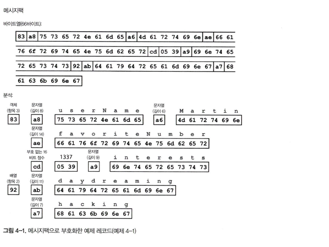

# 4장 부호화와 발전

## 서론

- 애플리케이션은 필연적으로 시간이 지나며 **필드/타입/스키마가 변경**된다
- 코드와 데이터가 동시에 바뀌기 어렵기 때문에 시스템은 **양방향 호환성**을 유지해야한다
    - 상위 호환성 → 옛 코드가 새 데이터를 읽을 수 있어야 한다
    - 하위 호환성 → 새 코드가 옛 데이터를 읽을 수 있어야 한다

## 데이터 부호화 형식

- 부호화 → 두 표현 간의 변환
    - 인메모리 표현 : 객체
    - 바이트열 표현 : 파일/네트워크 전송용
- 표현 간의 전환 방식
    - 직렬화/마샬링 = 인메모리 → 바이트열
    - 역직렬화/언마샬링 = 바이트열 → 인메모리

### 언어별 형식

- Java `Serializable`, Python `pickle`, Ruby `Marshal`
- 특징 : 코드 몇 줄로 편하게 사용이 가능하다
- **언어/런타임 종속**, 클래스 로딩/보안 이슈, 버전 관리·스키마 진화가 취약, CPU/바이트 크기 비효율
- **임의 코드 실행 위험**과 **스키마 변화 취약**.

### 텍스트 기반 형식 (JSON, XML, CSV)

- 사람이 읽기 쉽고, 도구/호환성, **조직간 교환 포맷**으로 적합하다
- 숫자 정밀도, 날짜·이진 데이터 표현 모호하고, 바이너리는  **Base64(크기가 33% 증가)** 표현한다
- JSON
    - 가볍고 널리 쓰이지만, 스키마 강제가 약하다
- XML
    - 스키마로 엄격 검증 가능하지만, 복잡하다
- CSV
    - 가장 단순하지만 스키마/인코딩, 구분자 문제로 애매한 부분이 많다

### 이진 부호화

- 텍스트 JSON을 그 구조 그대로 바이트로 압축한 **이진 JSON류**(MessagePack/Smile/UBJSON 등)도 있음
- 예시(JSON → MessagePack): **66바이트**(텍스트 JSON의 경우 81바이트)
- 미미한 공간 절약에 비해 가독성을 해칠만큼 가치가 있지는 않음

### 스리프트와 프로토콜 버퍼

- **IDL (인터페이스 데피니션 랭기쥐)** 스키마로 필드 정의 → 코드 생성 →  직렬화/역직렬화 수행
- 필드 태그 번호가 **핵심 식별자**
    - 새로운 필드는 새 태그로 추가하고, 제거시에도 태그는 **재사용 해서는 안됨**

- **Thrift**
    - 두 가지 이진 부호화 형식 제공
    - **BinaryProtocol**: **59바이트**. 타입/태그를 매 필드에 붙여 직관적
    - **CompactProtocol**: **34바이트**. 타입/태그를 단일 바이트로 줄이고, 가변길이 정수 (**varint)** 로 줄여서 표현

- **Protocol Buffers**
    - 같은 데이터가 **33바이트**. Thrift CompactProtocol 과 유사한 크기/원리
- 양방향 호환성을 유지하며 스키마 변경 방법 ?
    - 필드 값을 설정하지 않은 경우, **부호화 레코드에서 생략**해 버린다
    - 필드 태그는 부호화된 데이터를 해석하기 위한 중요한 정보
    - 필드 추가 → 새로운 태그 번호를 부여
    - 필드 삭제 → optional 필드만 제거 가능
- 타입 변경
    - 32 → 64 비트 확장은  비교적 안전하다 (남는 비트 0을 채우면 그만)
    - 그 반대의 경우는 위험함

### 아브로

- Avro IDL → 사람이 쓰기  쉬운 IDL 과 기계가 쉽게 읽을 수 있는 JSON 기반 언어
- 숫자 태그가 없다 → 바이트는 **필드 순서 기반으로 부호화** 한다

- **쓰기 스키마 ≠ 읽기 쓰기마** 처리가 가능하다
    - 두 스키마가 정확히 일치 하지 않아도 된다
    - 런타임에 두 스키마를 매칭해 상/하위 호환성을 유지한다
    - 새 필드가 추가되어도 기본 값만 있다면 예전 데이터도 읽힌다
    - 읽는 쪽에만 있고, 쓰기에는 없는 필드는 무시
- 유니온 타입 :
    - 필드에 널을 허용하는 방법
    - union { null, long. string} field; 필드가 널이거나, 숫자거나, 문자열이다
    - 필드가 유니온 엘리먼트중 하나인 경우에만 기본값으로 널 사용가능
- 필드 이름 변경은 하위 호환성이 있지만 상위 호환성은 없다
    - 유니온 타입에 엘리먼트 추가도 동일
- **동적 생성 스키마**(데이터베이스 테이블을 덤프하며 스키마 생성 등)에 친화적
- **자기 기술(self-describing) 파일**(스키마+데이터를 함께 저장)로 장기 보관/분석에 좋음
- **코드 생성은 선택**(정적 언어에 유용하나 필수는 아님)

## 데이터 플로 모드

- 데이터가 프로세스 사이를 오가는 방식 3가지
- **데이터 베이스를 통한 방법**
    - 한 프로세스가 DB에 **기록**(부호화), 다른 프로세스가 **읽음**(역부호화)
    - **상위 호환성**이 특히 중요
    - 장점: 내구성/재시도 용이.
    - 단점: 갱신 프로세스에서 **레코드 재부호화시** 이슈(알 수 없는 필드 보존 등) 주의
- **서비스 호출 기반 방법 (REST/RPC)**
    - **REST**: HTTP 원칙 활용(리소스/메서드/헤더/캐시). 공개 API에 적합
    - **SOAP**: 규격은 엄격하나 무겁고 도구 의존도가 높아 주류는 아님
    - **RPC**: 원격을 로컬 호출처럼 쓰게 해 주지만 네트워크 현실을 무시하면 위험.
        - 개발시 고려해야할 부분 : **타임아웃, 재시도, 멱등성, 순서, 부분 실패**.
        - 현대 프레임워크: **gRPC(Proto), Finagle/Rest.li(JSON/Thrift/Avro), Avro RPC**. 서비스 디스커버리/버전 관리와 함께 사용
    - **API 버전 관리**: URL 경로, 헤더, API 키 등으로 **다중 버전 공존**을 설계
- **비동기기 메세지 전달 방법 (RabbitMQ, ActiveMQ, NATS, Kafka)**
    - **버퍼링/재전달**로 안정성↑, **발신-수신 분리**, **팬아웃/구독**
    - 응답이 필요하면 **상관관계 ID** 등으로 별도 채널 운영.
    - 브로커는 포맷을 강제하지 않음 → **Avro/JSON 등 자유롭게**.
    - 토픽 ↔ 큐 모델, **프로듀서/컨슈머**

## 분산 액터 프레임 워크 (뜬금포)

- **액터 모델**: 각 액터가 메일박스로 메시지 비동기 처리(경합·락을 로직을 캡슐화)
- 단일 프로세스에도 유용하지만, 분산환경에서 노드간 메세지 전송으로 확장 가능하다
- 대표 적인 프레임워크
    - **Akka**(JVM): 내부 직렬화 사용, 상위/하위 호환성은 직접 설계해야 하나 **롤링 업그레이드**에 맞춰 적용 가능.
    - **Orleans**(.NET): 가상 액터 모델, 클러스터 단위로 점진적 배포 설계.
    - **Erlang/OTP**: 핫코드 스와핑/레코드 스키마 변경 등 **장수 시스템**에 특화된 기능.

