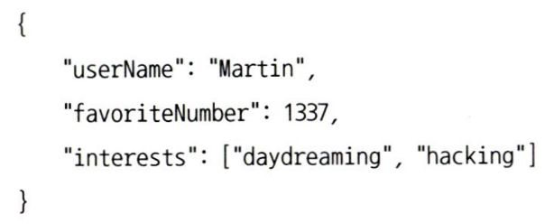

# 4장. 부호화와 발전

## 데이터 부호화 형식

---

- 프로그램은 메모리에 객체, 배열, 해시 테이블, 트리 등으로 데이터가 유지된다.
    - 하지만 파일/네트워크로 전송하려면 바이트열로 부호화해야 한다.

→ 부호화(직렬화, 마샬링): 인메모리 표현 → 바이트열

→ 복호화(역직렬화, 언마샬링): 바이트열 → 인메모리 표현

⚠️ 이 과정에서 호환성 문제(예전 코드와 새 코드의 호환) 발생

### 언어별 형식

---

- 많은 프로그래밍 언어는 부호화하는 기능을 내장한다.
    - Java: `Serializable`
    - Ruby: `Marshal`
    - Python: `pickle`
    - Kryo 등 서드파티 라이브러리 등
- 장점: 사용하기 매우 편리, 최소한의 코드로 객체 저장·전송 가능
- 단점:
    - 이식성 부족 (특정 언어/플랫폼 종속)
    - 보안 취약점 (임의 코드 실행 위험)
    - 성능 저하 (CPU/메모리 사용량↑)
- 따라서 임시적/단일 언어 환경에서는 적합하지만, 장기적·다국어 환경에서는 부적합

### JSON과 XML, 이진 변형

---

- JSON: 단순, 웹 친화적, 브라우저/JavaScript와 잘 맞음
- XML: 복잡하지만 풍부한 기능
- CSV: 단순하지만 스키마 없음
- 문제:
    - 숫자 표현 애매함 (정밀도, 부동소수점)
    - 텍스트 기반이라 크기가 크고 느림

- 이진 부호화: JSON/XML 단점을 보완한 compact 포맷
    - MessagePack, BSON, UBJSON, Smile, Fast Infoset, WBXML 등
    - 장점: JSON/XML 대비 효율적 (공간 절약)
    - 단점: 모든 필드 이름을 포함해야 하므로 데이터 크기 증가
    
    
    
    예제 4-1. 이번 장에서 다양한 형식으로 이진 부호화할 레코드 예
    
    
    
    그림 4-1. 메시지팩으로 부호화한 예제 레코드(예제 4-1)
    

### 스리프트와 프로토콜 버퍼

---

- 개발 배경:
    - Apache Thrift, Protocol Buffers (protobuf)
    - 둘 다 2007~2008년 오픈소스화
- 공통점:
    - 스키마 정의 필요 (IDL, Interface Definition Language)
        
        
        
    - 정의된 스키마 기반으로 코드 생성 → 데이터 부호화/복호화

- 부호화 프로토콜:
    1. BinaryProtocol: 단순 이진 부호화
        - 59바이트
            
            
            
            그림 4-2. 스리프트의 바이너리프로토콜을 사용해 레코드를 부호화한 예
            
    2. CompactProtocol: 공간 절약 (ex> variable-length integer 사용)
        - 34바이트
            
            
            
            그림 4-3. 스리프트의 컴팩트프로토콜을 사용한 부호화 예제
            
- 특징:
    - 필드 태그(field tag)로 데이터 구분 (필드 이름 불필요)
    - 스키마 발전(schema evolution) 시 하위/상위 호환성 유지

- 필드 태그와 스키마 발전
    - 스키마 발전(schema evolution): 스키마는 필연적으로 시간이 지남에 따라 변한다.
    - 필드 태그: 기존의 모든 부호화된 데이터를 인식 불가능하게 만들 수 있기 때문에 변경할 수 없다.
        - 새로운 태그 번호를 부여하는 방식으로 스키마에 새로운 필드를 추가할 수 있다.
- 데이터타입과 스키마 발전
    - 데이터타입: 새로운 코드가 기록한 데이터를 예전 코드가 읽는 경우 예전 코드는 값을 유지하기 위해 32비트 변수를 계속 사용한다. 복호화된 64비트 값은 32비트에 맞지 않기 때문에 잘리게 된다.

### 아브로

---

- 개발 주체: 아파치 소프트웨어 재단
- 예제 스키마와 동일한 JSON 표현
    
    
    
- 특징:
    - JSON으로 스키마 정의
    - 데이터는 compact한 이진 형식으로 저장
    - 스키마를 데이터와 함께 저장 → 동적 언어와 호환성 높음
- 장점:
    - 코드 생성 불필요
    - 스키마 변경·호환성 관리 용이
    - Hadoop/HDFS, Kafka 등과 잘 통합
- 단점: 읽기와 쓰기 간 스키마가 불일치한다면 데이터 복호화가 정확하지 않다.

- 아브로를 이용해 부호화한 예제 레코드
    
    
    
    그림 4-5. 아브로를 이용해 부호화한 예제 레코드
    

- 쓰기 스키마와 읽기 스키마
    - 쓰기 스키마: 어떤 데이터를 아브로로 부호화하길 원한다면 알고 있는 스키마 버전을 사용해 데이터를 부호화한다.
    - 읽기 스키마: 읽은 어떤 데이터를 복호화하길 원한다면 데이터가 복호화되는 스키마
    
    
    
    그림 4-6. 아브로 읽기가 쓰기 스키마와 읽기 스키마 간 차이를 해소한다.
    
    - 아브로(Avro) 방식: 저장된 데이터는 쓰기 스키마 기반으로 직렬화되고, 읽을 때는 읽기 스키마와 비교·해석됨
        - 장점: 애플리케이션이 새 버전으로 바뀌어도 → 기존 데이터 그대로 읽기 가능 (호환성 ↑)

- 스키마 발전 규칙
    - 필드 추가:
        - 새 필드가 추가되면 → 기본값(default)을 지정해야 한다.
        - 그렇지 않으면 예전 데이터 읽을 때 오류 발생
    - 필드 삭제:
        - 삭제된 필드는 무시 가능
    - 타입 변경:
        - 호환 가능한 타입 변경만 허용 (ex> `int → long`)
    - 순서 변경:
        - 필드 태그(번호)가 유지되는 한 순서는 중요하지 않음
    
    → 목적: 데이터 포맷을 진화시켜도 과거/미래 버전 모두 호환되게 하기 위함
    

- 그러면 쓰기 스키마는 무엇인가?
    - 쓰기 스키마: 데이터가 실제로 저장된 형식
    - 데이터 파일이나 메시지에 스키마 정보 자체를 함께 저장하거나, 시스템이 별도 스키마 레지스트리(schema registry) 에서 관리한다.
    - 아브로·프로토콜 버퍼 같은 시스템은 쓰기 스키마를 반드시 가지고 있어야 함.

- 동적 생성 스키마
    - 일부 부호화 프레임워크는 코드 생성 없이도 동작 가능하다.
    - 예: 아브로(Avro)는 런타임에 스키마를 읽어 들여 직렬화/역직렬화를 수행할 수 있다.
    - JSON처럼 동적으로 스키마를 해석하기 때문에,
        - 미리 클래스 파일을 컴파일하지 않아도 됨
        - 여러 버전 간 스키마 호환성 유지가 가능하다.

- 코드 생성과 동적 타입 언어
    - 스리프트(Thrift), 프로토콜 버퍼(Protocol Buffers) → 일반적으로 스키마에서 코드 생성 필요
        - 정적 타입 언어에서는 타입 안정성과 빠른 성능을 제공
    - 아브로(Avro) → 코드 생성이 필수가 아님
        - 동적 타입 언어에서는 런타임에 스키마를 해석해 바로 사용 가능
    - 따라서 언어 특성에 따라:
        - 정적 타입 언어 → 코드 생성 유리
        - 동적 타입 언어 → 동적 스키마 해석 방식이 더 자연스러움

### 스키마의 장점

---

- 간단한 문법
    - 프로토콜 버퍼, 스리프트, 아브로는 XML/JSON 스키마보다 훨씬 단순하고 구체적 유효성 검사를 지원
        - ex> "이 필드는 반드시 있어야 한다" / "값은 0과 100 사이여야 한다".
    - 구현과 사용이 쉽고 다양한 언어를 지원
- 역사적 배경
    - ASN.1(1984년 등장) 같은 오래된 표준도 있었으나 너무 복잡해서 대중적으로 실패
    - 프로토콜 버퍼, 스리프트, 아브로는 단순함을 택해 성공
- 데이터베이스 통합
    - 많은 DB 시스템이 자체 부호화를 지원하지만, 외부 통합을 위해 별도 프로토콜 필요
    - 드라이버(ex> ODBC, JDBC API)를 통해 DB 구조를 부호화된 형태로 노출
- 비교 요약
    - JSON, XML, CSV: 텍스트 데이터 타입 중심 → 널리 사용
    - 프로토콜 버퍼·스리프트·아브로: 이진 부호화 + 스키마 기반 → 더 유용한 속성 다수
        - 필드 이름 생략 가능 → 크기 절약
        - 복호화 시 최신 상태 유지
        - 상위·하위 호환성 확보
        - 정적 타입 언어에서 코드 생성 시 유용

## 데이터플로 모드

---

- 개념: 한 프로세스에서 다른 프로세스로 데이터를 전달할 때, 메모리 공유 대신 바이트열로 부호화 필요
- 중요성: 호환성은 곧 발전성. 즉, 시스템 각 부분이 독립적으로 업그레이드되며 전체가 쉽게 변화 반영
- 보편적 방법
    1. 데이터베이스 사용
    2. 서비스 호출 (REST/RPC)
    3. 메시지 큐 전달

### 데이터베이스를 통한 데이터플로

---

- 원리: 프로세스 A가 DB에 데이터 기록 → 프로세스 B가 읽음
- 특징: DB는 여러 프로세스 동시 접근 가능, 서비스 간 데이터 교환의 전통적 방식
- 문제:
    - 추가 필드가 생기면 이전 코드와 충돌 가능
    - 새로운 필드가 "알 수 없는 상태(unknown)"로 저장될 수 있음
- 핵심 원리: DB는 "데이터가 코드보다 오래 산다" → 데이터가 오래 유지되므로 스키마 발전 규칙 필요
    
    
    
    그림 4-7. 새로운 버전의 애플리케이션이 기록한 데이터를 예전 버전의 애플리케이션이 갱신하는 경우 주의하지 않으면 데이터가 유실될 수 있다.
    

- 다양한 시점에 기록된 다양한 값
    - 현상: DB는 동일한 테이블 안에서도 수년 전 값과 최근 값이 섞여 있을 수 있음
    - 문제: 새 코드가 이전 데이터를 재해석해야 하는데, 오래된 스키마와 충돌 가능
    - 데이터가 코드보다 더 오래 산다(data outlives code)

- 보관 저장소
    - 데이터베이스의 스냅숏: 백업, 데이터 웨어하우스 적재
    - 특징: 데이터 덤프는 최신 스키마를 사용해 부호화 → 다양한 시점 데이터가 함께 저장됨
    - 장점: 읽기 전용 저장이므로 아브로 같은 포맷에 적합

### 서비스를 통한 데이터플로: REST와 RPC

---

- 기본 모델: 클라이언트–서버 구조
    - 서버: API를 제공
    - 클라이언트: API 요청을 전송

- 웹 서비스
    - 서비스와 통신하기 위한 기본 프로토콜로 HTTP를 사용하는 것
    - REST
        - REST는 프로토콜이 아니라 HTTP의 원칙을 토대로 한 설계 철학
        - 단순한 데이터 타입을 강요하지 않고 URI를 사용해 리소스를 식별하고, 캐시, 메서드(`GET`, `POST`, `PUT`, `DELETE` 등), 인증, 콘텐츠 유형 협상 등 HTTP 기능을 활용
        - 따라서 RESTful API는 리소스를 중심으로 설계된 API
    - SOAP: XML 기반, WSDL 같은 무거운 표준 사용 → 현재는 인기가 줄었음

- 원격 프로시저 호출(RPC) 문제
    - RPC는 1970년대부터 사용된 원격 프로시저 호출(Remote Procedure Call) 개념에 기반
    - 원격 프로세스의 네트워크 요청을 같은 프로세스 내 함수 호출처럼 보이게 하는 방식
    - 간단해 보이지만, 네트워크 지연·에러·재시도 문제 포함
    - 문제:
        - 응답 없음(timeout), 중복 요청, 실행 지연 등
        - 네트워크 실패 시 복잡한 예외 처리 필요

- RPC의 현재 방향
    - RPC는 여전히 사용됨
    - `gRPC`: 구글이 개발, 프로토콜 버퍼 기반, `Finagle`: 트위터가 개발, 스리프트 기반
    - 추세: 서비스 디스커버리, 로드 밸런싱, 모니터링, 테스트 도구 등과 함께 동작

- 데이터 부호화와 RPC의 발전
    - 발전성 필요: 클라이언트와 서버를 독립적으로 변경 가능해야 함
    - 원칙: RPC도 스키마 호환성 유지가 필수
    - REST와 RPC 모두 스키마 기반 부호화 형식을 사용하면 발전성과 호환성 유지 가능

### 메시지 전달 데이터플로

---

- REST와 RPC: 네트워크를 통한 직접 요청/응답 방식. 빠른 응답 기대
- 메시지 전달 데이터플로: 데이터베이스에 기록 후 다른 프로세스가 나중에 읽는 방식
    
    → RPC와 달리 비동기 처리 가능
    

- 메시지 브로커
    - 메시지를 직접 전송하지 않고 임시 저장(큐/토픽) 후 다른 프로세스가 가져가도록 하는 시스템
        - ex> RabbitMQ, ActiveMQ, Kafka 등
    - 장점
        - 송신자와 수신자의 시간적 결합 해소 → 비동기 처리 가능
        - 송신자/수신자 간 주소 정보 불필요
        - 하나의 메시지를 여러 수신자에게 전송 가능
        - 발행/구독(pub-sub) 모델 지원

- 분산 액터 프레임워크
    - 액터 모델: 프로세스 단위 동시성 모델. 각 액터는 메시지 기반으로만 통신
    - 특징
        - 락(lock)·데드락(deadlock) 문제 회피
        - 위치 투명성: 메시지 수신자가 어디 있는지 알 필요 없음
        - 단일 프로세스 내에서도 메시지 전달 구조 사용 가능
    - 예시 프레임워크
        - Akka: 자바/스칼라 기반. 상위·하위 호환성 제공
            - [https://github.com/kyh1126/scalaStudy/tree/master/src/main/scala/progscala2/concurrency/akka](https://github.com/kyh1126/scalaStudy/tree/master/src/main/scala/progscala2/concurrency/akka)
        - Orleans: 마이크로소프트 .NET 기반, 가상 액터 모델
        - Erlang OTP: 전통적 액터 모델 구현, 전기통신 시스템 등에서 사용

## 정리

---

- 데이터 구조를 네트워크/디스크 상의 바이트열로 변환하는 다양한 방식이 존재
- 발전성: 시스템 변경이 용이해야 함
- 순차적 업그레이드: 일부 노드만 새 버전으로 업데이트 가능해야 함
- 상위·하위 호환성 확보가 핵심
- 다양한 부호화 방식(JSON, XML, 스키마 기반 등)은 선택 시 호환성과 성능을 고려해야 한다.
