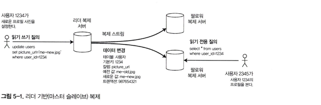

# 5장 복제

## 서론

- 복제란 ?
    - 네트워크로 연결된 여러 장비에 동일한 데이터의 복사본을 유지하는 행위
- 데이터 복제가 필요한 이유 ?
    - 지연 시간 감소
    - 고가용성
    - 읽기 처리량 증가
- 분산 DB 에서 흔히 사용하는 세 가지 패턴
    - 단일 리터
    - 다중 리더
    - 리더 없는 복제

## 리더와 팔로워

- 프라이버리/세컨더리, 슬레이브, 읽기 복제 서버 등
- 읽기는 리더 또는 팔로워 어디에서나 가능하다
- 리더 기반 복제
    - 모든 쓰기는 리더가 처리하고, 변경내용을 **복제로그/변경 스트림**으로 팔로워 에게 전파 한다



## 동기식 대 비동기식 복제

- **동기식**
    - 리더가 ≥ 1 개의 팔로워의 적용을 **확인 후 성공 응답**을 반환한다
        - 최소한 1 개의 사본이 항상 최신임을 보장한다
        - 팔로워 혹은 네트워크 문제 발생시 쓰기가 지연 혹은 장애 발생
- **비동기식**
    - 리더가 팔로워의 **응답을 기다리지 않는다**
        - 리더의 응답이 빨라지고 가용성이 높아짐
        - 리더 장애시 데이터 유실 위험이 있음
- **반동기식**
    - 최소한 **한 노드는 동기식, 나머지는 비동기로 처리**한다
    - 최신 사본을 최소 1개를 보장하면서 가용성과 성능의 절충안

## 새로운 팔로워 설정

1. 가능하면 중단 없이 리더와 일관된 스냅샷을 생성한다
2. 스냅샷을 새 노드에 복사한다
3. 스냅샷 시점 이후의 변경을 리더에게 요청한다 (로그 포지션/LSN/binlog)
4. 백로그를 모두 적용하면 **스트리밍 모드로 전환해 계속 복제**한다
- 실제 구현에 따라 방식이 달라지고, 도구를 사용하기도 한다 (MySQL → innobackpex)

## 노드의 중단과 복구

- **팔로워 장애 → 따라잡기 복구**
    - 팔로워는 수신했던 로그를 로컬에 저장했다가 재시작시 끊김 시점부터 다시 요청.적용해 합류한다
- **리더 장애 → 장애 복구 (페일오버)**
    - **장애 감지**(타임아웃·헬스체크)
    - **새 리더 선출**(수동/컨트롤러 노드/합의 시스템)
    - **재구성**: 클라이언트가 새 리더로 쓰기를 보내도록 라우팅/설정 변경
- 장애 복구시 **함정카드**
    - **비동기 손실**: 이전 리더가 응답한 쓰기가 새 리더에 없을 수 있음
    - **재가동한 이전 리더 처리**: 구 리더가 **팔로워로만** 돌아오게 만들고, **오래된 로그로 덮어써선 안됨**
    - **스플릿 브레인**: 네트워크 분할 등으로 **동시에 두 리더**가 생기는 상황을 엄격히 방지(펜싱/STONITH, 단일 리더 강제)

## 복제 구현 방식

- **구문 (STATEMENT) 기반 구현**
    - 리더가 실행한 SQL 구문 자체를 팔로워 에게 전파한다
    - 복제 깨짐 관련 문제
        - **비결정성**(`NOW()`, `RAND()` 등) → 서로 다른 결과.
        - **의존적 구문**(데이터 상태에 따라 달라지는 `UPDATE ... WHERE`) → 순서·효과 차이.
        - **부수효과**(트리거/스토어드 프로시저/사용자 정의 함수 등).
    - MySQL 5.1 이전에 널리 사용되었고, 최근에는 대체됨
- **WAL 로그 방식 (Write-Ahead Log)**
    - 저장소 엔진의 **저수준 변경 바이트열**을 그대로 전송(append-only 로그)
    - **정확히 같은 바이트 레이아웃**의 복제본을 만들어 내기 쉬움(Oracle Data Guard, PostgreSQL)
    - **엔진·버전 결합**이 강함(서버/스토리지 버전이 다르면 어려움). 업그레이드 때 주의 필요
- **논리 (로우) 로그 방식**
    - 테이블 단위로 **행 삽입/갱신/삭제**를 기록해 전파
    - 저장소 엔진과 **분리**되어 **이기종 버전/엔진 간** 복제가 쉬움.
    - 외부 시스템으로의 **CDC(Change Data Capture)** 용도에 적합(데이터 웨어하우스 적재 등).
    - MySQL의 **Row-based replication**
- **트리거 기반 방식**
    - 애플리케이션/DB 레벨 트리거 또는 프로시저로 **변경 이벤트를 외부**로 내보냄
    - **이기종 복제**(DB 종류가 달라도)나 **충돌 해결/변환 로직**을 쉽게 삽입 가능.
    - **운영 복잡도·오버헤드**: 트리거는 쓰기 경로에 개입 → 성능 영향 및 잠금/데드락 주의.
    - **관리 부담**: 스키마 변경 시 트리거·프로시저도 함께 수정 필요(변경 누락 위험).

## 복제지연 문제

- 복제가 필요한 이유 ?
    - 확장성과 지연시간 최소화
- **리더기반 복제**
    - 대부분이 읽기 요청인 경우 읽기 요청을 분산하는 목적
    - 팔로워를 더 추가함으로써 읽기 처리량을 늘릴 수 있음
    - 비동기식 복제
    - 동기식으로 처리한다면, 단일 노드나 네트워크 중다능로 인해 전체 시스템 쓰기가 불가능해짐
- **쓰기 후 읽기 일관성 (read-after-write)**
    - 자신의 쓰기 읽기 일관성 이라고도 함
    - 쓰기 이후 **반영 되지 않은 복제 서버**에서 데이터를 읽게되는 문제
    - 항상 자신이 제출한 모든 갱신을 볼 수 있음을 보장한다
- **리더기반 복제에서 쓰기 후 읽기 일관성 보장**
    - 사용자가 수정한 내용은 리더 에서 조회
    - 그 외의 내용은 팔로워에서 조회
    - 대부분의 내용을 수정할 수 있다면 비효율적
    - 타임 스탬프 기반으로 1분 동안은 리더에서 읽기 처리를 하는등 복잡도 증가
    - 데이터센터가 분리되어 있다면 복잡도 증가
- **단조 읽기**
    - 비동기 팔로워에서 발생하는 문제
    - 사용자가 시간이 거꾸로 흐르는 현상을 경험
    - 어디에선 보이고, 어디에선 안보이고… 복제지연으로 인한 문제
    - 새로고침할때 마다 데이터가 다르게 보이는것
    - **각 사용자의 읽기가 항상 동일한 복제 서버**에서 수행되게끔 하여 해소
- **일관된 순서 읽기**
    - 일련의 쓰기가 특정 순서로 발생한다면 같은 순서로 쓰여진 내용을 읽게끔 보장
    - 파티셔닝 또는 샤딩된 데이터베이스에서 주로 발생
    - 서로 인과성이 있는 쓰기는 동일한 파티션에 기록되게 한다

## 다중 리더 복제

- 리더 기반 복제의 단점 ?
    - 리더가 하나만 있다면, 리더의 장애가 발생한 경우 데이터베이스에 쓰기를 할 수 없음
- 다중 리더 복제
    - **여러 노드가 동시에 쓰기(Write)를 받는** 복제 방식
    - 각 리더는 로컬로 쓰기를 처리하고, **상호 간 비동기(보통)로 변경 사항을 교환**
    - 고가용성, 지리적 분산 성능 향상, 무중단 운영
    - 다중 데이터 센터 운용시 유용
    - 동일 데이터를 다른 데이터 센터에서 동시에 변경할 수 있기 때문에 **반드시 쓰기 충돌을 해소** 해야함
- MySQL 텅스텐 리플리케이터, Postgresql BDR, 오라클 goldengate

### 쓰기 충돌 해소

- 다중 리더 복제에서 가장 큰 문제 → 쓰기 충돌
- **단일 리더**
    - 첫 번째 쓰기가 완료될때 까지 두 번째 쓰기를 차단하거나 두 번째를 실패 시켜 재시도 시킨다
    - 동기식
- **다중 리더**
    - 두 쓰기는 모두 성공하고, 충돌은 비동기로만 감지 된다
    - 비동기식
- **충돌 회피**
    - 충돌을 처리하는 가장 간단한 전략
    - 샤딩으로 키-공간을 리더별 분리(서로 다른 키는 다른 리더가 주로 쓰기)
    - 동일 레코드 동시 수정 가능성이 낮도록 업무/데이터 경계 분리
- **최종 쓰기 승리**
    - LWW (Last Write Wins)
    - 타임스탬프 기반 가장 마지막 쓰기를 적용
    - 대중적인 방법이지만, 데이터 유실 위험이 있음
- **CRDT (conflict-free replicated datatype)**
    - 충돌 없는 복제 데이터 타입
    - 카운터, 집합 등을 사용한다
    - Riak 2.0 에서 일부 구현

### 다중 리더 복제 토폴로지

- 복제 토폴로지 → 쓰기를 한 노드에서 다른 노드로 전달하는 통신 경로
- 가장 일반적인 토폴로지는 전체 연결 (all to all)
    - 일부 연결이 빠르다면, 일부 복제 메세지가 다른 메세지를 추월할 수 있는 문제가 있음
- 원형/별모양 토폴로지
    - MySQL 원형 토폴로지 만 제공
    - 모든 복제 서버에 도달하기 전에 여러 노드를 거쳐야 한다
    - 하나의 노드에 장애가 발생하면 다른 노드의 흐름에도 영향을 주게 됨
- 타임스탬프, **버전 벡터(Vector Clock)**, 변경 로그 비교 등으로 **동시성 판단**

### 버전 벡터

- 모든 복제본의 버전 번호 모음
- 단순 타임스탬프 만으로는 인과관계를 알기 어려움
- 버전 벡터로 판별 가능
    - **순서 관계 판별**
        - 업데이트 X가 업데이트 Y보다 먼저 발생했는지
    - **동시성 탐지**
        - X와 Y가 서로 독립적으로 동시에 발생했는지 (conflict 상황인지)

```sql
Version Vector = { A:3, B:5, C:1 }
```

- A에서 3번째, B에서 5번째, C에서 1번째 업데이트까지 반영된 상태
- 분산 시스템에서 각 노드별 업데이트 횟수를 추적해 데이터 버전과 인과 관계를 표현하는 구조

## 리더 없는 복제

- 리더의 개념을 버리고 모든 복제 서버가 쓰기를 직접 받는 방식
- 아마존이 다이나모 시스템에서 사용함
- 리악, 카산드라와 같이 다이나모에서 영향받은 모델을 다이나모 스타일 이라고 한다
- **장애 복구**
    - 리더 없는 복제에선 장애 복구가 필요하지 않음
    - 클라이언트에서 복제 서버중 하나가 쓰기를 놓친 사실을 무시한다
    - 오래된 값을 얻는 문제를 해소하기 위해 **읽기 요청을 병렬로 여러 노드**에 시도
- **읽기 복구**
    - 여러 노드로 병렬로 읽기 수행해 오래된 응답 감지
    - 해당 복제 서버에 새로운 값을 다시 기록
    - 값을 자주 읽는 상황에 적합하다
- **안티 엔트로피 처리**
    - 백그라운드 프로세스에서 복제 서버간 데이터 차이를 지속적으로 추적, 누락된 데이터를 보정한다
    - 특정한 순서대로 쓰기를 복사하지 않기 때문에 지연이 있을 수 있음
- **정족수**
    - 읽기 쓰기를 적어도 N 개의 복제 서버에 존재 한다는 것을 보장하는 방식
    - R (Read) + W (Write) > N (Replication 복제본)

| 목표 | 전략 | 특징 |
| --- | --- | --- |
| 쓰기 성능 최적화 | **W 낮게, R 높게** | 쓰기 빠름, 읽기 비용 큼 |
| 읽기 성능 최적화 | **W 높게, R 낮게** | 읽기 빠름, 쓰기 비용 큼 |
| 강한 일관성 | **R+W > N** | 최신 데이터 보장, 지연 증가 가능 |
| 가용성 극대화 | **R=1, W=1** | 빠르고 가용성 높음, 일관성은 Eventually |
- **정족수의 한계**
    - CAP 이론에서 말하는 트레이드 오프
    - 정합성이냐 or 가용성이냐의 문제
    - 네트워크 분할 발생시 정족수를 만족하지 못해 장애상황으로 이어질 수 있음
    - 지연 증가
    - 정족수를 만족하더라도, 동시성이나 **클록 스큐** 문제로 인해 최신 데이터를 보지 못할 수 있음
        - 클록 스큐 → 각 노드들이 서로 다른 시계를 바라보는 문제
- **느슨한 정족수**
    - 항상 R+W > N 조건을 보장하지 않는다
    - Eventually Consistency
    - 가용성과, 성능을 위해 택하는 방식
    - N = 3 이라면 다음과 같음

| 전략 | R | W | R+W | 특징 |
| --- | --- | --- | --- | --- |
| **강한 정족수** | 2 | 2 | 4 > 3 | 항상 최신 데이터 보장 |
| **느슨한 정족수** | 1 | 1 | 2 ≤ 3 | 빠른 응답, 최신 데이터 보장 X |
- **다중 데이터 센터**
    - 리더 없는 복제는 동시 쓰기 충돌, 네트워크 중단, 지연 시간 급증을 허용함 → 다중 데이터 센터에 적합
    - 로컬 데이터 센터 내에서 정족수 노드의 응답을 확인한다
        - → 데이터 센터간 지연과 중단에 영향을 받지 않음

### 동시 쓰기 감지

- 다이나모 스타일은 동시에 같은 키에 값을 쓰는 것을 허용
    - 엄격한 정족수를 사용하더라도 충돌이 발생함
- **최종 쓰기 승리 (**LWW)
    - 카산드라에서 유일하게 제공하는 충돌 해소 방법
- **이전 발생**
    - A 의 데이터 추가가 B 증가 이전에 발생하는 것과 같이
    - 작업의 순서가 중요한 경우 **인과성**이 있다고 한다
    - 작업이 다른 작업에 대해 인과성이 없다면, 단순히 **동시 작업** 이라고 한다
- 형제 값 병합 (sibilings)
    - 다중 리더 복제에서 충돌을 해소하는 문제와 동일
    - 동시에 쓰기가 발생했을때, 어느 값을 버리지 않고 **모든 버전을 보관하는 방식**
    - 같은 키에 대해 존재하는 여러 값들을 형제 값 이라고 한다
- **형제 값 병합 방식**
    - LWW
    - Application Level Merge
        - 애플리케이션에서 직접 병합
        - 비즈니스에 맞는 의미있는 병합이 가능하지만
        - 복잡도 증가
    - CRDT

