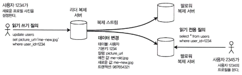

# 5장. 복제

- 복제: 네트워크로 연결된 여러 장비에 동일한 데이터의 복사본을 유지하는 것
    - 지리적으로 사용자 가까이 데이터 제공 → 지연 시간 단축
    - 시스템 일부 장애 발생 시 → 지속적으로 동작, 가용성 확보
    - 읽기 질의를 처리하는 장비 수 확장 → 처리량 증가
- 복제는 데이터셋이 작으면 전체 복사본을 각 장비에 유지할 수 있지만, 일반적으로 큰 데이터셋은 파티셔닝과 함께 사용됨
- 주요 과제는 복제된 데이터의 변경을 어떻게 동기화하느냐에 있음

## 리더와 팔로워

---

- 복제 서버(Replica): 복사본을 저장하는 각 노드
- 리더 기반 복제(Leader-based replication):
    - 리더(Leader, Primary)에만 쓰기 요청 가능
    - 리더가 쓰기 요청 처리 → 변경 로그(Replication log) 생성 → 팔로워(Follower, Read replica, Slave, Secondary)에게 전달
    - 팔로워는 로그를 적용하여 리더와 동일한 데이터 복사본 유지
    
    
    
    그림 5-1. 리더 기반(마스터 슬레이브) 복제
    

> 대표 DBMS: PostgreSQL(9.0+), MySQL, Oracle Data Guard, SQL Server의 AlwaysOn, MongoDB, Cassandra, Kafka, RabbitMQ 등
> 

### 동기식 대 비동기식 복제

---

그림 5-2. 한 팔로워는 동기식, 다른 팔로워는 비동기식인 리더 기반 복제

- 동기식: 리더가 팔로워의 쓰기 완료 응답까지 기다린 후 성공 처리
    - 장점: 최신 데이터 보장
    - 단점: 팔로워 응답 지연 → 전체 시스템 지연
- 비동기식: 리더가 팔로워 응답을 기다리지 않고 성공 처리
    - 장점: 빠른 응답
    - 단점: 팔로워가 최신 데이터 반영하지 못할 수 있음
- 반동기식(Semi-synchronous): 일부 팔로워만 동기식, 나머지는 비동기식으로 설정

### 새로운 팔로워 설정

---

- 새 팔로워를 추가할 때: 리더의 데이터 스냅샷을 복사 후, 이후 변경 로그를 적용하여 최신 상태로 맞춤
- 설정 방법:
    1. 데이터베이스를 잠가서 스냅샷 생성 → 팔로워에 복사
    2. 복제 로그와 일관되도록 보정
    3. 리더가 기록하는 새 로그부터 동기화 시작

### 노드 중단 처리

---

- 팔로워 장애: 따라잡기 복구
    - 리더의 로그를 다시 적용하여 최신 상태로 복구
- 리더 장애: 장애 복구
    - 장애 복구(Failover): 새로운 리더를 선출해야 함
    - 과정: 장애 탐지 → 새로운 리더 선택 → 클라이언트가 새로운 리더에 요청 재전송
    - 문제점: 두 리더 존재(split brain), 오래된 리더 복귀 시 충돌 위험

### 복제 로그 구현

---

- 리더 기반 복제를 실제로 구현하는 방법:
    1. 구문 기반 복제
        - 리더에서 실행한 SQL 구문 자체를 팔로워에 전달
        - 문제: `NOW()`, `RAND()` 같은 비결정적 함수 실행 시 결과 불일치 발생
    2. 쓰기 전 로그 배송
        - 저장소 엔진의 로그를 그대로 팔로워에 전달
        - 장점: 정확히 동일한 데이터 복제
        - 단점: DB 내부 형식에 의존 → 하위 호환성 어려움
    3. 논리적(로우 기반) 로그 복제
        - 테이블의 각 행 단위로 변경 기록
        - 삽입, 갱신, 삭제 시 실제 값 기록
        - 장점: 호환성과 외부 시스템으로 데이터 전달 용이
        - 응용: 변경 데이터 캡처(Change Data Capture, CDC)
    4. 트리거 기반 복제
        - 애플리케이션 코드 없이 DB 시스템의 트리거 기능으로 데이터 변경을 감지하여 다른 DB에 복제
            - 트리거가 변경 이벤트를 포착해 외부 프로세스로 전달 → 다른 DB에 반영
        - 장점: 범용적이며 이기종 DB 간에도 적용 가능
        - 단점: 오버헤드, 버그 가능성, 제약 사항이 많음

## 복제 지연 문제

---

- 리더와 팔로워 간 비동기 복제에서 지연 발생 → 읽기와 쓰기 불일치 초래
- 최종적 일관성: 시간이 지나면 결국 일관성이 맞춰짐
- 지연은 언제든 네트워크/시스템 부하로 발생 가능

### 자신이 쓴 내용 읽기

---

- 사용자가 입력한 데이터는 최소한 본인은 즉시 조회 가능해야 함
    
    
    
    그림 5-3. 사용자가 쓰기를 한 다음 새로운 내용이 반영되지 않은 복제 서버에서 데이터를 읽는다. 이런 이상 현상을 방지하려면 쓰기 후 읽기 일관성이 필요하다.
    
- 구현 방법:
    - 항상 리더에서 읽기
    - 세션/사용자 단위로 같은 노드에 연결 고정
    - 지연 시간을 고려한 TTL 기반 캐싱
    - 여러 디바이스 간 동기화 필요

### 단조 읽기(monotonic read)

---

- 사용자가 여러 번 읽을 때, 이전에 본 상태보다 과거 상태가 다시 보이지 않도록 보장
    
    
    
    그림 5-4. 사용자는 최신 복제 서버에서 먼저 읽고 그다음 예전 복제 서버에서 읽는다. 시간 역전 현상이 나타난다. 이런 이상 현상을 방지하려면 단조 읽기가 필요하다.
    
- 방법: 동일 사용자가 항상 같은 복제 서버에 연결되도록 함

### 일관된 순서로 읽기

---

- 쓰기 순서 A→B인데, 읽을 때 B만 보이고 A는 안 보이는 문제 방지
    
    
    
    그림 5-5. 일부 파티션이 다른 것보다 느리게 복제되는 경우 관찰자는 질문을 보기 전에 대답을 볼 수 있다.
    
- 모든 쓰기 순서를 동일하게 유지해야 함.
- 파티셔닝된 DB에서는 추가 알고리즘 필요.

### 복제 지연을 위한 해결책

---

- 복제 지연 고려 필요
    - 최종적 일관성(eventual consistency) 시스템에서는 복제 지연이 몇 분~몇 시간으로 늘어날 경우 애플리케이션이 어떻게 동작할지 고민해야 한다.
    - 지연이 사용 경험에 큰 문제가 되지 않는다면 괜찮지만, 복제가 동기식이라고 착각하는 것은 문제를 키울 수 있다.
        - ex> 사용자가 쓴 데이터를 곧바로 읽어야 하는 경우(Read-after-write) → 강한 보장이 필요
- 애플리케이션 수준에서 보강 가능
    - 리더에서 특정 종류의 읽기를 수행하도록 강제하는 방식 등으로 DB가 제공하는 것보다 강한 보장을 애플리케이션 코드에서 구현할 수 있다.
    - 하지만 이는 코드가 복잡해지고 오류 가능성이 높아진다.
- 트랜잭션의 필요성
    - 애플리케이션 개발자가 이런 세부적인 복제 문제를 직접 다루지 않고, 단순히 DB가 “제대로 처리해줄 것”을 신뢰할 수 있다면 이상적이다.
    - 이를 위해 트랜잭션이 존재한다. → 트랜잭션은 DB가 더 강한 보장을 제공하여 애플리케이션을 단순하게 만든다.
- 단일 노드 트랜잭션 vs 분산 환경
    - 단일 노드 트랜잭션은 오랫동안 사용되어 왔지만, 분산(복제/파티셔닝) DB로 옮겨오면서 많은 시스템은 성능과 가용성을 이유로 트랜잭션을 포기했다.
    - 스케일링 가능한 시스템에서는 결국 최종적 일관성이 불가피하다고 주장한다.
    - 그러나 이 주장은 지나치게 단순하며, 이후 책에서는 더 정교한 대안을 설명한다.

## 다중 리더 복제

---

- 리더를 여러 개 두어 동시에 쓰기 가능
- 장점: 가용성 및 분산 환경에서 유리
- 단점: 충돌(conflict) 발생 가능
- 활용 사례: 오프라인 작업 후 동기화, 다중 데이터센터 운영

### 다중 리더 복제의 사용 사례

---

- 다중 데이터센터 운영
    
    
    
    그림 5-6. 다중 데이터센터 간 다중 리더 복제
    
    - 단일 리더 모델:
        - 모든 쓰기를 한 리더로 집중
        - 단점: 지연 증가, 리더 장애 시 복구 어려움
    - 다중 리더 모델:
        - 각 데이터센터마다 리더 존재, 상호 복제
        - 장점: 지리적 분산 환경에서 효율적
        - 단점: 충돌 해결 필요

- 오프라인 작업을 하는 클라이언트
    - 인터넷이 끊긴 동안 로컬 DB에 쓰기 가능
    - 나중에 온라인 복귀 시 다중 리더 복제로 동기화
    - ex> 모바일 캘린더, 오프라인 문서 편집

- 협업 편집
    - 여러 사용자가 동시에 문서를 편집하는 경우
    - 단순 복제로는 충돌 문제 → 실시간 협업 편집 알고리즘 필요
    - ex> Google Docs, Etherpad

### 쓰기 충돌 다루기

---

- 다중 리더 복제에서 가장 큰 문제는 동일한 데이터를 동시에 수정할 때 발생하는 쓰기 충돌이다.
- 단일 리더 구조에서는 발생하지 않는다.
    - ex> 같은 페이지를 두 사용자가 동시에 수정하면 각 리더에서 충돌이 발생하고, 비동기 복제 시 충돌 감지가 늦어질 수 있다.
    
    
    
    그림 5-7. 동일한 레코드를 두 리더가 동시에 갱신하면 쓰기 충돌이 발생한다.
    

- 동기 대 비동기 충돌 감지
    - 단일 리더에서는 첫 번째 쓰기가 완료될 때까지 두 번째 쓰기를 차단하면 충돌을 예방 가능
    - 다중 리더에서는 비동기 복제 중 충돌이 나중에 발견되기도 한다.
    - 동기식 충돌 감지는 실시간으로 막지만, 다중 리더 복제의 장점(독립적 쓰기 허용)을 잃을 수 있다.

- 충돌 회피
    - 가장 단순한 방법: 충돌 자체를 회피
        - ex> 특정 사용자 데이터는 항상 같은 리더에서만 쓰게 강제하는 전략 → 데이터센터나 지리적 구분을 기준으로 라우팅
    - 그러나 리더 장애 시 복잡성이 커지며, 회피 실패 시 동기식 복제로 전환해야 하는 경우도 있다.

- 일관된 상태 수렴
    - 단일 리더: 순차적으로 쓰기를 적용 → 최종 값이 명확
    - 다중 리더: 순서 불명확 → 수렴(convergent) 기법 필요
    - 방법:
        1. 최종 쓰기 승리(LWW, Last Write Wins): 각 쓰기에 고유 ID 부여
            - 타임스탬프, 난수, UUID, 키+값의 해시 등을 이용해 각 쓰기에 고유 ID를 부여
            - 가장 큰 ID를 가진 쓰기를 승자(winner) 로 선택하고 나머지는 버림
            - 단점: 간단하고 널리 쓰이지만 데이터 손실 위험이 크다.
        2. 복제본에 고유 ID 부여
            - 각 복제 서버(replica)에 고유 ID를 부여
            - 번호가 더 큰 복제본에서 발생한 쓰기를 우선시하고, 작은 번호에서 발생한 쓰기는 버림
            - 이 역시 데이터 손실을 초래할 수 있다.
        3. 값 병합(Merge)
            - 충돌 시 여러 값을 단순히 합치는 방식
                - ex> 알파벳순으로 정렬 후 연결 → “B/C” 같은 결과
            - 데이터 손실을 막고 충돌을 모두 반영할 수 있음
        4. 충돌 기록 후 지연 해소
            - 충돌 발생 시 모든 정보를 보존하는 명시적 데이터 구조에 기록
            - 애플리케이션이 나중에 이 충돌을 해소하도록 유도 (ex> 사용자에게 선택하도록 요청)
            - 즉각적인 손실을 막고, 이후 애플리케이션 로직에 따라 유연하게 해결 가능

- 사용자 정의 충돌 해소 로직
    - 다중 리더 복제 환경에서는 애플리케이션 코드로 충돌 해소 로직을 구현할 수 있음
        - 쓰기 수행 중: 데이터베이스가 복제 로그에서 충돌을 감지하면 충돌 핸들러를 호출해 즉시 실행
            - 보통 사용자 개입 없이 백그라운드에서 빠르게 처리
        - 읽기 수행 중: 충돌이 발생하면 모든 충돌된 쓰기를 저장해 두었다가, 데이터 읽기 시 애플리케이션에 반환
            - 애플리케이션이 사용자에게 알리거나 자동으로 충돌을 해소한 뒤 그 결과를 다시 데이터베이스에 기록한다. ex> 카우치DB
    - 충돌 해소는 일반적으로 개별 로우나 문서 단위로 이뤄지며, 하나의 트랜잭션 안에 여러 쓰기가 있더라도 각각 따로 처리됨

- 자동 충돌 해소
    - 일반적 규칙(ex> 사전순, ID 크기 비교 등)으로 충돌을 자동 해결
    - 연구 분야 예시:
        - 충돌 없는 복제 데이터타입(Conflict-free Replicated Datatypes): 여러 사용자가 동시에 편집해도 자동으로 합쳐짐
        - 병합 가능한 영속 데이터 구조(Mergeable Persistent Data Structure): 3-way merge 활용
        - 운영 변환(Operational Transformation): 구글 Docs 등 협업 편집에서 사용

- 충돌은 무엇인가?
    - 충돌: 동일 데이터에 대해 동시에 서로 다른 값으로 갱신되는 상황
        - ex> 예약 시스템에서 같은 좌석을 동시에 예약
    - 해결 방법은 단순하지 않고, 애플리케이션 설계에 따라 다르다.

### 다중 리더 복제 토폴로지

---

- 리더가 여러 개일 때 리더 간 데이터 변경을 전파하는 구조
- 토폴로지 종류:
    
    
    
    그림 5-8. 다중 리더 복제를 설정하는 세 가지 토폴로지 예제
    
    1. 전체 연결 (all-to-all): 모든 리더가 서로 복제. 안정적이지만 복잡성↑
        
        
        
        그림 5-9. 다중 리더 복제에서 일부 복제 서버에 쓰기가 잘못된 순서로 도착할 수 있다.
        
    2. 원형 토폴로지 (circular): 각 리더가 하나의 다른 리더에게만 전송. 단일 장애 지점 위험
    3. 별 모양 토폴로지 (star): 중앙 리더를 거쳐 전달. 중앙 장애 시 전체 영향

## 리더 없는 복제

---

- 리더 없는 복제: 리더 개념을 버리고 모든 노드가 클라이언트의 쓰기를 직접 받을 수 있음
    - 기존의 단일 리더 / 다중 리더 복제 방식은 리더가 쓰기 요청을 받고 팔로워에게 복제하는 구조
- 아마존의 Dynamo 시스템 이후 다시 주목받음
    - Dynamo-style 예시: Riak, Cassandra, Voldemort 등 오픈소스 데이터스토어
- 구현 방식
    - 클라이언트가 여러 복제 서버에 직접 쓰기 요청을 보내는 방식
    - 또는 코디네이터 노드가 클라이언트 대신 여러 복제 서버에 요청을 전달하는 방식
    - 단, 리더와 달리 순서 제어(ordering) 는 강제하지 않음 → 이 점이 시스템 동작에 큰 차이를 만듦

### 노드가 다운됐을 때 데이터베이스에 쓰기

---

- 리더 기반 복제: 쓰기를 계속하려면 장애 조치(failover) 가 필요함
- 리더 없는 복제(Leaderless)
    - 클라이언트가 여러 복제본(replica)에 동시에 쓰기를 보냄
        - ex> 3개 복제본 중 2개만 응답해도 쓰기 성공으로 간주(`w=2 of 3`)
    
    
    
    그림 5-10. 정족수(quorum) 쓰기, 정족수 읽기와 노드 중단 후 읽기 복구
    
    - 다운된 노드는 해당 쓰기를 놓치고, 나중에 복구되면 오래된 값(stale value) 을 가질 수 있음

- 읽기 복구와 안티 엔트로피
    - 다운됐던 노드에서 읽으면 오래된 값이 반환될 수 있음
    - 이를 막기 위해 읽기 요청도 여러 노드에 병렬 전송(`r`개 노드 확인)
    - 버전 번호(version number) 를 사용해 최신 값 판별
- 복구 메커니즘
    - 읽기 복구(Read Repair):
        - 여러 노드에서 읽을 때 오래된 값 발견 시, 최신 값을 해당 노드에 다시 씀
        - 자주 읽히는 데이터에 효과적
    - 안티 엔트로피(Anti-entropy):
        - 백그라운드에서 복제본 간 데이터 차이를 주기적으로 동기화
        - 쓰기 순서를 보장하지 않아 지연이 있을 수 있음
- 정족수(Quorum) 조건
    - `w + r > n` (n: 전체 복제본 수, w: 쓰기 성공 노드 수, r: 읽기 노드 수) 충족 시 최신 데이터 읽기 가능
        - ex> `n=3, w=2, r=2` → 최소 1개 노드는 최신 쓰기를 반드시 반영
    - 이 조건이 깨지면 읽기/쓰기에 오류 발생

### 정족수 일관성의 한계

---

- 최신성 모니터링
    - 데이터베이스가 최신 결과를 반환하는지 모니터링 필요.
    - 네트워크 문제, 노드 장애 등으로 복제가 지연될 수 있음 → 복제 지연 원인 조사 필요.
    - 리더 기반 복제에서는 복제 지연을 로그와 지표로 쉽게 확인 가능.
    - 리더 없는 복제에서는 각 노드가 독립적으로 동작하므로 복제 지연이 더 복잡해질 수 있음.
    - 복제 서버의 오래된 상태(staleness)를 측정하기 위해 w, r, n 파라미터를 기반으로 지연 여부를 파악.

### 느슨한 정족수와 암시된 핸드오프

---

- **느슨한 정족수(sloppy quorum)**: 네트워크 장애 시 지정된 노드가 아닌 다른 노드에 임시로 쓰기 허용.
- **암시된 핸드오프(hinted handoff)**: 장애 복구 후 임시로 맡아두었던 데이터를 원래 노드로 되돌려줌.
- 장점: 고가용성 보장 (특히 Dynamo 스타일 시스템에서 자주 사용).
- 단점: 최신성 보장이 약해질 수 있음.

- 다중 데이터센터 운영
    - 리더 없는 복제 모델에서 여러 데이터센터 간 복제 가능.
    - 각 데이터센터는 자체적으로 정족수 합의를 수행.
    - 데이터센터 간 복제는 지연(latency)과 네트워크 안정성에 영향을 받음.
    - 카산드라, 볼드모트 같은 시스템은 이를 지원.

### 동시 쓰기 감지

---

- 여러 클라이언트가 같은 키에 동시 쓰기 발생 가능
    
    
    
    그림 5-12. 다이나모 스타일 데이터스토어에서 동시 쓰기. 잘 정의된 순서가 없다.
    
- 동시 쓰기 충돌을 해결하기 위한 전략 필요.
- 최종 쓰기 승리 (동시 쓰기 버리기)
    - 가장 최근 타임스탬프의 값을 선택. (단, 데이터 손실 가능)
- “이전 발생” 관계와 동시성
    - 어떤 쓰기가 다른 쓰기보다 앞선 경우 인과 관계로 구분
- 이전 발생 관계 파악하기
    - 동시성 판단 불가 시 충돌 처리 필요
        
        
        
        그림 5-13. 두 클라이언트가 동시에 장바구니를 수정하는 동안 인과성 파악하기
        
        - 예전 버전의 값을 덮어쓰기 때문에 손실된 쓰기는 없다.
        
        
        
        
        
    - 동시에 쓴 값 병합
        - 리악은 이런 동시 값을 형제 값이라 부른다.

- 버전 벡터
    - 단순 버전 번호 대신 버전 벡터(version vector) 사용
    - 각 복제본이 독립적으로 버전 번호를 유지 → 어떤 쓰기가 최신인지, 동시 쓰기인지 구분 가능
    - 동시 쓰기 충돌 감지 및 병합 처리에 활용됨

## 정리

---

- 복제의 주요 활용 목적
    - 고가용성: 일부 장비나 전체 데이터센터가 다운되어도 시스템이 계속 동작
    - 연결이 끊긴 작업 지원: 네트워크 장애 상황에서도 애플리케이션이 계속 동작 가능
    - 지연 시간 단축: 사용자와 가까운 위치의 복제본에서 데이터를 읽어 더 빠른 응답 제공
    - 확장성: 여러 장비에서 읽기를 동시에 처리하여 높은 처리량 확보

- 복제 접근 방식
    1. 단일 리더 복제
        - 클라이언트 → 리더 노드 → 다른 복제본으로 전송
        - 단순하고 이해 쉬움, 충돌 처리 용이
    2. 다중 리더 복제
        - 여러 리더에서 쓰기 허용
        - 네트워크 중단, 지연 상황에 유리하나 충돌 발생 가능성이 큼
    3. 리더 없는 복제
        - 클라이언트가 여러 노드에 동시에 쓰기 전송
        - 충돌 가능성이 가장 크며, 읽기/쓰기 일관성 확보가 과제

- 일관성 모델
    - 쓰기 후 읽기 일관성: 사용자는 자신이 쓴 데이터를 즉시 읽을 수 있어야 함
    - 단조 읽기: 사용자가 한 번 읽은 데이터보다 과거 데이터를 읽지 않음
    - 일관된 순서 읽기: 인과관계가 있는 데이터는 순서대로 읽어야 함
