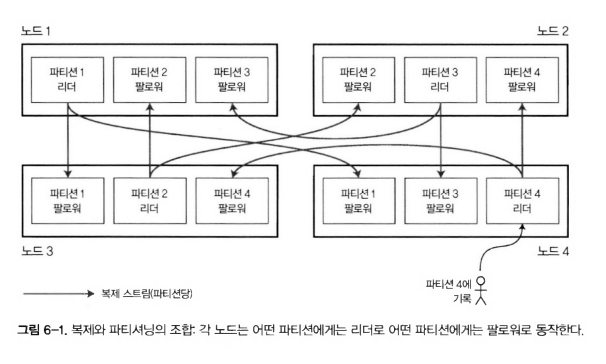
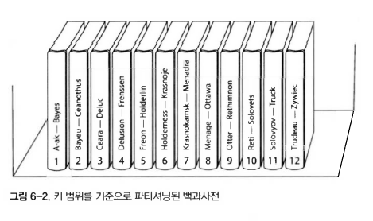
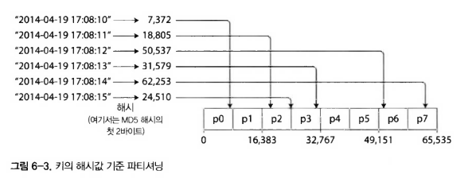
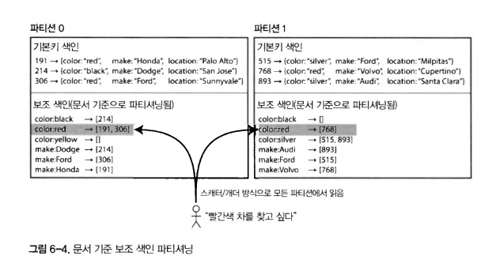
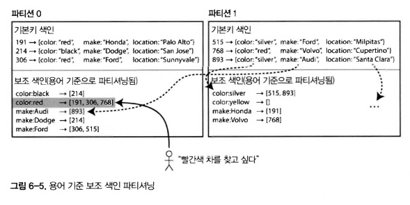
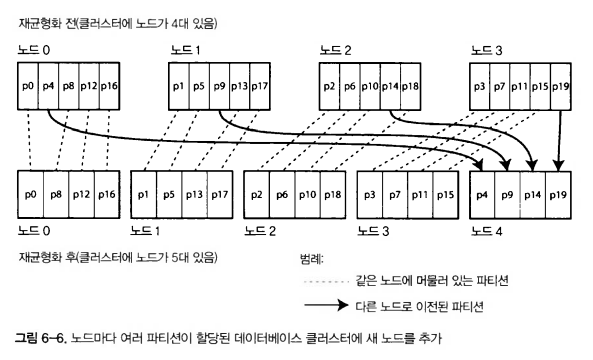
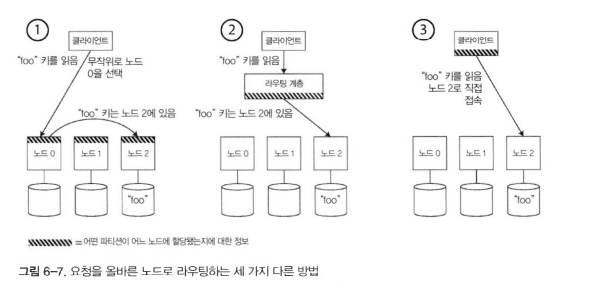

# 🔴 파티셔닝

- 파티셔닝이란
  - 데이터가 매우 크거나 질의 처리량이 매우 높다면 복제 보단 데이터를 파티션으로 쪼갤 필요가 있다. 이를 파티셔닝(=샤딩)이라 한다.

- 파티셔닝의 확장성
  - 비공유 클러스터에서 다른 파티션은 다른 노드에 저장될 수 있다.
  - 대용량 데이터셋이 여러 디스크에 분산되어 저장할 수 있고 질의 부하는 여러 프로세서에 분산할 수 있다.
  - 노드를 추가하면 질의의 처리량을 늘릴 수 있게 됨
  - 크고 복잡한 질의는 훨씬 어렵긴 하지만 여러 노드에서 병렬로 처리도 가능
- 지원 DB
  - 테라데이터, Tandem NonStop SQL, 하둡 기반 웨어하우스
 
- 이번장에서는?
  - 대용량 데이터셋 파티셔닝하는 방법
  - 데이터 색인과 파티셔닝의 상호작용
  - 노드를 추가하거나 제거할때 재균형화
  - DB가 어떻게 요청을 올바른 파티션에 전달하고 질의를 실행하는지 확인

## 🟠 파티셔닝과 복제

- 리더 팔로워 복제 모델
  - 6-1 그림과 같은 형태
  - 각 파티션의 리더는 하나의 노드에 할당되고 팔로워들은 다른 노드에 할당된다.
  - 각 노드는 리더이면서 팔로워가 될 수 있다.

## 🟠 키-값 데이터 파티셔닝

- 파티셔닝의 목적
  - 대량의 데이터를 파티셔닝할때, 어떤 레코드를 어느 노드에 저장할지 어떻게 결정할까?
  - 모든 노드가 동일한 분량을 담당한다고 가정할 때 10대의 노드를 사용하면 이론상 한 대를 사용할 때보다 10배의 성능을 내는 것을 의미한다.
- 쏠림 현상(skewed)
  - 파티셔닝이 고르게 이뤄지지 않은 경우
  - 쏠림이 있으면 파티셔닝의 효과가 매우 떨어짐
  - 극단적인 경우 모든 부하가 한 파티션에 몰려 병목이 발생할 수 있다.
  - 불균형하게 부하가 높은 파티션을 `핫스팟`이라고 한다.
- 핫스팟 회피 방법
  - 레코드를 할당할 때 무작위 노드를 선택하는 방법
    - 데이터가 노드들 사이에서 매우 고르게 분산됨
    - 어떤 레코드를 읽으려고할 때 해당 레코드가 어느 노드에 저장됐는지 알 수 없어 모든 노드에 병렬 질의를 진행해야 함
  - 키-값 데이터 모델을 사용
    - 모든 레코드가 기본 키를 통해 접근
    - 빠른 검색이 가능

### 🟢 키 범위 기준 파티셔닝

- 키 범위 기준 파티셔닝
  - 6-2 그림과 같이 연속된 범위의 키를 할당하는 방법
  - 어떤 키가 어느 범위의 파티션에 있는지 쉽게 찾을 수 있다.
  - 어떤 파티션이 어느 노드에 할당되었는지 알면 적절한 노드로 요청을 직접 보낼 수 있다.
  - 키 범위 크기가 반드시 동일할 필요는 없다.
    - 6-2 그림과 같이 1권은 A,B지만 12권은 T,U,V,W,X,Y,Z으로 구성됨
    - 데이터를 고르게 분산시키려면 파티션 경계를 데이터에 맞춰 조정해야 한다.
  - 파티션 경계는 개발자가 수동으로 선택하거나 DB에서 자동으로 선택하게 할 수 있다.
    - 빅테이블, HBase, RethinkDB, MongoDB 등에서 사용하는 파티셔닝 전략
- 키 범위 기준 파티셔닝의 특징
  - 파티션 내에서는 키를 정렬된 순서로 저장한다.
    - 범위 스캔이 쉬워진다.
    - 키를 연쇄된 색인으로 간주해서 질의 하나로 관련 레코드를 읽어오는데 사용할 수 있다.
- 센서 네트워크 데이터를 저장하는 키 범위 기준 파티셔닝
  - 장점
    - 타임스탬프를 키로 사용한다면 범위 스캔에 매우 유용하다.
    - 특정 월의 모든 데이터를 쉽게 읽어올 수 있기 때문
  - 단점
    - 핫스팟을 유발할 수 있다.
      - 1일치의 데이터를 파티션 하나가 담당하게 되기 때문
      - 센서에 쓰기가 발생될 때 모두 오늘 날짜에 해당하는 파티션에 전달되기 때문에 하나의 파티션에 과부하가 걸린다.
    - 이 문제를 회피하기 위해서는 타임스탬프가 아닌 다른 것을 키값으로 사용해야한다.
      - 타임스탬프를 앞에 센서이름을 뒤에 붙여 사용한다던지 키값을 다르게 하여 부하가 균등하게 퍼지도록 해야 한다.

### 🟢 키의 해시값 기준 파티셔닝

- 키의 해시값 기준 파티셔닝이란
  - 핫스팟을 회피하기 위해 키의 파티션을 정하는데 해시 함수를 사용한다.
  - 좋은 해시 함수는 균일하게 분산되게 한다.
  - 파티셔닝용 해시 함수는 보안적으로 강력할 필요는 없다.
    - 예를 들어 카산드라와 MongoDB는 MD5를 쓰고 볼드모트는 Fowler-Noll-Vo 함수를 사용한다.
  - 프로그래밍 언어에 내장되어 있는 해시함수는 적합하지 않다.
    - java와 ruby의 hash를 반환하는 함수는 같은 값을 넣었을 때 서로 다른 값을 반환하기 때문
  - 파티션 경계를 크기가 동일하도록 나눌 수 있고 무작위에 가깝게 선택한다. 이를 `일관성 해싱`이라 한다.
- 해시값 기준 파티셔닝의 단점
  - 범위 질의를 효율적으로 실행할 수 없다.
  - 연관되어 있는 인접 데이터가 모두 흩어진다.
  - MongoDB의 경우 해시 기반 샤딩 모드를 활성화하면 범위 질의가 모든 파티션에 전송된다.
  - 리악, 카우치베이스, 볼드모트에서는 기본키에 대한 범위 질의를 지원하지 않는다.
- 카산드라의 전략
  - 카산드라는 테이블을 선언할 때 여러 컬럼을 포함하는 복합 기본키를 지정한다.
  - 첫번째 컬럼에 해싱을 적용하여 파티션을 결정한다.
  - 남은 컬럼은 카산드라의 SS테이블에서 데이터를 정렬하는 연쇄된 색인으로 사용하여 범위 질의를 가능하게 한다.

### 🟢 쏠린 작업부하와 핫스팟 완화

- 핫스팟 완화
  - 앞에서 설명한 해시를 통해 핫스팟을 줄이는데 도움은 되겠지만 완전히 제거할 순 없다.
    - 항상 동일한 키를 읽고 쓰는 극단적인 상황에서는 모든 요청이 동일한 파티션으로 몰리기 때문
    - 예를들어 SNS에서 유명인이 쓴 글에 댓글을 달게 한다면 동일한 해시 ID에 파티션으로 모든 요청이 몰린다.
  - 현대 DB 시스템은 완벽하게 핫스팟을 완화할 수 없어 애플리케이션 단에서 완화를 해야한다.
    - 간단한 해결책은 키의 시작이나 끝에 임의의 숫자를 붙이는 방법이다.
    - 임의의 수 두개만 붙이더라도 한키에 대한 쓰기 작업이 100개의 다른 키로 균등하게 분산되게할 수 있다.
    - 하지만 이 부분도 읽기를 실행할 때 100개의 키에 해당하는 데이터를 읽어서 조합해야하는 문제가 있다.
  - 아직은 애플리케이션에 대한 트레이드 오프를 꼼꼼히 따져서 적용할 필요가 있다.

## 🟠 파티셔닝과 보조 색인

- 보조 색인 파티셔닝
  - 키-값 파티셔닝은 기본키를 통해서 파티션을 결정하고 읽고 쓰기를 전달할 수 있다.
  - 보조 색인이 연관되면 상당히 복잡해진다.
  - 보조 색인은 보통 레코드를 유니크하게 식별하는 용도가 아닌 특정한 값이 발생한 항목들을 검색하ㅡㄴ 수단이다.
  - 보조 색인은 RDB에서 흔하게 쓰이는 요소이며 문서형 DB에서도 흔하게 사용된다.
  - 보조 색인은 파티션에 깔끔하게 대응하지 않는 문제점이 있다.
  - 보조 색인이 있는 DB를 파티셔닝하는데 널리 쓰이는 방법으로는 문서 기반 파티셔닝과 용어 기반 파티셔닝 2가지 방법이 있다.

### 🟢 문서 기준 보조 색인 파티셔닝

- 문서 기준 보조 색인 파티셔닝
  - 그림 6-4와 같이 중고차를 판매하는 웹사이트를 운영한다고 가정하자.
  - 문서 ID(=고유 ID)를 기준으로 파티셔닝을 한다.
  - 쓰기
    - 각 파티션이 완전히 독립적으로 동작한다.
    - 파티션은 자신의 보조 색인을 유지하며 자신에게 속하는 문서만 담당한다.
    - 다른 파티션에 어떤 데이터가 저장되는지 신경쓰지 않는다.
    - 이러한 이유로 문서 파티셔닝 색인은 전역 색인(global index) 지역 색인(local index)라고 한다.
  - 읽기
    - 문서 ID에 특별한 작업을 하지 않으면 모든 데이터는 균등하게 분할된다.
      - 예시로 설명한다면 특정 색상, 특정 제조사의 데이터가 특정 파티션에 저장된다는 보장이 없다.
    - 따라서 빨간 자동차를 찾으려 질의를 한다면 모든 파티션에 질의를 보내서 결과를 모아야 한다.
    - 이러한 방식을 `scatter/gather`라고 한다.
    - 보조 색인을 써서 읽기를 진행하는 것은 큰 비용이 든다.
    - 여러 파티션에 질의를 병렬로 하더라도 꼬리 지연 시간 증폭이 발생하기 쉽다.
    - 그럼에도 문서 기준 보조 색인 파티셔닝을 사용하는 DB가 많다.
      - MongoDB, 리악, 카산드라, 엘라스틱 서치, 솔라클라우드, 볼트DB
    - 보조 색인 질의가 단일 파티션에만 살행되도록 설계하는 것을 권고한다. 하지만 항상 그렇게 설계하기는 어렵다.

### 🟢 용어 기준 보조 색인 파티셔닝

- 용어 기준 보조 색인 파티셔닝
  - 각 파티션에 보조 색인을 만드는 대신, 모든 파티션의 데이터를 담당하는 전역 색인을 만들 수도 있다.
    - 하지만 이것을 한 노드에만 적용한다면 해당 노드가 병목이 되어 파티셔닝의 목적이 사라진다.
    - 전역 색인도 파티셔닝을 해야 한다.
  - 그림 6-5 예시를 설명해보자.
    - 색상 기준 a~r까지는 파티션0에 저장하고 s~z까지는 파티션 1에 저장한다.
    - 모든 파티션에 있는 빨간 자동차를 파티션0에 저장한다.(파티션1의 768번이 파티션0에 저장되어 있다.)
  - 이처럼 색인을 파티셔닝할 때 용어 자체로 쓸 수도 있고, 해시값을 사용해 할 수 있다.
    - 용어 자체로 파티셔닝을 하면 범위 스캔에 유용하다.
    - 해시를 사용하여 파티셔닝을 하면 부하가 고르게 분산된다.
- 용어 기준 파티셔닝의 장점과 단점
  - 장점
    - 문서 기준 파티셔닝에 비교하면 읽기에서 좀더 유리하다.
  - 단점
    - 쓰기가 느리고 복잡하다.
      - 쓰기 발생시 여러 파티션에 영향이 있기 때문
    - 쓰기시에 모든 DB에서 분산 트랜잭션을 지원하여 처리하면 좋겠지만 대부분의 DB는 분산 트랜잭션을 지원하지 않는다.
      - 현실에서 대부분의 DB는 비동기로 생신한다.
      - 다이나모DB는 전역 보조 색인을 갱신하는데 1초도 안걸리지만 인프라 결함이 있을 경우 더 길어질 수 있다.

## 🟠 파티션 재균형화

- 재균형화(rebalancing)
  - 질의 처리량이 증가해 부하를 처리하기 위해 CPU를 추가
  - 데이터셋 크기가 증가하여 저장할 디스크와 램을 추가
  - 장비에 장애가 발생하여 다른 장비로 이동
  - 이러한 변화를 위해 한 노드가 담당하던 부하를 다른 노드로 옮기는 과정을 재균형화라고 한다.
- 재균형화 실행을 위한 최소 요구사항
  - 재균형화 후, 부하가 클러스터 내에 잇는 도드르 사이에 균등하게 분배돼야 한다.
  - 재균형화 도중에도 DB는 읽기 쓰기 요청을 실행해야 한다.
  - 재균형화가 빨리 실행되고 I/O 부하를 최소화할 수 있도록 노드들 사이에 데이터가 필요 이상으로 옮겨져서는 안된다.

### 🟢 재균형화 전략

_**n을 mod로 나누는 방법**_
- n을 mod로 나누는 방법 : 쓰면 안됨
  - 예를들어 hash = 123456 이고 노드가 최초에는 10대인 경우
    - 노드 6에 할당된다.
  - 노드가 11개로 늘어나는 경우
    - 기존 노드6에 있던 데이터들은 노드3으로 옮겨져야 한다.
  - 노드가 12대로 늘어나는 경우
    - 기존 노드3에 있던 데이터들은 노드0으로 옮겨져야 한다.
  - 이렇게 노드가 추가될 때마다 데이터를 필요 이상으로 이동해야하기 때문에 쓰면 안된다.

_**파티션 개수를 고정**_

- 파티션 개수를 고정
  - 그림 6-6이 파티션 개수를 고정하여 노드가 추가되는 과정을 설명한 그림이다.
    - 제거는 추가의 과정이 반대로 진행된다.
  - 파티션은 노드 사이에서 통째로 이동하기만 한다.
  - 파티션 개수는 바뀌지 않고 키도 변경되지 않는다.
  - 유일한 변화는 노드에 어떤 파티션이 할당되는가 뿐이다.
  - 파티션 자체가 모두 전송되어야 하므로 시간이 걸린다.
    - 이때 읽기나 쓰기가 실행되면 기존에 파티션에서 처리한다.
  - 이론상 부하가 많은 노드에 더 좋은 하드웨어를 사용하여 부하를 감당하도록 처리할 수 있다.
  - 리악, 엘라스틱 서치, 카우치베이스, 볼드모트에서 사용한다.
- 고려할 점
  - 처음 구축할 때 파티션 개수를 고정하고 이후에 변화하지 않는 경우가 많다.
  - 처음 설정된 파티션 개수가 사용 가능한 노드 대수의 최대치가 되므로 미래에 증가될 것을 고려하여 충분히 높은 값으로 선택해야한다.
    - 너무 큰 수를 선택하면 오버헤드(불필요한 비용) 발생한다.
  - 데이터셋의 크기 변동이 심하면 적절한 파티션 개수를 정하기 어렵다.
    - 처음엔 데이터셋이 작지만 이후에 훨씬 커질 수 있다.
  - 파티션 크기가 너무 크면 재균형화를 할때 노드 장애로부터 복구 비용이 커니다.
  - 너무 작으면 오버헤드가 증가한다.
  - 파티션 크기는 딱 적당한 크기일때 성능이 가장 좋은데 딱 적당한 크기를 고려하기가 쉽지가 않다.

_**동적 파티셔닝**_

- 동적 파티셔닝
  - 파티션 크기가 설정된 값을 넘어가면 파티션을 2개로 쪼개 각각에 파티션 절반 저옫의 데이터를 포함하게 한다.
  - 반대로 데이터가 삭제되어 파티션 크기가 기준값 아래로 떨어지면 인접한 파티션과 합친다.
  - 이 과정은 B트리의 작업과 유사하다.
- 장점
  - 전체 데이터 용량에 자동으로 맞춰서 조정됨
  - 데이터 양이 작으면 파티션 개수가 적어도 되므로 오버헤드가 적다.
  - 데이터양이 많다면 파티션 크디는 최대치로 설정됨
- 단점
  - 시작할 때는 파티션이 1개
  - 데이터셋이 작을 때는 모든 쓰기 요청이 하나의 노드에서 실행됨
  - 이 문제를 완화하기 위해 HBase와 MongoDB는 초기 파티션 집합을 설정할 수 있게 함
    - 이를 사전 분할(pre splitting)이라고 함

_**노드 비례 파티셔닝**_

- 노드 비례 파티셔닝
  - 고정, 동적 파티셔닝은 모두 노드의 개수와 파티션의 개수가 독립적이다.
  - 노드 비례 파티셔닝은 노드당 할당되는 파티션 개수를 고정한다.
    - 노드가 변함 없는 동안 데이터셋 크기에 비례하여 파티션 수가 늘어나지만 노드 개수를 증가시키면 파티션 크기는 다시 작아진다.
  - 카산드라와 케타마에서 사용된다.
  - 데이터 용량이 클수록 노드가 많아지기 때문에 파티션 크기가 안정적으로 유지된다.
- 작동 방식
  - 노드가 추가되면 고정된 개수의 파티션을 무작위로 선택해 분할하고 각 분할된 파티션의 절반은 그대로 두고 다른 절반은 새 노드에 할당한다.
  - 무작위 선택이라 균등하게 분할이 안될 수 있지만. 평균적으로 보면 균등하게 부하를 나누게 된다.
    - 카산드라의 경우 불균등한 분할을 회피할수 있는 재균형화 알고리즘을 추가했다.
  - 무작위 선택을 하기 위해 해시 기반 파티셔닝을 사용한다.

### 🟢 운영: 자동 재균형화와 수동 재균형화

- 완전 자동 재균형화
  - 유지보수에 손이 덜 가므로 편할 수 있다.
  - 하지만 예측하기 어려움
  - 요청 경로를 재설정하고 대량의 데이터를 이동해야하므로 비용이 큰 연산임
  - 주의 깊게 처리하지 않으면 과부하가 거릴 수 있고 성능 저하의 요인이 됨
  - 자동 장애 감지와 조합되면 위험해질 수 있음
    - 한 노드가 과부하에 걸려 일시적으로 응답이 느려졌을 때, 장애 감지에서 죽었다고 판단하고 재균형화를 진행하려고 한다면 상황이 악화되어 연쇄 장애로 이어질 수 있음
- 결론
  - 재균형화 과정에서 개발자가 직접 개입하는게 좋을 수 있다.
  - 완전 자동 처리보다는 느릴 수 있지만 예상치 못한 장애를 방지하는 것이 더 낫다.

## 🟠 요청 라우팅

- 궁금한 부분
  - 클라이언트에서 요청을 보낼 때 어느 노드로 접속해야 하는지 어떻게 알까?
  - 파티션이 재균형화되면서 노드에 할당되는 파티션이 바뀐다.
  - 질의가 온다면 파티션 할당 변경을 모두 알고 있어야 한다.
  - 이러한 문제는 DB뿐만 아닌 일반적인 문제인 서비스 찾기(service discovery)의 일종이다.

- 서비스 찾기 몇가지 접근 방법
  - 클라이언트가 아무 노드에나 접속하게 한다.
    - 해당 노드에 요청에 적절한 파티션이 있다면 응답하고 없다면 적절한 응답을 포함하고 있는 파티션으로 라우팅해준다.
  - 클라이언트의 모든 요청을 라우팅 계층으로 먼저 보낸다.
    - 라우팅 계층은 각 노드에서 처리할 수 있는 데이터를 알고 있고 요청에 따라 해당 노드로 라우팅 해준다.
    - 라우팅 계층은 요청에 대한 응답은 처리하지 않고 단지 파티션 인지(partition-aware) 로드 밸런서로만 동작할 뿐이다.
  - 클라이언트가 파티셔닝 방법과 파티션이 어떤 노드에 할당되어있는지 알고 있게 한다.
- 서비스 찾기 접근 방법에 대한 문제점
  - 참여하는 모든 곳에서 정보가 최신화되어 일치되어야 한다.
    - 노드, 클라이언트, 라우팅 계층 등이 모두 최신화되어야만 함
  - 분산 시스템에서 합의를 위한 프로토콜이 있지만 제대로 구현하기 어렵다.

- 해결 방법
  - 주키퍼(ZooKeeper)같은 별도의 코디네이션 서비스를 사용한다.
    - 각 노드는 주키퍼에 자신을 등록하고 주키퍼는 파티션과 노드 사이의 신뢰성 있는 할당 정보를 관리한다.
    - 라우팅 계층이나 클라이언트 같은 다른 구성요소들은 주키퍼에 잇는 정보를 구독하여 사용할 수 있다.
    - 파티션 소유자가 바뀌든지, 노드가 추가되고 삭제되는 부분을 주키퍼에서 알려줘서 최신 정보를 유지할 수 있게 한다.
    - 링크드인의 에스프레소는 헬릭스(헬릭스는 주키퍼에 의존)를 써서 클러스를 관리하며, 라우팅 계층을 구현한다.
  - MongoDB 아키텍처
    - 자체적인 설정 서버(config server) 구현에 의존하고 mongos 데몬을 라우팅 계층으로 사용한다.
  - 가십 프로토콜(gossip protocol)
    - 카산드라와 리악에서 사용되는 방법이다.
    - 가십 프로토콜을 사용해 클러스터 상태 변화를 노드 사이에 퍼트린다.
    - 아무 노드나 요청을 받을 수 있고 요청을 받은 노드는 요청을 처리할 파티션으로 요청을 전달한다.
    - 이 모델은 DB의 복잡도를 증가시키지만 주키퍼 같은 외부 코디네이션 서비스를 사용하지 않아도 된다.
  - 카우치베이스
    - 재균형화를 자동으로 실행하지 않아 자동으로 변경되는 부분이 없다.
    - 목시(moxi)라는 라우팅 계층을 사용하여 노드 변경을 알린다.
  - 클라이언트
    - 임의의 노드로 요청을 직접 보낼때 IP주소를 알아야 한다.
    - DNS를 통해 자동으로 IP를 할당하여 쓰는 것으로 충분하다.
    
### 🟢 병렬 질의 실행
- 내용 정리
  - 지금까지는 매우 간단한 질의에 대해서만 설명했다. (대부분의 DB에서 지원하는 수준)
  - 분석용으로 자주 사용되는 대규모 병렬 처리(massively parallel processing, MPP) RDB 제품은 훨씬 더 복잡한 종류의 질의를 지원한다.
  - MPP 질의 최적화기는 복잡한 질의를 여러 노드와 파티션에서 병렬적으로  실행할 수 있다.
  - 데이터 웨어하우스 질의 고속 병렬 실행은 비즈니스적으로 중요해짐에 따라 관심을 받고 있다.
  - 이 내용은 10장에서 살펴본다.