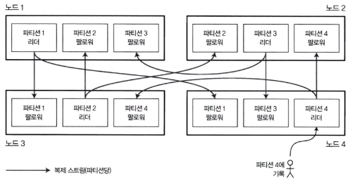

# 6장. 파티셔닝

- 파티셔닝의 필요성
    - 복제만으로는 대규모 데이터셋이나 높은 질의 처리량을 감당하기 어려움
    - 데이터를 여러 파티션에 나누어 저장(샤딩)하여 확장성과 처리량을 높인다.
    - 각 파티션은 작은 데이터베이스처럼 동작하며, 독립적으로 질의를 처리할 수 있다.

## 파티셔닝과 복제

---

- 파티셔닝은 보통 복제와 함께 사용된다.
- 각 파티션의 복사본이 여러 노드에 저장되어 장애 허용성(Fault tolerance) 확보
- 리더-팔로워 모델의 경우:
    - 각 파티션 리더는 한 노드에, 팔로워는 다른 노드에 위치
    - 한 노드는 일부 파티션의 리더, 다른 파티션의 팔로워가 될 수 있음
    
    
    
    그림 6-1. 복제와 파티셔닝의 조합: 각 노드는 어떤 파티션에게는 리더로 어떤 파티션에게는 팔로워로 동작한다.
    

## 키-값 데이터 파티셔닝

---

- 쏠렸다(skewed): 파티셔닝이 고르게 이뤄지지 않아 다른 파티션보다 데이터가 많거나 질의를 많이 받는 파티션이 있을 경우
- 핫스팟: 불균형하게 부하가 높은 파티션

### 키 범위 기준 파티셔닝

---

- 연속적인 키 구간을 각 파티션에 할당
    
    
    
    그림 6-2. 키 범위를 기준으로 파티셔닝된 백과사전
    
- 장점: 범위 질의(range query) 효율적
- 단점: 특정 범위에 질의가 몰리면 핫스팟(Hot Spot) 발생
    - ex> 센서 데이터에서 타임스탬프(년-월-일-시-분-초)를 키로 쓰면 하루치 데이터가 한 파티션에 집중
        - 키의 첫 번째 요소로 타임스탬프가 아닌 다른 것을 사용해야 한다.
        - 타임스탬프 앞에 센서 이름을 붙여서 파티셔닝할 때 센서 이름을 먼저 사용한 후 시간을 사용하게 하기

### 키의 해시값 기준 파티셔닝

---

- 해시 함수를 적용해 키를 고르게 분산시킴
    - 장점: 데이터와 질의가 균등 분산 → 핫스팟 위험 감소
    - 단점: 키 순서가 무시되므로 범위 질의가 어려움
    
    
    
    그림 6-3. 키의 해시값 기준 파티셔닝
    
- 일관성 해싱: 파티션 재배치 비용을 줄이는 기법
    - CDN 같은 캐시 시스템에서 유래. 파티션 경계를 무작위로 선택한다.
    - DB에서는 실제로는 잘 쓰이지 않음
- 일부 DB는 두 방식을 혼합(복합 키)하여 단점을 보완

### 쏠린 작업부하와 핫스팟 완화

---

- 특정 키에 질의가 몰리면 해싱으로도 해결이 어려움
- 해결책: 키를 인위적으로 분할(`user123#01`, `user123#02`)하여 여러 파티션에 분산
- 문제점: 읽을 때 여러 파티션을 동시에 조회해야 하므로 추가 부하 발생

## 파티셔닝과 보조 색인

---

- 기본 키 기반 파티셔닝은 단순하지만, 보조 색인 검색은 처리하기 어려움
    - 보조 색인은 파티션에 깔끔하게 대응되지 않는 문제점이 있다.

### 문서 기준 보조 색인 파티셔닝

---

- 각 파티션이 자기 문서 집합에 대한 색인을 유지
    - 장점: 단순, 독립적 관리 가능
    - 단점: 질의 시 모든 파티션을 검색해야 함 → Scatter/Gather 부하 발생
    
    
    
    그림 6-4. 문서 기준 보조 색인 파티셔닝
    

### 용어 기준 보조 색인 파티셔닝

---

- 색인 자체를 파티션으로 나누어 관리
    - 장점: 질의 효율적, 부하 분산
    - 단점: 색인 업데이트 및 관리 복잡
    
    
    
    그림 6-5. 용어 기준 보조 색인 파티셔닝
    

## 파티션 재균형화

---

- 시간이 지나면 질의 처리량 증가, 데이터 크기 확대, 장비 장애 등으로 인해 부하 분산이 필요하다.
- 재균형화(Rebalancing): 노드 간에 데이터를 옮겨 부하를 고르게 나누는 과정

- 재균형화의 기본 요구사항
    1. 부하가 노드 간에 균등하게 분산되어야 함
    2. 재균형화 중에도 읽기/쓰기 요청을 계속 처리 가능해야 함
    3. 최소한의 데이터만 이동해 네트워크와 디스크 부하를 줄여야 함

### 재균형화 전략

---

- 쓰면 안 되는 방법: 해시값에 모드 N 연산을 실행
    - `hash(key) mod N` 방식은 노드 수가 바뀔 때 대부분의 키가 다른 노드로 이동해야 함 → 잦은 데이터 이동으로 비효율적

- 파티션 개수 고정
    - 노드 수보다 많은 파티션을 미리 생성 후, 여러 파티션을 각 노드에 할당
    - 새 노드가 추가되면 기존 노드에서 일부 파티션을 “훔쳐와” 재분배
    - 단점: 파티션 개수 고정 → 미래 데이터 증가량 예측이 어려움
    
    
    
    그림 6-6. 노드마다 여러 파티션이 할당된 데이터베이스 클러스터에 새 노드를 추가
    

- 동적 파티셔닝
    - HBase, RethinkDB 등에서 사용
    - 파티션 크기가 특정 임계치(ex> 10GB)를 넘으면 분할, 작아지면 병합
    - 장점: 데이터 크기에 따라 파티션 개수가 자동 조정
    - 단점: 초기에는 단일 파티션에서 시작 → 사전 분할(pre-splitting) 필요

- 노드 비례 파니셔닝
    - Cassandra, Ketama 방식
    - 노드 개수에 비례해 파티션 수를 유지 → 데이터 양이 늘어나면 파티션 크기는 작아짐
    - 새로운 노드가 들어오면 기존 파티션 일부를 분할해 가져감 → 전체 부하 균형 유지

### 운영: 자동 재균형화와 수동 재균형화

---

- 완전 자동 재균형화
    - 장점: 일상적인 유지보수에 손이 덜 가므로 편리할 수 있다.
    - 단점: 예측하기 어렵다. 주의 깊게 처리하지 않으면 네트워크나 노드에 과부하가 걸릴 수 있고 재균형화가 진행 중인 동안에 실행되는 다른 요청의 성능이 저하될 수 있다.

❗재균형화 과정에 사람이 개입하는 게 좋을 수도 있다.

## 요청 라우팅

---

- 서비스 찾기(Service Discovery) 문제: 클라이언트는 어느 노드에 요청을 보내야 하는지 알아야 함
- 접근 방식
    1. 클라이언트가 아무 노드에 요청 → 해당 노드가 파티션 소유 시 직접 처리, 아니면 다른 노드로 전달
    2. 라우팅 계층(Routing Tier)이 모든 요청을 받아 적절한 노드로 분배 (로드밸런서 역할)
    3. 클라이언트가 직접 파티션-노드 매핑을 알고 적절한 노드에 바로 연결
    
    
    
    그림 6-7. 요청을 올바른 노드로 라우팅하는 세 가지 다른 방법
    

- 메타데이터 동기화
    - ZooKeeper: 파티션-노드 매핑을 중앙에서 관리
        
        
        
        그림 6-8. 주키퍼를 사용해 파티션 할당 정보 추적하기
        
    - Gossip Protocol: 노드들이 서로 상태 변화를 퍼뜨림 (Cassandra, Riak)
    - 기타: moxi(카우치베이스), mongos(MongoDB) 등 라우팅 계층

### 병렬 질의 실행

---

- 단순한 키 기반 조회 외에도 데이터 웨어하우스 질의(Join, Grouping, Aggregation 등)는 대규모 병렬 처리(Massively Parallel Processing) 구조 필요
- 대규모 병렬 처리는 질의를 여러 단계로 나누어 여러 노드에서 병렬 실행 → 대규모 분석 성능 향상

## 정리

---

- 파티션 목적: 데이터와 질의 부하를 고르게 분산, 핫스팟 방지
- 주요 방식:
    - 키 범위 파티셔닝(Key Range Partitioning): 효율적 범위 질의 가능, 핫스팟 위험 존재
    - 해시 파티셔닝(Hash Partitioning): 키 순서 무시, 질의 비효율 가능하지만 부하 분산에 효과적
- 재균형화(Rebalancing): 노드 추가/제거 시 필수
- 보조 인덱스도 파티션 필요:
    - 문서 기반(Document-partitioned index): 로컬 인덱스
    - 용어 기반(Term-partitioned index): 글로벌 인덱스
- 요청 라우팅과 병렬 질의 실행은 분산 시스템에서 매우 중요한 고려사항
