# 🔴 트랜잭션

- 트랜잭션을 사용하는 이유
  - DB 소프트웨어나 하드웨어는 언제라도 실패할 수 있다.
  - 애플리케이션은 언제라도 죽을 수 있다.
  - 네트워크가 끊기면 애플리케이션과 데이터베이스의 연결이 갑자기 끊기거나 노드 사이에 통신이 끊길 수 있다.
  - 여러 클라이언트가 동시에 DB에 쓰기를 실행해서 내용을 덮어쓸 수 있다.
  - 클라이언트가 부분적으로만 갱신돼서 비정상적인 데이터를 읽을 수 있다.
  - 클라이언트 사이의 경쟁 조건은 예측하지 못하는 버그를 유발할 수 있다.

- 트랜잭션의 특징
  - 애플리케이션의 읽기와 쓰기를 하나의 논리적인 단위로 묶는 방법
  - 전체가 성공(commit)하거나 실패(abort, rollback)하여 실패시 안전하게 재시도할 수 있다.
    - 애플리케이션에서 오류를 처리하기 훨씬 단순해짐
  - 프로그래밍 모델 단순화 목적
    - 어플리케이션의 잠재적인 오류와 동시성 문제를 무시할 수 있게 됨.
    - 이를 안정성 보장(safety guarantee)라고 함
  - 모든 어플리케이션에서 트랜잭션이 필요한건 아님
    - 완화하거나 아예 사용하지 않아 성능을 향상시키거나 가용성을 높일 수 있음
  - 트랜잭션이 필요한 상황과 필요 없는 상황은 어떻게 알 수 있을까?
    - 안정성 보장에는 어떤 것이 있고 관련된 비용은 무엇인지 정확하게 이해하고 판단해야 됨

- 이번장
  - 동시성 제어 분야를 깊게 다룸
  - DB에서 read committed, snapshot isolation, serializability와 같은 격리 수준에 대해 다룸

## 🟠 애매모호한 트랜잭션의 개념

- 트랜잭션의 애매해지는 역할
  - 기존 트랜잭션
    - RDB에서 안정성과 일관성을 보장하는 핵심 개념
    - 애플리케이션의 필수 요구사항임
  - 분산 데이터베이스
    - NoSQL의 등장 이후 복제와 파티셔닝 기능을 핵심으로 트랜잭션을 포기하거나 약하게 보장하도록 처리하는 경우가 많아짐
    - 높은 성능과 고가용성을 유지하기 위해선 트랜잭션을 포기하는 경우가 많아짐
  - 기존 트랜잭션과 분산 데이터베이스 관점 모두 완전한 과정이긴 함.
    - 트랜잭션의 이점과 한계를 알고 트레이드오프를 잘 이해하여야 함.

### 🟢 ACID의 의미
- ACID의 의미
  - 원자성(Atomicity), 일관성(Consistency), 격리성(Isolation), 지속성(Durability)의 약자
  - 1983년 테오 하더(Theo Harder)와 안드레아스 로이터(Andreas Reuter)가 정의함
  - 현실은 DB마다 ACID의 구현 방법이 모두 다름
  - ACID의 표준을 따르지 않는 시스템은 BASE라고 부름
    - 기본적으로 가용성 제공(Basically Available), 유연한 상태(Soft state), 최종적 일관성(Eventaul consistency)

_**원자성**_

- 원자성의 의미
  - 더 작은 부분으로 쪼갤 수 없는 것을 의미
  - 원자성은 동시성과 관련이 없다. 이는 격리성에서 다룸
  - 클라이언트가 쓰기 작업을 몇개 실행하려는데 그 중 일부만 처리된 후 결함이 생기면 무슨 일이 생기는지에 대해 설명한다.
  - 여러 쓰기 작업이 하나의 원자적 트랜잭션에 묶여 있는데 결함 때문에 커밋될 수 없다면 롤백되고 DB는 지금까지 실행한 하나의 트랜잭션의 쓰기를 무시하거나 취소한다.
  - 트랜잭션이 실패했다면 어플리케이션에서 해당 트랜잭션이 어떤 것도 변경하지 않았음을 알 수 있어 안전하게 재시도를 가능하게 한다.
  - 오류가 생겼을 때 트랜잭션을 실패하고 모든 내용을 취소하는 능력이 원자성의 특징이다.

_**일관성**_

- 일관성의 의미
  - 일관성은 여러 의미로 쓰이고 있다.
    - 복제 일관성
    - 비동기 시스템에서 발생하는 최종적 일관성
    - 파티셔닝의 재균형화에 대한 일관성 해싱
    - 9장에서 선형성
    - ACID에서 일관성
  - ACID의 일관성은 데이터에 관한 불변(invariant)이 있다는 것이다.
    - 예를 들어 회계 시스템에서 모든 계좌에 걸친 입출금 내역은 항상 맞아야 한다.
  - 일관성은 애플리케이션에서 트랜잭션을 올바로 정의하고 처리해야하는 책임이 있다.
  - 데이터베이스가 보장하는 것이 아닌 애플리케이션에서 처리해줘야 하는 것이다.
  - 데이터베이스의 ACID는 데이터베이스에서만 되는 것이 아닌 애플리케이션에서 해줘야하는 부분이다.

_**격리성**_
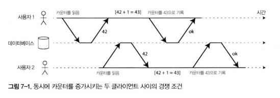

- 격리성의 의미
  - 그림 7-1이 격리성에 대한 간단한 예시
  - 동시에 실행되는 트랜잭션은 서로 격리된다는 것을 의미
  - 고전 DB에서는 격리성을 직렬성이라는 용어로 사용하고 있다.
    - 트랜잭션이 전체 DB에서 실행되는 유일한 트랜잭션인 것처럼 동작하게 한다.
    - 여러 트랜잭션이 동시에 실행되더라도 순차적으로 동작하는 것을 보장한다.
    - serializable isoliation은 성능적으로 손해가되어 현실에서는 거의 사용되지 않는다.
      - 오라클과 같은 대표 DB에서도 구현조차 하지 않는 경우도 있다.

_**지속성**_

- 지속성의 의미
  - 트랜잭션이 성공적으로 커밋됐다면 하드웨어 결함이 발생하거나 DB가 죽더라도 기록한 데이터는 손실되지 않는다는 보장이다.
  - 보통 디스크에 저장된 데이터를 복구하기 위해 쓰기 전 로그(write-ahead log)나 비슷한 수단을 사용한다.
  - 복제 기능이 있는 DB에서는 데이터가 다른 노드 몇개에 복사되었다는 의미이다.
    - DB는 트랜잭션이 성공적으로 커밋되었다고 판단하기 전에 로그에 쓰거나 다른 노드에 복제될 때까지 기다린다.
  - 완벽한 지속성은 존재하지 않는다.
    - 모든 하드디스크와 백업이 동시에 터지면 DB에서 지속성을 보장할 수 있는 방법은 없다.

### 🟢 단일 객체 연산과 다중 객체 연산
- 원자성과 격리성
  - 원자성
    - 하나의 트랜잭션이 실패한다면 쓰기 모두가 반영되지 않는 것을 보장해야 한다.
  - 격리성
    - 동시에 실행되는 트랜잭션들은 서로 방해하지 않아야 한다.

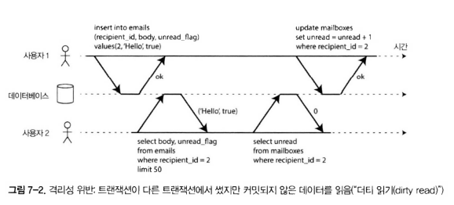
- 격리성 위반
  - 7-2 그림을 예시로 설명해본다.
    - 어떤 사용자의 읽지 않는 메세지 개수를 보여주려고 한다.
    - 이메일이 너무 많아 질의가 느려서 읽지 않은 메세지 개수를 별도의 필드에 저장한다.
    - 새 메세지가 올 때 읽지 않은 메세지 수를 증가시킨다.
    - 메세지를 읽었을 때 메세지 개수를 감소 시킨다.
    - 이 과정에서 예시는 우편함 목록에 읽지 않은 메일이 있지만 메세지 개수는 아직 증가되지 못하여서 0개로 나오는 경우이다.

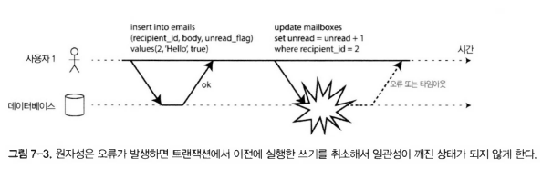
- 원자성 위반
  - 7-3 그림을 예시로 설명해본다.
    - 트랜잭션 실행 도중 어느 시점에서 오류가 발생하여 우편함의 내용과 읽지 않은 메세지 개수가 동기화되지 않을 수 있다.
    - 원자성에서는 개수 갱신에 실패한다면 새로 추가된 메일도 롤백된다.
- 동일한 트랜잭션을 확인하는 방법
  - RDB
    - 클라이언트 - DB 서버간 TCP 연결을 기반으로 한다.
    - `BEGIN TRANSACTION` ~ `COMMIT` 사이에 모든 것을 하나의 트랜잭션으로 묶는다.
  - NoSQL
    - 트랜잭션에 대한 보장이 없다.
      - 일부는 성공하고 일부는 실패할 수 있다.
    - 다중 객체 API(multi put)을 제공한다.
      - 여러 데이터를 하나의 연산에서 저장하는 처리이지만 이 또한 트랜잭션을 보장하지 않는다.

_**단일 객체 쓰기**_

- 단일 객체에서의 원자성과 격리성
  - 예를 들어 20kb json 문서를 데이터베이스에 저장하는 경우
    - 첫 10kb를 먼저 보낸 후 네트워크 문제로 나머지 10kb를 못 보낸다면 역직렬화가 불가능한 먼저 보낸 10kb 데이터 조각을 저장할 것인가?
    - DB가 디스크에 저장된 값을 덮어쓰는 도중 장애가 발생하면 기존 값에 새로운 값으로 덮여쓰여지다가 중지된 상태로 저장되는 걸까?
    - A가 문서를 수정하고 있을때 B가 읽고 있다면 B는 A가 수정하고 있는 내용을 부분적으로 읽게 되는걸까?
    - 이러한 문제에 대해 DB는 거의 보편적으로 한 노드에 존재하는 단일 객체 수준에서 원자성과 격리성을 제공하는 것을 목표로 한다.
  - 원자성은 장애 복구용 로그(crash recovery)를 써서 구현한다.
  - 격리성은 각 객체에 잠금을 통해 구현한다.

- Compare-and-Set (CAS)
  - 경량 트랜잭션이라고도 부름
  - ACID를 보장한다고 하지만 진정한 의미의 트랜잭션은 아님. 오해의 소지가 잇음

_**다중 객체 트랜잭션의 필요성**_

- 다중 객체 트랜잭션이 필요한 이유
  - 관계형 데이터 모델
    - 외래 키 제약을 통한 참조 무결성 보장
    - 여러 레코드 삽입 시 최신 정보 유지
    - 트랜잭션 없으면 데이터가 비정상적 상태로 변할 수 있음
  - 문서 데이터 모델
    - 하나의 논리적 개체가 여러 문서에 흩어질 수 있음
    - 비정규화된 데이터를 동시에 갱신해야 함
    - 트랜잭션 없으면 데이터 불일치 발생
  - 보조 색인
    - 대부분의 데이터베이스는 보조 색인을 가진다.
    - 트랜잭션이 없으면 색인과 원본 데이터 불일치 가능
    - 반드시 동시에 갱신되어야 함

_**오류와 어보트 처리**_

- 트랜잭션과 어보트
  - 트랜잭션의 핵심 기능은 오류 발생 시 어보트(abort) 후 안전하게 재시도 가능하다는 것.
  - ACID 데이터베이스는 원자성, 격리성, 지속성 보장을 위해 트랜잭션을 중간 완료 상태에서 멈추지 않고 완전히 폐기한다.
  - 하지만 모든 시스템이 이를 따르지 않는다.
    - 특히 리더 없는 복제를 사용하는 경우 "최선을 다하는(best effort)" 원칙을 적용 → 오류 발생 시 이미 실행된 작업은 취소되지 않는다.
    - 이 경우 오류 복구는 애플리케이션 책임이다.
-  현실적인 오류 처리 문제
  - 많은 프레임워크(예: Rails, Django)는 어보트 트랜잭션 재시도를 지원하지 않는다.
  - 오류 발생 시 단순히 예외를 발생시키고 입력 내용은 사라지며, 사용자는 오류 메시지를 받는다.
  - 따라서 어보트 처리의 취지는 재시도 가능성이지만, 현실에서는 불완전하다.

- 보완 기법
  - 중복 실행 문제
     - 네트워크 끊김 등으로 실제로는 성공했지만 클라이언트는 실패로 오인할 수 있음.
     - 재시도 시 같은 트랜잭션이 두 번 실행될 수 있음.
     - 애플리케이션에서 중복 제거 메커니즘 필요.
  - 오류 과부하 완화
     - 재시도를 무제한으로 하면 오히려 상황 악화.
     - 지수적 백오프(exponential backoff) 사용 권장
  - 일시적 오류 vs 영구적 오류
     - 예: 네트워크 단절, 잠금 충돌 같은 일시적 오류는 재시도로 해결 가능.
     - 하드 디스크 손상 등은 영구적 오류로 재시도로 해결 불가.
  - 부수 효과(side effect) 문제
     - 이메일 발송 같은 외부 효과는 어보트 후에도 실행될 수 있음.
     - 안전하게 하려면 외부 시스템도 트랜잭션적으로 설계하거나, 커밋 이후 실행되도록 보장 필요.
  - 클라이언트 프로세스 종료 문제
     - 재시도 중 클라이언트가 죽어버리면 DB에 반쯤 쓰인 데이터가 남을 수 있음.

## 🟠 완화된 격리 수준
-  완화된 격리 수준
  - 두 트랜잭션이 동일한 데이터에 접근하지 않으면 서로 의존하지 않으므로 안전하게 병렬 실행될 수 있다.
- 동시성 문제(경쟁 조건)
  - 두 트랜잭션이 동시에 같은 데이터를 읽거나 수정하려 할 때 발생한다.
  - 타이밍에 의존해 드물게 발생
  - 테스트로 발견하기 어렵고 재현도 힘듦
  - 추론이 까다롭다
- 해결책: 트랜잭션 격리
  - 데이터베이스는 트랜잭션 격리를 제공해 동시성 문제를 줄인다.
  - 직렬성 격리(Serializable Isolation)
    - 모든 트랜잭션을 순차적으로 실행한 것과 동일한 결과 보장
    - 하지만 비용이 크고 성능 저하 심각
- 현실적인 선택
  - 맹목적으로 도구에 의존하기 보단 개발자가 직접 동시성 문제의 종류를 이해하고 방지하는 방법에 대해 배울 필요가 있음.

### 🟢 커밋 후 읽기

- read commit
  - DB에서 읽을 때 커밋된 데이터만 보게 된다.(dirty read가 없음)
  - DB에서 쓰기를 진행할 때 커밋된 데이터만 덮어쓰게 된다(dirty write가 없음)
  - read commit은 이 2가지를 보장한다.

_**더티 읽기 방지**_

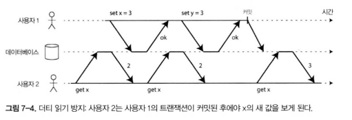

- dirty read
  - DB에 데이터를 썼지만 아직 commit되지 않은 상태에서 다른 트랜잭션이 해당 데이터를 보는 현상을 말한다.
  - read commit 격리 수준에서 실행되는 트랜잭션은 dirty read를 막아야 한다.
- dirty read를 막는게 유용한 이유
  - 이전에 7-2 그림과 같은 메일함에 새 이메일은 들어오지만 개수가 갱신되지 않는 문제를 방지할 수 있다.
  - 트랜잭션이 실패했을 땐 롤백을 한다. 이 실패된 데이터를 읽었다가 롤백으로 인해 데이터가 사라지는 문제를 방지할 수 있다.

_**더티 쓰기 방지**_

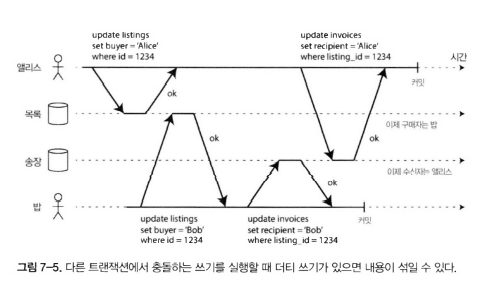

- dirty write
  - 동일한 객체를 동시에 갱신하려고 할 때, 아직 커밋되지 않은 먼저 쓴 내용이 이후에 실행된 쓰기 작업에 덮어 씌워지는 현상이다.
  - read commit 격리 수준에서는 먼저 쓴 트랜잭션이 완료될 때까지 두번째 쓰기를 지연시키는 방법을 사용한다.
- dirty write를 막는게 유용한 이유
  - 여러 객체를 동시에 갱신할 때 더티 쓰기가 발생하면 잘못된 결과를 낳는다.
  - 예: 중고차 판매 사이트에서 앨리스와 밥이 동시에 같은 차를 사려 한다.  
    두 번의 쓰기가 필요하지만 경합 상황이 생기면 잘못된 상태가 전달될 수 있다.
    
_**커밋 후 읽기 구현**_

- read commit
  - 매우 널리 쓰이는 격리 수준
    - oracle, postgreSQL 등 여러 DB의 기본 설정
  - 트랜잭션이 특정 객체를 변경하려면 해당 객체에 대한 잠금을 먼저 획득.
  - 트랜잭션이 커밋되거나 어보트될 때까지 잠금을 유지.
  - 다른 트랜잭션은 잠금이 해제되기 전까지 해당 객체를 읽거나 쓸 수 없음.
  - 결과적으로, 커밋되지 않은 값이 읽히지 않음.
- dirty read를 막는 방법
  - 락을 사용해서 동일한 객체를 읽을 때 lock을 걸었다가 읽기가 끝난 후 lock을 해제하게 하는 것이다.
- lock 방식의 현실적인 문제
  - 성능 저하로 이어짐
  - 현실에서는 사용하기가 어려움
- 문제를 해결한 방법
  - DB는 커밋된 값과 현재 lock을 걸고 쓰기를 진행중인 트랜잭션에 대한 데이터를 모두 기억한다.
  - 해당 트랜잭션이 실행 중인 동안 그 객체를 읽는 다른 트랜잭션은 과거에 커밋된 데이터를 읽게 만든다.
  
### 🟢 스냅샷 격리와 반복 읽기

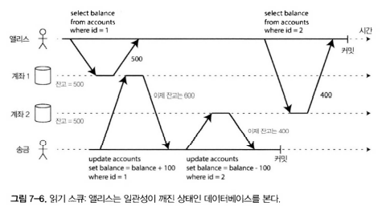

- 커밋 후 읽기와의 차이
  - 커밋 후 읽기 격리를 파상적으로 보면 트랜잭션이 해야 할 모든 일을 해주는 것처럼 보이지만, 실제로는 부족함.
  - 어보트를 허용하고(원자성에 필요), 미완료된 결과를 읽지 못하게 막아주지만 동시에 실행되는 쓰기 충돌 방지는 어렵다.
  - 스냅샷 격리는 더 강력한 보장을 제공.

- 발생할 수 있는 문제
  - 그림 7-6 은행 계좌에서 동시에 송금과 잔액 조회가 이루어지면 잘못된 금액이 보일 수 있음.
  - 이러한 문제를 비반복 읽기(nonrepeatable read) or 읽기 스큐(read skew)라고 함
  - 백업
    - 백업하려면 DB 전체 복사본을 만들어야 하기에 시간이 오래 걸린다. 이 과정 중에도 쓰기는 계속된다. 복사본은 과거 버전과 새로운 버전이 섞여 일관성 없는 상태가 될 수 있다.
  - 분석 질의와 무결성 확인
    - 질의 범위가 큰 경우가 있다. 실행 중 트랜잭션의 쓰기가 섞이면 결과가 달라져 신뢰할 수 없는 경우가 있다.

- 이러한 문제의 해결책 = 스냅샷 격리
  - 일관된 스냅샷을 읽도록 보장.
  - 트랜잭션 시작 시점에 보이는 데이터 전체를 스냅샷으로 취급.
  - 일관된 데이터 보장, 분석 질의나 백업 등에서 유용.
  - 이후 다른 트랜잭션이 데이터를 수정해도 영향을 받지 않고, 동일한 시점의 데이터를 계속 읽을 수 있음.
  - 하지만, 긴 질의가 실행되는 동안 많은 데이터가 잠길 수 있고, 격리 수준 유지 비용이 높음.
  - 분석 질의나 백업 시에도 중요:
    - 백업은 전체 데이터베이스 복사 → 실행 중 쓰기가 섞이면 불일치 가능.
    - 스냅샷 격리를 사용하면 특정 시점의 데이터를 안정적으로 복사 가능.
  - PostgreSQL, MySQL, OracleDB, Sql server 등 사용

_**스냅샷 격리 구현**_

- 스냅샷 격리 구현
  - 스냅샷 격리 구현은 커밋 후 읽기 격리처럼 더티 쓰기를 방지하기 위해 쓰기 잠금을 사용한다.
  - 하지만 읽을 때는 잠금이 필요 없음 → 성능 향상.
  - 핵심 원리
    - 읽는 쪽에서 쓰는 쪽을 차단하지 않고, 쓰는 쪽에서 읽는 쪽을 차단하지 않는다.
    - 따라서 잠금 경쟁 없이 쓰기 작업과 동시에 읽기 작업 가능.

- MVCC (다중 버전 동시성 제어)
  - 데이터베이스는 객체마다 커밋된 여러 버전을 유지.
  - 각 트랜잭션은 특정 시점의 데이터베이스 상태를 읽음.
  - 동시에 여러 트랜잭션이 실행되어도 충돌 없이 각각의 스냅샷을 참조.
  - PostgreSQL, Oracle 등은 MVCC로 스냅샷 격리 구현.

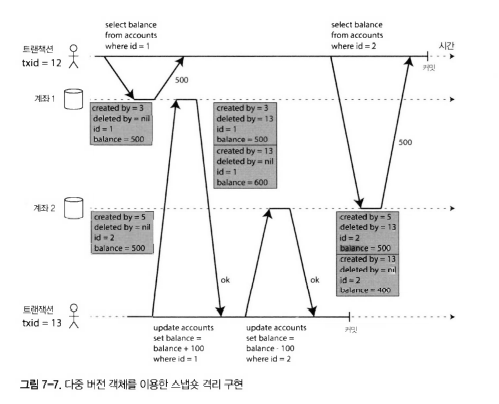

- PostgreSQL 스냅샷 격리 구현 방식
  - 테이블의 각 로우(row)에 `created_by` 필드 -> 삽입한 트랜잭션 ID 기록.
  - `deleted_by` 필드 -> 삭제한 트랜잭션 ID 기록.
  - 트랜잭션이 커밋되면, `deleted_by`에 ID가 기록된 로우는 더 이상 접근 불가.
  - 이후 GC 프로세스가 불필요한 로우 제거.
    - 나중에 아무 트랜잭션도 더 이상 삭제된 데이터에 접근하지 않는게 확실해지면 제거

_**일관된 스냅샷을 보는 가시성 규칙**_

- 일관된 스냅샷을 보는 가시성 규칙
  - 트랜잭션은 데이터베이스에서 객체를 읽을 때 트랜잭션 ID를 사용해 어떤 것을 볼 수 있고 어떤 것을 볼 수 없는지 결정  
  - 이를 가시성 규칙이라 하며, 데이터베이스는 이를 통해 일관된 스냅샷을 애플리케이션에 제공할 수 있다.
- 가시성 규칙 동작 방식
  1. 데이터베이스는 각 트랜잭션을 시작할 때, 그 시점에 진행 중인(아직 커밋되지 않은) 모든 트랜잭션의 목록을 만든다.  
     -> 이 트랜잭션들이 쓴 데이터는 모두 무시된다. 나중에 커밋되더라도 해당 시점에는 보이지 않는다.
  2. 어보트된 트랜잭션이 쓴 데이터는 모두 무시된다.
  3. 트랜잭션 ID가 더 큰(즉, 현재 트랜잭션이 시작한 후에 시작한) 트랜잭션이 쓴 데이터는 커밋 여부와 관계없이 모두 무시된다.
  4. 그 외의 모든 데이터는 질의에 반환하는 데이터가 된다.

- 스냅샷 격리에서 데이터를 읽을 수 있는 경우
  - 읽기를 실행하는 트랜잭션이 시작한 시점에 이미 생성된 객체
  - 아직 삭제되지 않았거나, 삭제 요청이 해당 읽기 시점 이전에 커밋되지 않은 경우.

- 오래 실행되는 트랜잭션
  - 따라서 다른 트랜잭션에서 삭제되거나 갱신된 값도 계속 읽을 수 있다.
  - DB는 값을 갱신할 때 기존 값을 덮어쓰지 않고, 버전을 새로 만들어 유지한다.
  - 이렇게 하면 작은 오버헤드만 추가되며, 일관된 스냅샷을 제공할 수 있다.

_**색인과 스냅샷 격리**_

- 다중 버전 DB에서 색인의 동작 방식
  - 색인이 객체의 모든 버전을 알고 있고 그 중 트랜잭션이 볼 수 있는 버전을 걸러낸다.
  - GC에서 삭제 대상이 되는 객체 버전을 삭제할 때, 색인 항목도 함께 삭제된다.

- 세부 구현에 따라 동시성 제어 성능이 결정
  - PostgreSQL
    - 같은 버전이 저장된 페이지를 재작성(compaction)하여 불필요한 오래된 버전을 제거한다.
  - CouchDB, LMDB
    - Append-only / Copy-on-write 기법
      - 새로운 버전을 만들 때 기존 페이지를 복사하여 기록한다.
      - 트리 구조에서 경로에 있는 페이지들을 복사하여 새 버전으로 연결한다.
      - 덕분에 트랜잭션 중 쓰기 작업은 기존 데이터를 수정하지 않고 새로운 데이터만 추가한다.
      - 불필요한 복사 비용을 줄이기 위해 **영향을 받는 페이지**만 복사한다.

- 추가 전용 B 트리
  - 새로 쓰는 모든 트랜잭션은 새로운 B 트리 루트를 생성한다.
  - 읽기 트랜잭션은 트랜잭션이 시작된 시점의 루트를 고정해서 사용한다.
  - 트랜잭션 ID 기반으로 특정 트랜잭션의 루트를 선택하여, 스냅샷 격리를 보장한다.


_**반복 읽기와 혼란스러운 이름**_
- 스냅샷 격리에 대한 명칭
  - 스냅샷 격리는 유용한 격리 수준이며 특히 읽기 전용 트랜잭션에 유용하다.
  - 그러나 데이터베이스마다 다른 이름을 사용:
    - 오라클 → 직렬성
    - PostgreSQL, MySQL → 반복 읽기 (repeatable read)
- 이유
  - SQL 표준에 스냅샷 격리 개념이 없었음
  - 많은 DBMS가 반복 읽기를 구현했지만 구현체마다 동작을 다르게 구현함
  - 결론적으로 반복 읽기라는 무슨 뜻인지 정확히 사용하는 사람은 거의 없음

### 🟢 갱신 손실 방지

- 쓰기 진행 시 발생하는 문제
  - 커밋 후 읽기와 스냅샷 격리 수준은 주로 동시에 실행되는 **읽기 전용** 상황에서 보장과 관련된다.
  - 그러나 두 트랜잭션이 동시에 쓰기를 실행하면 문제가 발생할 수 있다.
    - 이 중 대표적인 문제가 갱신 손실(lost update)
- 갱신 손실(lost update)
  - 두 트랜잭션이 동시에 같은 데이터를 읽고 수정 후 다시 쓰는 경우 발생.
  - (read-modify-write) 주기에서 충돌이 발생하면, 한쪽의 변경이 손실됨.
  - 나중에 쓴 값이 먼저 쓴 값을 덮어쓰는 현상 -> 이를 때려눌림(clobber) 이라고 함.

- clobber 발생 예시
  - 카운터 증가, 계좌 잔고 갱신
  - 복잡한 값을 지역적으로 변경
  - 사용자가 편집한 내용을 전체로 덮어 쓰고 있는데, 두명의 사용자가 동시에 작업한다.

- 갱신 손실을 해결하기 위한 해결 책
  - 원자적 쓰기 연산
  - 명시적인 잠금
  - 갱신 손실 자동 감지
  - compare-and-set
  - 충돌 해소와 복제

_**원자적 쓰기 연산**_

- DB에서 제공하는 원자적 갱신 연산
  - 이 연산은 애플리케이션 코드에서 `read-modify-write` 주기를 직접 구현할 필요를 없앤다.
  - 대부분의 관계형 데이터베이스에서 이러한 연산은 동시성 안전(concurrency-safe) 하다.
    ```sql
    update counters set value = value + 1 where key = 'foo';
    ``` 
  - MongoDB에서 제공하는 원자적 연산도 있다.
    - 우선순위 큐(priority queue) 같은 데이터 구조 변경을 위한 원자적 연산을 제공
  - 하지만 모든 쓰기가 원자적 연산으로 표현되는 것은 아니다.
    - 예를 들어 위키 페이지 편집은 임의의 텍스트 편집을 포함한다.
- 원자적 갱신 연산의 동작 방식
  - 원자적 연산 시, 해당 객체에 독점적(exclusive) 잠금을 걸어 다른 트랜잭션이 접근하지 못하게 한다.
  - 변경 적용이 끝날 때까지 다른 트랜잭션은 해당 객체를 읽을 수 없다.
  - 이 기법을 커서 안정성(cursor stability) 이라고 부른다.
  - 즉, 모든 원자적 연산은 단일 스레드에서 실행되도록 보장한다.
  - 하지만, 불행하게도 ORM을 사용할때, DB가 제공하는 원자적 연산을 쓰지 않고 잘못된 코드를 작성하기 쉽다. 이는 테스트하기 어려운 버그의 원인이 된다.

_**명시적인 잠금**_

```sql
BEGIN TRANSACTION;

select * from figures
where name = 'robot' and game_id = 222
for update;

update figures set position = 'c4' where id = 1234;

COMMIT;
```

- 명시적인 잠금
  - 애플리케이션에서 갱신할 객체를 명시적으로 잠그는 것이다.
  - 애플리케이션이 `read-modify-write` 주기를 실행할 수 있고, 연산이 끝날 때까지 기다리도록 강제된다.
  - 하지만, 이 방법은 개발자가 직접 sql문이나 orm에 작성을 해주어야 하기에 코드를 작성할때 신경을 써줘야 한다.

_**갱신 손실 자동 감지**_

- 갱신 손실 자동 감지
  - 원자적 연산과 잠금을 `read-modify-write` 주기가 순차적으로 실행되도록 강제함으로써 갱신 손실을 방지하는 방법
  - 트랜잭션 관리자가 갱신 손실을 발견하면 트랜잭션을 어보트시키고 `read-modify-write` 주기를 재시도하도록 강제
- 장점
  - 데이터베이스가 확인을 스냅샷 격리와 결합해 효율적으로 수행 가능
  - 코드에서 특별한 DB의 기능 없이 갱신 손실을 방지할 수 있다.

- DB의 갱신 손실 자동 감지 명칭
  - PostgreSQL의 반복 읽기
  - Oracle의 직렬성
  - SQL Server 스냅샷 격리
  - MySQL은 정의상 스냅샷 격리를 제공하지 않음.
  
_**Compare-And-Set**_

- compare and set
  - 트랜잭션을 제공하지 않는 DB에서 제공되는 원자적 연산
  - 마지막으로 읽은 후 값이 변경되지 않았을 때만 갱신 허용 -> 갱신 손실 회피
  - 읽은 값과 일치하지 않으면 갱신 반영하지 않고 `read-modify-write` 주기 재시도

```sql
update wiki_pages set content = 'new content'
where id = 1234 and content = 'old content';
```
- 사용 사례
  - 여러 사용자가 동시에 같은 데이터를 갱신하지 못하도록 제어
  - 사용자가 편집 시작 이후 내용이 바뀌지 않았을 때만 갱신되도록 보장
  - 예시 쿼리는 한번 동작 이후에는 `old content`라는 조건이 맞지 않아 갱신이 적용되지 않는다.
  - 따라서 적용됐는지 확인하고 필요하다면 재시도를 진행해야 한다.
  - 하지만, DB 자체적으로 오래된 스냅샷을 읽는 것을 허용한다면 이 쿼리는 갱신 손실을 발생시킨다.
  - 또한, 동시에 다른 쓰기 작업이 실행되고 있다면 이 쿼리는 갱신 손실을 발생시킨다.
  - 데이터베이스에 따라 compare-and-set은 안전하지 않을 수 있어 안정성을 검증하고 사용하기 바란다.
  
_**충돌 해소와 복제**_

- 문제 상황
  - 복제된 DB에서 갱신 손실 방지는 또 다른 과제
  - 여러 노드에 데이터 복사본이 있어 동시에 변경될 수 있음 -> 갱신 손실 방지를 위한 추가 단계 필요
  - `compare-and-set` 연산은 데이터의 최신 복사본이 하나라고 가정 -> 다중 리더/리더 없는 복제 DB에서는 보장 불가
- 문제 상황에 대한 대안
  - 잠금과 compare-and-set 기반 접근은 다중 노드 복제 상황에 적용 X
  - 대신, 동시 쓰기 감지를 통해 여러 개의 동등한 버전(=형제 sibling) 생성 허용
    - 이후 애플리케이션에서 충돌을 해소하거나 버전들을 병합하도록 설계
- 원자적 연산
  - 복제 환경에도 잘 적용됨
  - 특히 교환 법칙이 성립하는 연산
    - 예를 들어 카운터를 증가시키거나 집합에 요소를 추가하는 연산
- 최종 쓰기 승리(LLW)는 문제 발생
  - 복제 환경에서 문제가 발생함.
  - 하지만, 대부분의 DB는 LWW가 기본 설정임

### 🟢 쓰기 스큐와 팬텀

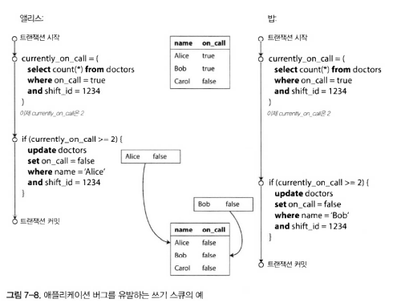

- 예시: 의사 당직 관리
  - 병원에서 여러 의사가 동시에 당직(호출 대기)에 있는지 확인해야 함
  - 최소 한 명 이상의 의사가 항상 대기 상태여야 한다는 제약 조건 존재
  - 각 의사는 상황이 허용될 경우, 자신의 대기 상태를 해제하려 시도
  - 하지만, 여러 의사가 동시에 대기 해제를 시도하면, `최소 한 명은 대기해야 한다`는 조건이 깨짐

- 동작 과정
  - 트랜잭션 시작 시:
    - 현재 대기 중인 의사 수 확인
    - 예: `현재 2명 이상 대기 중` -> 안전하다고 판단
  - 조건이 충족되면 트랜잭션은 자신의 대기 상태를 해제 (`on_call = false`)
  - 두 트랜잭션이 동시에 실행되면?
    - 둘 다 "안전하다"라고 판단
    - 동시에 대기 해제를 진행
    - 결과적으로 대기 중인 의사가 0명이 되는 오류 발생

_**쓰기 스큐를 특징짓기**_

- 쓰기 스큐
  - 위에서 설명한 현상을 쓰기 스큐라고 한다.
  - 두 트랜잭션이 같은 객체들을 읽어서 일부를 갱신하면서 발생하는 경쟁 조건
  - 더티 쓰기나 갱신 손실은 아님
  - 동시 실행으로 인해 제약 조건(예: 최소 한 명은 호출 대기 상태여야 함)이 깨질 수 있음
- 스기 스큐란
  - 쓰기 스큐는 갱신 손실보다 일반화된 문제
  - 같은 객체를 읽고 일부를 갱신할 때 발생 가능
  - 특정한 경우(타이밍, 조건)에 따라 더티 쓰기나 갱신 손실로 이어질 수 있음

- 스기 스큐 특징
  - 여러 객체가 관련되어 원자적 단일 객체 연산은 도움이 안됨
  - 일부 스냅샷 격리 구현에서 제공되는 갱신 손실 자동 감지도 도움이 안됨
    - 오라클에서 제공하는 직렬성에서도 감지가 안된다. 갱신 손실을 방지하려면 진짜 격리성 격리가 필요하다.
  - DB에서 제약 조건을 설정해 안전성을 보장 가능
  - 직렬성 격리 수준을 사용하지 않는다면 의존하는 로우를 명시적으로 잠그는 것이 차선책이다.
  ```sql
  BEGIN TRANSACTION;
  
  SELECT * FROM doctors
  WHERE on_call = true
  AND shift_id = 1234 FOR UPDATE;
  
  UPDATE doctors
  SET on_call = false
  WHERE name = 'Alice'
  AND shift_id = 1234;
  
  COMMIT;
  ```

_**추가적인 쓰기 스큐의 예**_

- 회의실 예약 시스템
  - 동시 예약 시, 같은 시간대에 회의실을 중복 예약하지 않도록 해야 함
  - 사용자가 예약을 시도할 때:
    - 해당 시간대에 이미 예약이 존재하는지 확인
    - 예약이 없으면 회의실 예약을 등록
  - 문제점
    - 여러 트랜잭션이 동시에 같은 시간대 예약을 확인하고 "비어 있다"고 판단 → 동시에 예약 등록
    - 결국 중복 예약 발생
  - 해결 필요
    - 직렬성 격리를 통해 동일 시간대 중복 예약을 방지
- 다중 플레이어 게임
  - 여러 플레이어가 동시에 같은 위치에 같은 아이템을 집으려는 상황
  - 규칙: 단 한 명만 아이템을 획득 가능
  - 문제점
    - 동시 실행 시, 여러 명이 동시에 같은 아이템을 집게 될 수 있음
    - 규칙 위반 발생
  - 게임 규칙은 "동시 실행 불가"를 전제로 하지만, 실제 DB 처리에서는 쓰기 스큐 취약

- 사용자 계정 획득
  - 웹서비스에서 동일한 사용자명을 두 명 이상이 동시에 요청
  - 규칙: 동일한 이름은 한 명만 사용 가능
  - 문제점
    - 동시에 같은 이름으로 계정 생성 시도
    - 중복 사용자명 계정 생성 -> 규칙 위반
  - 해결책:
    - 트랜잭션에서 사용자명 존재 여부를 확인하고 등록해야 함
    - 하지만 쓰기 스큐로 인해 두 트랜잭션 모두 성공할 수 있음
- 이중 사용(Double-spending) 방지
  - 사용자가 보유한 돈/포인트보다 많은 금액을 동시에 여러 곳에 지출하려는 경우
  - 규칙: 잔고를 초과해 사용 불가
  - 문제점
    - 동시 실행되는 두 트랜잭션이 잔고 검증을 통과
    - 합쳐진 결과, 초과 지출 발생
  - 금융, 전자결제 시스템에서 치명적 문제

_**쓰기 스큐를 유발하는 팬텀**_

- 쓰기 스큐를 유발하는 패턴
  1. `SELECT` 질의가 특정 검색 조건에 부합하는 행을 검색 -> 요구사항 충족 여부 확인
    - 예: 최소 두 명의 의사가 당직 중인지 확인, 해당 위치에 게임 아이템이 있는지 확인, 사용자의 계좌 잔액이 충분한지 확인
  2. 조건을 충족하면 애플리케이션 코드에서 다음 동작 수행 여부 결정
    - 해당 연산을 계속할지, 사용자에게 오류를 보고할지 결정
  3. 최종적으로 DB에 쓰기 연산(`INSERT`, `UPDATE`, `DELETE`) 실행 및 트랜잭션 커밋
    - 이 과정에서 조건 재평가 X -> SELECT 시점과 WRITE 시점 사이에 다른 트랜잭션이 개입할 수 있음
    - 결과적으로 처음 확인했던 조건이 깨진 상태에서 쓰기 작업이 반영될 수 있음

- 락을 통한 해결
  - 의사 호출 대기 예시의 경우 1단계에서 `SELECT FOR UPDATE`를 통해 트랜잭션을 안전하게 만들고 쓰기 스큐를 회피할 수 있다.
- 락을 통해서 해결하기 어려운 경우
  - 락을 통한 해결은 존재하는 행에 경우는 문제를 해결할 수 있음.
  - 존재하지 않는 행에 대해서는 락을 통한 해결이 불가능 함.
  - 어떤 로우가 존재하지 않는지 확인하고 새로운 로우를 추가하는 경우에는 락을 통한 해결이 불가능 함.

- 팬텀(phantom)
  - 어떤 트랜잭션의 쓰기가 다른 트랜잭션의 검색 결과를 바꿀 때 발생
  - 스냅샷 격리에서 특히 문제가 됨
  - 쓰기 스큐와 결합할 경우, 충돌 감지 및 방지가 더욱 어려워짐

_**충돌 구체화**_
- 충돌 구체화의 아이디어
  - 팬텀 문제의 핵심: 잠글 수 있는 객체가 없음
  - 그러면, 인위적으로 잠금 객체를 추가하여 충돌을 해결할 수 있지 않을까?
- 예시: 회의실 예약
  - 회의실 예약 시스템에서 로우는 특정 시간 범위+회의실 조합에 대한 테이블 생성
    - 예: 특정 회의실이 특정 시간(15분 단위) 동안 사용되는 경우를 모두 행(row)으로 미리 준비
    - 다음 6개월간의 모든 회의실-시간 조합을 미리 생성 가능
  - 동작 방식
    - 이제는 미리 생성해둔 회의실 로우를 락으로 잠금 수 있다.
- 충돌 구체화를 사용할때 주의할 점
  - 아쉽게도 이러한 충돌을 구체화하는 방법은 알아내기도 어렵고 구현한다 해도 오류가 발생하기 쉽다.
  - 또한 동시성을 제어하기 위한 어플리케이션 코드를 따로 작성하는 부분도 좋지 않다.
  - 이런 이유들로 충돌 구체화는 다른 대안이 불가능할 때 최후의 수단으로 고려해야 한다.
  - 대부분의 경우 직렬성 격리 수준을 사용하는걸 선호한다.

## 🟠 직렬성

- 격리 수준이 까다로운 이유
  - 격리 수준은 이해하기 어렵고 DB마다 구현 방식이 달라 구현 방식을 잘 이해해야 한다.
  - 코드를 보고 특정한 격리 수준에서 해당 코드가 안정하게 작동할지 알기 어렵다.
  - 경쟁 조건을 감지하는데 도움이 되는 좋은 도구가 없다.
- 직렬성 격리
  - 위의 문제들을 모두 해결하는 가장 간단한 방법은 직렬성 격리를 사용하는 것이다.
  - DB 트랜잭션을 개별적으로 실행한 결과와 동일하게 보장
  - 동시 실행되더라도 직렬화된 결과를 강제
  - 실질적으로 가장 강력한 격리 수준으로 평가됨

- 단일 노드 시스템 기반 직렬성을 구현하는 방법 (분산 시스템 직렬성은 9장에서 살펴본다.)
  1. 트랜잭션을 순차적으로 실행
     - 직관적이지만 성능 저하 큼
  2. 2단계 잠금(2PL)
     - 수십 년간 널리 사용된 고전적 방식
  3. 직렬성 스냅샷 격리

### 🟢 실제적인 직렬 실행

- 직렬 실행
  - 동시성 문제를 피하는 가장 단순한 방법은 동시성을 완전히 제거하는 것
  - 한 번에 하나의 트랜잭션만 단일 스레드에서 실행 -> 충돌 및 경쟁 조건 완전 회피
  - 당연한 내용처럼 보이지만 DB 설계자들은 2007년이 되어서야 단일 스레드 루프에서 트랜잭션을 실행하는게 가능하다고 결론 냈다.

- 성능을 위해 다중 스레드 동시성이 필수였지만 단일 스레드도 가능하다고 생각하게 된 이유
  - 램 가격이 저렴해짐
    - 예전보다 디스크 지연 없이 메모리 접근만으로 트랜잭션이 실행 가능해짐
  - OLTP 트랜잭션은 대부분 짧고 읽기와 쓰기의 개수가 적다는 것을 알게 됨.
    - 따라서 직렬 실행을 해도 충분히 성능이 좋음
  - VoltDB, H-Store, Redis, Datomic에서 실제로 구현하여 사용중
  - 하지만, 단일 스레드 특성상 하나의 CPU 코어 처리량으로 제한됨. 단일 스레드를 최대한 활용하려면 전통적인 트랜잭션 형태와는 다르게 처리되어야 함.

_**트랜잭션을 스토어드 프로시저 안에 캡슐화하기**_

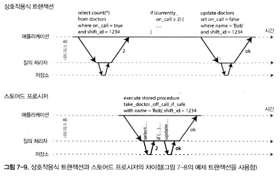


- 배경
  - 초기 DB 설계자들의 의도: 사용자 활동 전체 흐름을 하나의 트랜잭션으로 표현
    - 예: 항공권 예약 (경로 탐색 -> 요금 확인 -> 좌석 선택 -> 결제)
  - 현실: 사용자의 입력/결정 속도가 느림 -> DB는 대부분 대기 상태  
  - 동시에 많은 트랜잭션을 처리하려면 트랜잭션 지속 시간을 짧게 유지해야 함
    - 웹은 이러한 대기를 회피하기 위해 HTTP 요청은 하나의 트랜잭션으로 본다.
- 직렬성인 흐름의 문제
  - 애플리케이션이 질의 실행 -> 결과 확인 -> 다음 질의 실행  
    - 단계마다 DB와 네트워크 통신 발생 -> 성능 저하
  - 이러한 문제에 성능을 얻기 위해서는 여러 트랜잭션을 동시에 처리할 필요가 있다.

- 이러한 문제에 대한 해결책: 스토어드 프로시저
  - 단일 스레드에서 트랜잭션을 순차적으로 처리하는 시스템들은 상호작용하는 다중 구문 트랜잭션을 허용하지 않음.
  - 대신 어플리케이션은 트랜잭션 코드 전체를 스토어드 프로시저 형태로 DB에 미리 제출함.
  - 그림 7-9가 예시임.
    - 필요한 데이터가 모두 메모리에 있어야 네트워크 비용 없이 매우 빨리 실행됨.

_**스토어드 프로시저의 장단점**_

- 스토어드 프로시저
  - 관계형 데이터베이스에 도입된 지 오래되었으며, 1999년 SQL 표준(SQL/PSM)의 일부가 됨
  - 그러나 다양한 이유로 비판을 받음
 
- 비판
  - DB마다 제각각 프로시저용 언어가 있다.
    - Oracle: PL/SQL
    - SQL server: T-SQL
    - PostgreSQL: PL/pgSQL
  - DB 프로시저는 관리가 어렵다.
  - 잘못 작성된 프로시저는 잘못 작성된 코드보다 성능적으로 훨씬 큰 영향을 미친다.

- 현대의 프로시저의 극복 방안
  - PL/SQL 대신 기존 범용 언어 활용
  - 예:
    - VoltDB: 자바(Java), 그루비(Groovy)
    - Datomic: 자바, 클로저(Clojure)
    - Redis: 루아(Lua)
- 현대 프로시저의 장점
  - 데이터가 메모리에 저장된다면 모든 트랜잭션을 단일 스레드에서 실행할 수 있게 된다.
  - 동시성 제어에 대한 오버헤드를 회피할 수 있어 상당히 좋은 처리량을 얻을 수 있다.
  - 볼트 DB는 복제에도 스토어드 프로시저를 사용한다.

_**파티셔닝**_

- 단일 스레드를 사용함에 있어 문제점
  - 트랜잭션을 순차적으로 실행하면 동시성 제어는 단순하지만, 성능이 단일 CPU 코어 속도에 제한됨
  - 읽기 전용 트랜잭션에는 적합하지만, 쓰기 작업이 많은 애플리케이션에는 병목 발생
- 문제점을 해결하기 위한 파티셔닝
  - 데이터를 여러 CPU 코어나 노드로 분산해 병렬 처리
  - 각 트랜잭션이 **단일 파티션 내에서만 데이터 읽기/쓰기** 수행 가능하다면:
    - 파티션별로 독립 실행 가능
    - 각 CPU 코어에 하나씩 트랜잭션 스레드를 배정 → 선형적 확장 가능
- 파티셔닝에서 오는 문제점
  - 여러 파티션에 걸치는 트랜잭션이 존재한다면?
    - 모든 파티션이 코디네이션 필요
    - 스토어드 프로시저는 직렬성을 보장하기 위해 모든 관련 파티션에서 잠금 획득 후 실행
  - 추가적인 코디네이션 오버헤드 발생
    - 단일 파티션 처리보다 성능이 급격히 저하
    - 장비를 많이 추가해도 성능 선형 확장 어려움

_**직렬 실행 요약**_

- 요약
  - 모든 트랜잭션은 작고 빨라야 한다. 느린 트랜잭션 하나가 병목이 되기 때문
  - 활성 데이터셋이 메모리에 적재 가능해야 한다. 디스크 접근이 필요한 경우 단일 스레드 환경에서 병목 발생
  - 쓰기 처리량이 단일 CPU 코어로 감당 가능한 수준이어야 한다. 그렇지 않다면 트랜잭션을 파니셔닝해야 한다.
  - 여러 파티션에 걸친 트랜잭션도 가능하나, 활용에는 엄격한 제한 존재한다.

### 🟢 2단계 잠금(2PL)

- 2단계 잠금(2PL, Two-Phase Locking)
  - 약 30년간 DB에서 직렬성을 구현하는 데 가장 널리 쓰인 유일한 알고리즘
  - 2PL은 **2단계 커밋(2PC, Two-Phase Commit)** 과는 전혀 다른 개념

- 동작 원리
  - 쓰기
    - 해당 객체를 먼저 잠금 -> 쓰기 완료 전까지 다른 트랜잭션이 접근 불가
    - 트랜잭션이 커밋 또는 어보트될 때까지 잠금 유지
  - 읽기
    - 다른 트랜잭션이 쓰지 않는 객체는 동시에 읽을 수 있음
    - 그러나 쓰기가 예정된 객체에는 접근 불가

- 스냅샷 격리와의 차이
  - 스냅샷 격리:
    - 읽는 쪽은 쓰는 쪽을 막지 않음
    - 쓰는 쪽은 읽는 쪽을 막지 않음
  - 2PL:
    - 읽는 쪽도 쓰는 쪽을 막음
    - 쓰는 쪽도 읽는 쪽을 막음
    - 이 차이가 갱신 손실과 쓰기 스큐를 포함한 모든 경쟁조건으로부터 보호해준다.

_**2단계 잠금 구현**_

- 2단계 잠금 구현
  - MySQL(InnoDB), SQL Server -> 직렬성 격리 수준 구현
  - DB2 -> 반복 읽기 격리 수준 구현
- 2단계 잠금 규칙
  - 트랜잭션이 객체 읽기 -> 공유 모드 잠금 획득
  - 트랜잭션이 객체 쓰기 -> 독점 모드 잠금 획득
  - 객체를 읽다가 쓰기를 실행할 땐, 공유 모드에서 독점 모드로 업그레이드
  - 모든 잠금은 트랜잭션 종료(커밋/어보트) 시 해제
    - 그래서 "2단계"라 부름
    - 첫 번째 단계: 잠금 획득
    - 두 번째 단계: 트랜잭션 종료 시 잠금 해제
- 교착 상태 (Deadlock)
  - 여러 트랜잭션이 서로 잠금을 기다리다가 멈추는 상황
  - DB는 교착 상태를 자동 감지하고 트랜잭션 중 하나를 어보트시킴
  - 어보트된 트랜잭션은 애플리케이션에서 재시도 필요
  
_**2단계 잠금 성능**_

- 2단계 잠금의 성능
  - 1970년대부터 성능 문제 때문에 잘 쓰이지 않음
  - 2단계 잠금을 쓰면 직렬성 보장은 되지만 트랜잭션 처리량 감소와 응답 시간 증가 문제 발생
- 성능 저하 원인
  - 잠금 획득/해제 오버헤드
  - 동시성 감소를 위해 트랜잭션 하나가 끝날 때까지 다른 트랜잭션은 대기 필요 
- 2PL의 실질적 문제
  - 작업 부하에 경쟁이 많으면 지연 시간 불안정 및 느린 응답 시간 발생
  - 트랜잭션 하나가 느리면 시스템 전체 성능 저하
  - 많은 데이터 접근 + 잠금 보유 시, 다른 부분도 연쇄적으로 멈춤
  - 중요한 작업에서는 불안정성이 치명적 문제
  - 2PL에서는 교착상태가 많이 발생함.
  - 교착상태에서도 실패로 인해 재시도할때 작업을 전부 다시 해야하는 성능적인 문제가 추가됨.

_**서술 잠금**_

- 서술 잠금(Predicate Lock):
  - 특정 개별 객체가 아니라 검색 조건 전체에 대해 잠금을 거는 방식
  - 공유/독점 잠금과 유사하게 동작
  - 조건에 부합하는 모든 객체(현재 존재하거나, 미래에 추가될 객체 포함)에 적용됨

```sql
SELECT * FROM bookings
WHERE room_id = 123
  AND end_time > '2018-01-01 12:00'
  AND start_time < '2018-01-01 13:00';
```
- 예시: 회의실 예약
  - 한 트랜잭션이 특정 시간대의 예약을 조회했다면
    - 동일한 시간대/회의실에 대한 예약 추가나 갱신은 허용되지 않아야 함
    - 즉, 조회 조건에 걸리는 모든 객체에 대해 서술 잠금 필요
  - 동작 방식
    - 조회
      - 트랜잭션이 특정 조건에 해당하는 객체를 읽으려 하면 공유 모드 서술 잠금 획득
      - 다른 트랜잭션이 같은 조건에서 쓰기를 원하면 대기
    - 쓰기
      - 특정 조건에 해당하는 객체를 변경/삽입하려 하면 독점 모드 서술 잠금 획득
      - 해당 조건에서 다른 트랜잭션이 잠금 중이면 대기
- 핵심 아이디어
  - 서술 잠금은 현재 존재하지 않는 객체(=팬텀)에도 적용 가능
  - 2단계 잠금과 결합하면
    - 쓰기 스큐 포함 모든 경쟁 조건 예방
    - 결과적으로 직렬성 격리 달성 가능
  
_**색인 범위 잠금**_

- 서술 잠금 한계
  - 실행 중인 트랜잭션이 획득한 잠금이 많아질수록 확인 시간이 오래 걸림
  - 그래서 실제 DBMS에서는 색인 범위 잠금(index-range locking, 다음키 잠금(nextx-key locking))을 사용
  - 서술 잠금을 간략화한 형태
- 색인 범위 잠금
  - 서술 조건을 직접적으로 적용하지 않고, 색인 기준 범위를 잠금
  - 예시:
    - 특정 방(123번)에 대한 예약을 막는 대신, `room_id` 색인과 시간 범위 색인을 이용해 잠금
    - 결과적으로 특정 조건(방 번호 + 시간대)에 부합하는 모든 객체를 커버

- 색인 범위 잠금의 장점
  - 팬텀, 쓰기 스큐 및 다른 경쟁 예방
  - 서술 잠금보다 정밀하진 않지만 오버헤드가 훨씬 낮아 성능적으로 유리하다.
    - 직렬성을 보장하기 위해 꼭 필요한 부분만 lock을 걸기 때문
  - 범위 잠금을 진행할 색인이 없다면 테이블 전체를 잠그는 것으로 대체할 수 있음.
    - 성능상 불리하지만 안전한 대비책임

### 🟢 직렬성 스냅샷 격리(SSI)

- 지금까지...
  - 직렬성 격리: 가장 강력하지만 성능이 불리하고 확장이 어려움 (예: 직렬 실행, 2단계 잠금)
  - 스냅샷 격리: 성능은 좋지만 다양한 경쟁 조건(갱신 손실, 쓰기 스큐, 팬텀)에 취약
  - 그럼 직렬성 격리와 좋은 성능은 공존할 수 없을까? 직렬성 스냅샷 격리(Serializable Snapshot Isolation, SSI) 이라는 알고리즘이 유망하다.
- 직렬성 스냅샷 격리(SSI)
  - 완전한 직렬성을 제공
  - 스냅샷 격리 대비 약간의 성능 손해만 있음
  - 2008년 최초 제안 (Michael Cahill 박사의 학위 논문)
  - 단일 노드 DB와 분산 DB에서 모두 사용되고 있음.
  - 하지만, 역사가 짧기 때문에 아직 성능을 증명하는 중

_**비관적 동시성 제어 대 낙관적 동시성 제어**_

- 비관적 동시성 제어
  - 2PL이 대표적인 방식
  - 문제가 생길 가능성을 피하기 위해, 미리 잠금을 걸고 안전할 때까지 대기
  - 상호 배제(mutual exclusion)와 유사
  - 직렬 실행도 극단적 비관주의 방식
    - 모든 트랜잭션이 전체 DB(혹은 파티션)에 대해 독점 잠금을 획득
    - 실행 중 충돌이 일어나지 않지만 동시성이 크게 저하됨

- 낙관적 동시성 제어
  - 직렬성 스냅샷 격리(SSI)가 대표적인 방식
  - 문제가 생길 가능성을 허용하고, 실제 문제가 발생했을 때만 어보트 및 재시도
  - 트랜잭션 커밋 시점에 검증(충돌 확인) 수행
  - 충돌 발견 시 해당 트랜잭션을 어보트하고 재실행
  - 경쟁이 심하면 재시도 비율 증가 -> 성능 저하
  - 경쟁이 약하거나 연산이 가환적(commutative, 연산 순서를 바꾸어도 결과값이 바뀌지 않는다는 의미)이면 효율적

- SSI (Serializable Snapshot Isolation)
  - 스냅샵 격리를 기반으로 한 직렬성 제공 방식
    - 이게 낙관적 동시성 제어 기법 개념과 비교하여 SSI에서 추가된 내용
  - 동작 원리
    - 모든 읽기는 스냅샷을 참조
    - 트랜잭션 사이의 쓰기 충돌을 감지
    - 충돌 발생 시 실패할 트랜잭션을 결정하는 알고리즘 추가
    - 기존 낙관적 제어와 달리, 직렬성 수준의 격리를 제공

_**뒤처진 전제에 기반한 결정**_

- 스냅샷 격리에서의 문제
  - 쓰기 스큐(write skew) 문제 발생
  - 트랜잭션은 DB에서 데이터를 읽고 그 결과를 바탕으로 쓰기 동작을 결정
  - 하지만 스냅샷 격리에서는 커밋 시점에 원래 질의 결과가 최신이 아닐 수 있음
    - 도중에 다른 트랜잭션이 데이터를 변경했을 수 있기 때문

- 애플리케이션 코드의 문제
  - 애플리케이션은 DB 질의 결과를 실행하고 이후에 로직이 질의 결과를 어떻게 사용할지 모른다.
    - 질의 후 로직 처리 중에 질의 결과 데이터가 변경되었을 수도 있다.
  - DB는 질의 결과가 바뀌었을 수 있음을 감지해야 함
  - 따라서 트랜잭션이 뒤처진 전체를 기반으로 동작하는 상황을 탐지해야 함
    - 해당 상황이면 트랜잭션을 어보트시켜야 함

- 데이터베이스가 감지해야 할 두 가지 상황
  1. 오래된(stale) MVCC 객체 변경 감지(읽기 전에 커밋되지 않은 쓰기가 발생)
  2. 과거 읽기에 영향을 미치는 쓰기 감지(읽은 후에 쓰기가 실행)

_**오래된 MVCC 읽기 감지하기**_

- MVCC
  - 스냅샷 격리는 일반적으로 MVCC(Multi-Version Concurrency Control) 기반
  - 트랜잭션이 읽은 스냅샷에 아직 커밋되지 않은 데이터는 무시됨
  - 하지만, 커밋되지 않은 데이터를 기반으로 판단하면, 나중에 해당 데이터가 커밋되었을 때 결과가 달라질 수 있음

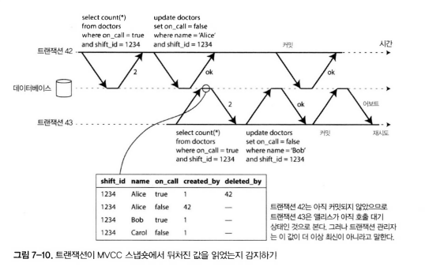
- 예시
  - 트랜잭션 42: 의사의 상태를 변경
  - 트랜잭션 43: `on_call = true` 상태를 조사
  - 트랜잭션 43이 읽을 당시, 42는 아직 커밋되지 않음
  - 그러나 43이 커밋 시도 시점에는 42가 이미 커밋된 상태
  - 따라서 43의 질의 결과는 더 이상 참이 아님 -> 어보트 필요

- 왜 커밋 시점 확인이 필요한가?
  - 트랜잭션 43은 읽기 전용 트랜잭션이라면 위험이 없으므로 어보트될 필요가 없다.
    - 읽기를 실행하는 시점에 나중에 쓰기를 실행할지 알 수 없다.
    - 또한 트랜잭션 42가 다른 이유로 인해 어보트될 수도 있고 트랜잭션 54이 커밋되는 시점에 아직 커밋되지 않았을 수도 있다.
  - SSI는 불필요한 어보트를 피해서, 일관된 스냅샷에서 읽으며 오래 실행되는 작업을 지원하는 스냅샷 격리의 특성을 유지한다.

_**과거의 읽기에 영향을 미치는 쓰기 감지하기**_

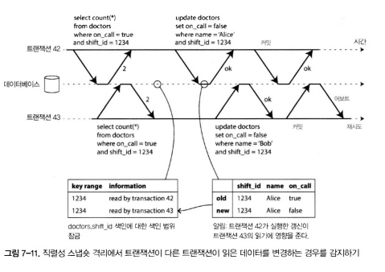

- 고려해야하는 두 번째 경우
  - 트랜잭션이 데이터를 읽은 후, 다른 트랜잭션이 그 데이터를 변경하는 경우
  - 이 상황은 쓰기 스큐(write skew)나 팬텀 문제와 유사
  - 직렬성을 보장하려면 DB는 이런 경우를 감지하고 충돌을 처리해야 함

- 예시 (그림 7-11)
  - 트랜잭션 42와 43이 동시에 `shift_id = 1234` 의사 대기 상태를 조회
  - 두 트랜잭션 모두 같은 데이터를 읽음
  - shift_id 색인이 있으면 DB가 색인 항목을 이요해 트랜잭션 42, 43이 데이터를 읽었다는 사실을 기록
    - 이 사실은 잠시만 유지하면 됨
  - 트랜잭션 42 -> 데이터를 변경 (예: 의사 상태 업데이트)
  - 트랜잭션이 쓰기를 진행할 때 영향받는 데이터를 최근에 읽은 트랜잭션이 있는지 색인에서 확인
    - 있다면 트랜잭션에 있는 데이터가 최신이 아님을 알림, 이 잠금은 지뢰선(tripwire)처럼 동작함.
  - 트랜잭션 43 -> 읽은 결과를 기반으로 동작하지만, 이미 42의 쓰기로 인해 결과는 더 이상 유효하지 않음
  - DB는 이 상황을 감지하고 트랜잭션 43을 어보트시켜야 함

_**직렬성 스냅샷 격리의 성능**_

- 트랜잭션의 읽기 쓰기를 추적하는 세밀함의 정도
  - 한 트랜잭션이 다른 트랜잭션의 읽기,쓰기 동작을 세밀하게 추적
    - 정확하지만 -> 많은 기록·오버헤드 발생
  - 한 트랜잭션이 다른 트랜잭션의 읽기,쓰기 동작을 덜 세밀하게 추적
    - 빠르지만 -> 필요한 정보 누락 가능, 많은 트랜잭션 어보트

- 다른 트랜잭션의 정보 활용
  - 어떤 경우엔 다른 트랜잭션에서 읽은 정보를 재활용해도 무방
  - 경우에 따라 결과가 직렬적임을 증명 가능
  - 포스트그레스큐엘(PostgreSQL)은 불필요한 어보트 개수를 줄이기 위해 이 방법 사용

- 2단계 잠금(2PL)과의 비교
  - 직렬성 스냅숏 격리(SSI)의 장점
    - 트랜잭션이 다른 트랜잭션이 끝나길 기다릴 필요 없음
    - 즉, 읽는 쪽은 읽고, 쓰는 쪽은 쓰는 쪽만 실행
  - 이 원칙은 짧은 지연 시간 보장
  - 읽기 전용 트랜잭션은 잠금 없이 실행 가능

- 순차 실행과 비교
  - 단일 CPU 코어에 제한되지 않음
  - 파운데이션DB(FDB)와 같은 분산 시스템에서 높은 수준의 확장성 제공
  - 여러 장비에서 병렬 처리 가능
  - SSI는 직렬성을 보장하면서도 여러 파티션에서 읽고 쓸 수 있음
 
- 어보트 비율
  - 어보트 비율은 SSI 성능에 큰 영향을 미친다.
  - 오랜 시간 동안 데이터를 읽고 쓰는 트랜잭션은 충돌이 나고 어보트되기 쉽다.
    - 짧은 트랜잭션을 통해 회피하자.
    - 읽기 전용 트랜잭션이라면 오래 실행되어도 무관하다.