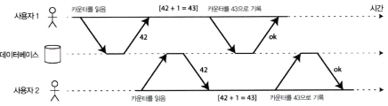

# 7장. 트랜잭션

- 트랜잭션의 필요성
    - 현실의 데이터 시스템은 다양한 장애(소프트웨어/하드웨어 오류, 애플리케이션 충돌, 네트워크 단절, 다중 클라이언트 동시 접근, 레이스 컨디션 등)에 직면할 수 있음
    - 트랜잭션은 여러 연산을 하나의 단위로 묶어 전부 성공(Commit) 또는 전부 실패 후 취소(Abort/Rollback) 하도록 보장
    - 프로그래밍 모델 단순화, 동시성 및 오류 처리 부담 감소
    - 모든 애플리케이션이 강한 트랜잭션 보장을 필요로 하지는 않음
        
        → 성능·가용성과의 트레이드오프 고려 필요
        

## 애매모호한 트랜잭션의 개념

---

- 관계형 데이터베이스는 전통적으로 트랜잭션을 지원해 왔음
- 2000년대 이후 NoSQL DB는 확장성과 성능을 위해 트랜잭션을 약화하거나 제거
- 두 관점:
    - 트랜잭션은 성능/확장성의 적이므로 포기해야 한다는 입장
    - 중요한 데이터를 다루려면 트랜잭션은 필수라는 입장
- 실제로는 어느 쪽도 절대적이지 않음
    
    → 트랜잭션 보장은 상황에 따라 선택해야 하는 설계 요소
    

### ACID의 의미

---

- 트랜잭션의 안전성 보장을 나타내는 대표적 약어
- 원자성 (Atomicity)
    - 트랜잭션은 쪼갤 수 없는 실행 단위
    - 일부만 반영되는 일이 없고, 전부 반영되거나 전혀 반영되지 않아야 함
    - 실패 시 모든 변경을 취소(Abort)
- 일관성 (Consistency)
    - 데이터가 항상 “진실”을 유지해야 함
    - 애플리케이션 불변식(invariant)을 위배하지 않아야 함
    - 실제로는 DB 자체보다는 애플리케이션 책임에 가까움
- 격리성 (Isolation)
    - 여러 트랜잭션이 동시에 실행되더라도, 각각의 트랜잭션은 마치 순차적으로 실행된 것처럼 보장하는 성질
        
        → 즉, 트랜잭션 간의 간섭을 방지하고 직렬성(Serializability)을 보장
        
    - 문제 상황: 카운터 값이 42일 때 두 클라이언트가 동시에 `+1` 연산을 수행하면, 결과가 44가 아닌 43으로 저장되는 경쟁 조건(race condition) 발생 가능
    - 직렬성(serializable)
        
        
        
        그림 7-1. 동시에 카운터를 증가시키는 두 클라이언트 사이의 경쟁 조건
        
        - 가장 강력한 격리 수준, 모든 트랜잭션을 순차적으로 실행한 것과 동일한 결과를 보장
            - 하지만 성능 저하 때문에 실제로는 잘 사용되지 않음
        - 대안: 스냅샷 격리(Snapshot Isolation) → 직렬성보다 약하지만 실용적 성능과 보장 사이의 절충안
- 지속성 (Durability)
    - 트랜잭션이 커밋되면, 설령 하드웨어 고장이나 시스템 충돌이 발생해도 데이터는 손실되지 않는다는 보장
    - 구현 방식:
        - 단일 노드 DB: 디스크/SSD 같은 비휘발성 저장장치에 데이터 기록. 보통 Write-Ahead Log(WAL) 사용
        - 분산 DB: 여러 노드에 데이터 복제 완료 후에야 커밋 성공으로 간주
- 복제와 지속성
    - 단순히 디스크 기록만으로는 안전하지 않고, 복제 시스템도 리더 장애 시 최근 데이터 유실 위험 존재
    - SSD나 디스크도 불완전하여, `fsync` 실패·디스크 펌웨어 버그·전원 장애 시 보장 위반 가능
    - 따라서 현실적으로는 다양한 위험 완화 기법(디스크 쓰기 + 복제 + 백업)을 병행 조합해 신뢰성을 높이는 방향으로 접근

### 단일 객체 연산과 다중 객체 연산

---

- 단일 객체 연산:
    - 하나의 로우/문서/레코드만 변경하는 경우
    - 원자성(Atomicity)으로 보장 가능 → 중간 실패 시 전체 연산 취소(Abort)
- 다중 객체 연산 (Multi-Object Transactions):
    - 여러 객체를 동시에 변경해야 할 때 필요
        - ex> 이메일 앱에서 안 읽은 메시지 개수(`unread_count`)를 유지하기 위해, 메시지 추가 시 카운터 증가, 메시지 읽음 처리 시 카운터 감소
    - 격리성 미보장 시 → 카운터 값과 실제 메시지 수가 불일치(Dirty Read, Lost Update 문제 발생)
        
        
        
        그림 7-2. 격리성 위반: 트랜잭션이 다른 트랜잭션에서 썼지만 커밋되지 않은 데이터를 읽음(dirty read)
        
        
        
        그림 7-3. 원자성은 오류가 발생하면 트랜잭션에서 이전에 실행한 쓰기를 취소해서 일관성이 깨진 상태가 되지 않게 한다.
        
    - 전통적인 관계형 DB에서는 `BEGIN TRANSACTION … COMMIT` 으로 처리
    - NoSQL에서는 보통 다중 객체 연산 지원이 제한적이며, `multi-put` 같은 API를 제공하더라도 트랜잭션 보장이 되지 않는 경우가 많음

- 단일 객체 쓰기
    - 단일 객체를 변경하는 경우에도 원자성과 격리성이 적용된다.
        - 원자성: 로그(Write-Ahead Logging 등)를 활용해 중간 상태가 아닌 완전한 결과만 반영되도록 보장한다.
        - 격리성: 객체 단위 잠금으로 동시에 하나의 쓰기만 허용해 부분 읽기를 방지한다.
    - 일부 데이터베이스는 더 복잡한 단일 객체 연산을 제공한다.
        - 증가 연산: Read-Modify-Write 반복 없이 바로 값 증가 가능
        - Compare-and-Set(CAS): 예상한 값일 때만 변경을 허용해 동시성 충돌 방지
        
        → 이러한 연산은 흔히 경량 트랜잭션으로 불리지만, 다중 객체 트랜잭션을 대체할 수는 없다.
        

- 다중 객체 트랜잭션의 필요성
    - 관계형 데이터 모델
        - 한 테이블의 행이 다른 테이블의 행을 참조하는 경우(외래 키 등), 여러 행이 동시에 일관되게 갱신되어야 한다.
    - 문서 데이터 모델
        - 한 문서 내의 여러 필드를 동시에 갱신해야 하는 경우, 다중 객체 트랜잭션이 필요하다.
        - 특히 조인 기능이 부족한 문서 DB에서는 역정규화를 자주 사용하기 때문에, 관련된 여러 문서를 한 번에 갱신해야 한다.
    - 보조 인덱스(secondary index)
        - 인덱스는 데이터와 별도의 객체로 관리되므로, 데이터 변경 시 인덱스도 동시에 갱신되어야 한다.
        - 트랜잭션이 없으면 데이터와 인덱스가 불일치 상태에 빠질 수 있다.
    
    → 원자성이 없으면 오류 처리가 훨씬 더 복잡해지고 격리성이 없으면 동시성 문제가 생길 수 있다.
    

- 오류와 어보트 처리
    - 트랜잭션의 핵심 기능은 오류 발생 시 안전하게 취소(어보트) 하고 재시도할 수 있게 하는 것.
        - ACID 데이터베이스는 원자성·격리성·지속성을 보장하면서 트랜잭션 전체를 완전한 상태로 유지하는 것을 목표로 한다.
    - 하지만 실제 시스템에서는 이 철학을 따르지 않는 경우도 많다.
        - 일부 시스템은 "최선을 다해(best effort)" 처리하고, 이미 수행된 작업은 되돌리지 않고 오류 이후는 애플리케이션이 직접 복구하도록 맡긴다.
    - 어보트된 트랜잭션을 재시도하는 것
        - 단순하고 효과적인 오류 처리 메커니즘이지만 완벽하지 않다.
        - 잠재적 문제
            - 네트워크 장애 등으로 커밋이 완료되었음에도 클라이언트가 실패로 판단해 재시도하면 중복 실행이 발생할 수 있음
            - 과부하로 인한 오류 상황에서 재시도를 반복하면 문제를 더 악화시킬 수 있음 → 재시도 횟수 제한 or 지수적 백오프(exponential backoff) or 과부화 관련 오류 별도 처리 필요
            - 영구적 오류(제약 조건 위반 등)에서는 재시도해도 의미 없음
            - 트랜잭션 중 일부 부작용(ex> 이메일 전송)은 어보트와 무관하게 실행될 수 있어, 재시도 시 중복 실행 위험 존재
                - 이런 경우에는 2단계 커밋(2-Phase Commit) 같은 프로토콜을 통해 여러 시스템에서 원자성을 맞춰야 함
        - 실패 시 데이터 손실 위험
            - 클라이언트가 실패 도중 중단되면, 쓰기 작업이 유실될 수 있음

## 완화된 격리 수준

---

- 엄격한 직렬성(Serializable)은 안전하지만 성능 비용이 크다.
- 많은 DB는 성능을 위해 더 약한 격리 수준을 제공한다.

### 커밋 후 읽기

---

- 더티 읽기(Dirty Read) 방지
    - 아직 커밋되지 않은 데이터는 읽지 않음
    
    
    
    그림 7-4. 더티 읽기 방지: 사용자 2는 사용자 1의 트랜잭션이 커밋된 후에야 x의 새 값을 보게 된다.
    
- 더티 쓰기 방지
    - 먼저 쓴 트랜잭션이 커밋되거나 어보트될 때까지 두 번째 쓰기를 지연시키는 방법을 사용한다.
    
    
    
    그림 7-5. 다른 트랜잭션에서 충돌하는 쓰기를 실행할 때 더티 쓰기가 있으면 내용이 섞일 수 있다.
    
- 커밋 후 읽기 구현
    - DB는 로우 수준 잠금을 사용해 더티 쓰기를 방지한다.
        - 트랜잭션에서 특정 객체(로우나 문서)를 변경하고 싶다면 먼저 해당 객체에 대한 잠금을 획득해야 한다.
        - 그리고 트랜잭션이 커밋되거나 어보트될 때까지 잠금을 보유하고 있어야 한다.
    - 그림 7-4 방법을 사용해 더티 읽기를 방지한다.
        - 쓰여진 모든 객체에 대해 DB는 과거에 커밋된 값과 현재 쓰기 잠금을 갖고 있는 트랜잭션에서 쓴 새로운 값을 모두 기억한다.
        - 해당 트랜잭션이 실행 중인 동안 그 객체를 읽는 다른 트랜잭션들은 과거의 값을 읽게 된다.
        - 새 값이 커밋돼야만 다른 트랜잭션들이 새 값을 읽을 수 있게 된다.
    - 그러나 Non-repeatable Read 발생 가능
        - 같은 쿼리를 두 번 실행하면 결과가 달라질 수 있음

### 스냅숏 격리와 반복 읽기

---

- 커밋 후 읽기(Read Committed)만으로는 트랜잭션 격리를 보장하기에 부족하다.
- 동시 실행 시 반복 불가능 읽기(Non-repeatable Read) 또는 읽기 스큐(Read Skew) 발생 가능
    - ex> 은행 계좌에서 동시에 조회와 이체가 실행될 경우, 잔액 합계가 일시적으로 불일치하는 상황 발생
        
        
        
        그림 7-6. 읽기 스큐: 앨리스는 일관성이 깨진 상태인 데이터베이스를 본다.
        

- 스냅숏 격리(Snapshot Isolation)
    - 각 트랜잭션은 시작 시점의 일관된 스냅숏을 읽음
        - 다른 트랜잭션이 쓰기를 해도 이미 시작된 트랜잭션의 읽기 결과는 변하지 않음
    - 구현 방식: 다중 버전 동시성 제어(MVCC)
        
        
        
        그림 7-7. 다중 버전 객체를 이용한 스냅숏 격리 구현
        
        → 각 객체의 버전을 관리해 트랜잭션 ID 기반으로 가시성(visibility) 규칙을 적용
        
    - 주요 원칙:
        1. 시작 시점에 진행 중이던 트랜잭션의 결과는 무시
        2. 중단(abort)된 트랜잭션의 결과도 무시
        3. 나중에 시작된 트랜잭션의 결과는 무시
        4. 나머지 커밋된 데이터만 보임
    - 장점
        - 백업, 분석 쿼리 등 장시간 읽기 작업에서도 안정적 결과 제공
        - 반복 읽기 문제 해결, 읽기 일관성 보장
        - PostgreSQL, Oracle, SQL Server, MySQL InnoDB 등 다수 DBMS에서 지원
    - 구현 고려사항
        - MVCC 기반 스냅숏은 삭제 시 row를 실제 제거하지 않고 삭제 표시 후 새로운 버전 생성
        - 불필요한 오래된 버전은 압축·가비지 컬렉션 과정에서 정리
        - 인덱스 역시 여러 버전을 가리킬 수 있도록 설계 필요

- 반복 읽기와 혼란스러운 이름
    - 스냅숏 격리 vs. SQL 표준
        - 스냅숏 격리는 읽기 전용 트랜잭션에 유용하지만, SQL 표준에는 없는 개념이다.
        - SQL 표준은 1975년 정의된 반복 읽기(repeatable read)만 포함하며, 스냅숏 격리와 유사해 혼동 발생
        - PostgreSQL·MySQL은 스냅숏 격리를 repeatable read라 부르며, Oracle은 serializable로 명명
    - 문제점
        - SQL 표준의 정의는 모호하고 실제 구현과 차이가 크다.
            - ex> IBM DB2의 repeatable read는 스냅숏이 아니라 직렬성 의미
        - 따라서 “반복 읽기” 용어는 혼란스럽고 실제 의미를 모르는 경우가 많다.

### 갱신 손실 방지

---

- 갱신 손실 (Lost Update)
    - 여러 트랜잭션이 동시에 같은 데이터를 읽고 갱신(write)하면서 이전 갱신이 덮어써지는 문제
        - ex> 계좌 잔고 증가 연산, JSON 문서 수정, 위키 문서 동시 편집 등
- 해결 방식
    1. 원자적 쓰기 연산
        - `UPDATE ... SET value = value + 1` 같은 연산을 DB가 직접 제공
        - MongoDB, Redis 등도 부분 갱신을 위한 원자적 연산 제공
        - 커서 안정성(읽은 객체에 잠금) 또는 단일 스레드 실행 방식 사용
    2. 명시적인 잠금
        - `SELECT ... FOR UPDATE`로 읽은 객체에 락을 걸고 이후 갱신
            - ex> 게임에서 두 플레이어가 같은 말을 동시에 옮기지 못하도록 제어
    3. 갱신 손실 자동 감지
        - DB가 트랜잭션 충돌을 감지하면 롤백 후 재시도 강제
        - PostgreSQL `repeatable read`, Oracle `serializable`, SQL Server `snapshot`은 갱신 손실 자동 감지
        - MySQL/InnoDB `repeatable read`는 갱신 손실 감지 불가
    4. Compare-and-Set (CAS)
        - `UPDATE ... WHERE content = 'old'` 조건으로 동시성 제어
        - 조건 불일치 시 갱신 실패 → 재시도 필요
        - 안전하지 않은 구현도 있으므로 DB 동작 확인 필수
    5. 충돌 해소와 복제
        - 동시에 쓰는 경우, 한 값에 대해 여러 충돌된 버전(형제) 발생 가능
        - 응용 코드가 충돌된 버전을 합치도록 설계 필요
        - 리악은 원자적 연산(ex> 카운터 증가, 집합 삽입)를 통해 자동 병합
        - 하지만 많은 복제 DB는 최종 쓰기 승리(LWW)가 기본 설정
            
            → 갱신 손실이 발생하기 쉽다.
            

### 쓰기 스큐와 팬텀

---

- 쓰기 스큐 (Write Skew)
    - 두 개의 트랜잭션이 서로 다른 객체를 갱신하면서 동시에 특정 조건을 만족하지 못하게 되는 상황
        - ex> 병원 당직 의사 최소 1명 필요 조건 → Alice와 Bob이 동시에 당직 해제 → 결과적으로 당직 의사 0명
            
            
            
            그림 7-8. 애플리케이션 버그를 유발하는 쓰기 스큐의 예
            
    - 특징
        - 더티 쓰기(Dirty Write)나 갱신 손실(Lost Update)과는 다른 유형
        - 동시에 실행되었을 때만 나타나며, 순차 실행 시 문제 없음
        - 단일 객체 원자 연산이나 갱신 손실 자동 감지로 해결 불가
    - 해결 방법
        - `Serializable` 격리 수준 사용
        - 데이터베이스 제약조건(유일성, 외래 키, 체크 제약 등) 정의
        - 명시적 잠금(`SELECT … FOR UPDATE`) 활용해 조건에 맞는 행을 직접 잠금
- 추가적인 쓰기 스큐의 예
    - 회의실 예약: 같은 시간대 중복 예약 체크 후 삽입 → 동시에 실행 시 중복 예약 발생
        
        
        
        예제 7-2. 회의실 예약 시스템은 중복된 예약을 피하려고 한다.(스냅숏 격리에서는 안전하지 않다)
        
    - 멀티플레이 게임: 두 플레이어가 동시에 같은 말 이동 → 게임 규칙 위배
    - 사용자명 획득: 동일한 username으로 계정 생성 → 동시에 통과 시 중복 발생
    - 이중 지불(Double Spending): 두 거래가 동시에 진행되어 계좌 잔고가 음수로 떨어짐

- 쓰기 스큐를 유발하는 팬텀
    - 한 트랜잭션에서 검색한 조건에 새로운 행이 다른 트랜잭션에 의해 추가/삭제되어 결과가 달라지는 현상
    - 특징
        - `SELECT FOR UPDATE`로 기존 행은 잠글 수 있으나, 조건에 맞는 새로운 행이 추가되는 것은 막지 못함
        - 쓰기 스큐는 종종 팬텀 현상과 결합하여 나타남
    - 해결 방법
        - `Serializable` 격리 수준 사용
        - 특정 조건을 만족하는 행 집합 전체를 잠그는 방식 필요

- 충돌 구체화
    - 팬텀 문제의 본질은 잡을 수 있는 객체가 없다는 점. 이를 해결하기 위해 인위적으로 잠금 객체를 추가하는 방식을 사용해 볼 수 있다.
        - ex> 회의실 예약 시스템에서 시간 슬롯과 회의실 조합으로 테이블을 만들어, 특정 시간-회의실 범위에 대해 예약 시 `SELECT FOR UPDATE`로 해당 슬롯을 잠금
    - 충돌 구체화: 실제 존재하지 않던 충돌을 구체적인 행(row) 충돌로 변환하는 것
    - 단점:
        - 구현이 복잡하고 오류 발생 위험이 큼
        - 애플리케이션 데이터 모델에 메커니즘이 침투해 관리가 어려워짐
    - 따라서 최후의 수단으로 고려하며, 일반적으로는 직렬성 격리가 더 단순하고 선호됨

## 직렬성

---

- 트랜잭션 격리의 최강 수준
- 트랜잭션들이 순차적으로 실행된 것과 같은 결과를 보장
- 모든 경쟁 조건을 방지
- 문제: 성능 비용이 크고, 구현 복잡성 있음

- 직렬성을 구현하는 대표적 기법:
    1. 실제 직렬 실행 (Actual Serial Execution)
    2. 2단계 잠금(2PL, Two-Phase Locking)
    3. 직렬성 스냅숏 격리(SSI, Serializable Snapshot Isolation)

### 실제적인 직렬 실행

---

- 가장 단순한 방법: 한 번에 하나의 트랜잭션만 실행
- 단일 스레드 루프에서 순차적으로 실행하면 정의상 직렬성 보장
- 장점: 경쟁 조건 감지와 방지 문제 자체가 사라짐
- 단점: 처리량이 단일 CPU 코어 성능에 제한됨

- 현대에서 가능해진 이유:
    - RAM 가격 하락 → 모든 데이터를 메모리에 유지 가능
    - OLTP 트랜잭션이 짧음 → 짧은 읽기/쓰기만 처리하므로 빠른 실행 가능
- 실제 사용 예: VoltDB, H-Store, Redis, Datomic

- 트랜잭션을 스토어드 프로시저 안에 캡슐화하기
    - 단일 스레드 직렬 실행에서는 클라이언트와 서버 간의 상호작용 방식(쿼리 여러 번 왕복)은 비효율적
    - 해결책: 트랜잭션 코드를 데이터베이스 내부에 프로시저로 캡슐화
        - ex> 항공권 예약 과정을 하나의 스토어드 프로시저로 실행
    - 장점: 네트워크 지연 제거, I/O 대기 최소화 → 매우 빠른 실행
    - 단점:
        - 코드 관리 어려움, 유지보수 힘듦
        - 각 DBMS마다 다른 프로시저 언어(PL/SQL, T-SQL 등) → 이식성 낮음
    
    
    
    그림 7-9. 상호작용식 트랜잭션과 스토어드 프로시저의 차이점
    

- 스토어드 프로시저의 장단점
    - 단점
        - 각 DB마다 다른 언어 사용 → 표준화 부족, 이식성 낮음
        - 코드 실행 환경이 제한적, 관리/테스트/모니터링 어려움
        - 애플리케이션 서버 대비 민감한 자원 공유 문제 발생 가능
    - 개선
        - 현대 시스템은 범용 언어(Java, Clojure, Lua 등) 사용 가능
        - 모든 데이터가 메모리에 올라온 경우, 스토어드 프로시저로 단일 스레드 직렬 실행 → 동시성 문제 제거 + 높은 처리량
        - ex> VoltDB는 자바/그루비 기반, Datomic은 Clojure 기반, Redis는 Lua 기반

- 파티셔닝
    - 단일 CPU 코어에서 직렬 실행은 직관적이지만, 트랜잭션 처리량은 코어 성능에 제한된다.
    - 읽기 전용 트랜잭션은 스냅샷 격리를 활용해 병렬 실행할 수 있지만, 쓰기 비중이 높은 애플리케이션은 단일 스레드 처리의 병목을 피하기 어렵다.
    - 확장 방법
        - 여러 CPU 코어·노드로 확장하기 위해 데이터 파티셔닝(partitioning)을 활용한다.
        - 각 트랜잭션이 하나의 파티션 내에서만 데이터를 읽고 쓴다면, 파티션별로 독립 실행이 가능하다.
        - 이 경우 CPU 코어마다 파티션을 맡아 병렬 확장이 가능하다.
    - 제약
        - 다중 파티션에 걸친 트랜잭션은 모든 파티션에서 코디네이션 필요
        - 이때는 잠금/커밋을 파티션별로 동기화해야 하므로 성능이 급격히 저하된다.
        - ex> VoltDB의 경우 단일 파티션은 초당 수십만 트랜잭션 처리 가능, 다중 파티션은 초당 약 1,000건으로 감소

- 직렬 실행 요약
    - 제약 조건
        - 트랜잭션은 짧고 빨라야 한다.
        - 전체 데이터셋이 메모리에 있어야 성능 보장
        - 쓰기 처리량은 단일 CPU 코어가 감당할 수준 이하여야 한다.
    - 활용 사례
        - 단일 노드에서의 고속 처리
        - 단순 키-값 저장소 등 파티셔닝이 쉬운 데이터 모델

### 2단계 잠금(2PL)

---

- 약 30년간 직렬성을 보장하기 위해 가장 널리 사용된 알고리즘
- 트랜잭션이 실행 중에는 필요한 모든 잠금을 확보하고, 커밋/중단 시 한꺼번에 해제한다.
    - 1단계: 잠금 획득
    - 2단계: 잠금 해제

- 2단계 잠금 구현
    - 공유 모드(shared): 읽기 전용 트랜잭션끼리는 공유 가능
    - 배타 모드(exclusive): 쓰기 연산은 독점 잠금 필요
- 특징 및 문제
    - 장점: 직렬성을 보장 → 모든 경쟁 조건 예방 가능
    - 단점:
        - 교착 상태(deadlock) 발생 가능 → DB가 탐지 후 강제 중단 필요
        - 동시성 낮음, 처리량·응답 시간 저하
        - 실행 시간이 긴 트랜잭션이 있으면 전체 대기열 지연

- 서술(Predicate) 잠금
    - 팬텀(phantom) 문제 해결을 위해 필요
    - 특정 조건(쿼리 범위)에 해당하는 객체 전체에 잠금을 거는 방식
        - ex> 회의실 예약 시 `room_id=123 AND time BETWEEN 12:00 AND 13:00` 조건에 대해 잠금
        - 새로운 예약이 추가되더라도 조건을 위반하지 않도록 제어 가능
    - 효과:
        - 존재하지 않는 객체(미래에 추가될 수 있는 행)까지 제어 가능
        - 2PL에 서술 잠금을 포함하면 직렬성 격리 완벽 보장

- 색인 범위 잠금
    - 서술 잠금의 복잡성을 단순화한 구현 방식
    - 색인 컬럼의 특정 범위를 잠궈서 팬텀(phantom) 문제 방지
        - ex> 회의실 예약 시 `room_id=123` + 특정 시간 구간 색인 범위를 잠금
    - 특징:
        - 색인에 기반하여 범위를 잠그므로 서술 조건 전체를 검사할 필요 없음
        - 색인이 없을 경우 테이블 전체를 잠궈야 하므로 성능 저하
    - 효과:
        - 팬텀 문제 방지 가능
        - 효율적으로 직렬성 보장 (단, 색인 설계가 중요)

### 직렬성 스냅숏 격리(SSI)

---

- 2단계 잠금(2PL)의 성능 저하 문제를 해결하기 위해 제안됨
- 스냅숏 격리(SI)의 장점을 유지하면서 직렬성 보장

- 비관적 동시성 제어 대 낙관적 동시성 제어
    - 비관적 제어(잠금 기반, 2PL): 충돌이 날 가능성이 있다고 보고, 미리 잠금으로 제어 → 안전하지만 성능 저하
    - 낙관적 제어(SSI): 충돌이 실제 발생하는지 감시하다가, 직렬성 위반 가능성이 감지되면 트랜잭션 Abort → 충돌이 적을 땐 효율적

- 뒤처진 전제에 기반한 결정
    - 트랜잭션이 처음 읽었던 전제(ex> 현재 대기 중인 의사가 2명 이상)를 바탕으로 결정을 내리지만, 이후 다른 트랜잭션이 데이터를 바꿔서 전제가 더 이상 유효하지 않을 수 있음
    - SSI는 이러한 stale premise(뒤처진 전제)를 감지하여 충돌로 간주하고 Abort 처리

- 오래된 MVCC 읽기 감지하기
    - MVCC 환경에서는 트랜잭션이 과거 스냅숏을 읽을 수 있음
        - ex> T42가 오래된 스냅숏을 읽고, 그 사이 T43이 새로운 값을 Commit → T42가 의사결정을 내리면 직렬성 위반
            
            
            
            그림 7-10. 트랜잭션이 MVCC 스냅숏에서 뒤처진 값을 읽었는지 감시하기
            
    - SSI는 이런 오래된 스냅숏 읽기와 직렬성 위반 가능성을 탐지

- 과거의 읽기에 영향을 미치는 쓰기 감지하기
    
    
    
    그림 7-11. 직렬성 스냅숏 격리에서 트랜잭션이 다른 트랜잭션이 읽은 데이터를 변경하는 경우를 감지하기
    
    - 다른 트랜잭션이 이미 읽은 데이터에 대해 뒤늦게 쓰기가 발생하면, 이전 트랜잭션의 전제가 깨질 수 있음
    - SSI는 이런 읽기 후 쓰기(Write after Read) 충돌을 추적하고 필요 시 Abort 처리

- 직렬성 스냅숏 격리의 성능
    - 장점: 잠금 기반 직렬성보다 높은 동시성, 읽기는 블로킹 없음
    - 단점: 충돌 감지 → Abort 발생률이 높으면 성능 저하
    - 실제로는 충돌이 많지 않은 환경에서 효과적

## 정리

---
