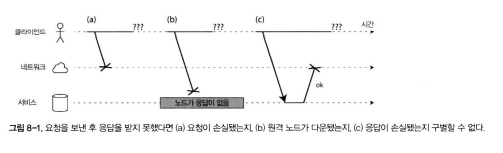
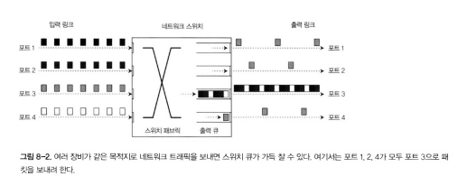
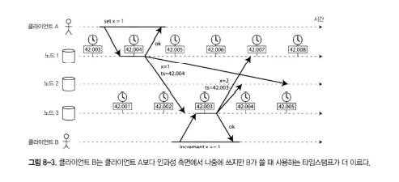
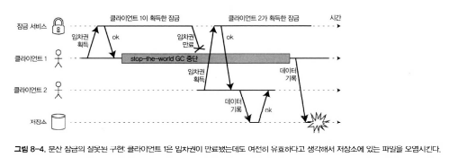
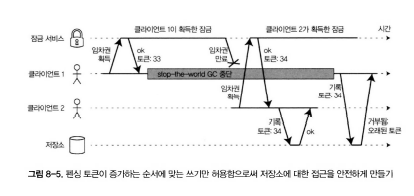

# 🔴 분산 시스템의 골칫거리

## 🟠 결함과 부분 장애

- **결함과 오류**
    - 단일 컴퓨터에서 프로그램은 보통 예측 가능한 방식으로 동작함.
    - 그러나 대부분의 장애는 **소프트웨어의 결함(Bug)** 으로 인해 발생.
    - 하드웨어 장애는 드물지만 존재하며, 결함은 결정적(Deterministic)인 방식으로 나타남.

- **분산 시스템의 특성**
    - 분산 시스템에서는 여러 컴퓨터가 네트워크로 연결되어 있어 상황이 완전히 다름.
    - 일부 노드가 정상이라도 **다른 노드의 장애나 네트워크 장애로 전체 서비스가 영향을 받음**.
    - 이러한 예측 불가능한 고장을 **부분 장애(Partial Failure)** 라고 함.
    - 부분 장애는 비결정적(Non-deterministic)이며 원인이나 시점 예측이 어려움.

- **결함의 예시 (Coda Hale 인용)**
    - 데이터센터에서 짧은 정전, 네트워크 분리, 전원 공급 문제 등으로 인해 전체 시스템이 중단될 수 있음.
    - 이러한 장애는 **물리적 현실의 불완전함**에 기인하며 완벽히 제거할 수 없음.


### 🟢 클라우드 컴퓨팅과 슈퍼컴퓨팅

- **슈퍼컴퓨터**
    - 계산 중 한 노드라도 실패하면 전체 작업 실패.
    - 고정된 계산 단위로 운영되어 장애 허용 불가.

- **클라우드/분산 시스템**
    - 일부 노드가 장애 나도 나머지가 정상 작동 가능.
    - 장애 허용 설계(Fault-tolerance)가 필수.
    - 예: 데이터 복제, 장애 감지 및 재시도, 자동 복구.

- **신뢰성 없는 구성 요소를 사용한 신뢰성 있는 시스템 구축**
    - 예: IP, TCP 등도 비신뢰적 전송 기반 위에서 신뢰성 보장.
    - 메시지 손실, 네트워크 지연, 중복 송신 가능성 등 존재.
    - 신뢰성은 **상위 계층 소프트웨어가 책임**짐 (예: 재시도, 확인 응답, 타임아웃 처리 등).


- **결론**
    - 완벽한 하드웨어나 네트워크는 존재하지 않음.
    - **소프트웨어 수준에서 결함을 탐지·복구하는 설계**가 분산 시스템의 핵심.
    

## 🟠 신뢰성 없는 네트워크



- **비공유 시스템의 특징**
    - 분산 시스템은 비공유 시스템으로, 네트워크로 연결된 다수의 장비로 구성된다.
    - 네트워크는 장비들이 통신하는 유일한 수단이다.
    - 각 장비는 자신만의 메모리와 디스크를 가지고 있으며, 다른 장비의 메모리나 디스크에 접근할 수 없다.

- **인터넷 서비스와 신뢰성**
    - 인터넷 서비스는 특별한 하드웨어 없이 상업적으로 저렴하고 상호작용 클라우드 서버를 활용할 수 있다.
    - 지리적으로 분산된 여러 데이터센터 중 비동기적으로 높은 신뢰성을 확보할 수 있다.

- **비동기 패킷 네트워크 (Asynchronous Packet Network)**
    - 대부분의 네트워크는 비동기 패킷 네트워크이다.
    - 노드는 다른 노드로 메시지를 보낼 수 있지만, 언제 도착할지 혹은 도착하지 않을지도 보장되지 않는다.

- **요청 시 발생할 수 있는 문제**
    1. 요청이 손실될 수 있다.
    2. 요청이 여러 번 전송될 수 있다.
    3. 요청이 너무 늦게 도착할 수 있다.
    4. 노드가 응답을 하지 못할 수 있다.
    5. 응답이 손실될 수 있다.
    6. 요청을 처리했지만 응답이 너무 늦게 도착할 수 있다.

- **통신 불확실성과 타임아웃**
    - 전송 성공 여부를 송신자는 알 수 없다.
    - 수신자가 응답을 보냈더라도 송신자가 응답을 받지 못하면 그 이유를 알 수 없다.
    - 이러한 문제를 다루는 유일한 방법은 **타임아웃(timeout)** 이다.

### 🟢 현실 네트워크 결함

- **네트워크 결함의 빈도**
    - 현실의 네트워크에서는 결함이 일상적이다.
    - 한 회사의 데이터센터 제어 환경에서는 네트워크 결함을 최소 한 달에 한 번꼴로 관찰하였다.
    - 12개월 내 네트워크 결함 발생 확률은 5% 이상이었다.

- **결함의 원인**
    - 단일 장비의 결함뿐만 아니라 스위치, 링크, 케이블 손상 등으로도 발생한다.
    - 클라우드 시스템(예: EC2)에서도 네트워크 결함은 자주 발생한다.
    - 네트워크 결함은 피할 수 없는 현실이며, 반드시 대비해야 한다.

- **네트워크 분단**
    - 네트워크 결함으로 인해 일부 네트워크가 다른 쪽과 차단되는 현상을 **네트워크 분단**이라 한다.
    - 네트워크 분단은 필연적으로 발생할 수 있다.

- **시스템 설계의 필요성**
    - 소프트웨어는 이러한 결함을 처리할 수 있어야 한다.
    - 네트워크 결함은 피할 수 없으며, 복구가 불가능한 상황도 있다.
    - 시스템은 네트워크 결함을 **견뎌내는(tolerating)** 방식으로 설계되어야 한다.

- **장애 감내 설계**
    - 네트워크 문제를 감내하지 않으면 클러스터 전체가 영향을 받을 수 있다.
    - 결함 허용성은 신뢰할 수 있는 시스템 설계의 기본 전제이다.
    - Netflix의 **Chaos Monkey**는 이러한 장애를 테스트하기 위해 고의로 결함을 유발한다.


### 🟢 결함 감지

- **자동 감지 메커니즘**
    - 많은 시스템은 결함 있는 노드를 자동으로 감지할 수 있어야 한다.
    - 리더 선출 시스템에서는 리더 노드가 장애 시 다른 노드가 새로운 리더로 승격되어야 한다.

- **감지의 어려움**
    - 네트워크 불확실성으로 인해 노드의 동작 상태를 구별하기 어렵다.
    - 응답이 늦은 경우에도 노드가 살아있을 수 있다.
    - 결함 감지는 **타임아웃 기반으로 수행**된다.

### 🟢 타임아웃과 기약 없는 지연

- **타임아웃의 역할**
    - 타임아웃은 결함 감지의 핵심적인 수단이다.
    - 노드가 죽었다고 선언될 때까지 기다리는 시간(타임아웃)이 길면 오류 감지가 늦어진다.
    - 타임아웃이 짧으면 정상 노드가 잘못 감지될 위험이 높아진다.

- **결과 처리**
    - 성공하면 노드가 응답하고, 실패하면 노드를 죽었다고 선언한다.
    - 노드가 죽었다고 선언되면 그 노드의 역할을 다른 노드가 대신한다.
    - 타임아웃은 **경험적으로 설정**해야 한다.

- **비동기 네트워크의 한계**
    - 비동기 네트워크에서는 전송 시간의 상한이 없으며, 지연은 무한할 수 있다.



- **네트워크 혼잡과 큐 대기**
  - **혼잡과 지연**
      - 네트워크의 패킷 이동 시간은 부하에 따라 달라진다.
      - 큐 대기로 인해 지연이 발생할 수 있다.
  - **TCP의 동작**
      - TCP는 손실된 패킷을 재전송하며 흐름 제어를 수행한다.
      - 애플리케이션에서는 패킷 손실이나 재전송이 보이지 않는다.

- **TCP 대 UDP**
  - **TCP**
      - 신뢰성 보장을 위해 사용된다.
      - 재전송과 흐름 제어로 인해 지연이 증가한다.
  - **UDP**
      - 실시간 응용(VoIP 등)에 사용된다.
      - 패킷 손실을 감수하지만 지연이 낮다.
      - 빠르지만 손실 복구는 하지 않는다.

### 🟢 동기 네트워크 대 비동기 네트워크
- **동기 네트워크**
    - 전송 지연의 상한이 고정되어 있다.
    - 전화 네트워크는 동기 네트워크의 예이다.

- **비동기 네트워크**
    - 인터넷과 데이터센터에서 사용된다.
    - 지연의 상한이 없으며, 전송 실패가 예측 불가능하다.


- **네트워크 지연과 자원 사용률**
  - **지연의 원인**
      - 지연의 변동은 동적 자원 분할의 결과이다.
      - 인터넷은 대역폭을 동적으로 공유한다.
      - 네트워크 링크와 스위치는 여러 사용자가 공유한다.
  - **결과**
      - 트래픽이 많을수록 지연이 증가한다.
      - 네트워크 혼잡은 불가피하다.
      - 자원 공유는 효율적이지만 지연의 불확실성을 야기한다.
      - 결과적으로 네트워크는 “항상 일정하지 않다”.

## 🟠 신뢰성 없는 시계
- **시계의 중요성**
    - 애플리케이션은 다음과 같은 질문들에 시계에 의존한다.
        1. 요청이 타임아웃됐나?
        2. 응답 시간은 어떻게 되나?
        3. 지난 5분 동안 평균 초당 몇 개의 처리를 했나?
        4. 웹사이트의 시간은 얼마인가?
        5. 기사가 언제 게시됐나?
        6. 이메일은 언제 보냈나?
        7. 회의 일정은 언제였나?
        8. 로그 파일의 타임스탬프는 무엇인가?

- **분산 시스템과 시계**
    - 통신이 즉각적이지 않기 때문에, 메시지는 네트워크를 거쳐야 하며 전송 지연이 발생한다.
    - 네트워크의 지연과 불확실성 때문에 송신 시각과 수신 시각은 항상 다를 수 있다.
    - 각 장비는 자체 시계를 가지고 있으며, 현실적으로 완벽히 동일하지 않다.

- **시계 장치**
    - 대부분 장비는 수정 발진기(quartz crystal oscillator)를 통해 시계를 유지한다.
    - 장비별로 시계 속도에 약간의 차이가 존재한다.
    - NTP(Network Time Protocol)을 통해 서버의 기준 시간으로 보정할 수 있다.
    - GPS 수신기 등을 사용하면 보다 정확한 시간 동기화가 가능하다.

### 🟢 단조 시계 대 일 기준 시계

- **두 종류의 시계**
    - 현대 컴퓨터에는 두 가지 시계가 있다:
        - **일 기준 시계(time-of-day clock)**
        - **단조 시계(monotonic clock)**


- **일 기준 시계 (Wall-clock time)**
  - **특징**
      - 현재 날짜와 시간을 반환하며, 현실적인 시간 개념과 일치한다.
      - 리눅스의 `clock_gettime(CLOCK_REALTIME)` 또는 자바의 `System.currentTimeMillis()`와 유사하다.
      - 기준 시점(epoch)은 1970년 1월 1일 UTC.

  - **NTP와 동기화**
      - 일반적으로 NTP와 동기화되며, 다른 장비의 타임스탬프와 동일한 의미를 지닌다.
      - 그러나 장비 간 시계의 오차나 설정에 따라 차이가 발생할 수 있다.

  - **문제점**
      - 시스템 시계는 조정될 수 있고(coarse-grained), 윤초(leap second) 등으로 인해 불연속적인 점프가 발생할 수 있다.
      - 이런 변화는 시간 계산 시 문제를 유발할 수 있다.

- **단조 시계 (Monotonic clock)**
  - **특징**
      - 단조 시계는 항상 앞으로만 진행하는 시간 측정용 시계이다.
      - 서비스 응답 시간, 처리 지연 등 상대적 시간 측정에 사용된다.
      - 시스템 시작 이후 경과된 시간을 측정하며 절대적인 ‘현재 시각’과는 다르다.

  - **예시**
      - 리눅스의 `clock_gettime(CLOCK_MONOTONIC)` 또는 자바의 `System.nanoTime()`.

  - **주의점**
      - 여러 CPU가 있는 시스템에서는 코어 간 미세한 차이가 생길 수 있다.
      - 운영체제는 스케줄링 시 이러한 차이를 보정하려 한다.

### 🟢 시계 동기화와 정확도
- **NTP 보정**
    - 단조 시계가 빠르거나 느릴 경우 NTP는 시계 속도를 미세하게 조정(slewing)하여 보정한다.
    - 보정 속도는 약 0.05% 이내이며, 대부분의 시스템은 마이크로초 단위 정밀도를 가진다.

- **일 기준 시계의 보정**
    - 단조 시계는 외부와 동기화할 필요가 없지만, 일 기준 시계는 NTP 서버를 통해 보정된다.
    - 하드웨어나 설정의 정확도에 따라 NTP 보정은 수 밀리초~수십 밀리초의 오차를 가진다.

- **정확도에 영향을 미치는 요인**
    - 하드웨어 드리프트(drift)
    - 네트워크 지연 및 패킷 손실
    - 서버의 부하 및 오차 누적

- **결과**
    - 서버 간 시계 차이는 수 밀리초에서 수십 밀리초까지 발생할 수 있다.
    - NTP 설정이 잘못되면 오차는 더 커질 수 있다.

### 🟢 동기화된 시계에 의존하기


- **한계**
    - 시계는 간단해 보이지만 신뢰할 수 없는 환경이다.
    - 하루는 86,400초보다 길거나 짧을 수 있으며, 시계가 거꾸로 갈 수도 있다.
    - 서로 다른 노드의 시계는 다를 수밖에 없다.

- **문제점**
    - 동기화 시계는 네트워크 지연, CPU 부하, 하드웨어 성능에 따라 오차가 생긴다.
    - 시계 오류는 쉽게 감지되지 않으며 시스템 오류로 이어질 수 있다.
    - 클러스터 환경에서는 시계 차이로 인한 심각한 버그가 발생할 수 있다.

- **결론**
    - 모든 노드의 시계 차이를 최소화하기 위해 지속적인 모니터링과 보정이 필요하다.
    - NTP 서버의 오차나 설정 불일치도 장애 원인이 될 수 있다.


- **이벤트 순서화용 타임스탬프**
  - **문제**
      - 여러 노드가 동시에 이벤트를 기록할 때, “어느 쪽이 먼저인가?”를 결정해야 한다.
      - 각 노드의 시계가 다르기 때문에 순서 불일치 가능성이 있다.

  - **예시**
      - 클라이언트 A와 B가 같은 데이터를 수정할 때, 타임스탬프가 빠른 쪽이 “이전”으로 처리된다.
      - 하지만 네트워크 지연으로 인해 실제보다 늦게 기록될 수 있다.

  - **결함**
      - 타임스탬프에 의존하는 방식은 시계 불일치로 인해 “잘못된 순서 판단”을 초래할 수 있다.
      - 이를 보완하기 위해 “가장 최근(last write wins)” 정책을 사용하기도 한다.

- **논리적 시계 (Logical Clock)**
  - **개념**
      - 물리적 시간 대신 이벤트 순서를 기반으로 하는 시계.
      - 실제 시간 대신 이벤트 간 인과 관계를 기록한다.

  - **특징**
      - 일 기준 시계의 오차 문제를 해결하고, 순서를 안정적으로 표현할 수 있다.
      - 실제 시간 정보는 제공하지 않지만, 사건 간 인과 관계를 명확히 표현한다.

- **시계 읽기의 신뢰 구간**
  - **문제**
      - 하드웨어나 NTP의 부정확성으로 인해 시계의 실제 시간과 읽은 값 간에는 오차가 존재한다.
      - 마이크로초 단위의 오차라도 누적될 경우 신뢰 구간이 커질 수 있다.

  - **신뢰 구간**
      - 보통 NTP 서버를 통한 동기화로 수 밀리초 단위의 정확도를 기대할 수 있다.
      - 네트워크 혼잡이 심할 경우 수십 밀리초~100밀리초 이상 오차가 발생할 수 있다.

  - **실제 사례**
      - 구글 스패너(Spanner)는 “트루타임(TrueTime)” API를 사용해 신뢰 구간을 명시적으로 제공한다.
      - 트루타임은 최소/최대 시간 경계(earliest, latest)를 함께 반환한다.

- **스냅숏용 동기화된 시계**
  - **스냅숏 격리**
      - 데이터베이스의 읽기 트랜잭션은 특정 시점의 데이터를 읽어야 한다.
      - 시계 동기화는 스냅숏 일관성을 유지하는 데 필요하다.

  - **트랜잭션 ID**
      - 각 트랜잭션은 고유한 증가형 ID를 가지며, ID 순서로 시점을 구분한다.
      - 동기화된 시계의 타임스탬프를 이용해 트랜잭션 간 순서를 일관되게 유지할 수 있다.

  - **문제와 해결**
      - 시계 불일치는 스냅숏 일관성에 영향을 준다.
      - 데이터센터 간에는 GPS 기반 시계나 NTP 서버를 이용해 동기화한다.

  - **결론**
      - 트랜잭션용 시계 동기화는 연구 중인 분야이며, 실제 상용화된 예시는 구글 스패너 외에는 거의 없다.

### 🟢 프로세스 중단

```java
while (true) {
    request = getIncomingRequest();

    // 항상 임차권이 적어도 10초는 남아 있게 보장한다
    if (lease.expiryTimeMillis - System.currentTimeMillis() < 10000) {
        lease = lease.renew();
    }

    if (lease.isValid()) {
        process(request);
    }
}
```
- **문제 상황**
    - 분산 시스템에서 리더가 쓰기를 담당할 때, 리더가 죽지 않았음을 어떻게 보장할 것인가?
    - 리더가 살아 있는 동안만 쓰기를 받도록 하기 위해 **임차권(lease)** 개념을 사용한다.
    - 임차권은 리더가 일정 시간 동안 역할을 유지할 수 있는 권한이며, 만료되면 리더 역할을 포기해야 한다.

- **임차권의 원리**
    - 리더는 다른 노드로부터 임차권을 얻고, 임차 만료 전까지 요청을 처리한다.
    - 임차권이 만료되면 리더 역할을 중단하고 다른 노드가 새로운 리더로 선출된다.
    - 임차권은 타임아웃이 있는 잠금과 비슷하며, 만료 전에 갱신(renew)해야 한다.

- **임차권 프로토콜의 한계**
  - **동기화된 시계 의존성**
      - 임차 만료 시간은 동기화된 시계에 의존하기 때문에, 시계 오차가 있으면 잘못된 판단이 생길 수 있다.
      - 로컬 시계가 느리면 임차권이 만료되지 않은 것으로 착각하고 계속 쓰기를 수행할 수 있다.
      - 반대로 시계가 빠르면 임차권이 실제보다 빨리 만료되어 리더가 조기 종료될 수 있다.

  - **프로세스 지연 문제**
      - 스레드가 멈추거나 늦게 실행되면, 임차권이 이미 만료된 상태에서 요청을 처리할 수 있다.
      - 스케줄러의 정지, GC 일시 중단, suspend, resume, 디스크 I/O 대기 등으로 인해 실행이 지연될 수 있다.
      - 이런 상황에서는 임차 만료 후에도 코드가 실행되어 시스템 불일치(inconsistency)가 발생할 위험이 있다.

  - **안전하지 않은 상태**
      - 스케줄러 중단이나 GC 정지로 인해 프로세스가 응답하지 않을 수 있다.
      - 임차권이 만료되었는지 판단하지 못한 채 계속 요청을 처리하면, 여러 리더가 동시에 쓰기를 수행하는 상황이 생길 수 있다.


- **스레드 정지(Stop-the-world)의 원인**
  - **가비지 컬렉터(GC)**
      - JVM의 stop-the-world GC는 모든 스레드를 일시 중단시킨다.
      - 병렬 수집기(CMS, G1)도 여전히 일부 중단 구간을 가진다.
      - GC 중단이 길어지면 임차권 만료 판단이 늦어질 수 있다.

  - **운영체제 요인**
      - OS suspend/resume 또는 메모리 페이징에 의해 프로세스가 정지될 수 있다.
      - 디스크 I/O 대기나 CPU 스케줄링 지연으로도 실행이 멈출 수 있다.

  - **하드웨어 요인**
      - 가상 머신(VM) 마이그레이션, 전원 절전 모드, 하드웨어 인터럽트로 인해 실행이 일시 중단될 수 있다.

- **스레드 정지로 인한 영향**
  - **디스크 및 네트워크 병목**
      - 디스크 I/O, 네트워크 지연, 버퍼링으로 인해 스레드가 블로킹될 수 있다.
      - 애플리케이션의 버퍼링, 락 경합, 큐 대기 등으로 지연이 누적될 수 있다.

  - **공유 메모리 및 락**
      - 락(lock), 세마포어(semaphore), 큐(blocking queue) 등에서 스레드가 대기 상태로 머무를 수 있다.
      - 병렬 처리 증가로 인해 타이밍 예측이 더욱 어려워진다.

  - **결과**
      - 분산 시스템의 노드는 언제든 실행이 지연될 수 있으며, 임차 만료 후에도 동작할 가능성이 있다.
      - 결국 “죽었다고 선언된” 노드가 다시 실행되는 상황이 발생할 수 있다.

- **응답 시간 보장 (Real-time)**
  - **응답 시간의 중요성**
      - 실시간 응답이 필요한 시스템은 특정 시간 내에 반드시 응답해야 한다.
      - 항공기, 로봇, 자동차, 물리 제어 시스템 등에서는 지연이 치명적인 결과를 초래할 수 있다.

  - **하드 실시간 시스템 (Hard Real-time)**
      - 응답 시간이 데드라인을 넘기면 시스템이 실패로 간주된다.
      - 예: 항공기 조종, 충돌 방지 제어 등.

  - **소프트 실시간 시스템 (Soft Real-time)**
      - 지연이 허용되지만, 가능한 한 빠른 응답을 목표로 한다.
      - 대부분의 서버 시스템은 이 유형에 속한다.

  - **실시간 운영체제 (RTOS)**
      - 실시간 스케줄링을 통해 CPU 자원을 정밀하게 제어한다.
      - GC, I/O 지연, 스케줄링 오차를 최소화한다.

- **가비지 컬렉션(GC)의 영향 제한하기**
  - **문제**
      - GC 중단은 실시간 보장에 큰 영향을 준다.
      - GC 수행 중에는 스레드가 정지되어 타임아웃이나 임차 만료 판단이 늦어질 수 있다.

  - **최근 동향**
      - 최신 JVM은 중단 시간을 줄이기 위해 점진적, 병렬, 또는 부분 수집 방식을 채택한다.
      - 예: G1 GC, ZGC 등은 GC 중에도 다른 스레드가 동작할 수 있게 한다.

  - **영향 최소화 전략**
      - 객체 생성을 줄여 GC 횟수를 감소시킨다.
      - 장기 객체는 별도의 영역에서 관리하여 수집 주기를 분리한다.
      - 노드별로 GC 시점을 분산시켜 전체 시스템의 응답성을 향상시킨다.
  - **결론**
      - GC를 완전히 없앨 수는 없지만,  
        실시간 보장을 요구하는 시스템에서는 GC의 중단 시간 최소화와 예측 가능한 수행

## 🟠 지식, 진실, 그리고 거짓말

- **핵심 개념**
    - 단일 컴퓨터에서는 예측 가능한 방식으로 프로그램이 실행되지만,
      분산 시스템은 네트워크 지연, 시계 불일치, 프로세스 중단 등으로 인해 **불확실성이 존재**한다.
    - 노드 간의 상태를 완전히 알 수 없으며, 메시지 손실이나 지연으로 인한 혼란이 발생할 수 있다.

- **결과**
    - 분산 시스템은 본질적으로 불확실성과 비결정성을 포함한다.
    - 네트워크를 통해 정보를 교환하지만, 노드가 살아 있는지, 데이터가 최신인지 확실히 알 수 없다.
    - 따라서 “진실”을 절대적으로 아는 것은 불가능하며, 시스템은 부분적인 관찰에 근거해 추론해야 한다.

### 🟢 진실은 다수결로 결정된다


- **비정상 상황**
    - 네트워크 지연이나 장애로 인해 노드 간 메시지가 늦게 도착하거나 손실될 수 있다.
    - 노드가 “죽었다”고 판단되는 시점은 상대적인 것이며, 다른 노드는 여전히 살아 있다고 생각할 수 있다.

- **다수결(Quorum)**
    - 분산 시스템은 **정족수(quorum)** 개념을 사용해 진실을 결정한다.
    - 예: 다수 노드의 과반수(예: 3개 중 2개)가 같은 결정을 내리면 그것을 ‘진실’로 간주.
    - “쓰기 정족수”와 “읽기 정족수”를 통해 시스템의 일관성을 유지할 수 있다.

- **리더와 정족수**
    - 리더 선출 과정에서 노드의 과반수가 특정 노드를 지지하면 리더로 인정된다.
    - 리더 장애 시 다른 노드가 리더로 승계될 수 있으며, 이 과정은 항상 과반수 동의를 필요로 한다.
    - 이로써 단일 리더의 오작동으로 인한 혼란을 방지한다.

- **리더와 잠금(Lease)**
  - **임차권 문제**
      - 리더가 “임차권(lease)”을 통해 일정 시간 동안 쓰기 권한을 유지하는 경우,
        리더가 멈추거나 지연될 때(예: GC 중단) 임차권이 만료되어도 자신이 리더라고 착각할 수 있다.
      - 이는 중복 쓰기, 데이터 충돌 등의 문제를 일으킬 수 있다.

  - **해결책: 펜싱 토큰(Fencing Token)**
      - 임차권이 갱신될 때마다 증가하는 숫자 토큰을 부여한다.
      - 클라이언트가 쓰기 요청 시 토큰을 함께 전달하여, 서버는 최신 토큰만을 허용한다.
      - 이를 통해 오래된 리더가 잘못된 요청을 수행하는 것을 방지할 수 있다.

- **펜싱 토큰 동작 원리**

  - **작동 방식**
      - 임차권이 갱신될 때마다 토큰 번호가 증가한다.
      - 클라이언트가 저장소에 쓰기를 요청할 때, 현재 토큰 번호를 함께 전송한다.
      - 저장소는 가장 높은 토큰 번호의 요청만 허용한다.
    
    
    
    

  - **예시**
      - 클라이언트 A가 임차권 33을 가지고 쓰기를 수행 중인데, 시간이 지나 임차권이 만료되었다면,
        새 리더가 임차권 34를 받아 새로운 쓰기를 시작한다.
      - 저장소는 토큰 33보다 작은 요청을 거부함으로써 **동시 쓰기 충돌 방지**가 가능하다.

### 🟢 비잔틴 결함

- **정의**
    - 일부 노드가 오류를 일으키거나 악의적인 행동을 하는 경우,  
      네트워크 전체가 혼란스러워지는 현상.
    - 단순한 장애(crash)가 아니라 **의도적인 잘못된 응답 또는 거짓 보고**를 포함한다.

- **예시**
    - “자신의 임차권이 만료되었음을 알지 못하고 계속 쓰기를 시도하는 노드”
    - “죽었다고 선언되었지만 여전히 메시지를 보내는 노드”
    - “의도적으로 잘못된 값을 보내는 악의적인 노드”

- **비잔틴 장군 문제(Byzantine Generals Problem)**
    - 여러 장군이 공격 시점을 합의해야 하지만, 메시지 손실과 배신이 존재하는 상황을 비유.
    - 모든 장군(노드)이 동일한 결정을 내리기 위해서는 최소 3n+1개의 노드 중 n개가 고장나도 합의가 가능해야 한다.

- **비잔틴 결함 허용(Byzantine Fault Tolerance, BFT)**
  - **개념**
      - 일부 노드가 악의적이거나 잘못 동작해도 시스템 전체는 올바르게 작동하는 성질.
      - 항공우주, 금융 시스템, 암호화폐(예: 비트코인)의 합의 알고리즘에서 사용된다.

  - **예시**
      - 비트코인은 POW(Proof of Work)를 통해 다수의 참여자가 정직하게 행동하도록 유도.
      - 악의적인 노드가 전체 해시 파워의 과반을 점하지 않는 한 시스템은 안전하다.

  - **현실적 고려**
      - 대부분의 데이터베이스나 기업용 시스템은 완전한 BFT를 구현하지 않는다.
      - 비용이 높고, 하드웨어/소프트웨어 수준의 복잡한 구현이 필요하기 때문이다.
      - 대신 입력 검증(input validation)과 출력 정제(output sanitization) 등으로 방어한다.

- **약한 형태의 거짓말**
  - **정의**
      - 노드가 악의적이지는 않지만 하드웨어, 설정, 버그 등의 이유로 잘못된 데이터를 보내는 경우.
      - 대표적인 예: 손상된 디스크, 메모리 오류, 잘못된 클럭 동기화.

  - **예시**
      - 네트워크 라우터의 버그, 손상된 데이터 전송, NTP 시계 오류 등.
      - 이러한 문제는 악의적 행위가 아니지만 시스템의 일관성을 깨뜨릴 수 있다.

### 🟢 시스템 모델과 현실
- **시스템 모델의 필요성**
    - 분산 시스템을 설계할 때는 현실의 제약 조건을 수학적으로 단순화한 **시스템 모델(system model)** 을 사용한다.
    - 이 모델은 알고리즘의 전제 조건이 된다.

- **타이밍에 따른 세 가지 모델**
    1. **동기식 모델**
        - 네트워크 지연, 시계 오차, 프로세스 중단이 모두 일정한 한계 내에 있음.
        - 현실보다는 이론적 모델로 주로 사용됨.
    2. **부분 동기식 모델**
        - 대부분의 상황에서 일정 시간 내 응답하지만, 일시적 지연이 발생할 수 있음.
        - 현실적인 시스템 환경에 가장 근접함.
    3. **비동기식 모델**
        - 지연 시간과 시계 오차가 무한할 수 있으며, 메시지 도착 시점을 예측할 수 없음.
        - 가장 복잡하고 불확실성이 높은 모델.

- **노드 장애 모델**
  - **세 가지 대표적인 장애 가정**
      1. **죽음만 발생(crash-stop)**
          - 노드가 고장나면 다시 돌아오지 않음.
      2. **죽음 후 복구(crash-recovery)**
          - 노드가 고장났다가 다시 재시작할 수 있음.
          - 저장된 데이터가 유지되거나 손상될 수 있음.
      3. **비잔틴 결함(Byzantine fault)**
          - 노드가 임의의 잘못된 동작이나 악의적 행동을 할 수 있음.

  - **현실적 모델**
      - 대부분의 실 시스템은 **죽음 후 복구** + **부분 동기식 모델**의 조합으로 설계된다.
      - 이는 네트워크나 노드의 일시적인 문제를 허용하면서도 복구 가능성을 고려한 현실적 접근이다.