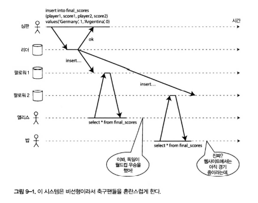
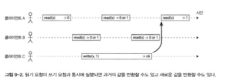
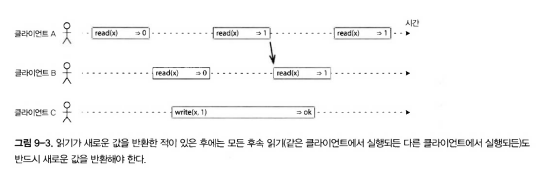
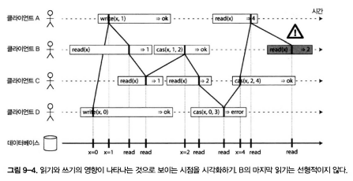
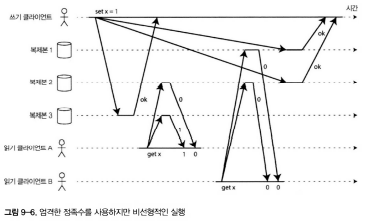
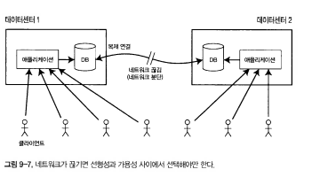
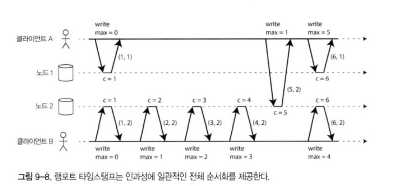
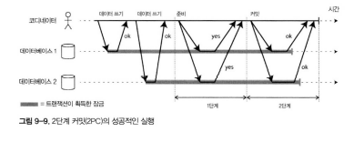

# 🔴 일관성과 합의

- **결함 허용(Tolerating Faults)**
    - 분산 시스템에서는 여러 가지 요소가 잘못될 수 있다.
    - 가장 단순한 해결책은 서비스 전체를 중단시키고 오류 메시지를 사용자에게 보여주는 것이다.
    - 그러나 실제 시스템은 일부 구성 요소가 실패하더라도 **전체 서비스가 계속 동작**해야 한다.
    - 이를 위해 시스템은 내부의 일부 결함을 ‘허용’하도록 설계되어야 한다.

- **내결함성(Fault Tolerance)의 목표**
    - 네트워크 오류, 패킷 손실, 순서 바뀜, 중복 전송, 임의의 지연 등 다양한 문제가 발생하더라도 최소한의 서비스 중단으로 시스템이 계속 작동하도록 하는 것.
    - 예: 노드가 멈추거나(가비지 컬렉션 등), 네트워크가 느려져도 전체 장애로 번지지 않게 설계.

- **합의의 개념**
    - 분산 시스템에서 가장 중요한 추상화 중 하나는 **합의(Consensus)** 이다.
    - 여러 노드가 동일한 결정을 내리도록 만드는 메커니즘.
    - 네트워크 결함이나 장애가 있더라도 합의는 신뢰성을 유지하는 핵심 요소이다.

- **합의의 활용 예시**
    - 리더 선출: 리더가 죽었을 때 새 리더를 정하기 위해 합의 사용.
    - 데이터 복제: 여러 노드가 동일한 데이터 상태를 유지하도록 보장.
    - 장애 복구: 특정 노드의 상태를 다른 노드와 일치시키는 과정.

- **합의의 어려움**
    - 노드가 서로 다른 시각에서 살아 있거나 죽었다고 판단할 수 있다.
    - 두 노드가 동시에 자신이 리더라고 생각하면 시스템이 분열됨(-> 스플릿 브레인, Split Brain).
    - 합의는 이런 문제를 방지하기 위한 핵심 수단이다.

## 🟠 일관성 보장

- **일관성 보장**
    - 복제된 데이터베이스에서는 여러 노드가 동시에 데이터를 쓰거나 읽을 수 있기 때문에, 데이터가 서로 다르게 보일 수 있는 **타이밍 문제**가 발생한다.
    - 이 문제를 해결하기 위해 데이터베이스는 다양한 **복제 모델**과 **일관성 보장 수준**을 제공한다.

- 최종적 일관성 (Eventual Consistency)
  - **정의**
      - 대부분의 복제 데이터베이스는 **최종적 일관성(eventual consistency)** 을 제공한다.
      - 즉, 일시적으로 데이터가 불일치할 수 있으나, 시간이 충분히 지나면 결국 모든 복제본이 동일한 상태가 된다.

  - **작동 방식**
      - 데이터가 복제되는 과정에서 지연이 발생하더라도, 시스템은 일정 시간이 지나면 **자동으로 수렴(converge)** 하도록 보장한다.
      - 사용자는 “언젠가 최종적으로 일관성이 맞춰진다”는 가정 하에 시스템을 이용하게 된다.

  - **한계**
      - “언제” 일관성이 회복될지 명시하지 않는다.
      - 복제 지연이 길거나 일부 노드가 장애 상태라면, 데이터가 오랫동안 불일치할 수 있다.
      - 예: 복제본 중 하나에서 오래된 데이터를 읽는 경우.

- 약한 보장과 강한 보장의 차이
  - **약한 보장 (Weak Guarantees)**
      - 최종적 일관성과 같은 약한 보장은 단일 장애에 강하지만, 일시적 불일치를 감수해야 한다.
      - 대부분의 애플리케이션은 이러한 비동기 복제를 사용한다.
      - 그러나 동시성이 높거나, 시간에 민감한 애플리케이션에서는 데이터 불일치로 인한 문제 발생 가능성이 있다.

  - **강한 보장 (Strong Guarantees)**
      - 강한 보장을 제공하는 시스템은 항상 **모든 복제본이 동일한 데이터를 보장**한다.
      - 하지만 그만큼 **성능 저하**가 발생하고, **가용성**이 떨어질 수 있다.
      - 따라서 시스템 설계 시 “성능 vs 일관성”의 균형을 고려해야 한다.

- 분산 일관성과 트랜잭션 격리 수준의 유사점
  - **트랜잭션 격리 수준과의 관계**
      - 분산 일관성 모델은 트랜잭션의 **격리 수준(isolation level)** 과 유사한 개념이다.
      - 트랜잭션 격리는 동시에 실행되는 연산 간의 경쟁 조건을 제어하는 방식이며,
        분산 일관성은 여러 복제본 간 데이터 상태를 일치시키는 방법이다.

  - **공통점**
      - 둘 다 “데이터 간 충돌과 불일치”를 제어하기 위한 규칙을 정의한다.
      - 복제본 간 결함이 있더라도 데이터가 **코디네이션을 통해 수렴하도록** 만드는 것이 핵심이다.

## 🟠 선형성

### 🟢 시스템에 선형성을 부여하는 것은 무엇인가?

- **선형성**
    - 선형성은 분산 데이터베이스의 복제본이 여러 개 존재하더라도, **모든 복제본이 하나의 데이터베이스처럼 동작하도록 보장**하는 강한 일관성 모델이다.
    - 즉, 모든 연산이 시간 순서에 따라 **하나의 전역 순서(global order)** 로 실행된 것처럼 보인다.

- **핵심 아이디어**  
  - 선형성을 부여한다는 것은 시스템이 데이터를 마치 **하나의 복사본만 존재하는 것처럼 보이게 만드는 것**이다.  
  - 즉, 모든 읽기와 쓰기 연산이 실제 시간 순서에 따라 한 지점에서 실행된 것처럼 보이게 한다.

- **레지스터(Register) 모델**  
  - 데이터베이스 내부에서 읽기(`read()`)와 쓰기(`write()`) 요청이 발생하며, 각 클라이언트는 요청을 보낸 시점과 응답을 받은 시점 사이의 시간 동안 시스템의 상태를 알 수 없다. 네트워크 지연으로 인해 요청 순서와 실제 처리 순서가 달라질 수 있다.

- **쓰기/읽기 순서 보장**
    - 모든 읽기 연산은 자신보다 먼저 완료된 쓰기 연산의 결과를 반드시 반영해야 한다.
    - 쓰기가 완료된 후 발생한 읽기는 최신 값을 반환해야 한다.
    - 이는 “데이터의 단일 복사본”처럼 보이게 하는 데 핵심적이다.

- **compare-and-set (CAS)**  
  - 클라이언트가 특정 시점의 값과 예상 값이 일치할 때만 새 값으로 변경하는 연산.  
  - 이 원자적 연산을 통해 선형성을 보장할 수 있다.

- **선형성 요구사항**
    - 모든 연산은 시간 순서대로 일관되게 실행되어야 하며  
      과거의 결과가 미래의 연산에 영향을 주되, 반대는 일어나지 않아야 한다.
    - 이는 “가장 최근 쓰기” 결과를 모든 읽기에서 반영하도록 만든다.

- 선형성 대 직렬성

  - **직렬성(Serializability)**
      - 여러 트랜잭션이 동시에 실행되더라도, 결과가 마치 **순차적으로 실행된 것처럼 보이는 성질**.
      - 트랜잭션 간 순서를 논리적으로만 보장하며, 실제 시간(real-time) 순서와는 무관하다.

  - **선형성(Linearizability)**
      - 모든 연산이 실제 시간 순서를 반영해야 한다.
      - “읽기 직전의 쓰기 결과를 읽는 것”을 보장한다.

  - **차이점 요약**

    | 구분 | 선형성 | 직렬성 |
      |------|----------|----------|
    | 기준 | 실제 시간(real-time) 순서 | 트랜잭션 논리 순서 |
    | 단위 | 개별 연산 (읽기/쓰기) | 트랜잭션 전체 |
    | 강도 | 더 강한 제약 | 상대적으로 약함 |
    | 보장 | 최신성 보장(recency) | 순서만 보장 |

### 🟢 선형성 기대기

- **선형성이 필요한 이유**  
  - 선형성은 결과가 뒤늦게 확인되더라도 **실질적인 손실을 막는 것이 중요하지 않은 경우**에는 굳이 필요하지 않다. 그러나 **시스템이 올바르게 동작해야 하는 영역**에서는 필수적이다.  
  - 예: 경기 점수 집계, 리더 선출, 금융 거래 등.

- 잠금과 리더 선출

  - **리더의 유일성 보장**  
    분산 시스템은 여러 개의 복제본이 존재하더라도 리더는 단 하나여야 한다.  
    여러 노드가 동시에 리더가 되는 상황(split brain)을 막기 위해 **잠금(lock)**을 사용한다.

  - **리더 선출 원리**
      - 모든 노드가 잠금을 시도하고, 성공한 노드가 리더가 된다.
      - 모든 노드는 “어느 노드가 잠금을 획득했는지”에 동의해야 한다.
      - 이 과정은 **선형성 보장**을 기반으로 해야 한다.

  - **구현 방식**
      - 아파치 **ZooKeeper**, **etcd** 등은 리더 선출을 위한 코디네이터로 사용된다.
      - 이러한 시스템들은 합의 알고리즘을 기반으로 하며,  
        리더가 유일하게 선택되도록 보장한다.
      - **Apache Curator**는 ZooKeeper를 쉽게 활용하기 위한 라이브러리로,  
        “리더십 잠금(leader lock)” 기능을 제공한다.

  - **대규모 시스템의 리더 선출**
      - Oracle RAC(Real Application Cluster) 같은 시스템은  
        디스크 기반 잠금으로 리더를 보장한다.
      - 여러 노드가 동일한 디스크를 공유하며, 잠금 파일 단위로 리더를 결정한다.
      - 트랜잭션 실행 경로에 직접 영향을 주므로 **전용 네트워크 연결**을 사용한다.

- 제약 조건과 유일성 보장

  - **유일성 제약의 필요성**  
    - 데이터베이스에서는 동일한 키나 이름이 중복 생성되면 안 된다.  
    - 예를 들어, 두 사용자가 동시에 같은 ID를 등록하려고 하면 한쪽만 성공해야 한다. 이 경우에도 **선형성 기반 제약 조건**이 필요하다.

  - **비유적 설명**  
    - 사용자가 서비스에 가입할 때, 선택한 사용자명이 이미 존재하면 가입은 실패해야 한다. 이 과정은 원자적 `compare-and-set` 연산을 통해 보장된다.

  - **금융 예시**  
    - 은행 계좌 잔고나 창고 재고 등에서도 동시에 여러 트랜잭션이 동일 자원에 접근할 수 없도록 해야 한다. 그렇지 않으면 중복 예약, 이중 지불 등의 오류가 발생한다.

  - **현실적 고려**  
    - 실제 애플리케이션에서는 일부 제약 조건은 **엄격하게 지켜지지 않아도 되는 경우**도 있다.  
    - 예: 항공권 좌석 초과 예약 시, 고객에게 다른 보상을 제공할 수 있음.  
    - 하지만 관계형 데이터베이스의 **고유성 제약(uniqueness constraint)** 은 일반적으로 선형성을 필요로 한다.

- 채널 간 타이밍 의존성

  - **문제 상황**  
    - 웹 서버와 파일 저장소 간의 통신 경로(채널)가 서로 다를 경우 메시지 도착 순서가 바뀌어 데이터 불일치가 생길 수 있다.  
    - 예: 사진 업로드 시 원본보다 썸네일이 먼저 표시되는 현상.

  - **원인**
      - 메시지 큐의 지연
      - 비동기 통신
      - 복제본 간의 업데이트 순서 불일치 이러한 경쟁 조건(race condition)은 선형성이 없는 시스템에서 자주 발생한다.

  - **예시 (그림 9-5)**
      1. 사용자가 웹 서버에 이미지를 업로드한다.
      2. 원본 이미지는 저장소에 기록된다.
      3. 동시에 메시지 큐를 통해 썸네일 생성 요청이 전송된다.
      4. 큐의 지연으로 썸네일이 원본보다 먼저 처리되면  
         “이전 버전의 이미지”가 보여질 수 있다.

  - **결과**
      - 썸네일 모듈이 과거 버전 이미지를 처리하여 최신 버전과 불일치가 발생한다.
      - 이는 사용자에게 잘못된 데이터를 보여주는 문제로 이어진다.

  - **해결 방법**
      - 작업 순서를 명확히 지정해 “원본 저장 -> 썸네일 생성”의 순서를 강제한다.
      - 각 단계 간의 시간 관계를 제어하여 **선형적 실행 흐름**을 보장한다.
      - 복수의 채널이 있는 경우, 타이밍 차이를 줄이는 동기화 전략을 적용한다.

### 🟢 선형성 시스템 구현하기

- **선형성 시스템 구현하기**
    - 선형성(linearizability)은 "데이터 복사본이 하나만 있는 것처럼 동작하는 시스템"을 의미함.
    - 모든 연산은 원자적으로 실행되어, 하나의 복사본에 순차적으로 적용되는 것처럼 보임.
    - 단일 복사본만 사용하는 것은 단순하지만 장애 발생 시 복구 불가 -> 복제 필요.
  - 단일 리더 복제 (선형성 가능)
    - **특징**
        - 리더가 쓰기를 담당하고, 팔로워는 복제만 수행.
        - 읽기는 리더에서 수행해야 선형성 보장.
    - **장점**
        - 단순하고 구현 용이.
    - **단점**
        - 리더 장애 시 새로운 리더 선출 필요 -> 일시적 비가용성 발생.
        - 비동기 복제 시 장애 시점에 따라 데이터 손실 위험 존재.

  - 합의 알고리즘 (선형성)
    - **개념**
        - 여러 노드가 동일한 순서로 이벤트를 처리하도록 합의(consensus)를 수행.
    - **대표 알고리즘**
        - Raft, Paxos, ZAB 등.
    - **특징**
        - 단일 리더 복제와 유사하지만, 리더 선출 및 상태 합의를 명시적으로 관리.
        - 고가용성과 데이터 일관성을 함께 확보 가능.
  - 다중 리더 복제 (비선형적)
    - **특징**
        - 여러 노드가 동시에 쓰기를 수행할 수 있음.
        - 쓰기 충돌(conflict) 발생 시 해결 메커니즘 필요.
    - **결과**
        - 일반적으로 선형성이 깨짐.
        - 최종 일관성(eventual consistency)에 가까운 모델.

  - 리더 없는 복제 (비선형적)
    - **개념**
        - 모든 노드가 동등하며, 다수의 노드가 동시에 쓰기,읽기 처리 가능.
    - **예시**
        - Dynamo 스타일 시스템 (예: Cassandra, Riak 등).
    - **특징**
        - 쓰기 요청은 여러 노드에 복제되고, 읽기 시 다수결로 결과 결정.
        - 정족수(quorum) 기반의 읽기/쓰기 조건을 조정하여 일관성,가용성 트레이드오프 조정.

- 선형성과 정족수(Quorum)
  - **정족수 조건**
      - 읽기 정족수 (r), 쓰기 정족수 (w), 전체 복제본 수 (n)
      - 선형성 유지 조건: (r + w > n)
      - 예: ( n=3, w=2, r=2 ) -> 일부 상황에서 비선형성 발생 가능
  - **문제점**
      - 동시에 요청이 들어올 경우, 서로 다른 노드가 서로 다른 값을 반환 가능.
      - 선형성을 완벽히 보장하려면 모든 쓰기 연산이 읽기보다 먼저 완료되어야 함.

### 🟢 선형성의 비용

- 선형성의 비용
  - **복제 방법의 차이**
      - 단일 리더 복제: 비교적 높은 선형성 보장, 낮은 지연시간.
      - 다중 리더 복제: 성능 향상 가능하지만 선형성 약화.
  - **예시**
      - 다중 데이터센터 환경에서 다중 리더 복제는 높은 가용성 확보.
      - 하지만 네트워크 분할 시 데이터 불일치 발생 가능.

- CAP 정리
  - **정의**
      - **C (Consistency)**: 모든 노드가 동일한 데이터를 즉시 보유.
      - **A (Availability)**: 모든 요청에 대한 응답이 가능.
      - **P (Partition tolerance)**: 네트워크 분할 시에도 시스템이 동작.
  - **핵심 요지**
      - 세 가지 중 **두 가지**는 동시에 보장 가능하나 **세 가지 모두는 불가능**.
      - 네트워크 분할 시 **선형성(C)** 과 **가용성(A)** 사이의 선택이 필요.
- 도움이 안 되는 CAP 오해
  - CAP는 현실적으로 단순한 “세 가지 중 둘 선택” 문제가 아님.
  - 대부분의 분산 시스템은 특정 상황에서 세 속성의 균형을 선택적으로 달성.
  - CAP보다는 **지연, 장애 복구, 일관성 수준 조절** 같은 구체적 메커니즘이 더 중요.

- 선형성과 네트워크 지연
  - **현실적 한계**
      - 네트워크 지연과 CPU, 메모리 구조는 절대 0이 될 수 없음.
      - 최신 CPU에서도 코어 간, 캐시 간 통신에는 물리적 지연 존재.
  - **결과**
      - 메모리 복사본이 늘어나면 선형성이 손상됨.
      - 선형성은 자연스러운 물리적 한계와 관련된 문제.

- 선형성과 성능 트레이드오프
  - **요약**
      - 완전한 선형성을 보장할수록 성능 저하 및 지연 증가.
      - 현실의 분산 시스템은 대부분 **부분적 선형성(partial linearizability)** 을 채택.
  - **이유**
      - 네트워크 지연, 장애 복구, 동기화 비용이 모두 커지기 때문.
      - 실제로 CAP 이론은 ‘선형성보다는 가용성’이 더 실용적임을 보여줌.

## 🟠 순서화 보장
- **순서화 보장**
    - 선형성(linearizability)은 데이터 복사본이 하나만 있는 것처럼 동작해 모든 연산이 특정 순서대로 실행되는 것처럼 보이게 하는 개념.
    - **순서화(ordering)** 는 이러한 선형성의 기반이 되는 핵심 속성으로, 연산의 실행 순서를 일관되게 유지함.

### 🟢 순서화와 인과성

- **인과성(Causality)**
    - 한 이벤트가 다른 이벤트의 원인이 되는 관계를 의미.
    - 예: A가 메시지를 보내고, B가 그 메시지를 읽고 응답 -> A -> B -> C 의 순서가 인과적 관계를 형성.
- **인과적 의존성(Causal Dependency)**
    - 어떤 연산이 이전 연산의 결과에 의존하는 관계.
    - 인과적 순서를 보존하면 시스템이 의미 있는 상태로 진화할 수 있음.
- **인과적 일관성(Causal Consistency)**
    - 인과관계가 있는 연산은 항상 같은 순서로 관찰되도록 보장.
    - 독립적인 연산은 병렬적으로 실행 가능.

- 인과적 순서가 전체 순서는 아니다
  - **전체 순서(Total Order)**
      - 모든 연산이 하나의 전역적 순서로 정렬되어 있음.
      - 모든 노드가 동일한 순서를 관찰해야 함 (선형성 시스템의 특성).
  - **인과적 순서(Causal Order)**
      - 인과 관계가 있는 연산만 순서를 유지.
      - 독립된 연산은 순서 없이 동시에 실행될 수 있음.
  - **부분 순서(Partial Order)**
      - 전체 순서의 하위 개념. 인과적 관계만 정렬되고, 나머지는 동시에 처리 가능.

- 선형성은 인과적 일관성보다 강하다
  - **관계**
      - 선형성은 인과적 일관성을 내포한다. -> 모든 선형성 시스템은 인과성을 보장하지만, 그 반대는 아님.
  - **차이점**
      - 인과성은 원인-결과 관계만 일관되게 유지.
      - 선형성은 전역적 순서까지 완전히 보장.
  - **트레이드오프**
      - 선형성은 성능 비용이 크고 가용성에 불리.
      - 인과적 일관성은 효율적이고 실용적이나 완전한 순서는 보장하지 않음.

- 인과적 일관성 담기 (Capturing Causal Consistency)
  - **핵심 아이디어**
      - 비선형적(비동기) 시스템에서도 인과적 일관성을 유지해야 함.
      - 이를 위해 각 연산이 **“어떤 연산 후에 실행되었는지”** 추적해야 함.
  - **실행 순서 보장**
      - 인과적 순서를 유지하려면, 모든 연산의 선행 관계를 명확히 알아야 함.
      - 이를 위해 **타임스탬프(timestamp)** 또는 **버전 벡터(version vector)** 사용.
  - **버전 벡터(Version Vector)**
      - 데이터의 인과적 의존성을 추적하기 위한 구조.
      - 각 노드가 자신이 알고 있는 다른 노드의 상태(버전)를 함께 저장.
  - **예시**
      - 트랜잭션이 읽은 데이터 버전을 기록하고, 그 버전을 기반으로 새로운 쓰기 수행.
      - SSI(Serializable Snapshot Isolation)에서도 동일한 개념이 등장.

### 🟢 일련번호 순서화

- **일련번호 순서화**
    - 인과성은 이론적으로 중요하지만, 모든 인과적 의존성을 실제로 추적하는 것은 비현실적.
    - 대부분의 애플리케이션은 인과적 순서 대신 **일련번호(sequence number)** 로 단순한 순서를 부여함.
    - 각 연산에 증가하는 번호를 붙여 순서를 정함으로써 일관성을 확보.

- **단점**
    - 인과적 의존성은 명확하지 않음.
    - 단순히 번호 순서에 따라 동작하기 때문에 논리적 인과 관계를 반영하지 못할 수 있음.

- **일반적 접근**
    - **일벽번호 타임스탬프(logical timestamp)** 를 사용하여 이벤트의 순서를 추정.
    - 논리적 시계(logical clock)를 사용하면 실제 시각과 무관하게 순서를 정할 수 있음.

- 비인과적 일련번호 생성기 (Non-Causal Sequence Generators)
  - **문제**
      - 단일 리더가 없거나 다중 리더, 또는 리더 없는 데이터베이스에서 일련번호 생성이 어려움.
      - 여러 노드가 동시에 증가시키면 순서 충돌 발생 가능.

  - **해결책**
      - 노드별 고유 ID 또는 노드 범위(range)를 부여해 번호 충돌을 방지.
      - “대략적으로 증가하는(approximately increasing)” 일련번호를 생성하는 방식 활용.
      - 완벽한 전역 순서는 아니지만, 실질적으로 인과성과 일관성이 크게 깨지지 않음.

  - **예시**
      - 노드가 독립적으로 일련번호를 생성하되, 타임스탬프를 일부 포함시켜 시간적 순서를 유추.
      - 노드 간 동기화 불일치로 순서가 완전히 보장되지는 않지만, 대부분의 경우 충분히 일관적.

- 램포트 타임스탬프 (Lamport Timestamp)

  - **램포트 타임스탬프**
      - **Leslie Lamport**가 제안한 논리적 타임스탬프 시스템.
      - 분산 시스템에서 이벤트의 순서를 정하기 위한 간단하면서도 실용적인 방법.
      - 각 노드마다 카운터(counter)를 유지하고, 이벤트 발생 시 카운터를 증가시킴.

  - **작동 원리**
      - 메시지 전송 시 자신의 카운터 값을 함께 전달.
      - 메시지를 받은 노드는 자신의 카운터를 `max(자신, 받은 값) + 1`로 설정.
      - 이를 통해 시스템 전체의 이벤트 순서를 부분적으로 정렬 가능.

  - **특징**
      - 모든 연산에 대해 **인과적 순서(causal order)** 는 보장.
      - 하지만 실제 시각과 일치하지 않으며, **전체 순서(total order)** 는 제공하지 않음.

  - **장점**
      - 구현이 단순하고, 동기화 없이 인과 관계를 유지 가능.
  - **단점**
      - 노드 간 병렬 연산(동시성)은 구분 불가.
      - 전역적 동기화를 보장하지 않음.

- 타임스탬프 순서화는 충분하지 않다
  - **문제**
      - 타임스탬프만으로는 전역적 전체 순서를 완벽히 정의할 수 없음.
      - 분산 환경에서는 네트워크 지연, 노드 장애 등으로 인해 이벤트 순서가 뒤바뀔 수 있음.
  - **예시**
      - 사용자 계정 생성/로그인과 같은 시나리오에서는 두 연산의 순서가 중요하지만,
        단순 타임스탬프만으로는 어느 쪽이 먼저인지 명확히 결정 불가.

  - **추가 필요 조건**
      - 모든 노드가 **전역적 합의(global agreement)** 에 도달해야 함.
      - 이를 위해 합의 알고리즘(Consensus Algorithm) 또는 **전역 순서 브로드캐스트(Total Order Broadcast)** 가 필요.

  - **결론**
      - 타임스탬프는 연산의 대략적 순서를 제공하지만,  
        **전체 순서화(total ordering)** 를 위해서는 추가적인 동기화 및 합의 과정이 필요하다.
      - 다음 장에서는 이를 해결하는 개념으로 **전역 순서 브로드캐스트** 를 다룸.

### 🟢 전체 순서 브로드캐스트

- **전체 순서 브로드캐스트**
    - 단일 CPU에서는 연산의 전체 순서를 정의하기 쉽지만, 분산 시스템에서는 모든 노드가 동일한 순서를 동의하도록 만드는 것이 어렵다.
    - **전체 순서 브로드캐스트(total order broadcast)** 는 모든 노드가 동일한 순서로 메시지를 수신하도록 보장하는 프로토콜.
    - 일부 문헌에서는 **원자적 브로드캐스트(atomic broadcast)** 라고도 부름.

- **필요성**
    - 여러 노드가 동시에 쓰기를 수행할 경우, 동일한 데이터 복제본 간 순서 불일치 발생 가능.
    - 이러한 충돌을 방지하기 위해 전역적 메시지 순서 합의가 필요.

- 순서화 보장의 범위
  - **단일 리더 시스템**
      - 리더 노드가 쓰기 순서를 결정하고 팔로워가 동일한 순서로 복제함.
      - 다중 리더나 리더 없는 시스템에서는 전체 순서를 위해 별도 조정(coordination)이 필요.
  - **분산 환경의 문제**
      - 네트워크 지연, 장애 등으로 인해 순서 불일치 발생 가능.
      - 모든 노드가 동일한 순서로 메시지를 처리해야 일관성 유지.
- 전체 순서 브로드캐스트의 속성
  - **신뢰성 있는 전송 (Reliable Delivery)**
      - 어떤 노드가 메시지를 받으면, 모든 노드도 반드시 그 메시지를 받는다.
  - **전체 순서가 정해짐 (Totally Ordered Delivery)**
      - 모든 노드가 메시지를 동일한 순서로 처리한다.

- 전체 순서 브로드캐스트 사용하기
  - **주요 활용**
      - 데이터베이스 복제 및 트랜잭션 로그 정렬에 사용.
      - 모든 메시지가 동일한 순서로 적용되어야 하는 상태 복제 시스템(State Machine Replication)에서 필수적.
  - **구현 방식**
      - 메시지를 브로드캐스트하면 모든 노드가 동일한 순서로 수신 및 적용.
      - 장애가 발생하더라도 순서 유지 및 복구 가능.
  - **예시**
      - ZooKeeper, etcd, Raft, Paxos 등은 내부적으로 전체 순서 브로드캐스트를 구현함.

- 전체 순서 브로드캐스트로 선형성 저장소 구현하기
  - **개념**
      - 선형성(linearizability)은 전체 순서 브로드캐스트를 기반으로 구현 가능.
      - 모든 쓰기 연산은 동일한 순서로 적용되어야 하며, 읽기 연산은 최신 값을 반환해야 함.
  - **compare-and-set 예시**
      - 전체 순서 브로드캐스트를 통해 `compare-and-set` 요청을 순서대로 전송하면 선형성 보장 가능.
      - 모든 노드는 동일한 순서로 명령을 실행하고 결과를 공유.
  - **비동기 특성**
      - 브로드캐스트는 비동기적이지만, 각 메시지는 고정된 순서로 전송됨.
      - 장애 시에도 메시지 재전송으로 일관성 유지.

- 전체 순서 브로드캐스트와 선형성 저장소의 관계
  - **핵심 관계**
      - 전체 순서 브로드캐스트 = 합의(consensus)와 동등한 개념.
      - 모든 노드가 동일한 순서로 메시지를 처리한다면, 그것은 합의를 달성한 것과 같다.
  - **선형성 보장 방식**
      - 로그 기반으로 `increment-and-get` 또는 `compare-and-set` 연산을 사용하여 순차적으로 명령을 실행.
      - 각 노드가 동일한 로그를 유지하므로 시스템은 선형적으로 동작.
  - **차이점**
      - 램포트 타임스탬프는 순서를 추론하는 반면, 전체 순서 브로드캐스트는 실제 순서를 **합의(consensus)** 를 통해 결정.

- 선형성 저장소를 위한 전체 순서 브로드캐스트 구현 방법
  1. **요청 수신**
      - 사용자의 쓰기 요청이 들어오면 브로드캐스트 큐에 추가.
  2. **순서 합의**
      - 합의 알고리즘(Raft/Paxos 등)을 통해 모든 노드가 동일한 순서에 합의.
  3. **명령 실행**
      - 각 노드는 합의된 순서대로 명령을 적용.
  4. **결과 반환**
      - 모든 노드가 동일한 결과를 반환하여 선형성 유지.

## 🟠 분산 트랜잭션과 합의

- **분산 트랜잭션과 합의**
    - 합의(Consensus)는 여러 노드가 동일한 결정을 내리도록 하는 분산 시스템의 핵심 문제.
    - 단순히 “여러 노드의 동의”처럼 보이지만, 비동기 환경에서는 네트워크 지연과 장애로 인해 매우 어려움.
    - 분산 시스템에서의 일관성, 트랜잭션, 리더 선출 등 모든 핵심 문제의 기초가 됨.

- 리더 선출 (Leader Election)
  - **정의**
      - 다중 노드 중 하나를 대표로 선택하여 결정을 위임하는 과정.
  - **중요성**
      - 복제 데이터베이스에서 한 리더가 결정한 순서에 모든 팔로워가 동의해야 데이터 불일치 방지.
  - **문제점**
      - 리더 충돌이나 선출 실패 시 시스템 전체가 불안정해질 수 있음.

- 원자적 커밋 (Atomic Commit)
  - **목적**
      - 여러 노드에 걸친 트랜잭션을 **전부 성공**하거나 **전부 실패**하게 하는 것.
  - **2단계 커밋(2PC, Two-Phase Commit)**
      - 가장 단순하고 널리 사용되는 원자적 커밋 프로토콜.
      - 모든 노드가 일관된 상태를 유지할 수 있도록 “합의된 커밋” 절차를 제공.
- 합의 불가능성 (Impossibility of Consensus)
  - **FLP 불가능성 정리(Fischer–Lynch–Paterson, 1985)**
      - 비동기 네트워크 환경에서는 **단 하나의 장애만으로도 합의 불가능**.
      - 즉, 네트워크 지연,장애,노드 실패 중 하나라도 발생하면 모든 노드가 동의된 결정을 내릴 수 없음.
  - **의미**
      - 완벽한 합의는 불가능하지만, 현실적 시스템은 타임아웃,재시도 등으로 “거의 합의”에 근접하도록 설계.
  - **결론**
      - 합의는 이론적으로 어렵지만 실용적으로는 구현 가능한 근사치가 존재함.

### 🟢 원자적 커밋과 2단계 커밋(2PC)
- **1단계: 준비(Prepare)**
    - 코디네이터가 모든 참여자에게 트랜잭션 실행 가능 여부를 물음.
- **2단계: 커밋(Commit)**
    - 모든 노드가 ‘YES’로 응답하면 커밋 실행, 하나라도 ‘NO’면 전체 트랜잭션 롤백.
- **특징**
    - 간단하고 직관적, 단일 코디네이터 중심.
    - 하지만 네트워크 장애 발생 시 “대기 상태(in-doubt)”로 인해 시스템이 정지할 수 있음.

- 단일 노드에서 분산 원자적 커밋
  - **로컬 DB의 경우**
      - 단일 노드 트랜잭션은 로그와 체크포인트를 이용해 안전하게 복구 가능.
  - **분산 환경의 경우**
      - 여러 노드가 동시에 트랜잭션을 수행하므로 하나의 노드 실패로 전체 불일치 위험.
  - **핵심**
      - 분산 커밋에서는 각 노드의 “부분 성공”을 허용하지 않음 -> 모든 노드가 동의해야만 커밋.

- 2PC의 한계와 보상 트랜잭션
  - **한계**
      - 코디네이터 장애 시 참여자들은 결과를 알 수 없음 (중단 상태).
      - 일부 노드가 커밋, 일부가 롤백될 수 있어 불일치 발생.
  - **보상 트랜잭션 (Compensating Transaction)**
      - 실패한 트랜잭션의 효과를 되돌리는 별도의 연산.
      - 예: 항공권 예약 취소 -> 호텔 예약도 자동 취소.
  - **의미**
      - 엄격한 원자성 대신, “결국 일관성(Eventual Consistency)”으로 수렴하도록 하는 실용적 접근.

- 약속(Promise) 기반 시스템
  - **핵심 아이디어**
      - 참여 노드는 커밋 여부를 미리 “약속(promise)”하며 코디네이터의 지시에 따름.
  - **절차**
      1. 코디네이터는 각 노드에 “준비 요청(prepare)”을 보냄.
      2. 노드는 커밋 가능 여부를 평가 후 약속을 반환.
      3. 코디네이터는 모든 노드의 약속을 수집 후 최종 결정.
      4. 모든 노드에 결과를 브로드캐스트.
  - **비유**
      - 결혼식에서 “네(YES)”라고 말하기 전까지는 결혼이 성립되지 않는 것과 동일.

- 코디네이터 장애 (Coordinator Failure)
  - **문제**
      - 코디네이터가 장애로 중단되면 참여 노드는 커밋 여부를 알 수 없음.
      - 준비(prepare) 후 응답을 받지 못한 참여자는 “불확실 상태(in doubt)”로 남음.
  - **결과**
      - 일부 노드는 커밋, 일부는 롤백 -> 데이터 불일치 발생 가능.
  - **해결**
      - 타임아웃 후 코디네이터 복구 시 로그를 통해 트랜잭션 상태 복원.
      - 하지만 완전한 자동 복구는 보장되지 않음.

- 3단계 커밋 (3PC, Three-Phase Commit)
  - **등장 배경**
      - 2PC의 불확실성 문제 해결을 위해 제안됨.
  - **특징**
      - 코디네이터의 장애로도 트랜잭션이 중단되지 않도록 3단계 절차 도입.
  - **단계**
      1. **CanCommit** – 커밋 가능 여부 확인
      2. **PreCommit** – 커밋 준비 완료 표시
      3. **DoCommit** – 실제 커밋 실행
  - **장점**
      - 비동기 환경에서도 블로킹 없이 동작 가능.
      - 장애 복구 시 상태 일관성 유지.
  - **단점**
      - 프로토콜 복잡성 증가, 구현 비용 큼.
  - **결론**
      - 3PC는 이론적으로 완벽하지만, 실제 시스템에서는 대부분 2PC를 사용.

### 🟢 현실의 분산 트랜잭션
- **현실의 분산 트랜잭션**
    - 분산 트랜잭션은 여러 노드에 걸쳐 원자적 커밋을 수행하는 메커니즘.
    - 특히 2단계 커밋(2PC)을 사용하는 분산 트랜잭션은 일관성을 제공하지만 **성능 저하와 복잡성**을 유발.
    - 대부분의 현대 분산 시스템은 성능상의 이유로 완전한 분산 트랜잭션을 피함.

- 분산 트랜잭션의 구현 방식
  1. **데이터베이스 내부 트랜잭션**
      - 동일한 데이터베이스 인스턴스 내에서만 작동.
      - 파티션 간 트랜잭션은 지원하지 않음.
      - 단일 노드 내에서는 빠르고 안전하지만, 다중 노드 간에는 적용 불가.

  2. **이중 분산 트랜잭션**
      - 서로 다른 시스템(예: 메시지 브로커 + 데이터베이스)을 묶어 하나의 트랜잭션으로 처리.
      - 2PC를 기반으로 하지만, 각 시스템의 지연과 장애로 인해 매우 비효율적.
      - 네트워크 왕복 비용이 크기 때문에 실제 서비스에서는 거의 사용되지 않음.

- 정확히 한 번 메시지 처리 (Exactly Once Processing)
  - **문제**
      - 분산 환경에서는 메시지 전송과 데이터베이스 쓰기가 분리되어 중복 실행 위험이 있음.
  - **해결 방법**
      - 메시지 전송과 DB 트랜잭션을 하나로 묶어 원자적으로 처리.
      - 실패 시 롤백하여 중복 실행 방지.
  - **한계**
      - 메시지 브로커와 DB 간의 트랜잭션 통합이 어려움.
      - “실질적으로 한 번만(exactly once)” 처리 보장은 가능하지만 완벽한 보장은 어려움.

- XA 트랜잭션 (X/Open XA)
  - **정의**
      - X/Open(eXteneded Architecture)에서 제정한 분산 트랜잭션 표준 인터페이스.
      - 다양한 DBMS와 메시지 브로커 간 트랜잭션을 연결할 수 있도록 API를 정의.
  - **특징**
      - XA 인터페이스는 `prepare`, `commit`, `rollback` 단계를 통해 트랜잭션을 조정.
      - 표준화되어 있지만 구현 복잡도가 높고, 성능이 저하됨.
  - **지원 예시**
      - Oracle, DB2, SQL Server, PostgreSQL, MQ Series 등에서 지원.
  - **구성 요소**
      - **트랜잭션 관리자(TM)**: 전체 트랜잭션 제어.
      - **리소스 관리자(RM)**: 실제 데이터 조작 담당.
      - **애플리케이션**: 트랜잭션 수행 요청.
- XA 트랜잭션의 한계
  - **코디네이터 중심 구조**
      - 코디네이터가 단일 장애점(SPOF, Single Point of Failure).
  - **잠금 유지 문제**
      - 코디네이터 장애 시 참여 노드가 “의심스러운 상태(in doubt)”로 남아 잠금이 해제되지 않음.
  - **성능 저하**
      - 네트워크 왕복 비용이 크며, 지연 시간 증가.
  - **복구 어려움**
      - 코디네이터 장애 시 수동 복구 필요.
  - **결과**
      - 실무에서는 XA를 거의 사용하지 않으며, 대신 “최종 일관성(Eventual Consistency)” 접근 사용.

- 의심스러운 상태와 잠금 유지 문제
  - **상황**
      - 코디네이터가 응답하지 않아 노드가 커밋/롤백 여부를 결정하지 못함.
      - 데이터베이스는 잠금(lock)을 유지한 채 대기 상태에 빠짐.
  - **결과**
      - 리소스 고갈, 교착 상태(deadlock), 시스템 지연 발생.
  - **원인**
      - 2단계 커밋(2PC)의 설계상 특성으로, 명확한 종료 시점을 보장하지 못함.
  - **해결**
      - 타임아웃 후 수동 롤백 또는 관리자가 직접 개입.

- 코디네이터 장애에서의 복구
  - **복구 절차**
      - 코디네이터는 로그를 이용해 트랜잭션 상태를 복구.
      - 그러나 장애 시점이 애매하면 일부 트랜잭션은 고아(Orphan) 상태로 남음.
  - **문제**
      - 고아 트랜잭션은 자동 복구가 어려워, 데이터 불일치 및 잠금 문제 유발.
  - **결과**
      - 코디네이터의 복구 속도에 따라 전체 시스템의 안정성이 좌우됨.

- 분산 트랜잭션의 제약 (Limitations)

| 문제 | 설명 |
|------|------|
| **성능 저하** | 네트워크 왕복, 로그 기록, 잠금 유지로 인해 지연 발생 |
| **단일 장애점** | 코디네이터 장애 시 전체 트랜잭션 중단 |
| **복잡한 복구 절차** | 로그 기반 복구 필요, 자동화 어려움 |
| **리소스 경합** | 장기 잠금으로 인한 리소스 고갈 |
| **현실적 대안 필요** | 보상 트랜잭션 또는 이벤트 기반 모델로 대체 필요 |

- 현실적 대안으로 최종 일관성 (Eventual Consistency)
  - **핵심 아이디어**
      - 완벽한 동기 일관성 대신, 시간이 지나면 모든 노드가 일관된 상태로 수렴하도록 설계.
  - **적용 예시**
      - 메시지 큐 기반 이벤트 소싱(Event Sourcing)
      - 사가 패턴(Saga Pattern)
      - 보상 트랜잭션(Compensating Transaction)
  - **장점**
      - 높은 가용성과 성능 확보.
      - 장애에도 시스템 전체 중단 없이 복구 가능.

### 🟢 내결함성을 지닌 합의

- **내결함성을 지닌 합의**  
  - 합의(Consensus)는 여러 노드가 특정 값이나 결정에 **동의해야 하는 과정**.  
  - 예를 들어 여러 사람이 동시에 항공기 좌석을 예약할 때, 중복되지 않도록 한 명만 좌석을 확정하는 문제와 유사하다.

- **핵심 문제**  
  - 어떤 노드가 값을 제안하고, 다른 노드들이 그 제안에 **동의(accept)** 할지 **결정(decide)** 하는 과정.  
  - 합의 알고리즘은 다음의 네 가지 속성을 만족해야 함:
    1. **균일한 동의(Agreement)** – 두 노드가 서로 다른 결정을 내리지 않는다.
    2. **무결성(Integrity)** – 동일한 노드가 두 번 결정하지 않는다.
    3. **유효성(Validity)** – 제안된 값만 결정된다.
    4. **종료(Termination)** – 모든 올바른 노드는 결국 결정을 내린다.

- 합의의 본질: 다수결과 내결함성
  - 합의의 핵심은 “다수 노드가 동일한 결과를 내는 것”.
  - 내결함성(Fault Tolerance)은 일부 노드가 장애나 네트워크 단절로 실패해도 **정상 노드들이 합의에 도달할 수 있음**을 의미.
  - 일반적으로 합의 알고리즘은 “과반수(Majority)” 응답만으로도 결정을 내림.
  - 과반 이상이 응답하면 시스템은 나머지 장애 노드가 복구되어도 동일한 결정을 공유하게 됨.

- 합의 알고리즘의 동작 방식

  - 합의 알고리즘은 장애나 지연이 있어도 시스템이 멈추지 않고 동작하도록 보장한다.

| 속성 | 의미 |
|------|------|
| **균일한 동의** | 두 노드는 서로 다른 결정을 내리지 않음 |
| **무결성** | 노드가 두 번 결정하지 않음 |
| **유효성** | 유효한 제안만 승인 |
| **종료성** | 결국 결정을 내림 |

- 합의 시스템은 “과반수 참여”를 통해 결정을 내린다.
  - 노드 일부가 네트워크에서 분리되어도 과반수가 유지되면 시스템은 정상 동작 가능.

- 합의 알고리즘과 전체 순서 브로드캐스트
  - **대표적인 합의 알고리즘**
      - **Viewstamped Replication (VSR)**
      - **Paxos**
      - **Raft**
      - **Zab (Zookeeper Atomic Broadcast)**
  - 이들은 모두 “내결함성을 지닌 합의”를 구현하며, 메시지를 동일한 순서로 전달하기 때문에 **전체 순서 브로드캐스트(Total Order Broadcast)** 와 동일한 성질을 가짐.
  - 즉, 전체 순서 브로드캐스트 = 합의 알고리즘 + 순서 보장. -> 모든 노드가 동일한 순서로 메시지를 처리한다.
  - Paxos나 Raft는 합의 과정을 반복하여 여러 메시지를 처리할 수 있도록 개선됨 (Multi-Paxos 구조).

- 단일 리더 복제와 합의
  - **리더 기반 합의**
      - 하나의 리더가 명령 순서를 결정하고, 팔로워가 이를 복제.
      - 모든 쓰기 요청은 리더를 통해서만 처리됨.
      - 리더 장애 시 새로운 리더 선출 과정 발생 (리더 교체 = 합의 과정).
  - **장점**
      - 구현 단순, 빠른 결정 가능.
  - **단점**
      - 리더 장애 시 선출 시간 동안 쓰기 불가.
      - 네트워크 분리 시 스플릿 브레인(Split Brain) 위험.

- 에포크 번호 붙이기와 정족수
  - **리더 교체 문제 해결**
      - 리더 교체 시 각 노드는 “에포크 번호(epoch)”를 증가시켜 새로운 임기를 구분.
      - Paxos -> 투표 번호(ballot number)  
        Viewstamped Replication -> 뷰 번호(view number)  
        Raft -> 임기 번호(term number)
  - **역할**
      - 에포크 번호가 높을수록 최신 리더임을 보장.
      - 이전 리더의 명령은 무시되고 새로운 리더의 결정만 유효.
  - **원리**
      - 과반수 노드가 동일한 에포크를 공유하면 합의가 확정된다.

- 정족수 투표와 리더 선출 과정
  1. 리더가 죽었다고 판단 -> 모든 노드가 새로운 리더를 제안.
  2. 각 노드는 자신이 제안한 에포크 번호를 포함해 투표 요청 전송.
  3. 과반수 이상의 노드가 가장 높은 번호를 승인하면 새 리더로 선출.
  4. 리더가 결정되면 그 이후의 모든 합의는 해당 리더를 통해 진행.

- 합의의 제약과 한계
  - **분산 시스템의 근본적 제약**
      - 합의 알고리즘은 완벽한 안정성을 제공하지만, 다음 문제들을 동반함:
          - 동기화 비용 상승
          - 네트워크 지연의 영향
          - 과반수 불참 시 시스템 중단
  - **현실적 문제**
      - 실제 시스템에서는 노드 참여가 가변적이고, 장애 복구가 동적으로 이루어짐.
      - 따라서 “정적 구성”만으로는 충분하지 않음.
      - 해결책으로 **동적 멤버십(Dynamic Membership)** 이 도입되어 노드 추가/삭제 시에도 합의 가능하게 함.
- 합의와 네트워크 분리
  - **문제**
      - 네트워크가 분리되면 각 파티션은 서로 독립적으로 리더를 선출할 수 있음 -> 스플릿 브레인 발생.
  - **해결**
      - 과반수를 확보한 파티션만 유효한 리더로 인정.
      - 소수 파티션은 읽기 전용(read-only) 상태로 제한.
  - **미해결 이슈**
      - 완전히 신뢰할 수 없는 네트워크 환경에서 완전한 합의는 여전히 미해결 문제로 남아 있음.

### 🟢 멤버십과 코디네이션 서비스
- **멤버십과 코디네이션 서비스**
    - ZooKeeper, etcd는 “분산 키-값 저장소”이자 **코디네이션/설정 서비스**.
    - DB처럼 보이지만 목적은 **합의 기반으로 상태 조율(리더 선출, 잠금, 구성 관리)**.
    - 많은 분산 프레임워크(HBase, Hadoop YARN, OpenStack Nova 등)가 **백엔드 조율 계층으로 의존**.
  - 선형성 원자적 연산
    - **compare-and-set(CAS)** 로 분산 환경에서도 **원자적 갱신** 보장.
    - 여러 노드가 동시에 갱신하려 해도 **단 한 노드만 성공**(경쟁 방지).
    - 일정 시간만 유효한 **임차권(lease)** 으로 자원 접근을 제어 -> 과도한 장기 락 방지.
  - 연산의 전체 순서화
    - 모든 갱신을 **전역적으로 동일한 순서**로 적용.
    - 각 연산에 **zxid/버전(version)** 부여 -> 재전송/중복 상황에서도 순서 일관성 유지.
    - 네트워크 지연/재시도에도 “한 번 정한 순서”를 전체 노드가 공유.
  - 장애 감지
    - 클라이언트는 **하트비트(heartbeat)** 로 세션 활성 유지.
    - 세션 끊기면 자동 정리되는 **임시 노드(ephemeral node)** 로 존재 여부를 표현.
    - 세션 만료 시 임시 노드가 사라져 **자동 잠금 해제/리더 포기** 효과.
  - 변경 알림
    - 노드/데이터 변경 시 **Watcher 이벤트**로 즉시 통지.
    - 폴링 없이 상태 변화를 비동기 구독 -> 설정 변경,리더 교체 등 시스템 반응성 향상.
- 작업을 노드에 할당하기
  - 하나의 리더/스케줄러가 **여러 작업 노드 중 대상 선택** 및 **장애 시 재배치** 수행.
  - 데이터베이스 외에도 메시지 스트림/파일 저장소/액터 시스템 등 **여러 리소스의 소유권 이동**을 조율.
  - 새 노드가 합류,이탈할 때 **작업 재분산**으로 가용성 유지(예: YARN/Mesos가 ZooKeeper를 통해 수행).
- 서비스 찾기
  - ZooKeeper, etcd, Consul은 **Service Discovery** 제공(서비스의 IP/포트 등록,조회).
  - 클라우드/컨테이너 환경에서 **동적 IP** 변화에 대응, **헬스 체크 + TTL** 로 레지스트리 갱신.
  - 전통 DNS는 전파 지연/캐시 문제로 느림 -> 레지스트리를 통해 **신속한 위치 갱신**과 연결성 확보.
- 멤버십 서비스
  - **어떤 노드가 “현재 활성 구성원”인지**를 합의로 결정하는 서비스(역사적으로 항공 교통 등 고신뢰 시스템에서 유래).
  - 네트워크 단절로 **죽음/지연을 구분하기 어려움** -> 합의된 멤버십 뷰가 필요.
  - 실제로는 “살아 있지만 합의로 탈퇴” 선언될 수 있음. 그럼에도 **클러스터 일치된 관점**을 주어 조율,복구에 유용.
