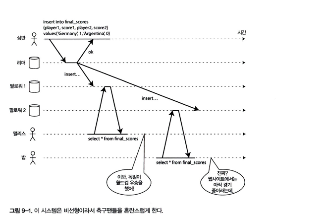

# 9장 일관성과 합의

## 일관성 보장

- 복제 DB에서는 네트워크 지연/순서 꼬임으로 **같은 시각에 서로 다른 값**을 볼 수 있음
- 대다수 데이터베이스 시스템이 기본으로 제공하는 **최종적 일관성(Eventual Consistency)**:
    - 쓰기를 멈추고 시간이 충분히 지나면 모든 복제본이 언젠가 같은 값으로 맞춰진다
- 실제 앱은 장기간 잘 동작해 보일 수 있어 **버그가 감춰지기 쉬움** → 테스트로 잡기 어렵다
- 따라서 더 강한 일관성 모델을 알아두고 **시스템 요구에 맞춰 선택 해야함**

## 선형성

- 선형성
    - 복제본이 여러 개여도 **마치 하나만 있는 것처럼 보이게 하도록 한다**
    - 어떤 쓰기가 **성공 응답**을 받은 **그 이후의 모든 읽기**는 최소 그 쓰기(또는 더 최신)를 본다.
    - 원자적 일관성, 강한 일관성, 즉각 일관성, 외부 일관성 이라고도 한다

- 비선형 사례(그림 9-1): 경기 결과 사이트
    - 리더→팔로워 전파 지연 때문에 사용자 A·B가 각기 **상반된 결과**를 봄 → 선형성을 위반한다
    - 새로고침 할때마다 다른 결과를 보게 됨

### 시스템에 선형성을 부여하는 것은 무엇인가 ?

- 선형성을 뒷받침 하는 기본 아이디어 → 복사본이 하나 뿐인것 처럼 만들기
- 분산 시스템 분야에서 **동시에 갱신되는 같은 키 (x)** 를 레지스터 라고 부른다

- 단일 키를 **레지스터(register)** 로 모델링:
    - `read()` : 현재 값 읽기
    - `write(v)` : 값을 `v`로 설정(응답은 ok/error)

- 초기값 0에서 `write(1)`이 진행될 때:
    - 약한 시스템: 중간 시점에 한 읽기가 **0 또는 1**을 볼 수 있어 **결과가 들쭉날쭉함**
    - 선형 시스템: 한 번 **새 값(1)**이 관측된 이후 **모든 후속 읽기**는 반드시 1만 본다(그림 9-3)
- 시스템을 선형 적으로 만드려면 **추가적인 제약조건**이 필요하다
    - 읽기가 새 값을 한 번이라도 보았다면, **그 이후의 모든 읽기**는 새 값만 반환한다
- 쓰기가 아직 끝나지 않아도 **읽기가 새 값을 본 이후 되돌아가면 안 됨**(단조 증가하는 관측).
- 연산들을 **실행된 시점의 부분순서**(요청/응답 인터벌)로 놓고, 이를 **현실 시간에 부합하는 총순서**로 배치 가능해야 선형성 충족.
- `cas(x, v_old, v_new)`(Compare-And-Set) 도입:
    - 레지스터의 현재 버전/값을 확인하며 조건부 쓰기
    - 선형 시스템에서는 **모든 읽기**가 “가장 최근에 선형적으로 성공한 쓰기”의 값을 본다

- 네트워크에서 **요청/응답이 엇갈려**도, 시스템이 정한 선형 순서를 지켜야 한다 (그림 9-4)
- 마지막 읽기가 과거 값을 허용하면 **비선형 구조가 되어버림**
- **선형성 대 직렬성**
    - **직렬성**: 여러 객체를 포함한 트랜잭션이 어떤 **순차 실행**과 동일(격리 속성)
    - **선형성**: **단일 객체**의 최신성 보장
    - 데이터베이스는 직렬성과 선형성을 모두 제공할 수 있으며, 이를 **엄격한 직렬성** 또는 **강한 단일 복사본 직렬성** 이라고 한다

### 선형성에 기대기

- 선형성이 유용한 케이스들 살펴보기
- **최종 점수/주문 결과 조회**처럼 보이는 값 = 현실의 최신 결과가 중요한 곳
- **리더 선출 및 잠금**: 한 시점에 **오직 하나만 리더/락 보유**하도록 만들려면 보통 선형성 필요
    - ZooKeeper/etcd 같은 코디네이션 서비스가 이를 제공(합의 알고리즘 기반)
- **유일성 제약**(ID/이메일 중복 방지 등): 사실상 **compare-and-set** + 선형성 문제
    - **유일성 제약**은 본질적으로 **선형성**을 필요로 함.
- RDBMS RAC처럼 스토리지 잠금 기반도 존재하나, 경로가 **크리티컬 패스**에 있어야 하므로 네트워크·디스크 요건이 까다롭다.
- 구현 패턴:
    - 키 공간을 잠금처럼 사용 + `compare-and-set` 로 **선점**(이미 있으면 실패)
    - 분산 시스템에선 모든 노드가 **동일 최신 상태**에 동의해야 제약을 지킬 수 있음(합의 필요)
- 업무에서 느슨히 다뤄도 괜찮은 제약은 **보상 절차**로 처리 가능(항공권 사례 등)

### 채널 간 타이밍 의존성

- 동일 객체에 대해 **둘 이상의 경로**(예: 저장소 쓰기 + 메시지 큐 알림)를 사용할 때,
    - 저장은 완료됐지만 **알림이 늦게 도착**해 클라이언트가 **오래된 뷰**를 보게 될 수 있음
- 단일 채널로 **순서 보장**(하나의 선형적 경로)하거나, 수신 측에서 **버전/타임스탬프 검증**으로 **과거 상태 무시**(아이템의 최신성 보증)

### 선형성 시스템 구현하기

- 복제본이 하나만 있는 것처럼 보이도록 모든 연산을 **하나의 전역 시점**에 배치한다.
    - 즉, 어떤 시점 t 이후의 모든 읽기는 반드시 t 직전까지 커밋된 **가장 최신 값**만 본다.
- 복제 없이 **단일 노드만 사용**하면 선형성은 쉽지만, 노드 장애·네트워크 분리 시 접근 불가 → 분산 시스템에선 실용적이지 않다.
- 선형성을 지키려면 결국 **복제**가 필요하고, 복제 방식을 선형적으로 만들 전략이 필요하다.

### 단일 리더 복제(선형적일 수 있음)

- 쓰기 경로에 **유일 리더**를 둬서 순서를 강제하면 선형성에 유리.
- 단, “누가 리더인지 불확실”하거나 리더 장애/선정 중 **스플릿 브레인**이 발생하면 선형성 위반 가능.
- 리더 동기식 팔로어 커밋을 과도하게 요구하면 **가용성·지연** 악화.

### 합의 알고리즘(선형성)

- Raft/zab(etcd/ZooKeeper 등)이 대표. **로그 복제+리더 선출**로 **쓰기 순서**를 확정하고 커밋만 노출.
- 전형적으로 **강한 일관성(선형성)** 저장소를 안정적으로 제공.

### 다중 리더 복제(비선형적)

- 여러 리더가 **동시 쓰기**를 처리 → 파티션 환경에서 가용성은 높지만 **충돌/병합** 필요.
- 충돌 해결 정책이 최신 보장과 어긋나면 선형성 유지 불가.

### 리더 없는 복제(대개 비선형)

- Dynamo/카산드라 류. (r + w > n) 같은 **정족수 조건**으로 “최신 보장”을 주장하지만,
    - 네트워크 지연·시계 오차·읽기 복구(read-repair) 지연 등으로 **경쟁 구간**이 생기면 **선형성 위반** 가능.
    - CAS(Compare-and-Set) 같은 **원자적 조건부 쓰기**를 선형적으로 보장하기 어려움.

### 선형성과 정족수

- 정족수 **r + w > n**을 만족해도, **쓰기가 진행 중인 구간**에서 다른 읽기가 **오래된 값**을 볼 수 있어 **선형성 충분조건이 아님**.
- 선형성을 원하면 **쓰기 완료 시점 이후의 모든 읽기**가 반드시 **새 값**을 반환해야 함 → **합의 기반 커밋**이 가장 안전.

### 선형성의 비용

- **멀티 데이터센터**:
    - **다중 리더**: 각 DC는 독립 작동(가용성↑). 연결 복구 때 백그라운드로 동기화. 읽기는 최신이 아닐 수 있음(비선형).
    - **단일 리더**: 모든 쓰기/선형성 읽기는 **리더 DC 경유** → **크로스-DC 지연**과 **분할 시 중단** 감수.
- **트레이드오프 요약**: 선형성↑ ↔ 지연/가용성/처리량↓

### CAP 정리

- **요점**:
    - 애플리케이션이 **선형성을 요구**하면, **네트워크 분단** 시 일부 요청에 **오류/대기**로 응답(가용성↓).
    - 선형성 **불요**면 각 복제본이 독립 처리(가용성 유지) 가능.
- **비판/오해 정리**:
    - CAP의 “C”를 흔히 **선형성**으로 좁게 이해하는 게 일반적이지만, CAP 자체는 역사적/개념적 프레이밍일 뿐 **설계 지침으로는 거칠다**.
    - 실무에서는 **지연·변동성**과 **성능**이 더 큰 트레이드오프를 만든다.

### 선형성과 네트워크 지연

- 최신 CPU/메모리에서도 코어 간 접근 지연이 크듯, **네트워크 지연·변동성**은 상수.
- 실무에서 선형성을 포기하는 주된 이유는 **내결함성**보다 **성능/응답시간** 요구 때문.

## 순서화 보장

- 선형성은 “복제본이 하나처럼 보이도록 **모든 연산에 전역 순서**”를 부여.
- 이 책 전반의 **핵심 주제**: 많은 예에서 **순서 보장**이 근거 전제가 됨.

### 순서화와 인과성

- **인과적 의존**: A의 결과에 의존하는 B는 “A가 B보다 **먼저**”여야 함.
- 리더 복제/네트워크 지연 등에서 **동시성** 때문에 “누가 먼저였는가”가 모호해지면 혼란.
- **consistent-with-causality**: 인과를 깨지 않는 범위에서만 순서를 비교.

### 인과적 순서와 전체 순서

- **전체 순서(total order)**: 모든 이벤트 쌍이 비교 가능(선형성의 이상).
- 현실에선 **부분 순서(partial order)**가 자연스럽다. **비교 불가능**한 동시 사건들이 존재.
- 선형성은 **하나의 타임라인**을 강제하여 전체 순서를 만든다. 인과성 모델은 **비교 가능한 쌍만** 순서를 강제.

### 선형성과 인과성

- **선형성**: 모든 연산이 하나의 전역 타임라인에 위치. “요청 완료 후의 읽기는 반드시 그 **결과**를 본다.” 동시성은 타임라인 상에서 재배열되어 **결코 뒤집히지 않음**.
- **인과성**: “원인→결과” 관계만 지키되, 무관한 동시 사건들은 **순서 미정** 가능. 성능·가용성에 유리하나 최신 보장 강도는 약함.

### 선형성은 인과적 일관성 보다 강하다

- 선형성은 **인과성을 자동으로 내포**한다. 여러 통신 채널/모듈이 있어도 타임스탬프 전달 없이 인과 관계가 보존됨.
- 이해하기 쉽고 매력적이지만, **성능·가용성 비용**이 커서 실제 대규모 분산시스템에서 적용은 어려울 수 있음.
- 인과성과 일관성(결함 상황에서도 느려지지 않는 모델)을 만족시키는 **대안적 모델**들(인과적 일관성 모델)이 연구/확산 중.

### 인과적 의존성 담기

- 인과성을 지키려면 “**무엇이 먼저 실행됐는지**”를 알아야 함. 선행 연산이 끝나기 전에는 후속 연산을 처리하지 않도록 해야 함.
- 이를 위해 시스템은 노드별 “**지식**(이미 본/처리한 버전·연산)”을 기록해야 하며, 실제로는 **버전 벡터(Version Vector)** 같은 구조를 사용.
- DB는 “어떤 트랜잭션이 어떤 버전을 읽었는지”를 추적해, 키 충돌 검출·최신성 판단에 활용.

### 일련번호 순서화

- 모든 인과적 의존성을 명시적으로 추적하기는 비현실적. 대신 **일련번호(혹은 논리적 타임스탬프)** 로 전체 순서를 부여.
- 크기가 작고 비교가 쉬워 **전역 순서**를 제공하며, 특히 **인과적 ‘일관적인’** 전체 순서를 만들 수 있음(선행 관계를 어기지 않도록).
- 단일 리더 복제에서는 리더가 **증가하는 카운터**로 로그 순서를 정함(각 파티션/로그 항목에 단조 증가 ID).

### 비인과적 일련번호 생성기

- 단일 리더가 없을 때의 생성 방법들:
    1. **노드별 독립 카운터**(고유 비트/프리픽스 포함),
    2. **물리 시계 기반 타임스탬프**,
    3. **미리 할당된 블록**(각 노드에 번호 범위 배정).
- 모두 확장성은 좋지만, 번호가 **인과 관계를 정확히 반영하지 못할 위험**이 있다(초당 속도 차, 스큐, 블록 소진/겹침 등).

### 램포트 타임스탬프

- 1978년 제안. 각 노드는 **카운터+노드 ID**로 타임스탬프를 만들고, 메시지 왕복 때 **최댓값+1** 규칙으로 갱신.
- **전역 ‘전체 순서’** 를 제공(동시성/인과성 여부 자체를 알려주진 않지만, 충돌 없는 전역 정렬 가능).
- 버전 벡터와 목적이 다름: 벡터는 인과성 구분, 램포트는 전체 순서 부여에 초점.

### 타임스탬프 순서화로는 충분하지 않다

- 계정 생성처럼 “**유일성 제약**”이 핵심인 문제는 단순 전체 순서만으로 부족.
    
    예) 두 노드가 동시에 같은 사용자명을 생성 → 누가 성공/실패인지 **결정하는 합의**가 필요.
    
- 타임스탬프가 낮은 연산을 우선한다 같은 **결정 규칙**만으로는 장애/분할 상황에서 안전 보장 어려움.

### 전체 순서 브로드캐스트

- 모든 노드가 **같은 순서로 같은 메시지**를 받게 하는 프로토콜. 요구 속성:
    - **신뢰성 전송**(결국 전달), **완전한 순서 보장**(모든 노드 동일 순서).
- 구현은 보통 **합의(Consensus)** 로 달성(네트워크 분할 시에도 ‘복구 후에도 동일 순서’ 보장 필요).
- 단일 리더 복제는 TOB의 한 구현: 리더가 순서를 정해 전파. 확장/장애 복구가 핵심 과제.

### 전체 순서 브로드캐스트 사용하기

- DB 복제·상태 기계 복제(State Machine Replication)의 핵심.
    
    “모든 쓰기 = 메시지”, **모든 서버가 같은 순서로 처리** → 파티션 간 일관성 유지.
    
- 결정적 트랜잭션 실행/로그 재생에도 활용. **로그 기반 합의**가 램포트/일련번호만보다 강한 보장을 제공.
- 메시지 타임스탬프가 곧 순서를 의미하지는 않음(전달 시점에 순서가 확정됨).

### 전체 순서 브로드캐스트로 선형성 저장소 구현하기

- TOB 위에 **원자적 compare-and-set** 같은 연산을 얹어 선형적 저장소를 구성:
    1. “사용자명 미점유” 메시지를 **전역 로그에 먼저 기록**해 순서를 확보,
    2. 로그에 반영된 것을 확인 후 **실제 쓰기 수행**,
    3. 첫 성공 메시지를 **원자로 확인**해 유일성 보장.
- 이 방식은 **쓰기의 선형성**을 보장하지만, **읽기 선형성은 별도 선택**(순차적 일관성/타임라인 일관성 등)으로 조합 가능.
- 실무 팁:
    - 읽기를 로그 동기화와 결합(최신 위치까지 **sync/추적**)하면 더 강한 보장을 얻을 수 있음.
    - 파티션/로그 재생으로 **장애 후 복구** 시에도 동일한 결과를 재현.

### 선형성 저장소를 사용해 전체 순서 브로드캐스트 구현하기

- **아이디어**: 이미 선형성(linearizability)을 보장하는 레지스터가 있다면, 각 메시지에 대해 레지스터의 **증가형 카운터(increment-and-get)** 값을 붙여 브로드캐스트하면 모든 수신자가 같은 순서(카운터 오름차순)로 처리할 수 있다.
- **람포트 타임스탬프와 차이**: 람포트 TS는 “최댓값+1” 규칙으로 전체 순서를 만들지만, **메시지 5의 번호가 확정되려면 4가 전달되었는지와 무관**하다. 반면 증가형 카운터 기반은 **번호의 연속성**을 보장하므로 “5를 처리하기 전에 4가 존재함”이 보장된다.
- **결론**: 선형성 compare-and-set(혹은 increment-and-get) 레지스터 ↔ **전체 순서 브로드캐스트와 본질적으로 동등**(equivalent to consensus). 즉, 하나를 구현하면 다른 하나로 변환 가능.

## 분산 트랜잭션과 합의

- **핵심**: 합의(consensus)는 “여러 노드가 **같은 선택에 동의**하도록 만드는 문제”.
- 본 장 앞부분(복제/타임/선형성/전체순서 등)을 통해 합의의 빌딩블록을 소개했고, 이제 **트랜잭션 커밋**이라는 현실 과제에서 합의를 본격적으로 사용.
- 리더 선출
    - 단일 리더 복제에서는 **모든 노드가 동일 리더에 동의**해야 함(네트워크 분단 시 특히 중요). 리더가 둘이면 스플릿 브레인이 발생
- 원자적 커밋
    - 다노드 트랜잭션에서 **모두 커밋 또는 모두 롤백**에 동의해야 함(ACID ‘원자성’). 이를 원자적 커밋 문제라 부름.
- 합의 불가능성
    - 비동기 네트워크에서 노드 실패 가능성이 있으면 **결정적 합의 알고리즘은 불가능**(FLP 정리).
    - 실무는 시간/신뢰 가정(디스크 기록, 타임아웃, 장애 감지 등)을 추가해 **실용적 합의**를 만든다.

### 원자적 커밋과 2단계 커밋

- **2PC**: 원자적 커밋을 위한 **합의 프로토콜**.
- **2PL**: 직렬성 격리를 위한 **동시성 제어**. 목적·층위가 전혀 다름.
- **목표**: 여러 노드가 같은 트랜잭션을 **모두 커밋 또는 모두 어보트**.
- **흐름**(성공 시): 코디네이터가 참가자에게 *준비(prepare)* 질의 → 모두가 “yes(준비됨)” 응답 → 코디네이터가 *커밋* 결정 기록 후 각자에게 커밋 통보 → 참가자들이 커밋.
- **구성요소**
    - **코디네이터**: 트랜잭션 관리자(별도 서비스일 수도 있음).
    - **참가자**: 각 데이터베이스 노드.

### 단일 노드에서 분산 원자적 커밋으로

- 단일 DB도 내부적으로 **디스크에 커밋 레코드 기록 → 크래시 후 복구**로 원자성 보장.
- 다노드에서는 각 노드가 **독립 커밋**만 해선 위험. 네트워크/디스크/노드 실패로 **어중간(commit 일부 성공)** 상태가 생길 수 있어 **공동 의사결정 절차**가 필요 → 2PC.

### 약속에 관한 시스템

- 2PC 단계 과정
- 앱은 코디네이터에게 **트랜잭션 ID** 발급 요청(전역적 식별자).
- 앱은 각 참가자에서 단일 로컬 트랜잭션을 수행(전역 ID와 연관).
- 준비 가능 시 참가자들은 **준비(prepare) 요청**을 받으면 상태를 디스크에 기록하고 “yes/no” 응답.
- “yes” 집계 후 코디네이터는 **최종 결정(커밋/어보트)**을 **디스크에 영속 기록**(커밋 포인트)하고 브로드캐스트.
- 코디네이터의 결정은 **불변**이어야 하며, 참가자는 성공 응답을 보낼 때까지 **재전송/재시도**로 내구성 확보.

### 코디네이터 장애

- 코디네이터가 **결정 기록 전에 죽으면** 참여자들은 **의심/불확실(in doubt)** 상태 → 회복될 때까지 기다림(잠정적으로 블로킹).
- 코디네이터가 복구되면 **자신의 로그로 결론**을 내려 재전파.
- 요점: 2PC는 **코디네이터 장애에 블로킹**될 수 있다.

### 3단계 커밋

- 2PC의 “코디네이터 블로킹” 문제를 줄이려는 시도.
- 하지만 **완벽한 장애 감지**(perfect failure detector) 같은 강한 가정이 필요하고, **실무의 비동기·지연 네트워크**에서는 여전히 원자성 보장이 약함 → **일반적으로 채택되지 않음**(연구적 가치).

### 현실의 분산 트랜잭션

- 2PC는 **운영 복잡도와 성능 비용**(fsync, 네트워크 왕복, 장애 복구 경로)이 커서, 많은 시스템/클라우드가 **분산 트랜잭션을 지양**하거나 **범위를 제한**한다.
- 분산 트랜잭션 유형
    - **데이터베이스 내부 분산 트랜잭션**: 동일 벤더/시스템 내 파티션 간(동일 SW 스택) — 비교적 수월.
    - **이종(heterogeneous) 분산 트랜잭션**: 서로 다른 시스템/벤더/스토리지 간 — **훨씬 어렵고 비용↑**.

### 정확히 한 번 메세지 처리

- **아이디어**: 메시지 큐의 “확인(ack)”과 데이터베이스의 **커밋**을 한 원자적 단위로 엮으면, 어떤 장애가 있어도 **effectively exactly-once** 처리가 가능.
- **방법**: 메시지를 읽고 → DB 트랜잭션 안에서 업무 처리와 함께 “메시지 처리됨”을 기록 → 트랜잭션이 커밋되면 그제서야 큐에 ack.
    - 중간에 실패하면 메시지는 **재전송**되지만, DB 쪽은 트랜잭션 원자성 때문에 **중복효과가 없음**.
- **전제**: 메시지 브로커와 DB가 서로 다른 장비여도 트랜잭션적 조합으로 구현 가능(다만 구현 복잡/비용 있음).

### XA 트랜잭션

- **정의**: X/Open XA는 2단계 커밋(2PC)을 표준 인터페이스(JTA/JDBC, JMS 등)로 제공하는 **분산 트랜잭션 표준**.
- **구성**: 애플리케이션(또는 코디네이터 라이브러리)가 XA API로 참여자(DB/메시지 브로커)에 **prepare/commit/rollback**을 지시.
- **현실적 이슈**: 코디네이터/참여자 프로세스가 죽으면 **의심스러운(in-doubt)** 트랜잭션이 남고, 로그를 읽어 **결과 복구**가 필요.

### 의심스러운 상태 동안 잠금 유지 문제

- 2PC에서 참여자는 **commit/abort 결과를 알 때까지** 트랜잭션 **락**을 유지해야 함 → 그 동안 **읽기/쓰기 차단**, 시스템 가용성 저하.
- 코디네이터가 죽거나 네트워크 장애면 **오랜 시간(예: 20분)** 락이 풀리지 않을 수 있어 운영상 큰 부담.

### 코디네이터 장애에서 복구하기

- 이상적으로는 코디네이터 재시작 후 로그로 복구하지만, 현실에선 **고아(orphaned)** 트랜잭션이 생길 수 있음(로그 손상·버그 등).
- 일부 구현은 코디네이터 결정을 받지 못한 트랜잭션을 **경험적(heuristic)** 으로 로컬에서 abort/commit하기도 하는데, 이는 **원자성**을 약화시킴.

### 분산 트랜잭션의 제약

- XA/2PC는 **단일 고장점(SPoF)**, **장시간 락 유지**, **네트워크/표준화 요구** 등으로 운영 난도가 높음.
- 모든 영속 상태를 DB에 두는 **비저장 서버(stateless)** 아키텍처와도 상극.
- 많은 시스템은 **팀·조직 경계(이기종)** 를 넘는 트랜잭션을 지양하고, **내결함성을 지닌 합의/로그 복제** 같은 대안으로 전환.

### 내결함성을 지닌 합의

- **균일한 동의(Agreement)**: 충돌 없는 동일 결정.
- **무결성(Integrity)**: 한 노드가 두 번 다른 결정을 내리지 않음.
- **유효성(Validity)**: 제안된 값만 채택.
- **종료(Termination)**: 죽지 않은 노드는 결국 결정을 내림.
    
    → 단순 “리더 독재”는 장애 시 **종료**를 보장하지 못하므로 불가.
    

### 합의 알고리즘과 전체 순서 브로드캐스트의 관계

- Paxos/Raft/Zab 등 합의 알고리즘은 **값 하나의 합의**를 반복 실행해 **전체 순서 브로드캐스트(Total Order Broadcast)** 를 구현한다고 볼 수 있음.
- 전체 순서 브로드캐스트가 만족해야 할 것:
    1. **신뢰성 전송**(누락 없음) 2) **완전한 순서성**(모든 노드 동일 순서).
- 따라서 “모든 노드에 메시지를 **정확히 한 번, 같은 순서**로” 전달하는 것이 목표이며, 이는 곧 **복제 로그**의 기초.

### 단일 리더 복제와 합의의 접점

- 단일 리더 복제(팬팔로워)는 쓰기 순서를 리더가 **사실상 결정**.
    - 리더가 정상이면 추가 합의 없이도 **순차적 일관성/타임라인 일관성** 달성 가능.
- 그러나 **리더 선출**(장애 시)이 필요하고, **누가 리더인가**에 대한 합의가 없으면 분열(스플릿 브레인) 위험 → 결국 **합의 프로토콜**이 필요.

### 에포크 번호 붙이기와 정족수

- Paxos/Raft 등은 리더를 강하게 가정하지 않고, **에포크/임기(term, view/ballot)** 를 단조 증가시키며 **최신 에포크의 과반수(정족수)** 로 결정을 안전하게 만듦.
- 새 리더는 **정족수의 투표**를 받아야 하며, 제안도 정족수에 복제되어야 유효.
    - 이는 2PC와 달리 **코디네이터 사망** 시에도 시스템이 **진행 가능**하도록 설계됨(합의의 종료성 확보 방향).

### 합의의 제약

- 합의(Consensus) 알고리즘은 신뢰·무결성·유효성 같은 **체계적 안전성**을 주지만, **대가가 크다**.
    - 투표 집합이 고정이라는 가정(정적 멤버십), 여러 장애를 동시에 넘기기 위한 **과반수 쿼럼 필요**, 네트워크 분단 시 진행 불가 등이 비용을 키움.
- 많은 실서비스는 성능·가용성 때문에 **완전한 합의 대신 비동기 복제**를 선택하기도 한다.
- **정적 멤버십 가정**이 현실과 어긋남 → 클러스터 크기/구성이 변하는 환경에서는 운영이 어렵다.
    - 동적 멤버십은 연구가 진행 중이나 여전히 까다로운 주제.
- 합의는 **네트워크 품질에 민감**: 지연/패킷손실/분단이 잦으면 리더 선출 불안정, 진행 멈춤(stall) 등으로 **성능 급락**.

### 멤버십과 코디네이션 서비스

- ZooKeeper/etcd 류는 “**분산 키-값 저장소 + 코디네이션/설정 서비스**”로, DB의 API와 비슷하지만 **상태(설정/메타데이터/잠금 등)**를 소량 안정적으로 관리하는 용도.
- 이들 서비스는 보통 **메모리 중심 + 로그 디스크 영속화** 구조로, 애플리케이션 **전체 데이터를 넣는 용도가 아님**.
    - 핵심은 **내결함성 있는 작은 상태**를 다루며, 로그는 **전체 순서 브로드캐스트(합의)**로 일관 복제.
- 주요 원자적/합의 프리미티브
    - **선형성 원자적 연산**: compare-and-set, 임차권(lease) 기반 잠금 등.
    - **연산의 전체 순서화**: zxid/term 등 증가하는 버전으로 **글로벌 순서** 부여.
    - **장애 감지(세션/heartbeat)**: 클라이언트-서버가 세션 유지, 타임아웃 시 **ephemeral node** 자동 삭제.
    - **변경 알림(watch)**: 키/경로 변화에 대한 푸시 알림(구독) 제공.
- 이런 프리미티브 조합으로 **리더 선출, 작업 할당, 설정 배포, 파티션 리밸런싱** 같은 코디네이션 문제를 해결.

### 작업을 노드에 할당하기

- 대표 패턴: 여러 워커 중 **하나를 리더**로 선출 → 리더가 파티션/작업을 워커에 배정.
- 노드 장애/증감 시 **리밸런싱**(기존 노드의 파티션을 새 노드로 이동) 필요.
- 주키퍼/치비(Chubby) 같은 서비스는 **원자적 연산 + ephemeral node + 알림**으로 이 과정을 자동화/안전화.

### 서비스 찾기

- etcd/Consul/ZooKeeper로 **서비스 등록/조회**를 구현해, 동적으로 변하는 엔드포인트를 추적.
- 전통 DNS도 캐시/지연 때문에 **합의만으로는 충분치 않음** → 등록소와의 **강한 일관성 읽기**가 필요한 경우가 많다.
- 주의: 단순 서비스 찾기는 합의가 과할 수 있지만, **리더 선출/락/상태 일관성**이 얽히면 합의가 요구됨.

### 멤버십 서비스

- “현재 **살아있는 노드 집합**(members)을 합의로 정의”하는 기능.
    - 네트워크 지연 탓에 “살아있음”을 **오판**할 수 있기에, **합의로 멤버십을 고정**해야 일관성 유지.
- 멤버십 합의가 필요한 이유
    - 리더 선출의 **투표권 집합**을 명확히 함(누가 투표자냐가 먼저 결정돼야 함).
    - 데이터/작업 배정의 **소유권**을 명시해, 중복 처리·스플릿 브레인 방지.
- 간단 구현 예: “**가장 낮은 번호/사전순**”과 같은 결정 규칙을 멤버 집합에 적용해 **리더/대표**를 정함.
    - 단, 규칙만으론 부족하고 **멤버십 집합 자체**를 합의로 확정해야 함.
