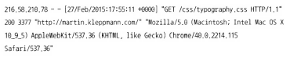
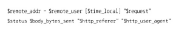
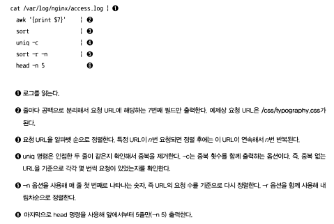
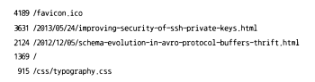
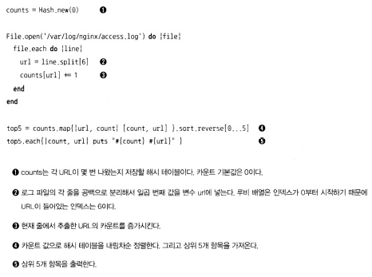
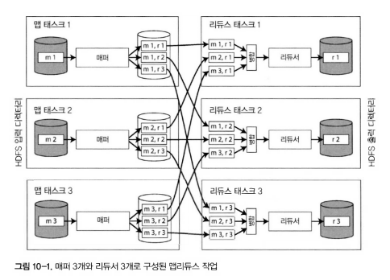
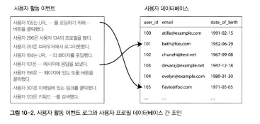
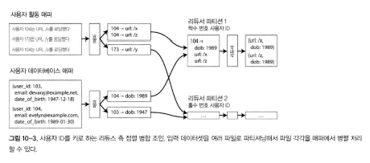

# 🔴 일괄 처리하기
- **핵심 정의(배치 처리, Batch Processing)**
    - **요청/응답(request/response)** 과 대비되는 **질의/결과(query/result)** 중심의 처리
    - **유한한 입력(bounded input)** 을 한 번 읽어 **결정적(deterministic)** 출력 생성
    - 온라인 시스템과 달리 **지연 허용**, **재현성·정확성** 중시
- 서비스(온라인 시스템)
  - **특징**
      - 클라이언트의 **요청이 즉시 응답**될 때까지 대기
      - **지연(latency)** 이 사용자 경험에 직접 영향, **가용성(availability)** 중요
      - 캐시, 검색, 웹 서버 등 **상호작용 서비스**가 여기에 속함
- 일괄 처리 시스템(오프라인 시스템)
  - **역할**
      - 대량의 **원시 데이터(raw data)** 를 모아 **분석·집계·정제** 후 결과물을 산출
      - 보통 **파일 단위 입력**을 읽고, **오래 걸리는 작업**도 허용
      - 예: **로그 집계, ETL, 추천오프라인 학습** 등
- 스트림 처리 시스템(실시간 시스템)
  - 온라인과 오프라인 사이의 **중간 지점**. 이벤트가 오면 **근실시간(near-real-time)** 으로 반응
  - **용도**
      - **알림/탐지/온라인 지표** 업데이트 등 **지연 수 초~분** 수준의 요구

# 🔴 유닉스 도구로 일괄 처리하기

- **접근법**
    - **텍스트 로그**를 **파이프라인(pipeline)** 으로 연결해 분석(예: `awk > sort > uniq > head`)
    - 각 도구는 **단일 책임**을 수행, **연결로 조합**해 문제 해결
- **장점**
    - 빠른 시도-실패, **학습 비용 낮음**, **도구 재조합**으로 다양한 문제에 적용 가능
- **주의**
    - **명령어 자체 학습 곡선** 존재, **복잡한 요구**에는 스크립트/프로그램이 더 적합할 수 있음

## 🟠 단순 로그 분석

위 실행 결과는 아래와 같다.

- **일반 절차**
    - 로그를 **읽기 -> 필드 추출 -> 집계/정렬 -> 상위 N개 추출**
    - 출력 예시는 **가장 많이 요청된 URL TOP 리스트** 등
- **교훈**
    - **텍스트-기반 인터페이스**와 **작은 도구 조합**만으로도 **실용적 분석** 가능

### 🟢 연쇄 명령 대 맞춤형 프로그램

- **연쇄 명령(chaining)**
    - **개발 없이 즉시 실행**, **짧은 작업**과 **탐색적 분석**에 적합
- **맞춤형 프로그램(custom code)**
    - **복잡 로직/재사용/배포**가 필요할 때 적합
    - 두 접근의 **트레이드오프**: 개발 비용 vs 실행 편의/반복 실험 속도

### 🟢 정렬 대 인메모리 집계

- **정렬 기반(sort-based)**
    - **메모리 제약**이 있어도 동작, **외부 정렬(external sort)** 로 대용량 처리에 강함
- **인메모리 해시 집계(in-memory hash aggregation)**
    - **빠르지만 메모리 의존** **키 수·카디널리티**에 따라 메모리 요구가 급증
- **실무 팁**
    - **데이터 크기/카디널리티/장비 스펙**에 맞춰 **혼합 전략** 채택

## 🟠 유닉스 철학
- 
- **핵심 원칙**
    - **작은 프로그램**을 만들어 **하나의 일**만 잘 하게 하라
    - **표준 스트림(stdin/stdout/stderr)** 으로 **텍스트**를 주고받아 **도구 간 결합을 느슨하게(loose coupling)** 하라
    - **빠른 실험과 자동화**, **쉬운 재사용**, **새 도구로 교체 가능**한 **지연 바인딩(late binding)** 지향
- **효과**
    - **프로토타이핑 가속**, **설치 용이**, **DevOps 문화와 궁합**이 좋음

### 🟢 동일 인터페이스
- **의미**
    - 다양한 프로그램이 **같은 입력/출력 인터페이스**를 공유(텍스트 바이트 스트림)
    - 파일, 파이프, 소켓, **/dev/** 장치, **TCP 연결** 등 **동일 모델**로 다룸
- **장점**
    - 도구 간 **조합성(composability)** 향상, **연계 비용** 최소화
- **한계**
    - **완벽히 일관적이지는 않음**(옵션/포맷 차이) 복잡 분석에는 **표준화·스키마**가 추가로 필요

### 🟢 로직과 연결의 분리

- **원칙**
    - **프로그램 로직**과 **데이터 연결(입출력 배선)** 을 분리하면 재사용·테스트 용이
    - 필요 시 파일 직접 I/O도 가능하지만, **표준 스트림**을 선호해 **결합도 낮추기**
- **실무**
    - **stdin에서 읽고 stdout으로 출력**하는 도구를 조합해 **파이프라인**을 구성
    - 네트워크/원격 파일 시스템 연계는 **별도 프로세스/서비스**로 담당 -> **관심사의 분리**

### 🟢 투명성과 실험

- **왜 중요한가**
    - 유닉스 도구는 **처리 과정이 눈에 보이는(투명)** 덕분에 **진행 상황 파악**과 **문제 진단**이 쉬움
- **실천 방법**
    - **입력->중간->출력** 단계마다 **샘플/요약 지표**를 확인
    - **재실행 가능**한 스크립트화, **작은 단계로 쪼개기**, **중간 산출물 보관**

# 🔴 맵리듀스와 분산 파일 시스템
- **맵리듀스와 분산 파일 시스템**
  - 맵리듀스(MapReduce)는 유닉스 도구와 유사하지만 **대량 데이터를 분산해 처리**할 수 있는 점이 다름
  - 유닉스 도구는 단일 장비에서 실행되지만, 맵리듀스는 **여러 노드에 데이터를 분산 저장·처리**
  - 맵리듀스는 **입력을 수정하지 않고 읽어서 출력 생성**하는 점에서 유닉스 프로세스와 유사
  - 출력 파일은 **순차적으로 한 번만 쓰여지고**, 이미 쓰인 부분은 덮어쓰지 않음

- **입출력 구조**
  - 유닉스는 `stdin`과 `stdout`을 사용하지만, 맵리듀스는 **분산 파일 시스템(HDFS)** 을 통해 입출력을 수행
  - 하둡(Hadoop)의 기본 파일 시스템은 **HDFS(Hadoop Distributed File System)** 이며,  
    구글의 **GFS(Google File System)** 을 모델로 함

- **HDFS 외의 예시**
  - **GlusterFS**, **QFS(Quantcast File)**, **아마존 S3**, **Azure Blob**, **오픈스택 스위프트** 등
  - 기본 원리는 **데이터를 여러 장비에 분산 저장**하는 것으로 동일

- **HDFS 구조**
  - **비용 우위의 하드웨어**를 기반으로 하는 **NAS/SAN과 다른 구조**
  - NAS/SAN은 중앙 집중형 저장 장치를 사용하지만, HDFS는 각 서버에 **로컬 디스크 저장**
  - 각 장비는 독립된 프로세스로 실행되며, 데이터는 여러 노드에 **복제(replication)** 되어 저장
  - 디스크 장애 시에도 자동 복구하며, **네임노드(NameNode)** 가 메타데이터 관리 담당

- **장점**
  - 데이터 **복제본(기본 3개)** 을 유지하여 내결함성을 확보
  - **확장성**이 뛰어나며, 수천 대 서버에서 병렬 파일 접근이 가능

## 🟠 맵리듀스 작업 실행하기

- **맵리듀스 작업 실행하기**
  - 맵리듀스는 HDFS 같은 분산 파일 시스템 위에서 **대용량 데이터를 병렬 처리**하는 방식
  - 사용자는 **맵(Map) 함수**와 **리듀스(Reduce) 함수** 두 가지만 구현하면 됨
  - 일반적인 데이터 처리 과정은 **입력 읽기 -> 매핑 -> 셔플 -> 리듀스 -> 출력 저장** 순서로 진행

- **맵리듀스 단계**
  1. **입력 분할(Split)**
    - 입력 데이터를 블록 단위로 나눠 여러 노드에 분배
  2. **매퍼(Map Task)**
    - 입력 블록을 읽어 **중간 키-값 쌍**을 생성
  3. **셔플(Shuffle)**
    - 중간 결과를 **키 기준으로 정렬·그룹화**
  4. **리듀서(Reduce Task)**
    - 그룹화된 데이터를 **최종 출력**으로 변환해 HDFS에 저장

- **특징**
  - 각 단계는 **병렬 실행** 가능하며, 시스템은 자동으로 **태스크 분산·재시도**를 수행
  - 맵리듀스는 **결정적(deterministic)** 이므로 실패 시 동일 입력으로 재실행해 동일 결과를 얻을 수 있음

### 🟢 맵리듀스 분산 실행

- **병렬 처리 구조**
  - 입력 파일 또는 블록은 여러 **맵 태스크(Map Task)** 로 분할되어 독립 실행
  - 각 맵 태스크는 **입력 데이터를 처리해 중간 파일 생성**, 이후 리듀스 태스크가 이를 병합
  - 가능한 한 **데이터가 있는 위치에서(map locality)** 작업이 수행되도록 스케줄링

- **리듀스 단계**
  - 셔플 단계 이후, 같은 키를 가진 중간 데이터를 하나로 모아 정렬 후 리듀스
  - 리듀스 결과는 HDFS에 **최종 출력 파일로 저장**

- **효율성과 한계**
  - 데이터 전송량을 최소화하기 위해 **네트워크 이동을 줄이는 로컬 실행 원칙**을 적용
  - 하지만 리듀스 단계에서 **대량의 정렬·데이터 이동 비용**이 발생
  - 디스크 기반 정렬 사용으로 **I/O 부하**가 커질 수 있음

- **장애 복구**
  - 태스크 실패 시 해당 블록만 재실행
  - **중간 결과 복제**와 **체크포인트**를 통해 장애에도 연속성 유지

### 🟢 맵리듀스 워크플로

- **워크플로 개념**
  - 단일 맵리듀스 작업으로는 복잡한 분석 불가
    여러 맵리듀스 작업을 연결해 **데이터 흐름(workflow)** 을 구성
  - 각 작업의 출력이 다음 작업의 입력으로 사용됨 -> **파이프라인 처리**

- **워크플로 도구**
  - **하둡(Hadoop)** 기반 워크플로 관리 도구들:
    - **Oozie**, **Azkaban**, **Luigi**, **Airflow**, **Pinball** 등
  - 이 도구들은 **작업 의존성 관리**, **재시도**, **스케줄링**을 자동화함

- **응용 예**
  - **로그 분석, 사용자 행동 추적, 추천 시스템 학습 파이프라인** 등
  - 워크플로를 통해 **여러 단계의 데이터 전처리·분석**을 자동으로 실행

- **발전 방향**
  - 맵리듀스의 한계를 극복하기 위해 **Pig**, **Hive**, **Cascading**, **Crunch**, **FlumeJava** 등  
    **고수준 추상화 프레임워크**가 등장
  - 이들은 **맵리듀스 작업을 내부적으로 자동 구성**해 실행 효율을 높임

## 🟠 리듀스 사이드 조인과 그룹화

- **조인(join)** 은 여러 테이블이나 레코드 간의 관계를 연결하는 일반적인 작업이다
  관계형 모델에서는 **외래키(foreign key)**, 문서 모델에서는 **문서 참조(document reference)**,  
  그래프 모델에서는 **간선(edge)** 로 표현된다
- 데이터 처리 시스템에서 조인은 **서로 다른 데이터 소스의 레코드 결합**을 의미하며, 맵리듀스에서는 일반적으로 **리듀스 단계**에서 수행된다
- 하지만 조인은 **비용이 높은 연산**이며, 완전한 처리에는 **전수 스캔(full table scan)** 이 필요하다

### 🟢 사용자 활동 이벤트 분석 예제

- 예제: **웹사이트 사용자 활동 로그**(activity event)와  
  **사용자 프로필 데이터(profile data)** 를 조인하는 분석
- 활동 이벤트 로그(clickstream data)는 **대량의 로그 파일**로 구성되고, 사용자 프로필은 비교적 작은 데이터 세트다
- 목표: 사용자 ID를 기준으로 두 데이터셋을 연결해 **“특정 연령대의 사용자 활동 패턴”** 등을 분석

- **실행 방식**
  - 모든 이벤트 로그를 읽고 각 사용자 ID에 맞는 프로필을 찾는다
  - 데이터는 HDFS에 분산되어 있으며, 각 태스크는 **전체 스캔(full table scan)** 으로 데이터를 읽는다
  - 각 태스크는 **사용자 ID를 기준으로 그룹화**하여 분석 결과를 생성

### 🟢 정렬 병합 조인

- 맵리듀스에서 가장 일반적인 조인 방식
  맵 태스크가 **입력 데이터를 키 기준으로 정렬**,  
  리듀스 태스크가 **같은 키를 가진 데이터**를 병합해 결과를 만든다
- 과정:
  1. 맵 단계에서 각 입력 파일의 레코드를 **키 기준으로 정렬**
  2. 리듀스 단계에서 동일 키를 모아 **조인 및 집계 수행**
- **보조 정렬(secondary sort)**
  - 동일 키 내에서 **시간 순서 등 부차적 기준으로 정렬**하는 기능
  - 예: 사용자 ID별 이벤트를 시간순으로 정렬하여 활동 패턴을 분석

- **장점**
  - 리듀스 단계에서만 병합 수행 -> 단순하고 안정적
- **단점**
  - 모든 관련 데이터가 리듀스 노드에 도달해야 하므로 **네트워크 부하 증가**

### 🟢 같은 곳으로 연관된 데이터 가져오기

- **핵심 개념**
  - 조인 대상 데이터가 다른 노드에 흩어져 있으면 비효율적이므로, 관련된 데이터를 **같은 노드(리듀서)** 로 보내야 함
- **방법**
  - 맵 태스크에서 데이터를 분할할 때 **동일한 키를 가진 데이터**는 **같은 파티션**으로 라우팅
  - 이렇게 하면 조인 시 **네트워크 전송량 감소**, **리듀서 부담 완화**
- 이 과정은 맵리듀스의 **셔플(shuffle)** 단계에서 수행됨

### 🟢 그룹화

- **그룹화**
  - 조인 외에도, “같은 곳으로 관련 데이터를 모으는” 일반적 연산
  - SQL의 `GROUP BY` 나 집계 함수(`COUNT`, `SUM` 등)와 유사
- **과정**
  1. 키 기준으로 레코드를 그룹화
  2. 각 그룹에서 **집계 연산(aggregation)** 수행

- **활용 예시**
  - 사용자별 페이지 조회 수 합계
  - 지역별 구매 건수 평균

- **최적화**
  - **셰어드 그룹화(shared grouping)**:  
    서로 다른 그룹 기준이 있을 때 중복 계산을 줄이기 위한 방식
  - **세션화(sessionization)**:  
    사용자의 활동 로그를 시간 순서로 묶어 한 세션 단위로 분석

### 🟢 쏠림 다루기
- **문제**: 특정 키에 너무 많은 데이터가 몰리면  
  “같은 키를 가진 레코드가 모두 한 리듀서로 모이는” 현상 발생
  -> **부하 불균형(skew)**, **리듀서 과부하** 초래
- **원인**
  - 일부 키(예: 인기 사용자 ID, 인기 상품 등)에 데이터 집중
- **해결 방안**
  - **키 분할(hash partitioning)**: 하나의 키를 여러 하위 키로 나누어 분산
  - **샘플링 기반 추정(shared join)**: 샘플을 기반으로 부하를 예측 후 균등 분배
  - **스페셜 조인(special join) 기법**
    - Pig: **skewed join**
    - Crunch: **shared join**
    - Hive: **map-side join** (리듀서 거치지 않고 맵 단계에서 조인 수행)
- **결과**
  - 리듀서의 **병목 제거**, **처리 속도 향상**, **리소스 균형화** 달성

## 🟠 맵 사이드 조인

- 기존 리듀스 사이드 조인은 모든 입력 레코드를 리듀서에서 모아 조인하므로 비용이 높다.
  이에 비해 **맵 사이드 조인(Map-side join)** 은 입력 데이터를 **리듀서로 보내지 않고**  
  **맵 단계에서 직접 조인**을 수행하는 방식이다.

- **특징**
  - 리듀서에서의 셔플(shuffle) 과정이 없어 **성능이 매우 빠름**
  - 다만 입력 데이터가 **정렬되어 있거나 파티셔닝 구조가 일치**해야만 적용 가능
  - 모든 매퍼가 **필요한 데이터 전체를 읽을 수 있어야** 함

- **제약**
  - 입력 데이터가 너무 크면 매퍼의 메모리에 담을 수 없어 비효율적
  - 따라서 **입력 데이터 중 하나가 작고**, **다른 하나가 큰 경우**에 주로 사용된다.

### 🟢 브로드캐스트 해시 조인

- **브로드캐스트 해시 조인**
  - 입력 중 **작은 테이블 전체를 각 매퍼에 복제(broadcast)** 하여 큰 데이터 집합과 매퍼 내에서 **해시 기반 조인**을 수행하는 방식
  - 즉, 각 매퍼는 작은 데이터를 **메모리에 올려둔 뒤**, 자신이 처리하는 큰 입력 데이터 블록과 비교/조인한다.

- **장점**
  - 리듀스 단계 없이 맵 단계에서 완료 -> **네트워크 부하 감소, 속도 향상**
  - **소규모 참조 테이블**과 **대규모 로그 데이터** 조합에 매우 효과적

- **단점**
  - 작은 데이터가 **모든 매퍼에 중복 로드**되므로 데이터 크기가 일정 수준 이상이면 **메모리 과부하** 발생 가능

- **적용 예시**
  - 사용자 활동 로그(대규모)와 사용자 프로필(소규모)을 사용자 ID로 조인

### 🟢 파티션 해시 조인

- **파티션 해시 조인**
  - 두 입력 데이터셋을 **같은 키 기준으로 파티셔닝(partitioning)** 하여 **각 파티션 단위에서 병렬 조인**을 수행
  - 입력 데이터가 모두 크고, 둘 다 HDFS 상에 분산된 경우 사용

- **특징**
  - 각 매퍼가 동일 키 파티션의 데이터를 병합하므로 네트워크를 거치지 않고 **로컬 데이터 접근(locality)** 이 가능
  - 데이터가 사전에 **같은 파티션 구조로 정렬**되어 있어야 함

- **효과**
  - 리듀서 없이도 **병렬 조인 성능 극대화**, **분산 환경에서의 효율성 향상**
  - 하이브(Hive)에서는 이를 **버킷 조인(bucketed map join)** 으로 구현

### 🟢 맵 사이드 병합 조인

- **맵 사이드 병합 조인**
  - 두 입력 데이터가 **키 기준으로 이미 정렬되어 있는 상태**라면 맵 단계에서 **정렬 병합(sort-merge)** 방식으로 조인을 수행
  - 이는 맵리듀스의 리듀스 병합 정렬과 유사하지만, 조인 과정이 **맵 단계에서만 수행**된다는 점이 다르다.

- **특징**
  - 리듀스 과정이 필요 없어 **지연(latency)** 이 낮고 **효율적**
  - 단, **정렬된 입력 데이터셋**과 **동일한 파티션 구조**가 필수

- **예시**
  - 사용자 ID별 정렬된 활동 로그와 정렬된 사용자 프로필 데이터를 맵 단계에서 직접 병합 조인

### 🟢 맵 사이드 조인을 사용하는 맵리듀스 워크플로

- **적용 맥락**
  - 맵 사이드 조인은 리듀스 사이드 조인보다 빠르지만, **입력 구조가 정렬·파티셔닝 조건을 만족해야** 하므로 일반적으로 **데이터 준비 단계를 선행**해야 한다.

- **워크플로 구조**
  - 먼저 분산 파일 시스템(HDFS)에 데이터를 **키 기준으로 파티셔닝 및 정렬**하여 저장
  - 이후 맵 사이드 조인이 이 정렬된 데이터를 **입력으로 사용**

- **하이브(Hive)/HCatalog**
  - 하둡 생태계에서는 **메타데이터 카탈로그(HCatalog)** 또는 **Hive 메타스토어**가 이러한 **파티셔닝·정렬 상태를 관리**한다.

- **효과**
  - 동일 키 파티션 데이터를 맵 단계에서 직접 결합 -> **조인 비용 감소**, **병렬 처리 효율 극대화**

## 🟠 일괄 처리 워크플로의 출력

- 지금까지 다룬 **맵리듀스 작업의 워크플로**는 다양한 알고리즘과 구현을 포함하지만, 그 목적은 “모든 작업을 수행해 **최종 결과를 산출하는 것**”이다.
- 일괄 처리(batch processing)의 핵심은 **트랜잭션 처리가 아닌 분석과 보고** 중심의 데이터 처리 구조를 갖는다는 점이다.

### 🟢 검색 색인 구축

- **검색 색인(Indexing)** 은 일괄 처리 워크플로의 대표적인 출력 예시
  - 구글은 초창기에 **검색 엔진 색인**을 만들기 위해 5~10개의 맵리듀스 작업을 연결한 워크플로를 사용했다.
  - 이 워크플로는 **웹페이지 데이터를 읽고 -> 토큰화(tokenize) -> 문서 ID와 키워드 매핑 -> 색인 파일 생성** 과정으로 구성

- **동작 방식**
  - 크롤링한 문서를 분석해 **키워드별로 문서 ID를 묶는 역색인(inverted index)** 생성
  - 90% 이상의 색인은 **단순한 맵리듀스 작업**으로 구성되어 있으며, 각 문서에서 키워드를 추출하고 이를 **매퍼-리듀서 구조로 병렬 처리**

- **의의**
  - 검색 엔진의 핵심 데이터 구조인 **색인(index)** 을 자동으로 생성
  - 이후 색인 파일을 검색 서비스가 바로 사용할 수 있는 형태로 제공
  - 일괄 처리된 색인은 **다음 단계의 분석(랭킹, 추천 등)** 의 기반이 된다.

### 🟢 일괄 처리의 출력으로 키-값을 저장

- 일괄 처리의 결과는 **데이터베이스 형태로 저장**되며, 보통 **키-값(key-value) 쌍** 형태로 구성된다.

- **활용 예시**
  - 사용자에게 친구 추천을 제공하기 위해 “사용자 ID -> 추천 사용자 목록”을 저장
  - 제품 추천 시스템의 경우 “상품 ID -> 연관 상품 리스트” 형태로 저장
  - 이 데이터는 이후 **온라인 서비스에서 즉시 조회 가능한 캐시나 데이터베이스**에 반영

- **저장 방식**
  - 맵리듀스 결과를 직접 **데이터베이스로 전송**하는 방법보다, 일단 **파일로 기록한 뒤 후속 배치 프로세스가 업로드**하는 방식을 선호
  - 대표적으로 HDFS 기반 시스템에서 **벌크 로딩(bulk loading)** 으로 처리

- **관련 기술**
  - Voldemort, Terrapin, ElephantDB, HBase 등이 맵리듀스 출력을 데이터베이스 형태로 적재하기 위한 대표 시스템
  - 각 시스템은 **파일을 분할 저장**하고, 이후 온라인 질의 처리를 위한 **색인 구조**를 유지한다.

### 🟢 일괄 처리 출력에 관한 철학

- **핵심 철학**
  - 유닉스 철학과 유사하게, 일괄 처리 역시 “**입력 -> 처리 -> 출력**”의 명확한 흐름을 가진다.
  - 데이터베이스의 트랜잭션 처리와 달리, 일괄 처리는 **비가역적(irreversible)** 이며, **새로운 결과를 계속 누적**한다.

- **신뢰성과 복구**
  - 실패 시 **전체 태스크를 재실행**하여 복원(맵리듀스 프레임워크의 핵심 안정성 원리)
  - 입력 데이터가 변경되지 않기 때문에 **재시도(retry)** 로 동일 결과를 얻을 수 있음.

- **성능과 효율**
  - 데이터는 대부분 **읽기 전용(read-only)** 으로 처리되며, 변경은 새 파일을 생성하는 방식으로 이뤄진다.
  - 이러한 구조는 **하둡(Hadoop)** 과 **유닉스 파이프라인**의 철학이 결합된 형태로, 단순하면서도 확장성이 높다.

- **현대적 적용**
  - 현재는 하둡 위에서 동작하는 **Spark**, **Flink** 등  더 빠른 분산 일괄 처리 시스템으로 진화
  - 이들은 동일한 철학을 기반으로 하되, **메모리 기반 최적화**로 속도 향상과 **실시간성 보완**을 이룸.

## 🟠 하둡과 분산 데이터베이스의 비교

- **하둡(Hadoop)** 은 유닉스의 분산 철학을 계승한 **파일 기반 시스템(HDFS)** 위에서 동작하며, 데이터를 **독립적인 프로세스로 병렬 처리**한다.
- **분산 데이터베이스(MPP: Massively Parallel Processing)** 또한 여러 노드에서 쿼리를 분산 처리하지만, 하둡보다 더 **구조화된 관리와 질의 최적화 기능**을 제공한다.
- 즉, 하둡과 맵리듀스는 데이터 분석의 **범용 프레임워크**, MPP 데이터베이스는 **고성능 분석 전용 시스템**에 가깝다.

- MPP의 대표 예:
  - **Gamma Database Machine**, **Teradata**, **Tandem NonStop SQL** 등
- 맵리듀스의 강점은 **유연성**이며, MPP 데이터베이스는 **쿼리 최적화와 실행 효율성**에서 우위

### 🟢저장소의 다양성

- **데이터베이스**는 미리 정의된 **스키마(schema-on-write)** 를 기반으로 데이터를 구조화해야 한다.
- 반면 **하둡의 HDFS** 는 데이터 형식과 구조에 제한이 없어 **비정형 데이터(텍스트, 로그, 이미지 등)** 저장에 적합하다.

- **극단적으로 유연한 저장 방식**
  - 데이터 형태나 스키마가 자주 변해도 그대로 저장 가능
  - 구조화 이전의 원시 데이터(raw data)를 바로 저장

- **MPP 데이터베이스**는 쿼리 실행 효율을 위해  
  미리 정의된 **테이블 구조**에 데이터를 적재해야 함.

- **스키마 온 리드(schema-on-read)**
  - 하둡 생태계에서 사용하는 방식으로, 데이터 적재 시점에는 스키마를 적용하지 않고, 조회 시점에 스키마를 적용하여 분석
  - 반대로 MPP는 **스키마 온 라이트(schema-on-write)** 로 동작

- **엔터프라이즈 데이터 레이크(Data Lake)**
  - 하둡과 MPP의 장점을 결합한 형태로, 원시 데이터를 하둡에 저장하고, 분석 시 필요한 스키마를 동적으로 적용

- **요약**
  - 하둡: 유연성·확장성 중심
  - MPP DB: 일관성·성능 중심
  - 현대 데이터 플랫폼은 **양자의 균형**을 추구함

### 🟢 처리 모델의 다양성

- **MPP 데이터베이스**
  - 단일 통합(monolithic) 아키텍처로 구성되어 쿼리 계획, 스케줄링, 실행을 **통합적으로 관리**
  - SQL 기반 인터페이스를 통해 **손쉬운 분석과 시각화** 가능 (예: Tableau, BI 도구 등과의 통합)

- **맵리듀스 / 하둡**
  - 개발자가 직접 **코드 형태의 분석 로직**을 구현해야 함.
  - SQL과 유사한 추상화 계층은 없지만, 복잡한 데이터 흐름 제어가 가능한 **프로그램적 유연성**이 장점
  - SQL 지원이 필요한 경우 **Hive, Pig** 등의 도구를 이용

- **차이점 요약**
  - MPP: 쿼리 중심, 고성능·고속 응답, OLAP 분석에 강함
  - 하둡: 코드 중심, 범용적·유연한 데이터 흐름 처리에 강함

- **결론**
  - 단기 응답이 필요한 분석은 MPP
  - 대규모 장기 배치나 복잡한 데이터 변환은 하둡이 적합

### 🟢 빈번하게 발생하는 결함을 줄이는 설계

- **핵심 개념**
  - 하둡과 MPP 모두 **노드 장애·작업 실패**를 대비한 설계 철학을 가짐
  - 차이는 **복구 방식과 비용 구조**에 있다.

- **하둡**
  - 태스크 단위로 작업을 재시도(retry)하거나 다른 노드로 재할당
  - **데이터 복제(Replication)** 와 **태스크 재실행**으로 복원
  - 실패 시 영향을 최소화하며, 즉시 사용자 서비스에 지장 없음
  - 작업은 독립적이며, 실패한 태스크만 다시 수행 가능

- **MPP 데이터베이스**
  - 일반적으로 디스크 I/O 비용이 크며, 장애 발생 시 전체 쿼리 재실행이 필요할 수 있음
  - 복구 비용이 크기 때문에, **고가용성 클러스터**나 **이중화**로 보완

- **자원 관리**
  - 두 시스템 모두 **CPU·RAM·디스크 공간을 분산 관리**
  - 하둡의 경우 **YARN**(Yet Another Resource Negotiator)이 자원을 스케줄링하며, **Mesos**, **Kubernetes** 등 외부 오케스트레이션 시스템과 통합 가능

- **우선순위 및 스케줄링**
  - 자원이 부족할 경우 우선순위(priority)에 따라 실행 순서와 자원 배분을 결정
  - 하둡의 **Capacity Scheduler**는 사용자 그룹별 자원 분할을 지원

- **핵심 차이**
  - 하둡: 실패 복구 중심, 유연한 스케줄링 구조
  - MPP: 장애 최소화 중심, 고정 자원 기반 고가용성 설계

- **결론**
  - 하둡은 **확장성과 내결함성(fault tolerance)** 에 초점
  - MPP는 **예측 가능성과 안정성**에 초점

# 🔴 맵리듀스를 넘어

- 2000년대 후반 **맵리듀스(MapReduce)** 는 대규모 데이터 처리를 가능케 한 핵심 모델로 각광받았지만, 시간이 지나며 **복잡한 처리 모델의 한계**가 드러났다.
- 맵리듀스는 분산 시스템 프로그래밍 모델 중 하나에 불과하며, 그 이후에는 더 유연하고 고수준의 데이터 처리 패러다임이 등장했다.

- **핵심 문제**
  - 맵리듀스는 개발자가 **저수준 API를 직접 다뤄야** 해서 사용성이 낮음
  - 여러 작업을 연결한 복잡한 워크플로우를 표현하기 어려움
  - 중간 결과를 관리하고 공유하는 기능이 부재

- 따라서 이후 세대 시스템은 **단순한 태스크 처리 이상**,데이터 간의 관계와 흐름을 명시적으로 표현할 수 있는 구조로 발전하게 됨.

## 🟠 중간 상태 구체화
- **중간 상태(Intermediate State)**
  - 여러 단계의 맵리듀스 작업에서 생성된 중간 결과를 의미
  - 예: 작업 A의 출력이 작업 B의 입력이 되는 형태

- **맵리듀스의 문제점**
  - 각 단계의 결과를 반드시 **디스크(HDFS)에 기록해야** 함 -> 비효율적
  - 중간 결과를 메모리에서 직접 이어받을 수 없음.
  - 복잡한 파이프라인을 구성하기 어렵고, **실행 지연(latency)** 이 큼

- **구체화(Materialization)**
  - 중간 결과를 디스크에 저장하는 행위
  - 복구나 내결함성에는 유리하지만, 속도 저하를 초래
  - 모든 중간 데이터를 저장하지 않고 **필요한 경우에만 부분적으로 구체화**하는 접근이 제안됨

- **현대적 개선**
  - Spark, Tez, Flink 등은 중간 상태를 메모리에 유지하며 연산 결과를 바로 다음 단계로 전달 -> 불필요한 디스크 I/O 감소

### 🟢 데이터플로 엔진

- **개념**
  - 여러 처리 단계를 그래프로 표현해 **데이터의 흐름(data flow)** 을 모델링
  - 맵리듀스와 달리 데이터플로 엔진은 **연산 간 의존성(Dependency)** 을 직접 관리

- **특징**
  - 각 연산 단계를 **연산자(Operator)** 로 추상화하여 명시적 그래프를 구성
  - 데이터 흐름을 정형적으로 표현함으로써 **병렬성 최적화와 리소스 할당 자동화** 가능

- **대표 시스템**
  - **Dryad** (마이크로소프트): 데이터플로 그래프 기반의 초기 시스템
  - **Naiad**, **Nephele**, **Spark**, **Tez**, **Flink** 등은 이 개념을 계승

- **장점**
  - 작업 간 의존 관계를 명시적으로 표현
  - 필요 시 연산 단계를 재배치하거나 병렬 실행을 최적화 가능
  - 맵리듀스보다 **유연하고 고성능**의 워크플로 관리 가능

### 🟢 내결함성

- **맵리듀스의 내결함성**
  - 모든 중간 상태를 HDFS에 저장해 장애 시 복구 가능
  - 단점: 저장·복구 과정의 **비용과 지연이 큼**

- **데이터플로 엔진의 접근**
  - **체크포인트(checkpoint)** 와 **로그 복원(replay)** 기반
  - 중간 상태를 메모리에 유지하되, 필요 시 특정 시점만 저장
  - 장애 발생 시 **손실된 연산만 재실행** -> 성능 향상

- **예시**
  - Spark의 **RDD(Resilient Distributed Dataset)**:
    - 데이터의 변환 이력을 추적하여 장애 시 자동 복원
  - Flink의 **체크포인트(Checkpoint)** 시스템:
    - 연속적 스트리밍 환경에서도 중간 상태를 안정적으로 관리

### 🟢 구체화에 대한 논의

- **맵리듀스**는 중간 데이터를 **파일로 완전히 구체화**해야 다음 단계 실행 가능
- **데이터플로 시스템**은 구체화를 최소화하여 **효율성과 속도**를 높임

- **논의 핵심**
  - 구체화는 복구와 안정성에는 필요하지만, 지나치면 병목이 됨
  - 현대 시스템은 **“선택적 구체화(selective materialization)”** 전략을 사용
  - 즉, 장애 복구를 위한 최소한의 지점만 저장하고 나머지는 메모리 상에서 파이프라인으로 연결

- **결론**
  - 구체화의 정도를 조절하는 것이 시스템 설계의 핵심 과제
  - 지나친 구체화는 성능 저하, 부족한 구체화는 복구 불가의 위험이 있음

### 🟢 그래프와 반복 처리

- **반복 처리(Iterative Processing)**
  - 데이터 분석, 머신러닝, 그래프 탐색 등에서 반복적으로 동일한 연산을 여러 번 수행하는 경우 필요

- **맵리듀스의 한계**
  - 매번 반복 시 데이터를 다시 읽고 기록해야 하므로 비효율적
  - 이전 결과를 캐싱하거나 참조할 수 없음

- **데이터플로 엔진의 개선**
  - 연산 간 의존성을 **DAG(Directed Acyclic Graph)** 로 표현해 반복 연산을 최적화
  - 캐싱된 데이터를 재사용 가능 -> 반복 연산 비용 감소
  - Spark의 **RDD 캐싱**, Flink의 **스트리밍 반복 연산**이 대표적 사례

- **핵심 이점**
  - 반복적 알고리즘(예: PageRank, 클러스터링 등)에 최적화
  - 불필요한 디스크 접근을 제거하고 **메모리 내 데이터 순환**을 지원
  - 맵리듀스보다 **훨씬 빠른 반복 처리 성능**을 제공

## 🟠 그래프의 반복 처리

- **그래프 데이터 모델(Graph Data Model)** 은 데이터 간의 관계를 명시적으로 표현할 수 있는 강력한 방법
- 맵리듀스로는 복잡한 **그래프 연산**(예: 순환 탐색, 연결 관계 계산 등)을 수행하기 어렵기 때문에 이를 효율적으로 처리하기 위한 **전용 반복 처리 모델**이 필요하다.
- 대표적으로 **PageRank**, **Shortest Path**, **Transitive Closure(전이적 폐쇄)** 등과 같은 반복적 그래프 알고리즘에서 이러한 모델이 사용된다.

### 🟢 프리글 처리 모델

- **프리글(Pregel)** 은 구글에서 개발한 **대규모 그래프 처리 시스템**으로, **BSP(Bulk Synchronous Parallel)** 모델에 기반을 둔다.

- **핵심 개념**
  - 그래프의 각 **정점(vertex)** 이 독립적으로 동작하면서 인접한 정점들과 **메시지(message)** 를 주고받는다.
  - 모든 정점이 한 “슈퍼스텝(superstep)” 내에서 병렬로 실행되고, 각 슈퍼스텝이 끝나면 전송된 메시지가 다음 슈퍼스텝으로 전달된다.

- **작동 방식**
  1. 각 정점은 입력 데이터를 받아 상태를 갱신하거나 메시지를 보냄
  2. 메시지는 네트워크를 통해 인접한 정점으로 전송
  3. 모든 메시지가 전달되면, **전역 동기화(global synchronization)** 후 다음 슈퍼스텝으로 이동

- **특징**
  - 전체 그래프가 **정점 단위로 병렬 처리**됨
  - 연산이 끝난 정점은 **비활성화(deactivate)** 되어 더 이상 계산하지 않음
  - 계산이 완료될 때까지 슈퍼스텝을 반복

- **장점**
  - 반복적 그래프 알고리즘(PageRank, Shortest Path 등)에 최적화
  - 단일 노드에서 처리하기 어려운 대규모 그래프를 분산 환경에서 효율적으로 실행 가능
  - 프로그래머는 “정점이 어떤 메시지를 보내고 받는지”에만 집중하면 됨

- **관련 시스템**
  - Apache **Giraph** (오픈소스 프리글 구현체)
  - GraphX (Spark 기반 그래프 엔진)
  - Pregel++ (고성능 C++ 기반 프리글 개선판)

### 🟢 내결함성

- 프리글은 각 슈퍼스텝이 끝날 때마다 **체크포인트(checkpoint)** 를 저장한다
  - 즉, 정점의 상태와 메시지 버퍼를 디스크에 기록해 두어 장애 발생 시 마지막 체크포인트부터 복원 가능

- **저장 방식**
  - 각 정점의 상태(state)를 주기적으로 저장
  - 노드 장애가 발생하면, 다른 노드가 해당 정점의 상태를 복원해 계산을 재개

- **비교**
  - 맵리듀스처럼 전체 중간 데이터를 저장하지 않으므로 **속도가 빠름**
  - 단, 체크포인트 주기가 너무 잦으면 디스크 I/O 부하가 증가 -> 효율적 균형 필요

- **장점**
  - 복잡한 그래프 연산에서도 안정적인 내결함성 확보
  - 장애 발생 시 전체 그래프 재계산 없이 **부분 복구(partial recovery)** 가능

### 🟢 병렬 실행

- 그래프의 각 정점은 병렬로 실행되며, 다른 정점과 메시지를 주고받는 과정은 **비동기적(asynchronous)** 으로 동작할 수도 있다.

- **병렬화 전략**
  - 각 정점이 메시지를 보내는 시점은 자유롭지만, 슈퍼스텝 단위의 **동기화(sync barrier)** 로 전체 진행 단계를 맞춘다.
  - 네트워크 전송 및 메시지 큐의 병목을 방지하기 위해 **버퍼링(batch)** 처리 사용

- **확장성**
  - 수억 개 이상의 정점을 가진 초대형 그래프도 분산된 여러 워커(worker) 노드에서 병렬로 처리 가능
  - 각 노드는 자신이 맡은 **서브그래프(subgraph)** 를 담당하여 계산

- **최적화 기법**
  - **메시지 압축(message aggregation)**: 동일 대상 메시지를 묶어 전송
  - **동적 파티셔닝(dynamic partitioning)**: 노드 간 부하를 균등하게 분산
  - **로컬 캐시(local caching)**: 자주 접근하는 정점 정보를 메모리에 유지

- **응용 예시**
  - **소셜 네트워크 분석:** 친구 추천, 연결 중심성 계산
  - **웹 그래프 분석:** 링크 기반 페이지 랭킹
  - **지식 그래프 탐색:** 관계 추론, 개체 연결성 분석

## 🟠 고수준 API와 언어

- **맵리듀스(MapReduce)** 는 대규모 데이터를 병렬로 처리할 수 있게 했지만, 프로그래머가 **저수준의 작업 로직(map/reduce 함수)** 을 직접 작성해야 했음
- 데이터가 증가하고 클러스터 규모가 커지면서, 단순한 코드 기반 접근으로는 복잡한 데이터 흐름을 관리하기 어려워짐
- 이를 보완하기 위해 **고수준 API와 선언형 언어**가 등장하여 개발자 생산성과 시스템 최적화를 동시에 달성하게 됨.

### 🟢 선언형 질의 언어로 전환

- **선언형 언어(Declarative Language)** 는 **“무엇을 할 것인가”** 를 기술하며, 구체적인 **“어떻게 할 것인가”** 는 시스템이 최적화하여 처리한다.

- 맵리듀스의 한계:
  - 사용자가 직접 맵·리듀스 코드를 작성해야 함
  - 관계형 연산(Join, Group, Filter 등)을 조합하기 어렵고, 재사용성이 낮음

- **SQL 기반의 선언형 접근**
  - MPP 데이터베이스와 달리 맵리듀스는 완전한 SQL 구현이 어려웠으나, **함수형 개념**(함수의 합성과 체이닝)을 도입하여 선언형 스타일을 확장
  - 대표 사례:
    - **Hive** – SQL 유사 언어(HiveQL)로 하둡 데이터를 질의
    - **Pig** – 데이터 흐름 언어(Pig Latin)를 통해 복잡한 변환을 단순하게 기술
    - **Spark SQL**, **Flink Table API** – 분산 처리 엔진 상에서 SQL 질의를 수행

- **코드 실행 및 최적화**
  - 사용자가 작성한 질의는 내부적으로 **논리적 실행 계획(Logical Plan)** 으로 변환되고, 시스템이 물리적 실행 방식을 자동으로 선택함.
  - 즉, 개발자는 “데이터 관계”에 집중하고, 시스템이 “실행 방식”을 최적화

- **하이브리드 실행 환경**
  - 하둡의 맵리듀스, MPP DB, Spark 등은 모두 **선언형 API + 분산 엔진**의 조합으로 진화
  - 파이썬, 자바스크립트, 스칼라(Scala) 등 다양한 언어 바인딩을 제공하여 분석가·개발자 모두 접근 가능

### 🟢 다양한 분야를 지원하기 위한 전문화

- 데이터 처리 기술이 확장되며 **특정 목적별 전문화(specialization)** 가 이루어짐

- **통계 및 머신러닝 영역**
  - 복잡한 통계·수치 계산을 위해 **수학적 연산 기반 API** 가 필요
  - 하둡 생태계의 대표 예:
    - **Mahout** – 하둡 기반 머신러닝 알고리즘 라이브러리
    - **MLlib** – 스파크 기반의 머신러닝 API
    - **FlinkML**, **TensorFlow on Spark** 등 분산 학습을 위한 프레임워크

- **고급 분석 시스템**
  - MPP DB와 연계된 **MADlib**(PostgreSQL, Greenplum용), **HAWQ**(SQL-on-Hadoop) 등은 데이터베이스 내부에서 직접 통계 및 학습 연산을 수행

- **근접 탐색 및 추천 시스템**
  - **K-최근접 이웃(k-nearest neighbor)** 과 같은 알고리즘은 사용자 행동 패턴 분석 및 추천 시스템 구축에 활용
  - 분산 환경에서는 데이터 샤딩 및 로컬 계산을 조합해 성능을 확보

- **전문화의 흐름 요약**
  - 단일 엔진이 모든 연산을 담당하지 않고, 각 영역에 특화된 엔진과 API가 분리·통합되어 작동
  - 예: 
    - SQL 질의 -> Spark SQL  
    - 머신러닝 -> MLlib  
    - 그래프 분석 -> GraphX  
    - 스트리밍 -> Flink/Storm
