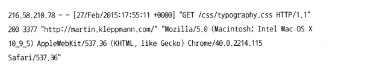

# 10장 일괄 처리

## 개요

- 온라인 시스템은 사용자가 요청을 보내고 응답을 기다린다고 가정한다
- 사용자가 오래 기다릴 수 없기 때문에, **응답 시간 단축에 노력**을 많이 기울인다
- 각 시스템을 유형 별로 구분하면 다음과 같다
    - **서비스 (온라인)**
        - 요청이 오면 바로 처리하고 응답한다
        - 성능 지표 → 지연시간과 가용성
    - **일괄 처리 (오프라인)**
        - 여러 건의 데이터를 모아 작업 으로 실행하고 결과를 산출한다
        - 성능 지표 → 처리량
    - **스트림 처리 (준실시간)**
        - 끊임없이 들어오는 데이터를 계속 소비 하고 결과를 산출ㄹ한다
        - 배치와 비슷한 개념이지만, **작은 단위로 지속 실행** 한다
- 일괄 처리는 왜 중요할까 ?
    - 대규모 데이터를 **신뢰성 있게**, **재현 가능하게**, **확장 가능하게** 돌리는 가장 단순한 구조
    - 대표 모델 → **MapReduce**, 이후 하둡, 카우치DB·몽고DB 등 다양한 시스템에 영향을 미침

## 유닉스 도구로 일괄 처리하기

- 로그 집계 예시



- 유닉스 파이프라인 예시

```sql
cat access.log | awk '{print $7}' | sort | uniq -c | sort -r -n | head -n 5
awk '{print $7}': 7번째 필드(URL)만 추출
sort | uniq -c: 정렬 후 개수 세기(중복 집계)
sort -r -n | head -n 5: 빈도 내림차순 상위 5개
```

- 동일한 작업을 파이썬 과 같은 스크립트 언어로도 처리가 가능하다
    - 파이프라인 → 조합/확장이 쉽다
    - 스크립트 → 사람이 읽기 쉽고 유지보수에 강점

### 정렬과 인메모리 집계

- 루비 스크립트는 URL 해시 테이블을 메모리에 유지하지만, 유닉스 파이프라인 에는 해시 테이블이 없다
- 두 가지 방식중 어떤것이 더 좋은지는, 데이터 양에 따라 다르다
    - URL 개수가 적어 인메모리 해시 테이블로 처리가 가능하면 가장 단순하고 빠르다
    - 데이터가 많아지면 정렬로 처리 하는것이 좋음
- 정렬 방식
    1. 로그를 청크로 나눠 각 청크를 메모리에 정렬한뒤, 디스크에 임시 파일로 기록
    2. 여러 정렬 청크를 병합 정렬로 최종적으로 합침
        
        → GNU `sort` 는 내부적으로 이 방식으로 메모리 부족 없이 큰 데이터 셋을 처리한다
        
    

### 유닉스 철학

- 하나의 프로그램은 한 가지 일에 집중
- 표준 화 된 인터페이스로 작성
    - 다른 프로그램의 입출력으로 사용될 수 있다 새악하고, 너저분해지면 안됨
- 파이프라인으로 구성
    - 작은 프로그램들을 연결해서 복잡한 작업을 단계화
- 느슨한 결합과 지연 바인딩
    - 어디서 입력이 들어오고, 어디로 나가는지 알 필요가 없다
    - 입력과 출력을 느슨하게 연결해 교체·확장이 용이
- **유닉스 도구가 성공적인 이유 ?**
    - 진행 사항을 파악하기가 상당히 쉽다
    - 유닉스 명령에 들어가는 파일은 불변적으로  처리 된다
    - 어느 시점이든 파이프라인을 중단하고 출력하여 디버깅이 가능하다
    - 특정 파이ㅣ플라인 출력을 파일에 쓰고, 그 파일을 다음 단계 입력으로 사용 가능하다
        - 다음 단계부터 재 시작이 가능해짐
- 유닉스 도구의 가장 큰 제약 → 단일 장비 에서만 실행 가능하다는 점

## 맵리듀스와 분산 파일 시스템

- 맵 리듀스
    - 대량 데이터를 여러 장비에서 병렬 처리 가능하게 해주는 프레임워크
    - 유닉스 도구처럼 단일 작업을 수행하지만, 수천 대의 서버에서 분산 실행이 가능하다
- 구조
    - 입력 → 맵 → 셔플 → 리듀스 → 출력 5 단계로 구성
- 처리 과정
    - 입력 : 파일을 읽어 레코드 단위로 나눔
    - 맵 : 각 레코드에서 키-값 쌍 추출
    - 셔플 : 동일 키를 가진 데이터를 한곳으로 모음
    - 리듀스 : 같은 키의 값을 합산.집계
    - 출력 : 결과 저장
- HDFS (Hadoop Ditributed File System)
    - GFS (Google File System) 을 구현한 오픈소스
    - 대량의 데이터를 여러 장비의 디스크에 분산 저장
- 구성요소
    - 네임 노드 : 파일의 메타데이터 관리
    - 데이터 노드 : 실제 데이터 저장
- 복제
    - 파일 블록을 여러 장비에 복제하여 장애에 대비
    - 리드 솔로몬 코드 와 같은 **삭제 코딩 방식**을 사용해 데이터 전체 복사 보다 효율적으로 손실된 데이터 복구 방식도 지원

### 맵리듀스 분산 실행

- 맵 리듀스는 여러 장비에서 동시에 실행이 가능
- 맵 태스크와 리듀스 태스크로 분리되어 실행 된다
    - 3개의 맵 태스크와 3개의 리듀스 태스크가 병렬로 수행 가능함
- 데이터 지역성 : 입력된 파일이 저장된 서버에서 작업이 실행되도록 스케줄링됨
    - 네트워크 부하 감소


### 맵리듀스 워크플로

- 맵리듀스 작업 하나로 해결가능한 문제 범위는 제한적
- 여러 맵리듀스 작업을 연결하여 더 복잡한 문제 해결 가능
    - 이는 매우 일반적임
- ex)
    1. URL 당 요청수 계산
    2. 요청수 기준으로 상위 URL 정렬
- 스케쥴러 도구 : Oozie, Azkaban, Luigi, Airflow, Pinball 등

→ 여러 작업의 실행 순서와 의존성을 관리 해줌

### 리듀스 사인 조인과 그룹화

- 조인 : 여러 데이터셋에서 서로 연관된 레코드를 결합하는 과정
- 관계형 모델 : 외래키 사용
- 문서 모델 : 문서 참조
- 그래프 모델 : 간선
- 완전 비정규화로 조인을 없애는 것은 어렵다
- **맵 리듀스의 조인**
    - 맵 리듀스에서는 일반적인 데이터베이스의 인덱스 개념이 없다
    - 조인시 전체 테이블 스캔으로 동작하게 된다
    - 모든 레코드를 순차적으로 읽어 여러 장비에서 병렬 처리한다
    - 이 방식은 대규모 데이터 분석에 효율적이다

### 사용자 활동 이벤트 분석 예제

- **활동 이벤트(activity event)**: 사용자의 행동 로그 (예: 클릭스트림 데이터).
- **사용자 데이터베이스(user database)**: 사용자 정보(이메일, 생년월일 등).
- 목표: 두 데이터를 **사용자 ID 기준으로 조인**하여, 예를 들어 연령대별 웹 페이지 이용 패턴을 분석


- 조인을 가장 간단하게 구현하는 방식
    - 하나씩 훑으면서 나오는 모든 사용자 ID 마다 원격 서버에 있는 사용자 데이터베이스에 질의
    - 네트워크 부하도 있고, 지역 캐시 효율성은 데이터 분포에 크게 좌우 된다
- 더 좋은 방법은 사용자 데이터 베이스의 사본을 가져와 이벤트 로그가 있는 분산 파일 시스템에 넣어 처리하는 방식
    - 동일 HDFS 에 존재하기 대문에 효율적으로 처리가 가능하다

### 정렬 병합 조인

- **매퍼:** 사용자 ID를 키로 추출 (활동 이벤트와 사용자 DB 모두 동일 키 사용).
- **리듀서:** 같은 사용자 ID를 기준으로 두 데이터셋을 결합.
- **정렬(sorting)** 과 **병합(merging)** 을 통해 수행됨.
- 결과: 예를 들어 “URL별로 본 사람의 연령 분포(viewer-age distribution)” 계산 가능.


- 리듀서는 동일 사용자 ID의 모든 레코드를 한 번에 처리
- 메모리에 유지 가능할 경우 **네트워크 전송 불필요** → 효율성 향상
- 이 구조는 **정렬 병합 조인(sort-merge join)** 알고리즘에 해당

### 같은 곳으로 연관된 데이터 가져오기

- 병합 정렬 조인중 매퍼 / 정렬 프로세스는 **동일 키(예: 사용자 ID)를 가진 모든 데이터를 한 리듀서로 모음**
- 리듀서가 사용자 단위로 데이터를 처리하므로 **부하를 줄이고 효율 향상**
- 이 과정을 **“메시지 전달(Message Passing)” 구조**로 볼 수도 있음
    - 키는 “주소”, 값은 “메시지” 역할.

### 그룹화

- 관련 데이터를 한 곳에 모으는 것은 SQL의 `GROUP BY`와 유사한 연산
- 같은 키를 가진 레코드를 한 그룹으로 묶어 집계 수행하는 예시는 다음과 같다
    - COUNT(*) → 레코드 수 세기
    - SUM(fieldname) → 필드 값 합산
    - 상위 N개의 레코드 선택
- **세션화(Sessionization):** 사용자의 일련의 활동을 시간 순서로 묶어 분석
    - 예: 웹사이트 방문 → 클릭 → 구매까지의 흐름 추적

### 쏠림 다루기

- 특정 키(예: 인기 인플루언서 ID)에 데이터가 몰리면 **핫 키(Hot Key)** 현상 발생
    - **린치핀 객체 (linchpin object)** 라고도 한다
- 일부 리듀서에 과도한 부하가 발생하여 전체 작업이 지연된다
- 해결 방법
    1. **샘플링(Skewed Join) / 쏠린 조인**
        - 미리 샘플 데이터를 분석해 핫 키를 감지하고 여러 리듀서에 분산한다
    2. **공유 조인(Shared Join)**
        - 샘플링 작업 대신 **핫 키를 명시적으로 지정**한다
        - 핫 키를 가진 데이터를 여러 리듀서에 동시에 복제하여 병렬 처리한다
    3. **맵 사이드 조인(Map-Side Join)**
        - 핫 키를 테이블 메타데이터에 명시적으로 지정, **핫 키 관련 레코드를 별도로 저장**한다

## 맵 사이드 조인

- 이전 까지 살펴본 여러 조인 방식은 조인을 리듀서에서 수행하기 때문에 리듀서 사이드 조인이라고 한다
    - 입력 데이터가 어떤 형태던 매퍼는 데이터를 조인할 수 있다
    - 정렬후 리듀서로 입력을 병합하는 과정에서 드는 비용이 크다
- 맵 사이드 조인은 리듀서에서 수행되는 리듀스 사이드 조인 보다 빠른 접근 방식
    - 특정 조건 (입력 데이터 크기 또는 구조) 에 따라 맵 단계에서 바로 조인을 수행한다
- 리듀서 단계를 거치지 않아 빠르고, 네트워크 비용 절감
- 입력 데이터에 대한 **사전 정렬과 파티셔닝**이 필요하고, **조인 대상이 메모리에 올라갈만큼 작아야 한다**

### 브로드캐스트 해시 조인

- 작은 데이터셋 전체를 각 맵 테스크 메모리에 브로드캐스트하여 큰 데이터셋과 조인하는 방식
- 작은 테이블들을 모든 맵 노드에 복사하고, 각 맵이 메모리 내 해시 테이블로 빠르게 조인을 수행한다
- 리듀스 단계가 불피룡하고, 조인 속도가 매우 빠르다
- 맵 사이드 조인과 동일하게 **조인 대상이 메모리에 올라갈 만큼 작아야 한다**

### 파티션 해시 조인

- 양쪽 입력 데이터를 동일한 기준 (해시 함수) 로 파티셔닝 한 뒤, 각 파티션 내에서 독립적으로 조인을 수행하는 방식
- **각 맵 테스크가 자신의 파티션**만 읽고, 전체 데이터를 한 번에 로드할 필요가 없다
- 대규모 데이터에 적합하며 데이터 재활용 및 I/O 비용 절감
- 하이브 에서는 **버킷 맵 조인**이라고도 한다

### 맵 사이드 병합 조인

- 두 입력 데이터셋이 동일한 키로 정렬되어 있을 때, 맵 단계에서 병합을 수행하는 방식
- 리듀서 단계 없이 수행 가능하고, 기존 맵 리듀스 병합 정렬 결과를 재활용 가능하다
- 성능이 빠르고 디스크 접근을 최소화하는 방식이며, 이미 정렬된 데이터를 활용할때 유용하다

### 맵 사이드 조인을 사용하는 맵 리듀스 워크플로

- **리듀스 사이드 조인**은 모든 데이터를 파티셔닝·정렬 후 리듀서에서 처리하지만, **맵 사이드 조인**은 미리 정렬된 데이터를 이용해 맵 단계에서 처리한다
- **브로드캐스트 조인**은 큰 입력 파일을 여러 맵 태스크에 나누어 병렬로 처리한다

### 일괄 처리 워크플로의 출력

- 모든 작업이 끝난 후 최종 결과를 안정적으로 저장하고, 필요 시 재실행 가능하게 만들어야 한다
- 트랜잭션 DB(OLTP)와 달리 분석용 출력 구조 (집계, 통계, 리포트 등)
- 중간 결과가 아닌 **최종 산출물 중심**
- 실패 시 재실행으로 보장 (human fault tolerance)

### 검색 색인 구축

- **검색 엔진 색인 과정도 맵리듀스 워크플로의 예시**
- 문서 집합을 파티셔닝 → 각 파티션을 리듀서가 처리 → 키워드 기반 색인 생성
- 일괄 처리 특성상 **전체 문서 집합을 주기적으로 색인**하거나 **변경분만 갱신** 가능

### 일괄 처리 출력의 저장 방식

- **결과를 데이터베이스나 파일 시스템에 저장**
- 예시:
    - HBase bulk loading
    - Voldemort, Terrapin, ElephantDB 등 분산 DB에 저장
- **특징:**
    - 불변성(immutable) 유지
    - WAL(Write-Ahead Logging) 불필요 → 성능 우수

### 일괄 처리 출력에 관한 철학

- 유닉스 철학과 동일하게 **“입력을 읽고 출력을 내놓는다”** 원칙 유지
- 출력은 이전 버전을 덮어쓰거나 새 버전으로 교체
- **인적 내결함성(human fault tolerance)**:
    - 코드 오류나 버그 발생 시 이전 버전으로 쉽게 복원 가능
- **비가역성 최소화(minimizing irreversibility)**:
    - 수정이 필요하면 새 실행으로 덮어쓰기
    - 쉽게 돌릴 수 있는 속성의 결과로 실수를 하면 그러지 못한 환경보다 기능 개발을 빠르게 진행할 수 있다

## 하둡과 분산 데이터베이스의 비교

- 대규모 병렬 처리 (MPP) 개념을 기반으로 한다
- 클러스터 내 여러 노드를 활용해 병렬 분산 처리를 수행한다
- 하둡의 맵리듀스는 MPP 데이터베이스와 유사한 방식으로 데이터를 병렬로 처리

| 구분 | Hadoop | MPP Database |
| --- | --- | --- |
| 구조 | 유닉스 기반의 분산 파일 시스템(HDFS) 위에서 동작 | 통합된(monolithic) SQL 기반 분석 DB |
| 처리 방식 | 맵리듀스 프로그래밍으로 유연한 처리 | SQL 쿼리를 통한 고성능 질의 처리 |
| 사용 목적 | 범용적인 데이터 처리, 비정형 데이터 가능 | 정형 데이터 중심의 분석 질의 |
| 유연성 | 프로그래밍 자유도 높음 | 사전 정의된 쿼리 최적화에 강점 |
| 복구/오류 처리 | 태스크 단위 복구 가능 | 전체 쿼리 재실행 필요 |

### 저장소의 다양성

- **Hadoop**
    - 파일 단위 저장, **데이터 형식에 제약 없음.**
    - 텍스트, 이미지, 비디오, 센서 로그 등 어떤 형태든 저장 가능
    - “데이터를 어떻게 처리할지는 나중에 생각한다” → **Dump-first 접근**
    - **Schema-on-read**: 읽을 때 스키마를 적용
    - 즉, 원본 데이터를 그대로 저장하고 분석 시점에 구조화
- **MPP 데이터베이스**
    - 관계형 또는 정형 데이터 모델 사용
    - 데이터를 저장하기 전에 **엄격한 스키마 정의(schema-on-write)** 필요
    - SQL 질의 성능을 위해 사전에 모델링된 형태로 저장
    - ETL(Extract-Transform-Load) 과정이 중요
- 하둡의 **데이터 호수(Data Lake)** 개념 ↔ MPP의 **데이터 웨어하우스(Data Warehouse)** 개념
- 하둡은 데이터 형식을 자유롭게 보관하고 필요 시 가공, MPP는 가공된 데이터 중심으로 빠른 질의 성능 제공.
- **스시 원칙(Sushi Principle)**: “원시 데이터가 더 좋다” → 변환 전 데이터를 그대로 보존.

### 처리 모델의 다양성

- **MPP 데이터베이스**
    - 단일 구조(monolithic)로 tightly coupled 환경.
    - 질의 최적화를 통해 빠른 응답속도 보장.
    - SQL 기반 → Tableau 같은 BI 도구와 통합 용이.
    - 그러나 **비SQL형 처리(예: 머신러닝, 자연어 처리)** 는 제한적.
- **Hadoop / MapReduce**
    - SQL 외의 다양한 처리(기계학습, 텍스트 분석, 로그 분석 등)에 유리.
    - 엔지니어가 직접 코드 작성 가능.
    - Hive, Pig 등은 SQL형 처리를 지원하여 MPP와 유사한 접근 제공.
    - 단, 초기 MapReduce는 성능과 사용 편의성 측면에서 한계 존재.
- MPP → 빠른 질의, 정형 데이터 분석
- Hadoop → 범용 처리, 비정형/대옹량 데이터 처리

### 빈번하게 발생하는 결함을 줄이는 설계

- **MPP 데이터베이스**
    - 장비 장애 시 전체 쿼리 중단됨
    - 자동 재시작 도는 질의 재제출 필요
    - 디스크 비용 절감을 위해 **in-memory 처리 선호**
- **Hadoop**
    - 맵/리듀스 **태스크 단위 복구 가능.**
    - 일부 태스크가 실패해도 전체 작업에 영향 없음.
    - 디스크 기반으로 중간 데이터를 기록하여 **복원력 우수.**
    - 하지만 메모리 사용이 많고 속도는 다소 느림.

### 맵 리듀스가 설계된 배경

- Hadoop은 CPU, RAM, 디스크 등의 **클러스터 자원 관리**를 YARN이 담당.
- **우선순위 기반 스케줄링(capacity scheduler)** 으로 리소스를 배분.
- 우선순위가 높은 태스크가 더 많은 자원을 요청 가능.
- 낮은 우선순위 태스크는 비활성화되거나 대기 상태로 전환 가능.
- 클러스터 자원을 효율적으로 활용해 전체 처리량 극대화.
- 낮은 우선순위 태스크가 자원을 잠시 초과 사용할 수도 있음.
- 유휴 자원을 재활용해 시스템 효율을 높임.
- 구글, YARN, Mesos, Kubernetes 등의 클러스터 관리 시스템에서 활용.

## 맵 리듀스를 넘어

분산 시스템에서 가능한 여러 모델 중 **단 하나의 모델**

- **단순하지만 명확한 모델**
    
    → 학습과 이해는 쉬우나, 복잡한 연산을 구현하기 어려움.
    
- 원시 API 사용 시 **조인·그룹화·복잡한 파이⁹프라인 구현이 번거로움.**
- 이를 보완하기 위해 고수준 프로그래밍 모델 등장:
    
    **Pig, Hive, Cascading, Crunch 등**
    

### 중간 상태 구체화

- 맵리듀스는 각 단계의 결과를 **분산 파일 시스템(HDFS)**에 저장.
- 다음 단계의 입력으로 사용될 때마다 파일을 다시 읽어야 함 → **I/O 비용 증가.**
- **중간 상태**
    - 한 워크플로 안에 존재하는 임시 결과.
    - 복잡한 작업일수록 중간 결과가 많아지고, 전체 실행 시간이 길어짐.
- **구체화**
    - 중간 결과를 파일로 저장하는 과정.
    - 안정성과 복구에는 유리하지만, **속도 저하의 주요 원인.**
- **스트리밍(Streaming) 접근**
    - 중간 데이터를 파일로 저장하지 않고 **메모리 버퍼를 통해 직접 전달.**
    - 데이터플로 엔진은 이 방식으로 속도를 극적으로 개선.

### 데이터 플로 엔진

- 맵리듀스의 한계를 극복하기 위해 **Spark, Tez, Flink** 등의 새로운 엔진 등장.
- 전체 워크플로를 독립된 단계로 나누지 않고 **하나의 연결된 데이터 흐름**으로 처리.
- 데이터를 여러 처리 단계로 **파이프라인(pipeline)** 형태로 연결.
- 각 함수(연산자, operator)가 데이터를 입력받고 즉시 다음 함수로 전달.
- 맵리듀스처럼 “맵 → 리듀스”의 고정 구조가 아님.

### 내결함성

- 맵리듀스는 **모든 중간 결과를 파일로 저장** → 복구는 쉬우나 느림.
- 데이터플로 엔진은 **메모리 중심** → 빠르지만 복구 어려움.
- **Spark / Flink 의 복구 방식**
    - 작업 이력을 추적하여 실패 시 재실행 가능.
    - **RDD 계보(lineage)** 를 통해 원본 데이터로부터 결과를 재계산
- **결정적 연산**
    - 동일 입력에 항상 동일한 결과를 내야 함.
    - 비결정적 연산(예: 랜덤, 외부 API 호출)은 복구 불가능 → 주의 필요.

### 구체화에 대한 논의

- 데이터플로 엔진은 **유닉스 파이프라인과 유사한 방식.**
    - 한 연산자의 출력이 바로 다음 연산자의 입력으로 전달됨.
- 중간 결과를 완전히 저장하지 않아 속도 빠름.
- 그러나 **최종 결과나 재사용 가능한 출력**은 분산 파일 시스템에 저장함.

### 그래프와 반복 처리

- **그래프 처리의 필요성**
    - 데이터 간의 관계 분석(예: **페이지랭크, 추천 시스템**)에서 중요.
    - 반복 계산(특정 값이 수렴할 때까지)을 반복적으로 수행해야 함.
- **맵리듀스의 한계**
    - 모든 반복마다 전체 데이터셋을 다시 읽음 → **비효율적.**
    - 결과가 바뀌지 않은 데이터까지 다시 계산함.
- **데이터 플로 엔진의 접근**
    - 그래프를 **DAG(방향성 비순환 그래프)** 로 표현.
    - 연산자 간 데이터 흐름을 그래프 형태로 모델링.
    - 반복 시 변경된 부분만 다시 계산 → **효율성 향상.**
- **알고리즘 : 이행적 폐쇄**
    - 그래프 내 모든 연결 관계를 찾기 위해 반복 수행.
    - 데이터플로 엔진에서는 이를 효율적으로 수행.

## 프리글 처리 모델

- 그래프 처리의 효율적 병렬화 모델로 **BSP (Bulk Synchronous Parallel)** 모델 기반
    - **Apache Giraph**
    - **Spark GraphX**
    - **Flink Gelly**
    - Google의 **Pregel** (원조 모델)
- 각 노드(정점, vertex)가 **다른 정점으로 메시지를 주고받으며 연산** 수행.
- 맵리듀스처럼 “리듀서”가 아닌 “정점 간 메시지 전달” 구조.
- 각 정점은 이전 반복(슈퍼스텝, superstep)에서 받은 메시지를 처리 후, 다음 반복 시 새로운 메시지를 보냄.

### 내결함성

- 메시지 손실·중복 방지를 위해 **체크포인트(checkpoint)** 사용.
- 각 반복이 끝날 때 정점의 상태를 디스크에 저장.
- 장애 발생 시 해당 시점으로 복구 가능.

### 병렬 실행

- 정점은 특정 장비에 종속되지 않으며 자유롭게 분산 배치됨.
- 메시지는 **정점 ID 기반 라우팅**으로 다른 장비의 정점으로 전송됨.
- 프리글 프레임워크가 메시지 전달과 파티셔닝 자동 처리.

### 고수준 API 와 언어

- 맵리듀스의 저수준 API는 복잡하고 난이도가 높음.
- 따라서 하이브, 피그, 캐스케이딩 같은 **고수준 프로그래밍 모델**이 등장.
- Tez, Spark 등의 발전으로 **고수준 언어 기반 데이터플로 API**가 확산.
- 관계형 데이터베이스처럼 **빌딩 블록 연산자(operator)** 를 제공.
- 예시 연산자:
    - 필터링, 그룹화, 조인, 정렬, 집계 등
- 내부적으로는 맵리듀스처럼 동작하지만,
    
    사용자에게는 SQL과 유사한 형태로 추상화됨.
    
- 코드를 적게 작성해도 명확하고 직관적인 작업 가능.
- 선언형(Declarative) 방식으로 **연산 최적화 자동 수행.**
- 고수준 인터페이스를 통한 **시스템 효율 향상 + 사용자 생산성 향상.**

### 선언형 질의 언어로의 전환

- 사용자가 “무엇을” 하고 싶은지만 명시하고, “어떻게”는 시스템이 결정.
- 즉, 조인·필터 등의 연산 방식을 직접 지정하지 않아도 됨.
- 하이브, 스파크 SQL, 플링크 등은 비용 기반 최적화(Cost-based Optimization, CBO)를 사용.
- 조인 순서, 중간 데이터 저장 여부 등을 자동으로 조정.

### 데이터 플로 엔진과 SQL 융합

### 결합의 특징

- 데이터플로 엔진은
    
    조인·그룹화 외에도 **선언형 연산**을 지원하면서도
    
    명령형 코드 호출 기능을 포함.
    
- Spark의 DataFrame, Dataset API, Flink의 Table API가 대표적.

### ⚙️ 내부 동작

- 내부적으로는 **벡터화(Vectorized) 처리**와 **JVM 바이트코드 최적화**를 사용.
- CPU 캐시 효율성을 극대화하며 데이터 반복 접근 최소화.

### 다양한 분야를 지원하기 위한 전문화

### 📊 통계 및 수치 분석

- 분산 통계 연산, 회귀 분석, 머신러닝 모델 학습 등에서 활용.
- Apache Mahout: Hadoop/Spark/Flink에서 실행 가능한 머신러닝 라이브러리.
- MADlib: MPP 데이터베이스(Hawq 등)에 통합된 통계 라이브러리.

### 📍 공간 알고리즘 (Spatial Algorithms)

- **k-최근접 이웃(k-nearest neighbor, kNN)**
    
    → 유사 아이템 검색, 추천 시스템, 유전자 분석 등에서 사용.
    
- 반복적이고 계산량이 많은 알고리즘을 분산 시스템에서 효율적으로 수행.
- **맵리듀스 → 데이터플로 엔진 → 프리글 모델**
    
    로 이어지는 발전은 **일괄 처리 시스템의 고도화**를 보여줌.
    
- 핵심 변화는 다음과 같음:
    1. 중간 상태 파일 저장 → 메모리 파이프라인 전달
    2. 명령형 API → 선언형 언어
    3. 단일 연산 모델 → 다양한 연산자와 반복 처리 지원
- 오늘날 Spark, Flink, GraphX 등은 이 모든 진화의 결과물로
    
    **범용 분산 데이터 처리 플랫폼**으로 자리잡음.
