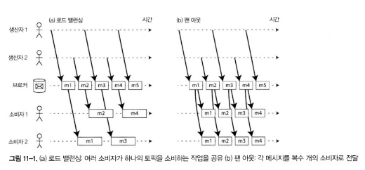
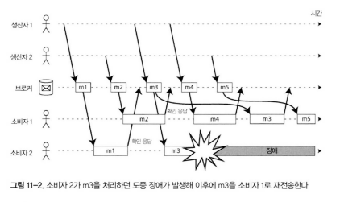
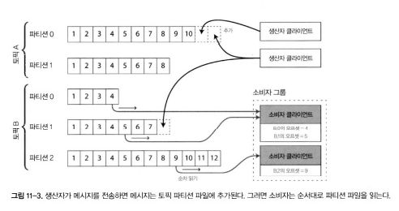
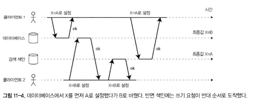
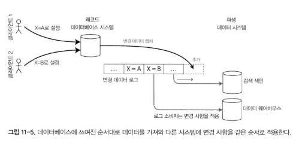
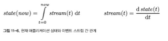
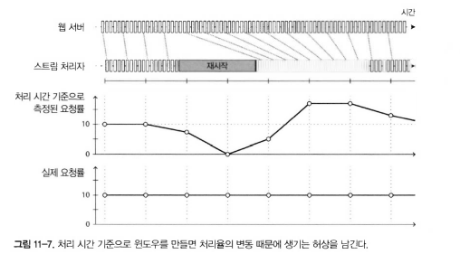

# 🔴 스트림 처리

- **스트림 처리**
    - **입력 처리(Input Processing)** 는 입력으로부터 파일 집합을 읽어 새로운 파일 집합을 생성하는 기술
    - 출력은 **배치 데이터(batch data)** 형태로, 재실행이 가능하고 완전한 데이터셋을 기반으로 함.
    - 반면 **스트림 처리(stream processing)** 는 끊임없이 생성되는 데이터를 실시간으로 처리하는 방식
- **이번장에서는**
  - 스트림이란 단어는 유닉스의 stdin/stout, 프로그래밍의 lazy lists, java의 FileInputStream과 같은 파일 시스템 API, TCP 연결, 인터넷 상 오디오와 비디오 전송 등 많은 곳에서 등장한다.
  - 이번장은 데이터 관리 메커니즘으로 이벤트 스트림을 설명한다.
  - 스트림을 표현하는 방법, 저장하는 방법, 네트워크 상에서 전송하는 방법이다.


# 🔴 이벤트 스트림 전송

- **이벤트 스트림 전송**
    - 입력 처리 환경에서 작업은 입력을 읽어와 분석하고 출력하는 흐름으로 동작함.
    - 스트림 처리에서는 **이벤트(event)** 가 지속적으로 발생하고, 각 이벤트는 분석 혹은 처리를 통해 소비자에게 전달됨.
      - 생산자(producer, =publisher/sender)가 이벤트를 만들면 소비자(consumer. =subscriber/recipient)
      - 파일 시스템에서는 파일 이름으로 식별하지만 스트림 시스템에서는 topic이나 stream으로 이벤트를 묶는다.
    - 이러한 이벤트 흐름을 관리하고 전달하기 위해 **이벤트 스트림(event stream)** 과 **메시징 시스템(messaging system)** 이 활용됨.
    - DB는 알림 메커니즘을 지원하지 않는데, RDB에는 보통 trigger 기능이 있고, 그 외에도 이벤트 알림 전달 목적으로 개발된 도구들이 있다.


## 🟠 메세징 시스템

- **메세징 시스템**
    - 이벤트를 생성하는 쪽(생산자, producer)과 이를 소비하는 쪽(소비자, consumer) 사이의 데이터 전송을 담당
    - 생성자는 메시지를 **메시징 시스템**에 전송하고, 소비자는 이 시스템을 통해 메시지를 수신함.
    - 메시지는 일반적으로 **토픽(topic)** 단위로 스트림 형태로 관리됨.

- **구성 요소**
    - **생산자(Producer)**: 이벤트 혹은 메시지를 발행(publish)
    - **소비자(Consumer)** 또는 **구독자(Subscriber)**: 메시지를 수신(subscribe)
    - **토픽(Topic)**: 메시지 스트림이 전달되는 채널 개념

- **메세징 시스템을 구축하는 가장 간단한 방법**
  - 유닉스 파이프나 TCP연결과 같이 직접 통신 채널을 사용
  - 유닉스 파이프와 TCP는 전송자 하나를 수신자 하나에 연결한다.
  - 대부분 메세징 시스템은 이 모델에서 확장한다.
  - 메세징 시스템은 다수 생산자 노드가 같은 토픽으로 메세지를 전송할 수 있고 다수 소비자 노드가 토픽 하나에서 메세지를 받아갈 수 있다.

- **발행/구독(publish/subscribe) 모델에서 위 두가지 모델을 구분하는 질문**
  - 생산자가 소비자 메세지를 처리하는 속도보다 빠르게 메세지를 전송한다면?
    - 메세지를 버린다.
    - 큐에 메세지를 버퍼링한다. 
    - 배압(backpressure)/흐름 제어(flow controller)을 적용한다.
      - 유닉스 파이프와 TCP는 배압을 사용한다.
      - 버퍼가 가득 차면 수신자가 버퍼에서 데이터를 가져갈 때까지 전송자를 막는다.
  - 노드가 죽거나 일시적으로 오프라인이 된다면 어떻게 될까? 손실되는 메세지가 있을까?
    - DB 처럼 지속성을 갖추려면 디스크에 기록하거나 복제본을 생성하거나 둘 모두를 해야 한다.
      - 이것은 비용이 든다.
    - 때로는 메세지를 잃어도 괜찮다면 하드웨어 처리량은 높이고 지연시간은 낮출 수 있다.

### 🟢 생산자에서 소비자로 메세지를 직접 전달하기

- **직접 연결 방식**
    - 일부 메시징 시스템은 생산자가 소비자와 직접 네트워크 연결을 맺고 데이터를 전송함.
    - 예: UDP, ZeroMQ, gRPC 등의 기술
    - **장점**: 빠른 속도와 낮은 지연(latency)
    - **단점**: 소비자 장애 시 데이터 손실 위험이 있음.

- **직접 전송 방식의 한계**
    - 생산자와 소비자가 항상 동시에 연결되어야 함.
    - 네트워크 불안정, 소비자 장애 시 메시지 유실 발생 가능
    - 이러한 문제를 해결하기 위해 **중간 저장소(버퍼 역할)**인 메시지 브로커가 등장함.

### 🟢 메세지 브로커

- **역할**
    - 생산자와 소비자 사이에서 메시지를 중계하는 시스템
    - 메세지 큐 라고도 함.
    - 생산자는 브로커에 메시지를 전달하고, 소비자는 브로커로부터 읽어감.
    - 생산자와 소비자의 시간적 분리를 지원 (비동기 처리)

- **특징**
    - 브로커에 데이터가 모이기 때문에 시스템은 클라이언트의 상태 변경에 쉽게 대처할 수 있다.
      - 지속성 문제는 브로커가 담당하기 때문.
        - 어떤 메세지 브로커는 메모리에만 메세지를 보관한다.
        - 반면, 다른 브로커는 장애에 대비하여 디스크에 메세지를 기록한다.
        - 소비 속도가 느린 소비자가 있으면 브로커는 큐가 제한 없이 계속 늘어나게 한다.
        - 등과 같이 지속성 관련한 문제는 브로커가 담당한다.
    - 메시지를 **내구성 있게 저장**해 장애 발생 시에도 데이터 손실을 최소화
    - **백프레셔(backpressure)** 를 완화하여 생산속도와 소비속도를 균형 있게 유지
    - 브로커가 큐(queue) 또는 로그(log) 형태로 메시지를 저장함.

- **장점**
    - 생산자·소비자 간 느슨한 결합(loose coupling)
    - 시스템 안정성 및 신뢰성 향상
    - 확장성 있는 메시지 분배 가능

### 🟢 메세지 브로커와 데이터베이스의 비교

| 항목 | 메시지 브로커 | 데이터베이스 |
|------|----------------|---------------|
| **목적** | 실시간 데이터 전송 및 이벤트 전달 | 영구 저장 및 질의 수행 |
| **데이터 접근 방식** | 스트림 기반, 순차 접근 | 쿼리 기반, 임의 접근 |
| **일관성 모델** | 최종 일관성(eventual consistency) 중심 | 강한 일관성(strong consistency) 가능 |
| **활용 사례** | 로그 수집, 이벤트 처리, 실시간 분석 | 트랜잭션, 조회, 배치 처리 |

- 메시지 브로커는 트랜잭션 관리나 질의보다는 **전달 지연 최소화와 내구성 확보**에 초점
- 데이터베이스는 반대로 **정확성과 영속성**을 보장하지만 **실시간성**은 떨어짐
- 위와 같은 메세지 브로커 관점으로 JMS, AMQP와 같은 표준으로 캡슐화되어 여러 소프트웨어로 구현되었다.
  - RabbitMQ, ActiveMQ, Qpid, HornetQ, TIBCO, IBM MQ, Azure Service Bus, GPC Pub/Sub 등
  - JMS(Java Message Service) : java messaging system 명세
  - AMQP(Advanced Message Queuing Protocol) : 메세지 브로커와 클라이언트 간 통신 프로토콜 표준 규격

### 🟢 복수 소비자


- **복수 구독 모델**
    - 동일한 메시지 스트림을 여러 소비자가 읽을 수 있음.
    - 두 가지 주요 모델 존재:
        1. **로드 밸런싱 모델**: 각 메시지가 여러 소비자 중 하나에게만 전달 (작업 부하 분산)
        2. **팬아웃 모델**: 모든 소비자가 동일한 메시지를 수신 (브로드캐스트)
    - 이 두가지 패턴은 함께 사용 가능하다.
      - 두개의 소비자 그룹에서 하나의 토픽을 구독하고 각 그룹은 모든 메세지를 받지만 그룹 내에서는 각 메시지를 하나의 노드만 받게 하는 방식이다.

### 🟢 확인 응답과 재전송


- **문제 상황**
    - 소비자가 메시지를 처리하지 못하거나 장애가 발생할 수 있음.
    - 메시지가 손실되거나 중복 처리될 위험 존재
    - 그림과 깉이 장애 발생시 메세지 간 인과성이 있다면 매우 중대한 문제가 발생한 경우다.

- **해결 메커니즘**
    - 브로커는 메시지 전달 시 **확인 응답(acknowledgment)** 을 기다림.
    - 응답이 없을 경우 **재전송(retry)** 수행
    - 소비자는 처리 완료 후 **커밋(commit)** 형태로 확인을 전송
    - 메세지 순서가 바뀌지 않도록 해결하기 위한 방법은 이번장 후반부에 다룬다.

## 🟠 파티셔닝된 로그

- **파티셔닝된 로그**
  - 위에서 설명한 AMQP/JMS 방식의 메세징 처리는 소비자에게 전달 된 즉시 삭제된다.
    - 영구적으로 보관하는 DB와는 반대되는 접근법이다.
    - 새로운 소비자를 추가하면 지나간 메세지는 다시 복구할 수 없다.
    - 이러한 문제를 해결하기 위해 제안된 방법이 로그 기반 메세지 브로커이다.
    - 기존 메시징 시스템은 메시지를 일시적으로만 저장했지만, **로그 기반 메시지 브로커(log-based message broker)** 는 메시지를 **디스크에 영구 저장**하여 신뢰성과 복구성을 확보함.

### 🟢 로그를 사용한 메세지 저장소


- **로그 구조**
  - 로그(log)는 **디스크에 순차적으로 저장되는 구조**로, 새로운 메시지는 항상 로그의 끝에 추가됨.
  - 생산자가 보낸 메시지는 로그에 추가되고, 소비자는 순차적으로 읽음
  - 이 구조는 유닉스 도구의 `tail -f`처럼 파일에 새로 추가되는 내용을 지속적으로 읽는 것과 유사함.

- **효율성**
  - 순차 쓰기(sequential write)를 기반으로 하여 랜덤 접근보다 훨씬 빠름
  - 복제 및 장애 복구 과정에서도 효율적으로 메시지를 유지할 수 있음.
  - 각 파티션 내 브로커는 모든 메세지에 오프셋이라 부르는, 단조 증가하는 순번을 부여한다.
    - Apache Kafka, Amazon Kinesis Stream, DistributedLog가 이런 방식으로 동작한다.

- **파티셔닝(Partitioning)**
  - 하나의 로그를 여러 파티션으로 분리해 병렬 처리와 처리량 향상을 도모
  - 각 파티션은 독립적으로 읽기/쓰기가 가능하며, 서로 다른 서버에 분산될 수 있음.
  - 동일한 형식의 메시지를 전송하는 파티션들은 **토픽(topic)** 단위로 그룹화됨.


### 🟢 로그 방식과 전통적인 메세징 방식 비교

| 구분 | 로그 기반 메시징 | 전통적 메시징(JMS/AMQP 등) |
|------|------------------|----------------------------|
| 메시지 저장 | 디스크 로그에 영구 저장 | 큐에서 소비 시 삭제 |
| 순서 보장 | 파티션 내에서 순서 보장 | 개별 메시지 단위 처리로 순서 보장 어려움 |
| 소비 방식 | 여러 소비자 그룹이 독립적으로 동일 로그를 읽음 | 각 메시지는 한 소비자에게만 전달 |
| 복구 | 로그를 통해 재처리 가능 | 처리 실패 시 재전송 필요 |
| 처리 효율 | 배치 및 병렬 처리에 적합 | 실시간 단건 처리 중심 |

- 로그 기반 메시징은 **소비자가 서로 영향을 주지 않고 독립적으로 메시지를 처리**할 수 있음.
- JMS/AMQP는 메시지 단위 전송에 적합하지만, 처리량이 많은 시스템에서는 로그 기반 방식이 효율적임.


### 🟢 소비자 오프셋

- **정의**
  - 소비자가 파티션 내에서 **어디까지 메시지를 처리했는지를 나타내는 지표**
  - 오프셋(offset)은 숫자로 표현되며, 소비자의 처리 위치를 추적 가능하게 함.

- **작동 방식**
  - 소비자는 메시지를 순차적으로 처리하며, 현재 처리된 위치를 오프셋으로 기록
  - 장애 복구 시 오프셋을 참조해 중단된 지점부터 재처리할 수 있음.
  - 오프셋 정보는 **별도의 데이터베이스**나 **브로커 내부에 복제 저장**되어 유지됨.

- **문제**
  - 소비자 노드에 장애가 발생하면 그룹 내 다른 노드가 메세지를 처리한다. 그후 장애가 발생한 소비자가 아직 오프셋을 기록 못했기 때문에 재시작 할때 2번 처리하게 된다.
  - 이 문제는 후반주에 다시 다룬다.

### 🟢 디스크 공간 사용

- **문제**
  - 로그가 무한히 추가되면 결국 디스크 공간이 소진됨.
  - 오래된 메시지를 삭제하거나 다른 저장소로 이동하는 **보관 정책(retention policy)** 이 필요
  - 너무 뒤쳐진 소비자는 삭제된 메세지를 읽지 못하는 경우가 발생함.

- **해결 방법**
  - 오래된 데이터를 자동으로 삭제하여 처리함.
  - 이러한 방법은 **순환 버퍼(circular buffer)** 또는 **링 버퍼(ring buffer)** 이라함.

- **성능 고려**
  - 일반 하드디스크(예: 6TB, 150MB/s) 기준으로 11시간 동안 발생한 메세지를 버퍼링할 수 있다.
  - 실제로 디스크 대역폭을 전부 사용하는 경우는 드물다.
  - 그래서 일반적으로는 하드디스크 버퍼에 수 일 ~ 수 주간 메세지를 보관할 수 있다.
  - 하지만, 메세지를 저장해야하는 시스템이므로 성능을 고려하여 사용해야 한다.

### 🟢 소비자가 생산자를 따라갈 수 없을 때

- **문제 상황**
  - 소비자가 처리 속도가 느려 생산자의 메시지 생성 속도를 따라가지 못하면, 브로커의 버퍼가 가득 찰 수 있음.
  - 이 경우 오래된 메시지를 삭제하거나 덮어쓰는 버퍼링 전략(buffering strategy)이 필요

- **해결책**
  - 버퍼 크기와 보관 기간(retention time)을 조정해 메시지 손실을 최소화
  - 소비자가 너무 느릴 경우, 브로커는 오래된 메시지를 버리고 새 메시지만 유지

- **운영적 고려**
  - 특정 소비자가 느려도 다른 소비자 그룹에는 영향 없음
  - 로그 기반 메시징 시스템은 각 소비자 그룹이 독립적으로 작동하기 때문

### 🟢 오래된 메세지 재생

- **기존 방식의 한계**
  - AMQP/JMS 시스템에서는 메시지가 소비되면 큐에서 삭제되어 재처리 불가.
  - 재전송이 필요한 경우 복잡한 트랜잭션 관리가 필요했음.

- **로그 기반의 장점**
  - 로그를 삭제하지 않기 때문에, **필요 시 과거 메시지를 재처리(replay)** 가능.
  - 소비자는 오프셋을 과거로 이동시켜 특정 시점부터 메시지를 다시 읽을 수 있음.
  - 예: 장애 복구, 데이터 재분석, 테스트 재실행 등에 활용.
  - 과거 데이터를 쉽게 재활용할 수 있어 데이터 일관성 유지 및 복구에 강점이 있음.

# 🔴 데이터베이스와 스트림

- **핵심 개념**
  - 메시지 브로커와 데이터베이스는 전통적으로 별개로 생각되었음.
    - 사용자의 행동 기반으로 이벤트가 생성된다는 아이디어 였음.
    - **이벤트 스트리밍** 아이디어는 두 시스템의 경계를 허물고 상호 통합을 가능하게 함.
  - 데이터베이스에 저장되는 변경 사항(event log) 자체를 스트림으로 다루면, 데이터베이스와 메시징의 역할을 결합할 수 있음.

## 🟠 시스템 동기화 유지하기

- **데이터 일관성 문제**
  - 여러 데이터 저장소에 동일한 데이터가 존재할 경우 **동기화(synchronization)** 가 필수
  - 데이터웨어하우스나 분석 시스템 등에서는 **ETL(Extract, Transform, Load)** 과정을 통해 주기적으로 데이터를 복제/변환



- **이중 기록(Dual Write) 문제**
  - 하나의 이벤트를 두 시스템(예: 데이터베이스와 캐시)에 동시에 기록해야 하는 경우 발생
  - 두 시스템 중 하나라도 실패하거나 지연되면 데이터 불일치 가능성이 커짐
  - 예시: 사용자 X가 ‘A’를 ‘B’로 바꾸는 작업을 수행했지만, DB에는 반영되었고 캐시에는 실패하는 상황

- **문제점**
  - 이중 기록은 **경쟁 조건(race condition)** 을 초래할 수 있음.
  - 각 시스템의 타임라인 불일치로 인해 일부 업데이트가 누락되거나 덮어쓰기 발생
  - 해결을 위해선 **트랜잭션(2PC)** 을 사용하지만 비용이 매우 큼
  - 색인용 인덱스를 데이터베이스의 팔로워로 만들어 실제 리더 하나만 존재하게 한다면 문제를 해결할 수 있을지도 모른다. 하지만 현재는 불가한거 같다.

## 🟠 변경 데이터 캡쳐 (CDC, change data capture)



- **개념**
  - 데이터베이스에서 발생한 모든 데이터 변경 사항(insert, update, delete)을 **캡처하여 외부 시스템에 전달**하는 기술
  - 데이터베이스의 내부 로그나 트랜잭션 로그를 활용해 변경 이벤트를 감지하고, 이를 다른 시스템에 스트림 형태로 전송
  - 메시징 시스템처럼 데이터베이스 변경을 실시간 스트림으로 전달할 수 있음.

### 🟢 변경 데이터 캡처의 구현

- **특징**
  - CDC는 메시지 브로커와 유사한 방식으로 작동하며, 데이터베이스의 변경 이벤트를 메시지처럼 다룸
  - 로그 기반 메시징과 동일하게 **순서 보장 및 내결함성**을 갖춤

- **구체적 구현 예시**
  - 트리거 기반(trigger-based) 접근: DB 트리거를 사용해 변경 사항을 감지
    - 고장나기 쉽고 성능 오버헤드가 상당하다.
  - 로그 기반 접근(log-based): DB의 트랜잭션 로그를 직접 읽음
    - 스키마 변경 대응 등 해결해야할 여러 문제가 있지만 트리거 방식보단 견고함.

- **대표 시스템**
  - **Debezium**, **Maxwell**, **Databus**, **Wormhole**, **Sherpa**, **Bottled Water** 등은 로그 기반 CDC를 제공.
  - 상용 솔루션으로는 **Oracle GoldenGate**, **MongoRiver**, **MySQL binlog** 등이 있음.

- **문제점**
  - CDC는 메세지브로커와 동일하게 비동기 방식으로 작동한다.
  - 즉, DB는 새로운 변경 사항을 커밋하기 전에 소비자에게 적용될 때까지 기다려주지 않는다.
  - 운영상 사용자가 데이터를 변경하는데 성능상 이점이 있다.
    - 소비자가 느리더라도 운영상 문제가 없기 때문이다.
  - 하지만 복제 지연의 모든 문제가 발생한다는 문제점이 있다.

### 🟢 초기 스냅샷

- **필요성**
  - CDC는 변경된 데이터만 추적하므로, 시스템 초기에는 전체 데이터의 복제본을 먼저 만들어야 함.
  - 즉, **스냅샷(snapshot)** 은 데이터베이스의 전체 상태를 외부 시스템에 처음 전송하는 단계

- **구현 방식**
  - 기존 데이터베이스를 읽어 로그의 기준 시점(offset)을 설정
  - 이후 CDC가 해당 시점부터 발생하는 모든 변경 이벤트를 스트림으로 전송

- **운영 고려**
  - 전체 데이터를 재생성하는 것은 비용이 크기 때문에, 효율적인 스냅샷 전략 필요
  - 일부 CDC 시스템은 스냅샷을 비동기적으로 진행하거나 부분적 스냅샷을 지원


### 🟢 로그 컴팩션

- **개념**
  - 로그가 무한히 증가하지 않도록, **키(key)당 최신 상태만 유지**하고 오래된 변경 내역을 제거하는 과정
  - 불필요한 기록을 제거하면서도 최신 상태를 보존

- **장점**
  - 저장 공간 절약 및 조회 효율 향상
  - CDC 로그의 크기를 줄이면서도 필요한 최신 데이터 유지 가능

- **구현**
  - Kafka 등에서는 **삭제된 레코드 표시(tombstone)** 를 이용해 항목 삭제를 표현
  - 이후 압축(compaction)을 통해 해당 키의 가장 최신 상태만 남김

- **활용**
  - CDC 시스템의 로그 압축 기능은 **데이터 동기화 및 백업 효율**을 극대화
  - 실시간 스트림 뿐 아니라, 장기 저장소로도 사용 가능

### 🟢 변경 스트림용 API 지원

- **최근 동향**
  - 데이터베이스들이 자체적으로 CDC API를 제공하기 시작
  - CDC를 통해 데이터베이스 변경 사항을 **실시간 이벤트 스트림**으로 외부 애플리케이션에 제공

- **예시**
  - **RethinkDB**, **Firebase**, **CouchDB**, **Meteor**, **MongoDB**, **VoltDB** 등은 변경 스트림 기능을 내장
  - 데이터베이스의 변경 사항이 발생할 때마다 클라이언트가 이를 **구독(subscribe)**할 수 있음

- **Kafka Connect**
  - Kafka 기반의 통합 프레임워크로, 다양한 데이터베이스에서 변경 이벤트를 읽어 스트림으로 전송
  - 이를 통해 **CDC 이벤트를 스트리밍 파이프라인**으로 쉽게 연동 가능

## 🟠 이벤트 소싱

- **핵심 개념**
  - **이벤트 소싱(event sourcing)** 은 **도메인 주도 설계(DDD)** 에서 발전한 개념으로,  시스템의 상태를 현재 값이 아니라 **이전에 발생한 모든 이벤트의 로그로부터 파생**시키는 방식
  - 데이터의 변경 이력을 로그에 모두 저장하여, 이를 재생(replay)함으로써 현재 상태를 복원할 수 있음.
  - 이는 **변경 데이터 캡처(CDC)** 나 스트림 처리 개념과 유사하지만, 단순히 변경 사항을 감지하는 것이 아니라 **시스템의 근본적 설계 패러다임**이 다름.
  
- **데이터 모델링의 차이점**
  - 기존 데이터베이스는 최신 상태만 저장하지만,  이벤트 소싱은 상태 변화를 일으킨 **모든 이벤트(event)**를 기록
  - 이벤트는 “어떤 데이터가 어떻게 변화했는가”를 설명하는 데이터

- **장점**
  - 모든 상태 변경이 이벤트로 남기 때문에, **감사 추적(audit)** 이나 **과거 상태 복원**이 용이
  - 시스템 장애 시 이벤트 로그를 재생해 정확히 동일한 상태를 재구성 가능
  - **분산 시스템에서 일관성 유지** 및 **데이터 복제**에도 유리함

- **적용 방식**
  - 사용자의 행동(명령, command)에 따라 발생하는 모든 상태 변경을 **이벤트로 기록**
  - 이벤트 로그는 애플리케이션의 데이터 스토어(Event Store)로 사용됨.
  - 이 로그가 곧 시스템의 **단일 진실의 원천(single source of truth)** 이 됨.

### 🟢 이벤트 로그에서 현재 상태 파생하기

- **핵심 아이디어**
  - 이벤트 로그에는 시스템의 모든 상태 변경 내역이 포함되어 있으므로, 이를 재생(replay)하면 현재 시스템 상태를 복원할 수 있음.
  - 즉, 데이터베이스의 **현재 상태(snapshot)** 는 이벤트 로그의 누적 결과물

- **이벤트 로그의 활용**
  - 일반적인 시스템에서는 현재 상태만 저장하지만, 이벤트 소싱에서는 **이벤트 로그를 재구성해 상태를 계산**함.
  - 로그의 각 이벤트는 “누가 언제 무엇을 변경했는가”를 기록함으로써 상태를 결정

- **로그 컴팩션**
  - CDC와 마찬가지로 이벤트 로그를 재현하면 현재 시스템을 재구성할 수 있다.
  - 하지만, 로그 컴팩션은 다르게 처리해야 한다.
  - CDC는 일반적으로 가상 새로운 버전을 보유한다. 그래서 이전 이벤트는 로그 컴팩션을 통해 버린다.
  - 반면, 이벤트 소싱은 사용자 최신 행동 결과로 발생하는 것이 아닌 이벤트의 전체 히스토리가 필요하다. 이런 방식에서는 로그 컴팩션이 불가능하다.

- **이벤트 소싱을 사용하는 애플리케이션**
  - 이벤트 소싱을 사용하는 애플리케이션은 대부분 현재 상태의 스냅숏을 저장하는 메커니즘이 있기 때문에 전체 로그를 반복해서 재처리할 필요는 없다.
  - 하지만, 이 메커니즘은 장애 발생 시 읽고 복구하는 성능을 높여주는 최적화에 불가하다.
  - 이벤트 소싱 시스템에는 모든 원시 이벤트를 영원히 저장하고 필요할 때마다 재처리할 수 있어야 한다는 의도가 있다.
  - 이 내용은 이후에 설명한다.


### 🟢 명령과 이벤트

- **명령(command)**
  - 사용자의 요청 혹은 시스템의 의도적인 행동을 나타냄
  - 예: “사용자 A를 등록하라”, “상품 가격을 변경하라”
  - 명령은 수행 가능 여부를 검사해야 하며, 실행되기 전까지는 확정되지 않음

- **이벤트(event)**
  - 명령이 성공적으로 수행된 후에 발생한 **사실(fact)** 을 의미
  - 한 번 발생하면 되돌릴 수 없는 불변 데이터
  - 예: “사용자 A가 등록되었다”, “상품 가격이 10% 인상되었다”

- **명령과 이벤트의 관계**
  - 명령은 “~하라(do)”이고, 이벤트는 “~되었다(done)”이다.
  - 명령은 선택적으로 실패할 수 있지만, 이벤트는 이미 발생한 사실이므로 취소 불가능
  - 이벤트는 비즈니스 로직에서 **결과적 일관성(eventual consistency)** 을 달성하는 핵심 단위로 사용됨.

- **예시**
  - 사용자가 예약을 시도(명령) 0> 예약 성공 시 “예약됨” 이벤트 기록
  - 이후 동일한 좌석에 대한 예약 요청이 들어와도, 이미 “예약됨” 이벤트가 존재하므로 중복 방지 가능
  
## 🟠 상태와 스트림 그리고 불변성

- **핵심 개념**
  - 입력 데이터의 **불변성(immutability)** 은 시스템 안정성과 복원력의 핵심 원리
  - 이벤트 소싱, 스트리밍, 변경 데이터 캡처(CDC)는 모두 불변성을 기반으로 설계됨.
  - 불변성 덕분에 입력 파일이나 이벤트를 재처리해도 동일한 결과를 재생산할 수 있음.

- **데이터베이스와 불변성**
  - 전통적인 데이터베이스는 애플리케이션의 “현재 상태”를 저장하는 방식
  - 하지만 상태는 변화하는 이벤트의 결과이므로, 이벤트를 저장하고 재생하면 언제든 상태를 복원할 수 있음.
  - 즉, 데이터 삽입/갱신/삭제를 직접 수행하기보다, 상태 변화를 일으킨 **이벤트 로그(event log)** 를 기록


- **변경 로그(Change Log)**
  - 모든 상태는 시간에 따른 이벤트의 누적 결과이며, 상태와 스트림은 수학적으로 미적분 관계로 표현 가능:
  - 즉, 상태는 이벤트 스트림의 누적 결과이고, 스트림은 상태의 시간에 따른 변화율.

- **불변성과 데이터 복원력**
  - 이벤트 로그는 시스템의 모든 변화를 기록하므로, 장애 후에도 **정확한 상태 복구** 가능
  - 상태를 저장하기보다 **이벤트를 로그로 저장하고 재생하는 방식**이 더 유연하고 신뢰성 있음


- **DB는 로그의 캐시 = 로그 컴팩션**
  ```text
  트랜잭션 로그는 데이터베이스에 적용된 모든 변경 사항을 기록한다. 로그는 고속으로 덧붙여지고, 덧붙이기가 로그를 변경하는 유일한 방법이다.
  이런 측면에서 데이터베이스의 내용은 로그의 최근 레코드 값을 캐시하고 있는 셈이다.
  즉 로그가 진실이다. 데이터베이스는 로그이 부분 집합의 캐시다. 캐사한 부분 집합은 로그로부터 가져온 각 레코드와 색인의 최신 값이다.
  ```
  - 팻 헬랜드가 언급한 내용이다.
  - 로그 컴팩션은 로그와 데이터베이스 상태 사이의 차이를 메우는 한가지 방법이다.
  - 각 레코드의 최신 버전만을 보유한다.

### 🟢 불변 이벤트의 장점

- **회계적 사고방식과 유사**
  - 거래가 발생하면 거래 정보를 원장(ledger)에 추가만 하는 방식으로 기록한다.
  - 회계 시스템은 과거 거래 내역을 삭제하지 않고 새로운 거래로 정정함.
  - 불변 이벤트 역시 과거 상태를 삭제하지 않고 **누적 기록으로 진실성을 유지**
  
- **데이터 무결성과 신뢰성 강화**
  - 데이터 변경이나 손상 시 원인을 추적하기 쉬움
  - 이벤트는 삭제되지 않기 때문에 **감사(audit)** 와 **회복(recovery)** 에 강함

- **시스템 안정성 향상**
  - 이벤트 기반 시스템은 변경으로 인한 오류 위험이 적음
  - 실수로 잘못된 업데이트가 발생해도, 이전 이벤트 로그를 재생해 복원 가능

- **활용 예시**
  - 금융 거래, 재고 관리, 결제 시스템 등에서 불변 이벤트는 핵심 원리로 사용됨.
  - 예: 블록체인, 원장 시스템(ledger), 회계 시스템 등이 모두 불변 데이터 구조를 기반으로 함.

### 🟢 동일한 이벤트 로그로 여러 가지 뷰 만들기

- **이벤트 로그의 재활용**
  - 동일한 이벤트 로그로부터 여러 **소비자(consumer)** 가 각기 다른 방식으로 데이터를 가공할 수 있음.
  - 예: 분석용, 모니터링용, 실시간 서비스용 등 다양한 **뷰(view)** 생성 가능.

- **뷰 구성 방식**
  - 스트림 데이터를 여러 소비자 그룹이 서로 다른 주기로 읽어 자체적인 상태를 유지함.
  - Kafka Connect Sink, Druid, Pistachio 시스템은 이런 구조를 활용

- **CQRS (Command Query Responsibility Segregation)**
  - 명령(command)과 조회(query) 책임을 분리해 서로 다른 데이터 뷰를 유지하는 방식
  - 쓰기(write)는 이벤트 로그에 기록하고, 읽기(read)는 별도의 인덱스나 뷰를 통해 수행
  - 시스템 부하를 줄이면서도 다양한 질의 요구를 처리할 수 있음.
  - DB와 스키마 설계의 전통적인 접근법은 데이터가 질의를 받게 될 형식과 같은 형식으로 데이터를 저장해야 한다는 잘못된 생각에 기초함.
  - 데이터를 쓰기 최적화된 이벤트 로그에서 읽기 최적화된 애플리케이션 상태로 전환 가능하면 정규화와 비정규화(다대일, 다대다 등) 논쟁은 의미가 없어진다.
  - 변환 프로세스가 뷰와 이벤트 로그 사이의 일관성을 유지하는 메커니즘을 제공하기 때문이다.(single source of truth)

### 🟢 동시성 제어

- **문제**
  - 이벤트 소싱 시스템에서 여러 사용자가 동시에 동일 자원을 수정할 경우, 순서 충돌이나 중복 이벤트가 발생할 수 있음.

- **해결 전략**
  - 읽기 뷰의 갱신과 로그에 이벤트를 추가하는 작업을 동기식으로 수행하는 벙빕
  - 트랜잭션에서 여러 쓰기를 원자적 단위로 결합해야 하므로 이벤트 로그와 읽기 뷰를 같은 저장시스템에 담아야 한다.
  - 다른 시스템에 있다면 분산 트랜잭션이 필요하다.
  - 대안으로 전체 순서 브로드캐스트를 사용해 선형성 저장소 구현하기에서 설명한 접근법도 있다.

- **이벤트 로그로 현재 상태를 만들면**
  - 이벤트 소싱 시스템에서는 "한 번 쓰기" 원칙이 중요
  - 소비자는 이벤트를 읽기만 하고, 상태 변경은 **생산자(producer)** 만 수행

### 🟢 불변성의 한계

- **삭제의 어려움**
  - 불변 로그는 본질적으로 데이터를 지우지 않기 때문에, 개인 정보 보호나 보안 이슈에서 문제가 됨.
  - 데이터 삭제는 기술적으로 매우 어렵고, 복제본까지 모두 지우기 위해선 복잡한 절차 필요

- **현실적 한계**
  - 스토리지 용량은 유한하며, 모든 데이터를 무한히 저장할 수 없음.
  - 오래된 이벤트는 **압축(compaction)** 하거나, 특정 시점 이후의 데이터만 유지하는 정책 필요
  
- **실제 시스템의 해결책**
  - **부분적 삭제(excision)**: 특정 데이터만 선택적으로 제거
  - **Shunning (회피 저장)**: 삭제된 데이터를 읽지 않도록 무시하는 접근법
  - **법적 요구사항**에 따라 완전한 삭제가 필요한 경우 별도 절차 적용

- **결론**
  - 불변성은 데이터의 신뢰성과 추적성을 보장하지만,  법적·운영적 제약에서는 삭제 및 수정 메커니즘이 반드시 보완되어야 함.


# 🔴 스트림 처리

- **핵심 개념**
  - 스트림 처리는 시간에 따라 지속적으로 발생하는 데이터를 실시간으로 분석하고 반응하는 기술
  - 입력은 사용자 이벤트, 센서 데이터, 데이터베이스 변경 등이며, 출력은 알림, 통계, 집계, 또는 또 다른 스트림으로 이어질 수 있다.
  - 스트림 처리는 이벤트가 발생할 때마다 즉시 반응하는 **실시간 데이터 흐름 처리 방식**이다.

## 🟠 스트림 처리의 사용

- **스트림 처리의 목적**
  - 스트림 처리는 **모니터링**, **경보(alert)**, **실시간 대응**에 주로 사용됨.
  - 특정 패턴이 발생할 때 경고를 발생시키거나, 특정 상태 변화에 따라 즉각적인 조치를 취하는 데 활용된다.

- **주요 활용 사례**
  - **사기 감지 시스템**: 신용카드 사용 패턴을 실시간 분석하여 비정상 거래 탐지
  - **거래 시스템**: 금융 거래 내역을 실시간 모니터링하여 규제 위반 거래 방지
  - **산업 설비 모니터링**: 기계 이상 동작을 감지해 고장 예측 및 조기 경고
  - **고객 행동 분석**: 웹 사용자 클릭·이동 패턴을 실시간으로 수집해 맞춤형 서비스 제공

### 🟢 복잡한 이벤트 처리

- **복잡한 이벤트 처리(CEP, Complex event processing)**
  - 1990년대 등장한 기술로, 다수의 이벤트 스트림을 결합하여 **특정한 패턴을 인식하고 복합 이벤트를 탐지**하는 방법
  - 단순 이벤트(event)의 조합을 통해 더 높은 수준의 의미를 지닌 **복합 이벤트(complex event)** 를 생성

- **작동 방식**
  - CEP 엔진은 입력 스트림에서 일정 시간 동안의 이벤트들을 관찰하여 정의된 규칙이나 패턴이 충족될 때 새로운 이벤트를 발생시킴
  - 예: “A 거래 후 5분 이내에 B 거래가 발생하면 경고 발송” 같은 복합 조건을 탐지

- **CEP의 구성**
  - **질의 언어(Query Language)**: SQL과 유사한 선언적 언어로 이벤트 패턴 정의
  - **지속적 질의(Continuous Query)**: 이벤트가 도착할 때마다 자동으로 질의를 수행

- **주요 구현체**
  - Esper, IBM InfoSphere Streams, StreamBase, SQLStream, Samza 등

### 🟢 스트림 분석

- **정의**
  - 스트림 분석은 실시간 데이터 스트림에서 통계적 지표나 패턴을 계산하는 영역
  - **CEP**가 이벤트 패턴 탐지에 초점을 둔다면, 스트림 분석은 **통계적/집계적 분석**에 중점

- **대표적 예시**
  - 특정 유형의 이벤트 빈도 측정(얼마나 자주 발생하는지)
  - 특정 기간에 걸친 값의 이동 평균 계산(rolling average)
  - 이전 시간 간격과 현재 통계값의 비교(추세를 감지하거나 지난 주 대비 비정상적으로 높거나 낮은 지표에 대해 경고)

- **윈도우(window) 개념**
  - 스트림은 끝나지 않기 때문에, 분석은 일정 시간 구간으로 나누어 수행
  - 집계 시간 간격을 윈도우라고 한다.
  - 예: “최근 5분 동안 발생한 거래 수”, “지난 1시간 평균 CPU 사용률”

- **활용 기술**
  - 효율적인 집계를 위해 집합 구성원 확인 용도의 **블룸 필터(Bloom Filter)**, 우너소 개수 추정 용도의 **하이퍼로그로그(HyperLogLog)** 등 확률적 알고리즘 사용
  - 대규모 데이터에도 빠르고 메모리 효율적인 통계 연산 수행

- **대표 시스템**
  - Apache Storm, Spark Streaming, Flink, Samza, Kafka Streams, Azure Stream Analytics 등.


### 🟢 구체화 뷰 유지하기

- **개념**
  - 스트림을 통해 **데이터베이스 변경 사항**을 반영하여 항상 최신 상태의 뷰(view)를 유지하는 방식
  - 데이터 웨어하우스나 검색 색인에서 데이터 변경을 실시간으로 반영하는 데 활용

- **작동 방식**
  - 데이터베이스 변경 이벤트를 구독하여 변경 사항을 스트림으로 수신
  - 해당 변경을 기반으로 기존 뷰를 갱신하거나 재계산

- **활용**
  - 이벤트 소싱 및 CDC 시스템에서 발생한 이벤트를 바탕으로 애플리케이션의 상태를 최신화하는 데 사용됨.
  - 예: “최근 주문 현황 대시보드”를 실시간으로 업데이트

### 🟢 스트림 상에서 검색하기

- **개념**
  - 스트림 데이터를 대상으로 **실시간 질의나 패턴 검색**을 수행하는 기술
  - 복합 이벤트 처리(CEP) 외에도, 일반적인 질의 엔진과 결합해 동작 가능

- **차이점**
  - 전통적 데이터베이스 검색은 정적인 데이터에 대한 질의이지만, 스트림 검색은 **실시간으로 유입되는 데이터에 대한 질의**를 수행

- **예시**
  - 소셜 미디어 스트림에서 특정 키워드를 포함한 게시물 실시간 감지
  - 뉴스 스트림에서 새로운 부동산 관련 단어가 등장할 때 경고 발생

- **대표 기술**
  - Elasticsearch의 Percolator 기능: 미리 등록된 질의 조건에 맞는 이벤트를 실시간 탐지.


### 🟢 메세지 전달과 RPC

- **핵심 개념**
  - 메시징 시스템을 **RPC(Remote Procedure Call)** 형태로 사용할 수도 있다.
  - RPC는 클라이언트가 서버의 함수를 원격으로 호출하는 통신 방식
  - 이벤트 스트림과 RPC는 기능적으로 겹치지만 목적이 다름

- **차이점**
  - RPC는 **요청-응답(request-response)** 중심이며, 스트림은 **비동기 이벤트 전파(event-driven)** 중심
  - 스트림은 데이터 흐름 중심이며 지속적으로 이벤트를 전송한다.

- **확장된 형태**
  - **분산 RPC(distributed RPC)**: 이벤트 스트림 위에서 RPC를 수행하는 방식
  - 이벤트 스트림을 통해 원격 함수 호출 결과를 비동기로 전달할 수 있음.

- **특징**
  - 메시지 전달 보장, 장애 복구 기능, 비동기 처리 지원
  - 그러나 RPC 방식은 높은 응답 지연(latency)과 처리 순서 불확실성 문제를 가질 수 있음.
  - 추가적인 재시도 로직을 구현하지 않으면 처리에 내결함성을 보장하지 못한다.


## 🟠 시간에 관한 추론

- 스트림 처리는 종종 시간 개념을 다뤄야 한다.  
- 특히 **분석(analytics)** 목적으로 사용될 때 “지난 5분 동안 평균”과 같은 시간 기반 **윈도우(window)** 개념이 자주 등장한다. 이 개념은 단순해 보이지만, 실제로는 복잡한 시간 추론이 필요하다.
- 일괄 처리는 과거 이벤트 1년치를 읽어야 할 수도 있다. 이벤트의 타임스탬프를 사용하면 이벤트 처리를 결정적으로 만들 수 있다.
  - 결정적: 동일한 처리를 다시 하더라도 같은 결과를 내놓는다.
- 스트림 처리는 윈도우 시간을 결정할 때 장비의 시스템 시계를 이용한다.
  - 이 접근 방법은 간단하다는 장점이 있고 이벤트 생성과 처리 사이의 간격이 무시할 정도로 작다면 꽤 합리적이다.
  - 하지만, 처리가 지연되면 문제가 생길 수 있다.

### 🟢 이벤트 시간 대 처리 시간



- **문제점**
  - 네트워크 지연, 시스템 부하 등으로 인해 이벤트의 “발생 시점”과 “처리 시점”이 달라질 수 있다.
  - 예를 들어 센서 데이터가 잠시 버퍼링되어 늦게 도착하면, 시간 순서가 뒤섞일 수 있음.
  - 그림의 예시와 같이 실제 요청률은 지속적으로 10이지만, 스트림 처리자의 재시작으로 인해 요청률이 튀는 것처럼 보일 수 있다.
  
- **두 가지 시간의 차이**
  1. **이벤트 시간(Event Time)**: 이벤트가 실제로 발생한 시각
  2. **처리 시간(Processing Time)**: 시스템이 해당 이벤트를 실제로 처리한 시각

- **스타워즈 예시**
  - 스타워즈는 에피소드를 4,5,6,1,2,3,7 순서로 개봉했다.
  - 인간은 이런 불연속에 대해 대처하는 능력이 있지만 스트림 처리 알고리즘은 그런 문제를 처리하게끔 명확하게 작성할 필요가 있다.

### 🟢 준비 여부 인식

- **문제**
  - 어떤 윈도우에 포함되는 이벤트가 모두 도착했는지 판단하기 어렵다. 즉, “윈도우가 완전히 닫혔다”는 것을 언제 인식할지가 불명확하다.

- **해결 방법**
  - 낙오자 이벤트를 무시한다.
  - 낙오자 이벤트가 발생할 경우 수정한다.

- **예시**
  - 1분 동안의 평균을 계산할 때, 일부 이벤트는 지연되어 다음 분에 도착할 수 있음.
  - 따라서 시스템은 약간의 대기 시간을 두고 윈도우를 “닫는 시점”을 결정해야 한다.

### 🟢 어쨌든 어떤 시계를 사용할 것인가?

- **시계를 항상 신뢰하기는 어렵다**
  - 모바일 앱 예시
    - 오프라인일 때도 사용할 수 있는 모바일 앱이 있다.
    - 온라인일때 서버로 데이터를 전송한다.
    - 오프라인 시간동안 사용자가 이용한 데이터는 서버로 한시간 or 며칠이 지난 후 도착한다.
    - 스트림 소비자 입장에서는 이 이벤트들은 극단적 지연된 낙오자 이벤트로 본다.
  - 이러한 문제는 스트림 처리에서만 나타나는 것은 아니다. 일괄 처리에서도 시간을 추론하는데 동일한 문제가 발생한다. 
  - 단지 스트림 처리가 일괄 처리보다 시간의 흐름을 더 잘 알아야 하기 때문에 문제가 두드러진다.

- **해결 방법**
  - 이벤트가 발생한 시간 -> 장치 시계를 따른다.
  - 이벤트를 서버로 보낸 시간 -> 장치 시계를 따른다.
  - 서버에 이벤트를 받은 시간 -> 서버 시계를 따른다.


### 🟢 윈도우 유형

- 이벤트를 그룹화하고 집계하기 위해 스트림 처리에서는 여러 **윈도우(Window)** 개념을 사용한다.  

- 텀블링 윈도우 (Tumbling Window)
  - **특징**
    - 고정된 크기의 연속된 시간 구간으로 이벤트를 나눔
    - 각 이벤트는 정확히 하나의 윈도우에만 속한다.
  - **예시**
    - 1분 간격 텀블링 윈도우:  
      `10:00~10:01`, `10:01~10:02`, `10:02~10:03`
    - 10:00:30에 발생한 이벤트 -> `10:00~10:01` 윈도우에 포함

- 홉핑 윈도우 (Hopping Window)
  - **특징**
    - 일정 간격으로 윈도우가 중첩되며 이동
    - 하나의 이벤트가 여러 윈도우에 포함될 수 있음
  - **예시**
    - 윈도우 크기: 5분, 이동 간격: 1분 ->
      `10:00~10:05`, `10:01~10:06`, `10:02~10:07`
    - 최근 5분 평균처럼 연속적인 통계 계산에 유용

- 슬라이딩 윈도우 (Sliding Window)
  - **특징**
    - 윈도우가 이벤트 발생 시마다 갱신됨.
    - 실시간 반응형 시스템에 적합
    - 시간 기준으로 정렬한 이벤트를 버퍼에 유지하고 시간이 지나면 제거하는 방식으로 구현할 수 있다.
  - **예시**
    - 윈도우 크기 5분 ->
      `10:03:39`, `10:08:12`
    - 위의 예시인 텀블링, 홉핑 윈도우에서는 예시 시간을 하나의 윈도우에 담을 수 없다.
    - 슬라이딩 윈도우를 통해 임시로 윈도우에 담아두도록 할 수 있다.

- 세션 윈도우 (Session Window)
  - **특징**
    - 고정된 간격 대신 **이벤트 간 비활동 시간(gap)** 을 기준으로 윈도우를 구분
    - 사용자의 세션이나 활동 주기 분석에 적합
  - **예시**
    - 사용자가 5분 이상 아무 이벤트를 발생시키지 않으면 세션 종료로 간주
    - 이후 새 이벤트가 오면 새 세션 윈도우 생성

## 🟠 스트림 조인

- **핵심 개념**
  - 스트림 처리에서도 일반 데이터베이스처럼 **조인(join)** 을 수행할 수 있다.
  - 하지만 스트림은 끝나지 않는 데이터 흐름이므로, 조인을 수행하려면 시간 제약이나 상태 관리가 필요하다.
  - 스트림 조인은 입력 스트림 간의 관계를 분석하거나, 스트림과 외부 데이터(테이블)를 결합하기 위해 사용된다.

### 🟢 스트림 스트림 조인(윈도우 조인)

- **개념**
  - 두 개의 이벤트 스트림을 일정 시간 범위(윈도우) 안에서 조인하는 방식
  - 각 스트림에서 동일한 키를 가진 이벤트가 주어진 시간 구간 내에 발생하면 결합한다.
  - 예: 사용자의 클릭 이벤트와 검색 이벤트를 시간 윈도우 내에서 결합

- **예시**
  - 사용자가 특정 검색어를 입력한 후 10초 내에 광고를 클릭했다면, 두 이벤트를 조인하여 “검색 -> 클릭” 행동을 분석
  - 반대로 클릭 이벤트가 윈도우 내에 도착하지 않으면 “클릭되지 않음” 이벤트를 발생시켜 알려줌.

- **특징**
  - 실시간으로 두 스트림을 연결하므로 **상태(state)** 유지가 필요함.
  - 각 스트림의 이벤트를 저장하고, 일정 시간 동안 도착한 상대 스트림의 이벤트와 비교
  - 윈도우가 닫히면 해당 시간 구간의 조인이 완료

- **장점**
  - 시간적으로 연관된 두 이벤트를 결합해 즉각적인 통찰 제공.
  - 예: 웹 로그 분석, 클릭스트림, 실시간 사용자 행동 추적 등.

### 🟢 스트림 테이블 조인(스트림 강화)

- **개념**
  - 스트림의 각 이벤트를 외부 **정적 데이터(테이블)** 와 결합하여 의미를 보강(enrich)하는 방식
  - 스트림은 지속적으로 변화하지만, 테이블의 정보는 상대적으로 안정적임.

- **예시**
  - 사용자의 활동 스트림에 “사용자 프로필 테이블”을 조인하여, 각 이벤트에 이름·나이·지역 등의 정보를 추가함.
  - 즉, 사용자 ID만 있는 이벤트 스트림을 풍부한 정보로 확장.

- **동작 방식**
  - 이벤트 발생 시점의 테이블 상태를 참조해 조인
  - 테이블의 최신 상태를 반영해야 하므로, 조인 시점의 **데이터 일관성(consistency)** 관리가 중요함.

### 🟢 테이블 테이블 조인(구체화 뷰 유지)

- **개념**
  - 두 개의 테이블을 조인하여 **구체화 뷰(materialized view)** 를 유지하는 방식
  - 이벤트 로그로부터 파생된 데이터베이스 뷰를 지속적으로 최신 상태로 유지

```sql
select fllows.follower_id AS timeline_id,
       array_agg(tweets.* order by tweets.timestamp DESC)
     from tweets
     join follows on follows.followee_id = tweets.sender_id
     group by follows.follower_id
```
- **소셜 미디어의 타임라인 예시**
  - 사용자 a가 새로운 트윗을 보냈을 때, a를 팔로잉하는 모든 사용자의 타임라인에서 트윗을 추가한다.
  - 사용자가 트윗을 삭제하면 모든 사용자의 타임라인에서 해당 트윗을 삭제한다.
  - 사용자 a가 사용자 b를 팔로우하기 시작하면 b의 최근 트윗을 a의 타임라인에 추가한다.
  - 사용자 a가 사용자 b 팔로우를 취소했을 때 사용자 b의 트윗을 사용자 a의 타임라인에서 제거한다.

- **특징**
  - 스트림으로 전달된 변경사항을 반영하여 뷰를 지속적으로 갱신
  - 테이블 간 관계를 유지하기 위한 지속적 조인(continuous join) 수행
  - SQL 기반 질의로 표현 가능하며, 구체화된 뷰는 캐시로도 활용 가능

### 🟢 조인의 시간 의존성

- **핵심 문제**
  - 스트림 조인에서는 이벤트의 **시간 순서**가 매우 중요하다.
  - 동일한 이벤트라도 조인 시점에 따라 결과가 달라질 수 있음.

- **문제점**
  - 복수 개의 스트림에 걸친 이벤트 순서가 결정되지 않으면 조인도 비결정적이다.
  - 동일한 입력으로 같은 작업을 재수행하더라도 같은 결과를 얻지 못할 수 있다는 것을 의미한다.

- **해결 방안**
  - **느리게 변하는 차원(SCD, Slowly Changing Dimension)** 기법 적용.
  - 데이터 웨어하우스에서 사용하는 기법
  - 조인되는 레코드의 특정 버전을 가리키는 데 유일한 식별자를 사용해 해결한다.
  - 하지만 로그 저장소의 용량과 복잡도가 커지고 로그 컴팩션이 불가능해진다.

## 🟠 내결함성

- **핵심 개념**
  - 스트림 처리는 **지속적이고 실시간적인 처리**이기 때문에, 장애나 오류가 발생하더라도 중단 없이 복구되어야 한다.
  - 이러한 특성을 **내결함성(fault tolerance)** 이라 하며, 스트림 시스템은 “정확히 한 번 처리(exactly-once processing)”을 목표로 설계된다.

- **일괄 처리와 비교**
  - 일괄 처리(batch processing)는 실패한 작업을 재시도하거나 다시 실행하는 방식으로 쉽게 복구 가능하다.
  - 반면 스트림 처리는 실시간 연속 데이터이므로 **부분 실패가 발생했을 때 복구가 더 복잡**하다.

- **정확히 한 번 시맨틱스**
  - “정확히 한 번(exactly-once)”은 입력 데이터가 중복되거나 누락되지 않고 결과적으로 한 번만 반영됨을 의미한다.
  - 실질적으로는 완벽한 의미의 ‘정확히 한 번’보다 **결과적으로 한 번(effectively-once)** 처리되는 것을 목표로 한다.
  - 즉, 중복 처리가 발생하더라도 최종 결과에는 영향을 미치지 않게 만드는 방식이다.

### 🟢 마이크로 일괄 처리와 체크포인트

- **마이크로 일괄 처리(Microbatching)**
  - 스트림을 매우 짧은 구간으로 나누어 일괄 처리(batch)처럼 실행하는 방식
  - 각 구간은 작은 “마이크로 배치(microbatch)”로 처리되어, 일괄 처리의 안정성과 스트림의 실시간성을 절충한다.

- **특징**
  - 각 마이크로 배치는 짧은 시간 간격(예: 1초 단위)으로 수행되며, 실패 시 전체 배치를 재실행할 수 있다.
  - 체크포인트(checkpoint)는 실행 중인 연산 상태를 주기적으로 저장하여 장애가 발생했을 때 해당 시점부터 다시 복구 가능하게 한다.

- **장단점**
  - 장점: 간단한 구조로 정확한 처리 보장 가능
  - 단점: 배치 단위로 묶이므로 완전한 실시간 반응성은 떨어짐

- **체크포인트(Checkpointing)**
  - 실행 중인 연산 상태를 주기적으로 지속성이 있는 저장소에 저장
  - 장애 발생 시 최근 체크포인트에서 복구하여, 이전 상태를 재현
  - 스트림 내의 **배리어(barrier)** 개념을 이용해 체크포인트 경계를 구분한다.
  - 일괄처리와 동일하게 정확히 한번 시맨틱을 지원한다.
  - 스트림 처리 프레임워크에서 실패한 태스크를 재시작하면 외부 부수 효과가 두번 발생하는 문제가 있다.

### 🟢 원자적 커밋 재검토

- **핵심 문제**
  - 스트림 처리에서 메시지나 이벤트를 외부 시스템에 기록(write)할 때, 중복 또는 누락이 발생하지 않도록 보장해야 한다.
  - 모든 연산이 성공적으로 완료된 경우에만 출력이 반영되어야 한다.

- **원자적 커밋(Atomic Commit)**
  - 하나의 연산 단위가 “모두 성공하거나, 모두 실패해야 함”을 의미한다.
  - 이 원리를 스트림 처리에 적용하면 이벤트 처리 중간에 장애가 발생해도 **일관된 상태 유지**가 가능하다.

- **실행 방식**
  - 스트림 처리 시스템은 트랜잭션 로그나 오프셋(offset)을 이용해 커밋 상태를 관리한다.
  - 메시지 전송(예: Kafka), 데이터베이스 쓰기, 상태 갱신 등이 모두 완료되어야 커밋 확정
  - 실패 시 전체 과정을 다시 실행하여 동일한 결과를 보장한다.

- **대표 시스템**
  - Google Cloud Dataflow, VoltDB, XA 프로토콜 기반 시스템 등은 모두 원자적 커밋을 구현
  - kafka도 지원 예정
  - 특히 트랜잭션 로그를 기반으로 메시지 전달 및 상태 갱신의 정확성을 확보한다.

### 🟢 멱등성

- **개념**
  - 멱등성은 동일한 연산을 여러 번 수행해도 결과가 한 번 수행한 것과 같음을 의미한다.
  - 스트림 처리에서는 중복된 이벤트가 발생할 수 있으므로, **멱등 연산**은 필수적이다.

- **활용**
  - 메시지 큐(Kafka 등)에서 멱등적 메시지 처리 방식으로 중복 데이터 문제를 완화
  - 예: 트랜잭션 로그에 동일한 메시지가 여러 번 기록되어도 최종 결과는 한 번만 반영

- **보조 개념: 트라이던트(Trident)**
  - Storm의 내결함성 확장 방식으로, 멱등성을 보장하며 상태를 재시작 가능한 단위로 관리
  - 실패 시 동일 메시지를 재처리하지만, 결과는 한 번만 반영되도록 설계

### 🟢 실패 후에 상태 재구축하기

- **핵심 개념**
  - 장애 발생 후 시스템은 **상태(state)** 를 다시 복원해야 한다.
  - 이는 스트림 처리에서 데이터 일관성을 유지하기 위한 필수 조건이다.

- **복구 방식**
  - 원격 데이터 저장소에 상태를 유지하고 복제하는 방법
    - 다만, 개별 메세지를 원격 데이터베이스에 질의하는 것은 성능적으로 느리다.
  - 스트림 처리자의 로컬에 상태를 유지하고 주기적으로 복제하는 방법
    - 스트림 처리자가 실패한 작업을 복구할 때 새 태스크는 복제된 상태를 읽어 데이터 손실 없이 처리를 재개할 수 있다.
    - Flink : 주기적으로 연산자 상태의 스냅샷을 캡처하고 캡처한 상태를 HDFS와 같은 지속성 있는 저장소에 기록한다.
    - 쌈자, 카프카 스트림 : 로그 컴팩션을 사용하는 상태 복제 전용 카프카 토픽에 상태 변화를 보내서 복제한다.
      - CDC와 비슷하다.
    - VoltDB : 각 입력 메세지를 여러 노드에 중복 처리해 상태를 복제한다.

- **성능 고려사항**
  - 어떤 경우에는 상태 복제가 필요 없을 수도 있다.
  - 상태 복구에는 시간과 저장소가 필요하며, 인프라의 성능(디스크, 네트워크)에 따라 지연이 발생할 수 있음.
  - 완전한 상태 복구를 위해서는 시스템 설계 시 체크포인트 주기와 로그 복제 정책을 함께 고려해야 함.
  - 이 모든 트레이드오프는 인프라 성능과 특성에 달려있다. 모든 상황을 만족하는 이상적인 트레이드 오프는 없기 때문에 상황에 맞게 고려해서 선택하자.