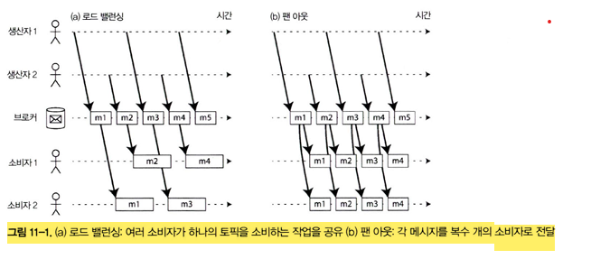

# 11장 스트림 처리

- 일괄 처리의 문제점
    - 입력의 변화가 하루가 지나야 반영된다
    - 이를 해결 하려면 좀 더 자주 실행해야 한다
- 스트림 처리의 기본 개념
    - 고정된 시간 조각이라는 개념을 버리고, 단순히 이벤트가 발생할때 마다 처리한다

## 이벤트 스트림 전송

- **이벤트**
    - 스트림 처리 문맥에서 레코드를 의미
    - 특정 시점에 일어난 사건에 대한 세부사항을 포함하는 작고 독립된 불변 객체
    - 일반적으로 일기준 시계를 따르는 이벤트 발생 타임스탬프를 포함한다
    - ex) 웹 페이지를 보거나, 상품을 구입하는 것 같은 사용자가 취한 행동
    - 텍스트 문자나 JSON, 이진 형태 등으로 부호화
    - 데이터 베이스에 기록하는  식으로 저장 되기도 한다
    - 토픽 또는 스트림으로 관련된 이벤트를 묶는다
    - 생산자 / 소비자 모델
- **생산자**
    - 이벤트 발행 주체
    - publisher, sender
- **소비자**
    - 이벤트 처리 주체
    - subscriber, recipient
- **이벤트 처리**
    - 이론상 파일이나 데이터베이스가 있다면 생산자/소비자를 연결하기 충분하다
    - 지연 시간이 낮으면서, 지속해서 처리해야 한다면, 일괄처리 수행시 비용이 큼
    - 오히려 새로운 이벤트 발생시 마다 소비자에게 알리는 것이 낫다

### 메세징 시스템

- 새로운 이벤트에 대해 소비자에게 알려주기 위해 일반적으로 **메세징 시스템**을 사용한다
    - 메세징 시스템에서 **발행/구독 모델**을 널리 사용
- **발행/구독 모델의 이슈**
    - 생산자가 소비자 보다 메세지를 빠르게 전송
        - 해결법
            - 메세지 버리기
            - 메세지 버퍼링 —> 배합/ 흐름 제어
            - 메세지 발행 방지
    - 노드가 죽었을 경우 메세지 손실
        - 지속성을 갖추기 위해 디스크 기록 / 복제본 생성
- 메세지 유실 허용 여부는 **애플리케이션 특성**에 따라 매우 다르다
    - 어느 정도 유실을 허용해도 지장이 없다면 굳이 온몸  비틀기로 할 필욘 없다
    - ex) 비플페이 알림 메세지 유실 된다고 크리티컬 하진 않다
        - 오히려 좋아 함께 결제 ㄱㅇㄷ

### 생산자에서 소비자로 메세지 직접 전달

- 많은 메세징 시스템은 생산자와 소비자를 네트워크로 **직접 통신** 한다
- 소비자가 네트워크에 서비스 노출시 직접 HTTP/RPC 요청 가능
    - **웹훅 아이디어**, 서비스 콜백 URL 을 다른 서비스에 등록하는 형태
- 직접 전달하는 시스템의 경우, 메세지 유실 가능성을 고려해서 애플리케이션을 개발해야  한다

### 메세지 브로커

- 직접 메세징 시스템의 대안으로 널리 사용 되는 방법으로 **메세지 브로커 (메세지 큐)** 를  사용한다
- 메세지 스트림을 처리하는데 최적화된 시스템
- 생산자는 브로커로 메세지를 전송하고, 소비자는 브로커에서 읽어 처리한다
- **데이터 지속성에 대한 책임**은 브로커가 가진다
    - 기본적으로 메모리에 보관, 브로커 특성에 따라 장애 대비 디스크에 기록하기도 한다

### 메세지 브로커와 데이터베이스 비교

- **데이터베이스는 명시적으로 삭제할때 까지 메세지를  보관**
    - 메세지 브로커 대부분은 소비자에게 데이터  전달 이후 자동적으로 삭제
- **데이터베이스는 보조 색인을 지원**
    - 메세지 브로커는 특정 패턴과 부합하는 토픽의 부분 집합을 구독하는 형태로 지원
    - 메커니즘은 다르지만, 클라에서 필요한 데이터를 선택하는 방법
- 메세지 브로커 중 XA/JTA 와 같이 2단계 커밋을 수행하기도 하는 브로커도 있다

### 복수 소비자

- 복수 소비자가 동일 토픽에서 메세지를 읽을때 사용하는 주요 두가지 패턴

- **로드 밸런싱**
    - 메세지가 여러 소비자중 하나로 전달
    - 각 소비자 들이 해당 토픽의 **메세지 처리 방식을 공유**하고 있다
    - 메세지 처리 비용이 비싸, 병렬화 하기 위해 사용하는 방식
    - 공유 구독 방식 이라고도 한다
- **팬 아웃**
    - 각 메세지는 모든 소비자에게 전달 된다
    - 여러 독립적인 소비자가 브로드캐스팅된 메세지를 송신하게 된다
    - 같은 입력 파일로, 여러  다른 일괄철리 작업에서 사용하는 것과 동일
    - 토픽  구독, 바인딩 교환 방식

### 확인 응답과 재전송

- **확인 응답**
    - 브로커가 메세지를 전달했지만 소비자가 처리하지 못하거나, 부분 처리중 장애 나는 경우
    - 메세지 손실을 방지하기 위해 확인 응답을 사용한다
    - 정상적으로 **메세지 처리가 되었음**을 브로커에게 알ㄹ림
- **재전송**
    - 브로커가 확인  응답을 받기전 연결이 끊어지거나, 타임아웃 발생시 브로커는 메세지가 처리되지 않았다고 판단
    - 다른 소비자에게 재전송하게 된다
    - 이 과정에서 메세지 순서에 영향을  미칠수 있다

- **메세지가 서로 독립적**이라면, 순서가 바뀌는 것은 문제가 되지 않는다
    - 메세지 인과성 여부가 중요한 판단 포인트

### 파티셔닝된 로그

- 메세지 브로커의 메세지는 **일시적으로 보관**하는 개념으로  만들어 졌다
- 디스크에 지속성있게 기록하더라도, 소비자에게 전달된 이후 즉시 삭제한다
- AMQP/JMS 형식의 메세징 처리는, 브로커가 확인 응답을 받고 메세지를 삭제하기 때문에 이미 받은 메세지를 복구할 수 없다
- 새로운 소비자를 추가하면, 일반적으로 소비자를 등록한 시점 이후에 전송된 메세지 부터 받기 시작한다
- 데이터베이스의 지속성 있는 저장 방법과, 메세징 시스템의 지연이 짧은 알림의 기능의 조합
    - **로그 기반 메세지 브로커의 기본 아이디어**

### 로그를 사용한 메세지 저장소

- 로그 = 단순히 디스크에 저장된 추가 전용 연속된 레코드
- 생산자가 보낸 메시지는 로그 끝에 추가하고, 소비자는 로그를 순차적으로 읽어 메세지를 받는다
    - 로그 끝에 도달하면, 새 메세지 추가 알림을 대기한다
- 디스크 하나를 사용할때  보다 **처리량을 늘리기 위해 파티셔닝 으로 확장** 한다
    - 다른 장비에서 서비스가 가능하고, 각 파티션은 다른 파티션과 독립적으로 읽고 쓰기 가능한 분리된 로그
- 파티션 내에서 **모든 메세지에 오프셋을 부여** 한다
    - 다른 파티션 간 메세지의 순서를 보장하지는 않는다

- 파티션을 지원하는 메세지 브로커는  모든 메세지를 디스크에 저장하지만, 여러 장비에 파티셔닝해 초당 처리량을 늘리고 복제함으로써 장애에 대비할 수 있다

### 로그 방식과 전통적인 메세징 방식 비교

- 로그기반 접근 법에서도 팬아웃 메세징 방식을 제공한다
    - 개별 메세지를 클라에게 할당하지 않고 소비자 그룹관 로드 밸런싱 하기 위해 소비자 그룹 노드들에게 전체 파티션 할당
- 토픽 하나를 소비하는 **작업을 공유하는 노드 수**는 많아야 **해당  토픽의  로그 파티션 수로 제한** 된다
- 특정 메세지 처리가 느리면 파티션 내 후속 메세지 처리가 지연도ㅚㄴ다
    - 선두 차단
- 메세지ㅣ 처리 비용이 비싸고 메세지 단위로 병렬화 (순서는 중요하지 않은 경우) JMS/AMQP 메세지 블로커가 적합
- **메세지 순서가 중요**하다면 로그기반이 효과적

### 소비자 오프셋

- 소비자 오프셋을 사용하면, 브로커는 개별 메세지 마다 보내는 확인 응답을 추적할 필요가 없다
    - 주기적으로 오프셋ㅅ을 기록하기만 하면 된다
- 추적 오버헤드가 감소하고, 로그 기반 시스ㅡ템 처리량이 늘어난다
- 메세지 오프셋 → 단일 리더 데이터베이스 복제에서 널리쓰는 로그 순차번호와 상당히 유사
- 소비자 노드 장애 발생시, **그룹 내 다른 노드가 해당 파티션을 할당**받아 마지막 기록된 오프셋 부터 메세지를 처리한다
- 장애 발생 시점에 처리되었지만, **오프셋 기록이 안되었다면 이 메세지는 재 시작시 두 번 처리**될 수 있다

### 디스크 공간 사용

- 로그는 크기가 제한된 버퍼로 구현하고, 버퍼가 가득차면 오래된 메세지를 순서대로 버리는데
- 이런 버퍼를 원형 버퍼 또는 링 버퍼 라고 한다
- 소비자 처리속도가 느리다면, 소비자가 너무 뒤쳐져 오프셋이 **이미 삭제된 메세지를 가리킬 수도 있다**
    - 메세지 유실 가능성이 존재함

### 소비자가 생산자를 따라갈 수 없을때

- 소비자가 생산자를 따라갈 수 없을때 선택지 3가지
    - 메세지 버리기, 버퍼링, 배압
- 로그기반 접근은 **고정 크기의 버퍼를 사용하는 버퍼링 형태**이다
- 소비자가 뒤쳐진다면, 오래된 메세지를 읽을 수 없다
- 브로커는 버**퍼 크기를 넘는 오래된 메세지를 버린다**
- 소비자가 너무 뒤쳐져서 메세지를 잃기 시작해도, 해당 소비자만 영향을 받고 나머지 는 영향을 받지 않는다
- 소비자가 종료 또는 죽을 경우 자원 소비가 중단되고 오프셋만 남게 되는데
- 이는 전통적인 메세지 브로커와는 다르다, (큐를 삭제해 주어야 함)

### 오래된 메세지 재생

- AMQP/JMS 메세지 브로커에서 메세지 처리/확인 응답 작업은 브로커에서 메세지를 제거 한다
    - 이미 소비된 메세지를 재시작 할 수없다
- 로그기반 메세지 브로커는 메세지를 소비하는 것이 읽기 전용 연산이다
- 메세지 처리의 유일한 부수 효과 → 소비자 오프셋 변동
- 이미 읽은 메시지라도, 오프셋만 조정하면 **언제든 다시 읽을 수 있다**
- 입력 데이터에 영향을 주지 않기 때문에, 데이터 플로우, 파이프라인 구성 등 확장에 용이하다

## 데이터베이스와 스트림

- 이벤트 → 특정 시점에 발생한 사건을 기록한 레코드
- 사용자 활동, 측정 판독, 데이터베이스에 기록
- 뭔 말을 하려는지 몰루

### 시스템 동기화 유지하기

- 데이터 저장, 질의, 처리 **요구사항을 모두 만족하는 단일 시스템은 없다**
- 대부분 중요 애플리케이션의 요구사항을 만족하려면 몇 가지 다른 기술의 조합이 필요하다
    - OLTP DB, 캐시, 검색 색인 등
    - 이런 시스템들이 각각 복제본을 가지고 있음
- 동일한 데이터가 여러 장소에 위치하기 때문에 **동기화는 필수**
    - 데이터 웨어 하우스는 이를 ETL 과정에서 수행
        - 데이터베이스 전체 복수 이후 벌크 로드 (일괄 처리)
    - 이중 기록 (dual write)
        - 데이터가 변할때 마다 애플리케이션에서 각 시스템에 write
- **이중 기록의 문제**
    - 타이밍 이슈
        - 동일한 값을 갱신하는 타이밍이 교차하여, 시스템 오류가 발생하지 않았음에도 값이 일치하지 않음
    - 내결함성 문제
        - 한쪽 쓰기가 성공할때, 다른쪽 쓰기는 실패
        - 원자적 커밋 문제

### 변경 데이터 캡처

- 변경 데이터 캡쳐 (CDC) → 데이터베이스에 기록하는 모든 데이터 변화를 관찰해 다른 시스템으로 데이터를 복제할 수 있는 형태로 추출하는 과정
- 데이터가 기록되자마자 변경 내용을 스트림으로 제공할 수 있으면 특히 유용하다
    
    
    
- 변경 데이터 캡처는 파생 데이터 시스템이 레코드 시스템의 정확한 데이터 복제본을 가지게 하기 위해 모든 변경 사항을 파생 데이터 시스템에 반영하는 것을 보장하는 메커니즘
- 본질적으로 캡처할 데이터베이스 하나를 리더, 나머지를 팔로워로 처리한다
- 로그 기반 메세지 브로커가 이를 전송하기에 적합하다 (메세지 순서를 유지하기 때문)
- 데이터베이스 트리거를 이용해 구현하기 도 한다
- CDC 는 메세지 브로커와 동일하게 비동기 방식으로 동작한다

### 초기 스냅숏

- 데이터베이스의 모든 변경 사항을 영구적으로 보관하는것은 디스크 용량 문제 및 모든 로그를 재생하는 작업도 너무 오래 걸리기 때문에 적절히 로그를 잘라내야 한다 (스냅숏)

### 로그 컴팩션

- 저장 엔진이 동일 키의 로그 레코드를 주기적으로 오래된 것을 삭제하고, 최신 값만 유지한다
    - 이 과정 백그라운드에서 수행됨
- 삭제 처리
    - **툼스톰** 이라는 특별한 널 값으로 기록해 두었다가, 컴팩션 과정이 수행되며 실제 데이터가 삭제된다
- 로그 크기를 제어 하며 키당 최신 상태인 스냅샷을 보존한다
- **파생 시스템을 구축할때 마다** 새롭게 추가된 소비자는 오프셋 0 부터 스캔하기만 하면, 전체 키의 최신 값을 읽을 수 있다
    - 원본 DB 스냅샷 없이도, 전체 복사본을 얻을 수 있음
- 카프카에서도 로그 컴팩션 기능을 제공하고 있다

### 변경 스트림 지원

- 최근 DB는 **변경 스트림 을 기본 인터페이스로 지원하기 시작**
- **RethinkDB**(changefeeds), **Firebase**, **CouchDB**(`_changes`), **Meteor**(MongoDB **oplog tailing**), **VoltDB**(트랜잭션 스트림 내보내기)
- **Kafka Connect**: 다양한 DB/시스템의 **변경 이벤트를 카프카로 수집**하는 표준화 프레임워크(소스·싱크 커넥터)

## 이벤트 소싱

- 애플리케이션의 상태 변화 (도메인 이벤트) 를 항상 이벤트 로그로 기록하는 방식, DDD 커뮤니티에서 개발한 기법이다
- CDC 마냥 DB 에서 바뀐 값을 추출하는 것이 아닌, 애플리케잇녀 에서 **왜/무엇이 바뀌었는지 (의도)** 를 이벤트로 남긴다
- 현재 상태 는 **시간에 따라 누적된 이벤트의 결과, 이벤트 로그만으로 현재 또는 특정 시점의 상태를 재현할 수 있다**
- 이벤트 소싱은 **연대기 데이터 모델**과 유사하다
    - 핵심 아이디어 → 값을 덮어쓰지 않고 “무엇이 언제 어떻게 되었는가”를 **행 단위**로 기록한다는 점
    - 불변 로그를 보관하고, 상태를 재구성 한다

### 명령과 이벤트

- 이벤트 소싱의 철학 → 이벤트와 명령을 구분한다
- 사용자의 요청 → 명령
- **성공한 결과만 불변 이벤트로 기록**하고, 실패한 명령은 이벤트가 아니다
- 이벤트는 **생성 시점에 사실**이 된다, 이후 취소나 변경이 되더라도 당시 예약 했다는 사실 자체는 변하지 않아야 한다
    - 변경/취소는 나중에 추가된 독립적인 이벤트
- 좌석 예약 이벤트를 두개로 쪼갬
    - 가예약 / 확정 예약
- **가주문 처리 목적과 유사**함
    1. 실제 주문 처리 프로세스를 잘개 쪼개서 안전하게 처리
        1. 동시성 / 중복 처리 등 완충지
        2. 커머스의 주문/결제 특성상 실패 발생 가능한 지점에 대한 완충지 역할
    2. 외부 API 응답 등을 미리 우리쪽 데이터에 저장해 두는 목적
        1. 우리 내부 처리 도중 재처리 등 용이
    3. 도중에 실패하면 쓰레기 데이터가 남아 있음. (실제 주문데이터와 뒤섞여있다.. 데이터양이 많아지면 매번 쓰레기 데이터들 찾아서 지우는 것도 일이고 낭비임.. 실제 프로덕션 쿼리에서 해당 쓰레기 데이터 발라내는 내용이 포함되어야함 (?)
    4. 3번과 이어지는 내용.. PG 사 결제 처리 프로세스와도 연관 있음 일반적으로 콜백이 들어오는 형태 (미리 가주문으로 재고 차감등 수량을 미리 확보해두었다가 최종 완료되었을때만 실제 주문 데이터를 만드는 등)
    5. 쿠폰 / 프로모션 등도 연관됨 (특정 시점 스냅샷 필요)
    6. UX 랑도 이어지는 부분
        1. 외부 시스템 지연이 발생하더라도, 가주문을 만들어 사용자에게 주문 처리 진행중 이라고 표기할 수 있음
        2. 자꾸 실패하면 이는 사용자 이탈로 이어질 수 있고, 도중에 실패하더라도 가주문서 기반으로 재결제 유도도 가능함
        3. 또한 실제 결제 콜백들어오는 시점에 만들어버리면 또 문제가…
        4. PG 사 처리마다 속도가 다른데 사용자 입장에서 운의 영역이 되어버릴 수도 있음 (선착순 구매)
            1. 내가 먼저 결제 시작했는데 결제 늦어져서 선착순 못삼 수박
    - 엥 ? 그거 테이블 하나로도 상태 쪼개서 하면 되는거 아님 ?
        - 서비스 규모 작거나 단순한 흐름이면 한 테이블에 상태를 쪼개서 처리해도 문제는 없다
        - 보통 주문 상태가 최소 수십개 ~

### 상태와 스트림 그리고 불변성

- 불변성의 원리가 이벤트 소싱과 CDC 를 강력하게 만든다
- 현재 상태 → 시간이 흐름에 따라 변한 이벤트의 마지막 결과
    - 현재 예약가능한 좌석 목록은 예약을 처리한 결과
    - 현재 계좌 잔고는 입출금의 결과
    - 모든 변경 로그는 시간이 지남에 따라 바뀌는 상태를 나타낸다
- 로그를 잘 남기면 **스냅샷 없이도 상태를 재현 할 수 있다**

### 불변 이벤트의 장점

- 회계 원장처럼 **삭제/수정 대신 보정 이벤트 추가**. 사고 원인 분석·법적 감사·복구가 쉬움.
- 단순 ‘최종 상태’가 아닌, **과정/의도/맥락**(예: 장바구니 담았다가 취소)을 모두 남긴다.
- 코드 버그나 데이터 오염 시, **정정 이벤트를 추가**하고 로그를 재생성해 일관성 회복 가능

### 동일한 이벤트 로그로 여러가지 뷰 만들기

- 하나의 **불변 이벤트 로그**에서 필요에 따라 서로 다른 **읽기 전용 뷰(프로젝션, 머티리얼라이즈드 뷰)** 를 여러 개 생성해 운용한다.
- **Kafka Connect Sink** 등으로 이벤트를 **검색/분석/캐시/서버 DB** 같은 이기종 저장소에 바로 적재해 각각의 쿼리 워크로드에 맞춘 뷰를 만든다.
- 장점
    - 기존 스키마를 바꾸지 않고 **새 기능을 “새 뷰 추가” 방식**으로 개발(레거시 영향 최소화).
    - 시스템을 바꾸지 않고 **신규 기술을 곁다리로 붙여** 실험/확장 용이.
    - 필요 없어지면 **뷰만 폐기**하면 됨(원본 이벤트 로그는 유지).
- 데이터 쓰는 형식과 읽는 형식을 분리하는 개념 → **CQRS**

### 동시성 제어

- 이벤트 소싱 / CDC 가 비동기로 이루어지기 때문에, 쓰기 직후 바로 읽는 경우 아직 반영이 되지 않은 경우가 있음
- 해결 방안
    1. **동기적 갱신**: 쓰기 트랜잭션에서 이벤트 로그와 필요한 읽기 뷰를 **원자적으로 함께 갱신**(같은 저장소면 다중-레코드 트랜잭션, 분산이면 전역 트랜잭션/전체 순서 브로드캐스트 계열).
    2. **세션 일관성 패턴**: “내가 방금 쓴 건 보이게”를 사용자/파티션 기준으로 보장(예: 동일 파티션에 사용자 이벤트를 몰아 처리, 클라이언트에 오프셋/버전 전달 후 그 이상이 반영된 뷰만 읽게).
    3. **단일 쓰기 지점**(파티션당 단일 리더)으로 경쟁 축소.

### 불변성 한계와 대응

- 많은 DB는 내부적으로 **다중 버전/불변 구조**를 사용하지만, 현실적으로 **완전 불변**은 어렵다
- 법적인 이유로 실제로 데이터를 삭제해야하는 경우가 발생할 수도 있음
- **단순 삭제 이벤트**로만 으로는 처리가 힘듦
- 실제로 처음부터 발생하지 않았던것 처럼 처리 한다
    - Excision(적출)/Shunning(차단)
- 불변 이벤트만 추가가 기본이지만, 예외 상황을 위해 **실제 삭제도 고려**해야 한다

## 스트림 처리

- **스트림 처리의 3가지 방식**
    - 스트림을 저장소에 적재
        - 이벤트를 캡처해 DB/캐시/검색엔진 등에 기록하고 다른 소비자가 그 저장소를 질의
    - 실시간 알림/푸시
        - 사용자에 직접 알림·경고 등
    - 스트림을 스트림으로 변환 (파이프라인)
        - 여러 입력 스트림을 연산자로 가공해 **새 출력 스트림**을 생성
- **스트림 처리 사용 사례**
    - 특정 상황 발생시 모니터링 목적으로 사용
        - 도난 의심 결제 등..
    - CEP (complex event processing)
        - 규칙이나 패턴 매칭으로 복잡한 이벤트를 탐지
        - 질의가 오랜기간 젖아되고, 이벤트가 지속적으로 질의를 지나가면서 패턴에 매칭되는 질의를 찾음
    - 스트림 분석 (Analytics)
        - 빈도, 이동평균, 주별 추세 등 통계.  **고정된 시간 간격**의 **윈도우(window)** 기반
            - 집계 시간 간격을 윈도우 라고 함
    

### 구체화 뷰 유지하기

- 구체화 뷰(Materialized View)
    - 심플하게 생각하면, 원본 데이터를 직접 조회하지 않고 **미리 계산된 형태로 저장된 결과 테이블**
- 이벤트 소싱에서 구체화뷰는 이벤트 로그를 기반으로 미리 계산된 상태를 유지하는 캐시 역할

### 스트림 에서의 검색

- 스트림 검색 → CEP 처럼 미리 정의된 패턴뿐 아니라 복잡한 질의 조건을 스트림 데이터에 **실시간으로 적용해 매칭되는 이벤트를 찾는 방법**
- 전통적인 방식과 반대로 질의 중심 으로 접근한다
- 싨시간 데이터 스트림 처리에 좋으며 패턴 탐지/모니터링/알림 시스템 구축에 용이함
- 문서가 아닌 새로 들어오는 이벤트를 기준으로 필터링/트리거를 수행한다
- 예시
    - 미디어 모니터링 시스템
    - 부동산 알림 서비스
    - Elasticsearch Percolator
        - 질의를 미리 저장해 두고, 새 문서(또는 이벤트)가 들어올 때 해당 질의와 매칭되는지 즉시 판단

### 메세지 전달. RPC 와의 관계

- 메시지 시스템은 애초에 **서비스 간 통신의 RPC 대안** 으로도 쓸 수 있음.
- 하지만 **스트림 처리 엔진** 은 기본적으로 **대량의 이벤트 파이프라인** 을 돌리기 위한 구조(체크포인팅, 재처리, 파티셔닝 등)라서 일반적인 RPC 대체로 보지 않는다
- 몇몇 프레임워크는 **분산 RPC(distributed RPC)** 라는 기능을 제공
- 가능은 하지만, **메시지 전달 보장/내결함성**을 자동으로 보장하지 않기 때문에 재시도·멱등성·집계 일관성은 별도 설계가 필요하다

### 시간에 관한 추론

- 스트림 처리에서 이벤트가 끊임없이 발생하기 때문에 데이터 분석/집계를 위해 **시간 단위인 윈도우** 를 기준으로 묶어서 처리해야 한다
    - 분석 목적인 경우 지난 5분 평균, 최근 1시간 트래픽 등
- 일괄 처리는 몇분 안에 1년치 데이터를 읽어야 할 수 있기 때문에 이벤트 타임스탬프를 사용해 이벤트 처리를 **결정적**으로 만든다
    - 동일 처리를 다시 해도 동일한 결과
- **스트림 프레임 워크**는 윈도우 시간 결정시 처리하는 장비 시스템 시계를 이용한다 (매우 심플)
    - 이벤트 생성과 처리 시간 간격이 좁다면 문제가 안되지만, 지연된다면 문제가 발생할 수 있다

### 이벤트 시간대 처리 시간

- **처리 지연이 발생하는 이유**
    - 큐 대기, 네트워크 결함, 스트림 소비자 재시작, 재처리 등
- 이벤트가 지연되거나, 재처리 되는 경우 순서 불일치가 발생할 수 있음
- 스트림 시스템이 처리 시간 기준으로 집계하게 되면 **왜곡된 데이터**가 만들어질 수 있다
    - 초당 요청량을 측정하는 시스템에서 스트림 처리기가 1분간 다운됐다가 복구되면,
    - 복구된 후 과거 이벤트를 한꺼번에 처리하면서 **요청 비율이 비정상적으로 튀는 현상 이 생김**

### 준비 여부 인식

- 스트림 처리는 일반적으로 이벤트 시간을 기준으로 윈도우를 구성한다
- 하지만 모든 이벤트가 **정확히 제 시간이 도착하는 것은 아니다**
- **윈도우가 이미 종료된 뒤 늦게 도착하는 이벤트 (낙오자)** 를 어떻게 처리할지 결정해야 한다
- 처리 방법 두가지
    - 낙오자를 무시한다
        - 대부분의 정상 환경에서는 늦게 도착하는 이벤트의 비율이 매우 낮음
        - 만약 늦은 이벤트의 비율이 높거나 데이터 손실 위험이 크다면 경고를 발생시킬 수 있음
    - 수정값을 발행한다
        - 늦게 도착한 이벤트를 포함해 윈도우 집계를 다시 계산함
        - 이미 발행된 결과를 **취소(Invalidate)** 하거나 **정정된 결과(Updated Value)** 를 새로 발행해야 한다

### 어쨋든 어떤 시계를 사용할 것인가

- 이벤트가 여러 지점을 거쳐 전송될 때 **각 장치의 로컬 시계**가 다를 수 있다
    - 이 이벤트가 언제 발생했는지에 대해 정확히 판단하기 어렵다
- 잘못된 장치 시계 조정하는 방법
    - 이벤트 로그에 세 가지 타임스탬프를 모두 기록한다
    - 이벤트가 발생한 시각 → **장치 시계(Local Device Clock)** 기준
    - 이벤트를 서버에 보낸 시각 → 네트워크 요청 시점 (Client → Server 전송 시)
    - 서버가 이벤트를 받은 시각 → **서버 시계(Server Clock)** 기준
- 세 시각을 모두 기록해, 서버 간의 시계 오프셋 계싼하여 **실제 이벤트가 발생한 시점을 추정**할 수 있음

### 윈도우 유형

- GPT 에몽

| 윈도우 유형 | 설명 | 예시 |
| --- | --- | --- |
| **① 텀블링 윈도우 (Tumbling Window)** | - **고정된 크기(Fixed size)**의 윈도우로, 겹치지 않음.- 모든 이벤트는 **정확히 하나의 윈도우**에만 속함. | 예: “1분 텀블링 윈도우” → 10:03:00 ~ 10:03:59 동안 발생한 이벤트만 포함. |
| **② 홉핑 윈도우 (Hopping Window)** | - **겹치는 윈도우(Overlapping window)**.- 일정 간격으로 새 윈도우를 시작하지만, 각 윈도우의 길이가 더 길면 서로 겹친다. | 예: “1분 간격, 5분 길이 홉핑 윈도우” → 10:03~10:08, 10:04~10:09 등 여러 윈도우에 같은 이벤트가 포함될 수 있음. |
| **③ 슬라이딩 윈도우 (Sliding Window)** | - 모든 이벤트마다 새로운 윈도우를 시작할 수 있음.- 시간 간격마다 발생한 모든 이벤트를 포함해 **연속적인 집계(rolling aggregation)** 가능. | 예: “5분 슬라이딩 윈도우” → 매 초마다 최근 5분 동안의 평균 요청 수 계산. |
| **④ 세션 윈도우 (Session Window)** | - **고정된 크기가 없음.**- 사용자의 활동(session) 단위로 묶음.- 일정 시간 동안 새로운 이벤트가 없으면 세션이 종료됨. | 예: 사용자가 30분 동안 아무 이벤트도 발생시키지 않으면 세션 종료. |

## 스트림 조인

- 스트림 처리는 지속적으로 흐르는 데이터를 다루므로, 일고라 처리 처럼 단순히 정적인 데이터 조인을 수행하기 어렵다
- 스트림간 또는 스트림과 테이블간 동적 결합이 필요하다
- 이때 사용되는 세 가지 조인유형이 있음
    - **스트림-스트림 조인 (Stream-Stream Join)**
    - **스트림-테이블 조인 (Stream-Table Join)**
    - **테이블-테이블 조인 (Table-Table Join)**

### 스트림 스트림 조인 (윈도우 조인)

- 두 개의 이벤트 스트림을 **윈도우 단위로 묶어 같은 키를 기준으로 조인**하는 방식
    - 검색 이벤트와 클릭 이벤트를 같은 사용자 세션 ID 로 조인
- 특정 시간동안 발생한 두 스트림의 이벤트를 같은 윈도우 내에서 조인한다
    - 검색 이후 5초이내 클릭만 유효하게 본다 거나
    - 광고, 트래킹, 사용자 패턴 분석 등에서 자주 사용된다
- 스트림간 조인을 위해 **상태를 유지**해야 한다
    - 최근 10초간 발생한 검색 이벤트를 메모리에 물고 있어야함
- **검색 결과 클릭** 을 분석하려면 검색 이벤트와 클릭 이벤트 스트림을 조인하여, 사용자의 클릭율을 계산할 수 있음

### 스트림 테이블 조인 (쓰트림 강화)

- 스트림으로 들어오는 이벤트에 테이블 데이터를 붙여 정보를 강화하는 방식이다
- 스트림이 실시간으로 흘러 들어오면 테이블 정보를 조회후 **살을 덧붙인다**
- 스트림의 각 이벤트를 테이블 로우와 조인하여 데이트를 확장한다
- 이벤트 스트림을 강화하여 분석이나 후속 처리를 쉽게 한다
- 스트림은 계속해서 흘러들어오지만 테이블 데이터는 시간이 지나며 변경될 수 있기 떄문에 **테이블의 최신 상태를 지속적으로 동기화**해야한다

### 테이블 테이블 조인 (구체화 뷰 유지)

- 두 개의 변경 가능한 테이블 (Change Log Table) 을 조인하여, **항상 최신 상태를 반영하는 뷰를 유지**하는 방식
- 일괄 처리시에는 필요시 한번 조인하면 되지만, **스트림 처리에서는 테이블 변경시마다 조인 결과도 함께 업데이트** 되어야 함

### 조인의 시간 의존성

- 세 가지 조인 모두 조인 상태를 유지하고, 각 입력 스트림의 이벤트 순서가 매우 중요하다
- 스트림 처리에서는 이벤트가 언제 도착하느냐에 따라 조인 결과가 달라질 수 있다
    - 조인 시점”에 따라 결과가 달라질 수 있는 **비결정성(nondeterminism)** 이 발생한다.
- 예를 들어, “팔로우 관계 변경”과 “트윗 작성” 이벤트가 거의 동시에 발생하면,
- 어느 시점의 팔로우 상태를 기준으로 트윗을 포함시킬지 결정해야 한다
- 데이터 웨어하우스에서는 **천천히 변하는 차원(Slowly Changing Dimension, SCD) 문제** 가 있다
    - 특정 시점별로 버전을 구분하여 “과거의 상태를 재현”할 수 있다

## 내결함성

- 스트림 처리나 일괄 처리 프레임워크는 작업 중 일부가 실패해도 다른 장비에서 재실행하여 결과 복구가 가능함
- 입력 파일이 불변이고, 작업 결과가 HDFS에 분리 저장되기 때문에 재처리 가능
- **결함 허용 방식**
    - 일부 테스크가 실패하더라도 전체 결과를 동일하게 유지한다
    - 모든 레코드가 **정확히 한 번 처리된 것 처럼 보이게** 만듦
    - 정확히 한 번 시맨틱(exactlyonce semantics)
- 스트림 처리에서 일괄 처리 처럼 **출력이 완료될 때 가지 기다리는 방식**은 실시간 처리 특성상 사용할 수 없다

### 마이크로 일괄 처리와 체크포인트

- **마이크로 일괄 처리**
    - 스트림 데이터를 **작은 블록 단위**로 나누어 일괄 처리 하듯이 처리하는 방식
    - Spark Streaming 에서 사용
    - 일반적으로 1초 단위로 처리하며, 작은 단위일수록 실시간성은 높지만 스케줄링 비용이 커지고
    - 큰 단위일수록 효율적이지만, 지연 시간이 길어진다
    - 텀블링 윈도우 형태로 동작하며, 한 마이크로 배치가 끝난 후 다음 배치를 명시적으로 실행해야 한다
- **체크포인트**
    - 스트림 처리 상태를 주기적으로 저장 하여 장애 발생시 마지막 저장 시점부터 복구 가능하도록 하는 방식
    - 롤링 체크포인트로 형태로 지속 저장한다
    - 장애 발생시, 마지막 체크포인트 이후 출력은 버리고 다시 시작한다
    - 배리어가 트리거되어 스트림 내 경계를 구분하지만, 윈도우 크기를 직접 결정하지는 않는다
- 마이크로 일괄 처리 + 체크포인트 조합은 정확히 한번 시맨틱스를 완벽히 보장하지 못한다
    - 스트림 처리 결과가 외부 시스템(DB, 메시지 브로커, 이메일 전송 등)에 이미 기록된 뒤 장애가 발생하면,재시작 시 **같은 출력이 두 번 발생(중복 처리)** 될 수 있음

### 원자적 커밋 재검토

- 장애가 발생해도 **정확히 한 번 처리된 것처럼 보이도록 하려면**, 모든 출력과 이벤트 처리 결과가 동기화되어 일관성 있게 커밋 되어야함
    - 한쪽만 성공하는 일은 있어선 안됨
- 원자적 커밋은 분산 환경에서 구현하기 어렵다
    - XA 같은 전통적인 2단계 커밋은 복잡하고 오버헤드가 크다
- 클라우드 데이터 플로나 볼트 DB 등에서는 좀 더 가벼운 방식으로 내부 상태와 메세지 처리를 하나의 트랜잭션으로 관리한다

### 멱등성

- 목표 → 중복된 출력 없이 안전하게 재처리 하기
- 멱등 연산 → 여러 번 수행해도 결과가 한 번 수행한 것과 동일한 연산
- 멱등성을 데이터 구조로도 보장할 수 있다
    - Kafka 메세지에 오프셋을 이용해 이미 처리된 메세지는 다시 실행해도 중복이 발생하지 않도록 한다
- Storm Trident 프레임워크 도 이 개념을 사용한다
    - 같은 메세지를 항상 동일 순서로 재생
    - 여러 노드간 동시성 충돌을 방지하기 위해 펜싱 사용
    - 오버헤드는 존재하지만 정확히 한번 시맨틱스를 달성하는 방법

### 실패 후에 상태 재구축하기

- 스트림 처리에서는 윈도우 집계나 조인, 색인과 같은 상태가 필요하다
    - 시스템 장애 발생 이후에도 이전 상태를 복구할 수 있어야 한다
- **상태 복구 방법**
    - 원격 저장소에 상태 저장 및 복제
        - 스트림 처리중 상태를 외부 저장소에 저장하고, 복제하는 방식
        - 개별 메세지를 직접 DB 에 기록하는 방식은 느리기 때문에, 처리기 내부에서 주기적으로 스냅숏 뜨는 것이 일반적
        - **Flink** → 주기적으로 연산자 상태의 스냅숏을 **HDFS** 같은 저장소에 기록
        - **Spark Streaming** → **로그 컴팩션(log compaction)** 기반의 상태 복제 사용
        - **VoltDB** → 여러 노드에서 입력 메시지를 중복 처리하여 상태를 복제
- **복제가 필요 없는 경우**
    - 일부 상황에서는 상태 복제가 필요 없을 수 있다
    - 입력 스트림을 다시 재생하여 상태를 재구축할 수 있음
    - 작은 윈도우 상태라면 윈도우에 해당하는 입력 이벤트만 다시 읽어 빠르게 복구할 수 있다
    - 데이터베이스에서도 로그 컴팩션된 변경 스트림을 이용해 재구축 가능하다
- **트레이드 오프**
    - 상태 복구 방식의 효율성은 인프라 성능 특성에 따라 달라진다
    - 디스크 접근 지연, 네트워크 지연 또는 대역폭 차이
