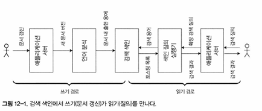

# 🔴 데이터 시스템의 미래

- **데이터 시스템의 미래**
    - 지금까지는 ‘현재 존재하는 시스템’을 설명했지만, 이제는 **앞으로 어떻게 해야 하는가**에 초점
    - 애플리케이션을 설계하고 구축하는 근본적 접근법과 **미래 데이터 시스템의 방향**을 제시
    - 목표: **신뢰할 수 있고, 확장 가능하며, 유지보수가 쉬운 시스템** 설계 방법 탐구

# 🔴 데이터 통합

- **데이터 통합**
    - 이 책에서 되풀이되는 주제는 어떤 문제에 대한 장점과 단점, 트레이드 오프를 다루고 있음.
- "데이터를 저장하고 나중에 조회하기" 와 같은 문제가 주어졌을때
  - 모든 문제를 해결하는 단 하나의 해결책은 존재 하지 않다.
  - 각각 서로 다른 접근법으로 해결하려 한다.
  - 일반적으로는 특정 접근법 하나를 채택하여 소프트웨어를 구현한다.
  - 상황에 따라 가장 적절한 소프트웨어 도구는 달라진다.
  - 모든 드란 상황에 적합한 소프트웨어 도구가 있을 가능성은 낮다.
  - 그래서, 반드시 여러 다른 소프트웨어를 함께 엮어서 사용해야 한다.

## 🟠 파생 데이터에 특화된 도구의 결합

- **파생 데이터에 특화된 도구의 결합**
    - OLTP(트랜잭션) 시스템과 OLAP(분석) 시스템 간 **전문화된 도구의 결합 필요성** 제시
    - 일반적인 DB의 전문 색인 기능만으로는는 복잡한 검색 기능을 지원하기 어렵다.
      - 그래서, 전문적인 정보 탐색 도구가 필요하다.
    - 하지만, 데이터를 다른 방식으로 표현하는 수가 늘어날수록 데이터 시스템을 통합하기 더욱 어렵다.
      - 해당 데이터를 웨어하우스 같은 시스템에서도 사본을 유지해야 한다.
    - 어떤 사람에게는 애매하거나 의미 없는 기능도 다른 사람에게는 핵심 요구사항이 될 수 있다.
      - 데이터 통합의 필요성은 나무가 아닌 숲을 보기 위해 조직 전체 플로우를 고려할 때 비로소 보인다.

### 🟢 데이터플로에 대한 추론

- **핵심 개념**
    - 데이터플로(Dataflow)는 **데이터 간 의존 관계를 명시화**해 전체 시스템 구조를 이해하게 함.
    - 데이터가 어디서 오고, 어디로 가는지, 어떤 시스템이 어떤 역할을 하는지 충분히 고려해야 한다.
    - 예를 들어, CDC가 색인을 갱신하는 유일한 방법이라면 색인은 전적으로 레코드 시스템에서 파생되므로 버그가 아닌 이상 일관성이 보장된다.
    - 파생 데이터 시스템은 이벤트 로그를 기반으로 갱신하면 결정적이고 멱등성을 지녀 결함에서 복구하기 상당히 쉬워진다.

### 🟢 파생 데이터 대 분산 트랜잭션

| 구분            | 분산 트랜잭션           | 파생 데이터                        |
|---------------|-------------------|-------------------------------|
| 쓰기 순서 결정      | 2PL               | 로그                            |
| exactly once | 원자적 커밋            | 결정적 재시도와 멱등성                  |
|| 트랜잭션 시스템이 선형성을 제공 | 비동기로 갱신되기 때문에 동시간 갱신을 보장하지 않음 |

- XA(분산 트랜잭션 처리 표준)
  - 현재까지 XA를 분산 트랜잭션 환경에서 잘 사용해 왔다.
  - 하지만, 결함 대응에 취약하고 성능면에서도 나쁘다.
  - XA보다 더 좋은 프로토콜이 나올 것이라 믿는다.
  - 하지만, 근시일 내에는 이런 일이 생기긴 어려울 것이다.


### 🟢 전체 순서화의 제약

- **전체 순서화의 제약**
    - 작은 시스템에서는 이벤트 순서 전체를 보장할 수 있지만, **규모가 커질수록 불가능**
    - 단일 리더 복제 기반 DB는 가능하지만, 복잡한 분산 환경에서는 **작업 부하로 인한 한계** 발생
    - 지역적으로 분산된 여러 데이터센터인 환경이라면 각 데이터센터에 독립적인 리더를 둔다. 
      - 즉, 다른 지역에 있는 데이터센터마다 나온 이벤트는 서로 순서가 정해지지 않는다.
    - 애플리케이션을 마이크로서비스로 배포할때 가장 일반적인 설계는 각 서비스와 서비스의 지속적인 상태를 독립적으로 배포하고 지속적인 상태는 서비스 간 공유하지 않는 것이다.
      - 두 이벤트가 서로 다른 서비스에서 발생했다면 이들 사이에는 정해진 순서가 없다.
    - 어떤 애플리케이션은 사용자 입력이 올때마다 서버 응답을 기다리지 않고 갱신한다. 특히 오프라인 상태일때도 계속 동작하는 애플리케이션이 있다.
      - 이런 애플리케이션은 이벤트의 순서가 클라이언트와 서버에 서로 다르게 적용될 가능성이 높다.

### 🟢 인과성 획들을 위한 이벤트 순서화

- **핵심 개념**
    - **이벤트 간 인과 관계(causality)** 가 보장되면 전체 순서가 불명확해도 일관된 결과 유지 가능
    - 동시 발생 이벤트는 순서 무관, 단 인과 관계 있는 이벤트는 올바른 순서 유지 필요
    - 예시:
        - SNS에서 친구 관계 끊기 > 메시지 전송 불가
        - 메시지 전송이 친구 끊기보다 먼저 일어나면 모순 발생
    - 해결: **친구 관계 끊기 이벤트**가 발생하면 해당 관계에 종속된 메시지 이벤트 무효화
    - 즉, 인과 관계 기반의 **로컬 순서(local ordering)** 유지가 전체 순서화보다 실용적

## 🟠 일괄 처리와 스트림 처리

- **일괄 처리와 스트림 처리**
    - 데이터 통합의 목표는 데이터를 올바른 장소에 올바른 형태로 두는 것
    - 이를 위해 입력을 소비해 형태를 바꾸고, 필터링하며, 통계적으로 모형화해 마지막에 적절한 출력으로 기록하는 과정이 필요

- **공통점과 차이점**
    - 두 방식 모두 공통 원리가 존재하지만, 차이는 입력 데이터의 성격과 처리 방식에 있음
    - 일괄 처리는 **고정된 크기의 입력 데이터를 한 번에 처리**하지만, 스트림 처리는 **끝이 없는 실시간 데이터 흐름을 지속적으로 처리**함.
    - 현대 시스템에서는 **마이크로 일괄 처리(micro-batch)** 방식이 스트림 처리의 한 형태로 사용되며 구분이 희미해지기 시작했다.

- **예시**
    - 스파크(Spark) 같은 엔진은 마이크로 일괄 처리를 통해 스트림 데이터를 작은 윈도우 단위로 나누어 처리한다.
    - 하지만, 마이크로 일괄 처리는 홉핑 윈도우나 슬라이딩 윈도우를 구현하기에는 성능이 좋지 않다.

### 🟢 파생 상태 유지

- **파생 상태 유지**
    - 일괄 처리는 입력 전체를 한 번에 다루지만, 스트림 처리는 지속적인 데이터 입력을 다룸
    - 결정적이고 출력이 입력에만 의존하며 명시적 출력 외에는 다른 부수 효과가 없는 순수 함수를 장려한다.
    - 입력을 불변으로 간주하고 출력은 추가 전용으로만 사용한다.

- **결함**
  - 파생 데이터 시스템은 데이터를 갱신할 때, 동기식으로 갱신하는 것처럼 운여할 수 있다.
  - 하지만, 비동기식 방식을 사용하면 로그 기반 시스템이 훨씬 견고하다.
  - 분산 트랜잭션은 실패시 어보트하기 때문에 나머지 시스템에 실패가 확장되어 실패가 증폭되는 경향이 있다.
  - 하지만, 비동기식 방식은 시스템 일부의 결함이 국소적으로 남아 있게 한다.

### 🟢 애플리케이션 발전을 위한 데이터 재처리

- **애플리케이션 발전을 위한 데이터 재처리**
    - 애플리케이션은 시간이 지나며 새로운 요구사항과 모델을 반영하기 위해 **과거 데이터를 재처리(reprocessing)**해야 함.
    - 일괄 처리와 스트림 처리 모두 이를 지원하지만, **스트림 처리는 변화의 즉각적 반영**, **일괄 처리는 과거 누적 데이터의 재산출**에 강점이 있음.

- **점진적 발전**
    - 기존 데이터 재처리는 새로운 기능 추가나 필드 확장 시 과거 데이터까지 일관되게 반영해야 함.
    - 이 과정에서 시스템은 점진적으로 진화하며, 새로운 스키마(schema)와 코드를 적용해 데이터 품질을 유지함.

- **점진적 재처리의 장점**
    - 재처리 시스템이 **이전 상태로의 복귀와 반복적 실행**이 가능해야 함.
    - 이를 통해 시스템은 점진적 개선과 버그 수정이 쉬워짐.


### 🟢 람다 아키텍처

- **핵심 개념**
    - 람다 아키텍처는 **일괄 처리와 스트림 처리**를 함께 조합하여 데이터 일관성과 실시간성을 동시에 추구하는 구조
    - 두 계층 구성
        - **일괄 계층(batch layer)**: 전체 데이터를 기반으로 정기적 계산 수행
        - **속도 계층(speed layer)**: 최신 데이터를 빠르게 반영
    - 이 두 계층을 결합해 완전한 데이터 뷰를 제공

- **특징**
    - 일괄 처리는 느리지만 정확, 스트림 처리는 빠르지만 근사적(approximate)
    - 두 계층의 조합으로 **정확성과 실시간성의 균형**을 유지함

- **한계**
    - 동일한 로직을 일괄 처리와 스트림 처리 두 곳에서 구현해야 함 
      - 유지보수 어려움
    - 스트림과 일괄 처리 파이프라인은 분리된 출력을 생산하기 때문에 사용자 요청에 대응하기 위해 출력을 병합해야 한다.
      - 조인이나 세션화 같은 복잡한 연산을 사용해야 하는 경우에는 상당히 어려워진다.
    - 대용량의 전체 과거 데이터를 재처리하기 위해서는 많은 비용이 든다. 


### 🟢 일괄 처리와 스트림 처리의 통합

- **일괄 처리와 스트림 처리의 통합**
    - 최신 데이터 시스템은 **일괄 처리, 데이터 재처리, 스트림 처리**를 모두 하나의 엔진에서 수행하려는 방향으로 발전

- **기술 예시**
    - 최근 이벤트 스트림을 다루는 처리 엔진에서 과거 이벤트를 재생하는 역할을 하고, 어떤 스트림 처리자는 분산 파일 시스템에서 입력을 읽을 수 있다.
    - 스트림 처리자에서 사용되는 정확히 한번 시맨틱 
      - 결함이 발생하더라도 결함이 없었던 상황과 동일한 출력을 내는 것을 보장한다.
    - 이들은 **처리 시간(processing time)** 이 아니라 **이벤트 시간(event time)** 기준의 윈도우(window) 연산을 지원하여 과거 이벤트 처리도 가능


# 🔴 데이터베이스 언번들링

- **핵심 개념**
  - 데이터베이스, 하둡, 운영체제 모두 데이터를 저장하고 처리하는 공통 목적을 가짐
  - 결국 모두 “**정보 관리 시스템**”으로, 저장과 조회, 갱신 등의 기능을 수행함

- **유닉스와 데이터베이스의 관계**
  - 유닉스: 저수준인 추상화를 프로그래머에게 제공하는것을 목적
    - 파이프와 바이트의 순차열일 뿐인 파일이 개발
  - 데이터베이스: 고수준 추상화를 프로그래머에게 제공하는 것을 목적
    - SQL과 트랜잭션이 개발

- **어느 접근법이 좋은가?**
  - 무엇을 원하느냐에 달려 있다.
  - 유닉스는 간단하게 추상화되어 있다는 의미로 간단하다.
  - 데이터베이스는 질의어를 통해 복잡한 동작을 활용 가능하다는 의미로 간단하다.
  - 이 둘 중 어느 접근법이 좋은가에 대해서는 수 세기 동안 논쟁이 있다.

## 🟠 데이터 저장소 기술 구성하기
- **데이터 저장소 기술 구성하기**
  - 데이터베이스의 기능은 여러 저장소 기술의 조합으로 구성됨
    - **보조 색인**: 필드 값을 기준으로 효율적인 검색 지원
    - **구체화 뷰**: 미리 계산된 결과를 저장해 반복 질의 속도 향상
    - **복제 로그**: 최신 데이터를 여러 노드에 동기화
    - **전문 검색(Full-Text Search)**: 텍스트 기반 검색을 효율적으로 수행
  
### 🟢 색인 생성하기

- **색인의 역할**
  - 관계형 데이터베이스에서 색인은 쿼리 성능을 높이기 위한 핵심 기능
  - `CREATE INDEX` 실행 시
    - 테이블의 일관된 스냅샷을 사용해 스캔
    - 색인할 필드 값을 골라 모두 정렬하고 색인에 기록
    - 일관된 스냅샷을 만든 이후에 실행된 쓰기의 백로그를 처리
    - 이후 쓰기 시 꾸준히 색인에 반영

- **색인과 복제**
  - 색인 생성은 복제 및 변경 전파와 유사한 구조로 동작
  - 스트림 처리 시스템에서 **데이터 변경을 즉시 반영하는 방식**은 색인 갱신과 유사

### 🟢 모든 것의 메타데이터베이스

- **핵심 개념**
  - 데이터베이스는 점차 모든 시스템의 중심, 즉 **메타데이터를 관리하는 플랫폼**으로 확장됨
  - ETL, 일괄 처리, 스트림 처리 모두 특정 데이터의 형태를 변환하고 저장하는 공통 목적을 가짐
  - 관계형 DB, 키-값 저장소, 검색 엔진 등 다양한 시스템이 모두 메타데이터 관리 기능을 수행

- **미래의 데이터베이스 통합 방향**
  - 연합 데이터베이스(federated database) : 읽기를 통합
    - 연합 데이터베이스 또는 폴리스토어(polystore)라고 알려진 접근법은 엄청나게 많은 하단 저장소 엔진과 처리 메서드를 통합해 질의하는 인터페이스를 제공한다.
    - postgreSQL 외래 데이터래퍼(foreign data wrapper) 기능이 예시가 될수 있다. 
    - 연합 질의 인터페이스는 고수준 질의 언어와 우아한 시맨틱을 사용하지만 구현이 복잡한 시스템이다.
      - RDB의 전통을 따른다.
  - 언번들링 데이터베이스 : 쓰기를 통합
    - 여러 시스템으로 구성됐을 때도 변경된 모든 데이터가 올바른 장소에 반영되도록 보장해야 한다.
    - 언번들링 접근법은 하나만 잘하는 작은 도구를 사용하는 방식과 유사하다.
      - 유닉스의 전통을 따른다.
  
### 🟢 언번들링이 동작하게 만들기

- **핵심 개념**
  - 언번들링은 시스템의 구성요소를 분리해 **유연하고 확장 가능한 구조**로 만드는 것
  - 핵심은 **루즈 커플링(loose coupling)** 구성 요소들이 독립적으로 동작하면서도 유기적으로 협력

- **동작 원리**
  - 저장소 간의 동기화와 트랜잭션 관리가 필요
  - 단일 저장소나 스트림 처리 시스템에서 트랜잭션은 쓸만하지만 다른 기술 사이의 경계를 오간다면 이벤트 로그를 사용하는 편이 훨씬 강력함. 
  - 예: 분산 트랜잭션 대신 **이벤트 로그 기반 일관성 유지(Event Sourcing)** 사용

- **결과**
  - 로그 기반 통합의 장점
    - 언번들링된 시스템 간의 연결은 강한 결합 대신 느슨한 연결로 구성됨
    - 시스템 수준에서 비동기 이벤트 스트림을 사용하면 전체 시스템이 개별 구성 요소의 장애나 성능 저하가 생겨도 잘 견디게 만들 수 있다.
    - 서비스를 다른 팀에서 각자 개발하고 개선하고 독립적으로 유지보수할 수 있다.

### 🟢 언번들링 vs 통합 시스템

- **핵심 비교**
  - 언번들링: 여러 전문 시스템을 분리해 각각의 장점을 살림
  - 통합 시스템: 단일 시스템에서 모든 기능을 처리하려는 방식

- **통합 시스템의 필요성**
  - 일괄 처리, 스트림 처리, 분석, 트랜잭션 모두를 효율적으로 수행하기 위해선 통합이 필요
  - 예: MPP 엔진, 분산 데이터웨어하우스는 통합적 처리 구조를 유지하며 확장성을 보장

- **한계와 현실**
  - 통합형은 설정/운영이 복잡하지만 일관된 데이터 관리 가능
  - 언번들링은 유연성과 구성 자유도가 높으나, 데이터 일관성 유지가 더 어려움

### 🟢 뭐가 빠졌지?
- **핵심 문제**
  - 언번들링의 발전에도 불구하고, **자동 색인 갱신 및 변경 전파** 기능이 아직 부족
  - 즉, 데이터 변경 시 자동으로 색인 시스템과 저장소에 반영되는 완전한 통합 모델은 부재

- **흥미로운 초기 연구가 진행**
  - **미분 데이터플로(Differential Dataflow)**: 데이터의 변경만을 효율적으로 반영하는 기술
  - 실시간 데이터 파이프라인에서 계산을 자동으로 갱신할 수 있는 차세대 모델로 주목받음

## 🟠 데이터플로 주변 애플리케이션 설계

- **데이터베이스 인사이드 아웃 접근법**
  - 언번들링된 데이터베이스 접근법은 **데이터베이스와 인식이 어긋난 애플리케이션 코드 구조를 통합**하려는 시도
  - 애플리케이션이 데이터 시스템의 핵심 원리를 이해하고, 데이터플로를 중심으로 설계되도록 하는 것이 목표
  - **함수형 반응형 프로그래밍(functional reactive programming, FRP)** 과 **논리형 프로그래밍(Logic Programming)** 의 개념이 데이터플로 설계에 영향을 줌
  - 데이터플로 기반 설계는 **데이터의 상태 변경, 흐름, 반응성**을 중심으로 애플리케이션을 구성

- **맥락**
  - 데이터베이스를 단순한 저장소로 보지 않고, 데이터 흐름의 일부로 간주
  - 즉, 데이터베이스와 애플리케이션이 상호작용하며 실시간으로 변화에 반응하도록 설계
  - 과거 비절차적 언어(VisiCalc, Lisp 등)의 개념이 현대 데이터 시스템 설계에도 계승되고 있음


### 🟢 파생 함수로서의 애플리케이션 코드

- **핵심 개념**
  - 데이터플로에서 **애플리케이션 코드 또한 파생 함수(derived function)** 로 간주됨
  - 즉, 데이터 변화에 따라 코드가 계산 결과를 내는 하나의 함수처럼 동작
  - 데이터베이스의 입력값이 바뀌면 코드의 출력도 자동으로 변함 > "데이터 중심 계산 모델"

- **구체적 내용**
  - 보조 색인, 구체화 뷰, 복제 등은 모두 데이터 입력을 변환하는 파생 함수의 예시
  - 애플리케이션 코드도 마찬가지로 입력 데이터에 따라 결과를 산출
  - 여러 시스템의 상태를 결합하여 새로운 결과를 도출하는 복합 파이프라인을 형성

- **의의**
  - 코드와 데이터 간의 구분이 흐려지고, **데이터 흐름이 곧 코드의 실행 경로**가 됨
  - 이는 “소프트웨어 아키텍처가 데이터 아키텍처로 변한다”는 발상의 전환을 의미함
  - 결과적으로 **데이터 중심 설계(data-centric design)** 가 강화됨


### 🟢 애플리케이션 코드와 상태의 분리

- **핵심 개념**
  - 데이터베이스와 애플리케이션의 **책임 분리** 필요성
  - 데이터베이스는 **상태(state)** 를 관리하고, 애플리케이션은 **로직(logic)** 을 담당
  - 두 영역의 결합은 시스템 복잡성을 증가시키므로 **상태와 로직을 분리**하는 것이 이상적

- **관찰자 패턴(observer pattern)**
  - 데이터의 변경을 감지해 자동으로 반응하는 구조
  - 하지만 일부 언어(예: 전통적인 SQL, 스프레드시트 언어)는 내부적으로 이를 완전 지원하지 않음
  - 이를 해결하기 위해 이벤트 기반 데이터 시스템이 등장했지만 이제 막 등장한 개념이다.
  - 주기적으로 질의를 반복해서 폴링하는 것이 흔한 방법이다.

### 🟢 데이터플로: 상태 변경과 애플리케이션 코드 간 상호작용

- **핵심 개념**
  - 데이터플로는 **데이터 변경과 애플리케이션 코드의 실행이 연결된 구조**
  - 즉, 데이터가 변하면 해당 변화를 코드가 자동으로 감지하고 반응함
  - 데이터베이스는 이러한 트리거를 통해 애플리케이션과 실시간 상호작용 가능

- **상호작용 구조**
  - 이벤트 스트림은 데이터베이스의 상태 변경을 외부로 전달
  - 애플리케이션은 이 이벤트를 구독(subscribe)하여, 변화에 따라 추가 작업을 수행

- **튜플 공간(tuple space) 모델**
  - 상태 변경을 공유하는 고전적 모델로, 여러 서비스가 동일한 데이터 변경에 반응할 수 있게 함
  - 현대 스트림 처리 엔진은 이 개념을 기반으로 **상태 일관성과 반응성**을 보장

- **결과**
  - 데이터플로 시스템은 단순 데이터베이스가 아닌, **상태 변화에 반응하는 분산 시스템**이 됨
  - 이벤트 중심 모델로 전환되며, 실시간 처리와 강한 일관성을 동시에 추구

### 🟢 스트림 처리자와 서비스

- **핵심 개념**
  - 애플리케이션 개발에서 REST API나 RPC 대신 **스트림 기반 통신 모델**이 부상
  - 스트림은 **이벤트 중심의 데이터 전달 및 처리**를 가능하게 함
  - 이는 비동기적이며 실시간성을 높이는 방식으로, 최신 마이크로서비스 아키텍처의 기반

- **서비스 통신 모델**
  - 스트림 조인(stream join)을 통해 서로 다른 서비스 간 이벤트를 연결
  - RPC 호출보다 빠르고 신뢰성이 높음

- **시간 일관성**
  - 이벤트는 발생 시간(event-time)을 기준으로 처리되어야 함
  - 과거 이벤트 재처리나 순서 보장이 필요한 경우, 이벤트 시간 기준의 윈도우(window) 개념을 적용
  - 이는 데이터플로의 “시간적 정확성(temporal correctness)”을 보장

- **의미**
  - 변경 스트림 구독은 필요할 때 현재 상태를 조회하는 것보다 스프레드시트의 연산 모델에 더 가까움
  - 일부 데이터 변경이 있을 때 파생 데이터가 신속히 갱신됨.
  - 시간 의존성 조인과 관련된 문제 등 아직 해결되지 않은 문제가 있지만, 데이터플로 아이디어를 사용해 애플리케이션을 구축하는 방법은 매우 유망한 방법이라 생각함.

## 🟠 파생 상태 관찰하기



- **핵심 개념**
  - 데이터플로 시스템은 검색 색인, 구체화 뷰, 예측 모델과 같은 **파생 데이터(derived data)** 를 생성해 최신 상태를 유지
  - 이 과정은 **쓰기 경로(write path)** 와 **읽기 경로(read path)** 로 나뉨
  - 쓰기 경로: 시스템이 새로운 데이터를 받아 파생 데이터를 갱신하는 과정
  - 읽기 경로: 사용자가 쿼리를 요청할 때 기존 파생 데이터를 활용하여 결과를 빠르게 반환

- **핵심 흐름**
  - 사용자가 데이터를 기록하면 > 파생 데이터가 즉시 또는 지연 계산되어 갱신됨.
  - 읽기 요청 시 기존에 계산된 결과를 재활용하거나 실시간으로 결합하여 반환
  - 즉, 쓰기와 읽기가 교차하는 지점이 **파생 데이터의 최신 상태 유지 지점**이 됨.

### 🟢 구체화 뷰와 캐싱

- **구체화 뷰(Materialized View)**
  - 복잡한 쿼리를 미리 계산해 저장함으로써, 반복 조회 시 성능 향상을 꾀하는 구조
  - 예: 특정 필터나 조합을 사전 계산해둔 테이블
  - 쓰기 시점에 계산할지(즉시 계산, eager) 또는 읽기 시점에 계산할지(지연 계산, lazy) 선택 가능

- **색인(Index)과의 관계**
  - 색인은 특정 데이터 접근을 빠르게 하기 위한 구조로, 구체화 뷰의 일종
  - 즉, 구체화 뷰는 **쿼리 전체 결과를 저장**, 색인은 **쿼리 일부(탐색 경로)를 저장**
  - 색인은 자주 사용되는 검색 키에 대해 최적화되어 있음

- **성능 트레이드오프**
  - 구체화 뷰는 계산 부하를 쓰기 시점으로 옮겨 읽기 성능을 높임
  - 반대로 색인은 쓰기 속도를 희생하고, 읽기 효율성을 높이는 선택적 구조

### 🟢 오프라니 대응 가능한 상태 저장 클라이언트
- **핵심 개념**
  - 클라이언트(앱, 브라우저 등)가 오프라인 상태에서도 동작 가능하도록 데이터를 **로컬 상태로 저장**
  - 네트워크 연결 없이도 최신 상태를 반영할 수 있도록 **상태 캐시(state cache)** 를 유지함
  - 오프라인 상태에서 발생한 변경은 이후 온라인 전환 시 서버에 **동기화(synchronization)**

- **예시**
  - 이메일 클라이언트(Gmail), 오프라인 지도, SNS 피드 등
  - 오프라인 상태에서도 읽기/쓰기 가능, 이후 서버에 반영

- **오프라인 우선(Offline-first) 전략**
  - 서버보다 클라이언트의 데이터를 우선적으로 사용
  - 서버 동기화는 비동기적으로 수행되며, 지연된 업데이트는 나중에 병합됨

### 🟢 상태 변경을 클라이언트에게 푸시하기
- **핵심 개념**
  - 서버에서 발생한 데이터 변경을 클라이언트가 실시간으로 받도록 **푸시(Push)** 메커니즘 사용
  - 예: RSS, WebSocket, EventSource 등
  - 서버는 변경 발생 시 즉시 이벤트를 전송, 클라이언트는 구독(subscribe) 형태로 수신

- **전통적 모델의 한계**
  - 클라이언트가 주기적으로 데이터를 요청(Polling)하면 지연 발생 및 자원 낭비
  - 푸시 기반 모델은 이를 개선하여 **서버 주도형 데이터 전달**을 구현

### 🟢 종단 간 이벤트 스트림

- **핵심 개념**
  - **이벤트 스트림(Event Stream)** 은 데이터의 변경 상태를 실시간으로 전달하는 통로
  - 서버에서 발생한 모든 상태 변화를 클라이언트로 전달하여 **엔드 투 엔드(end-to-end)** 데이터 흐름을 형성
  - 클라이언트는 상태 변화 이벤트를 즉시 반영해 UI나 캐시를 최신으로 유지

- **구현 방식**
  - React, Flux, Redux 등의 상태 관리 도구가 이 철학을 실현
  - 서버는 스트리밍 API를 통해 데이터베이스의 상태 변경을 실시간으로 전송
  - 클라이언트는 이를 구독하여, UI 상태를 변경된 데이터와 동기화

- **의의**
  - 이벤트 스트림은 데이터베이스와 클라이언트 간의 **상태 동기화 파이프라인**을 완성
  - 모든 계층이 동일한 데이터플로 안에서 움직이게 함.

### 🟢 읽기도 이벤트다

- **핵심 개념**
  - 데이터 읽기 자체도 이벤트로 간주해야 함.
  - 읽기는 단순히 데이터를 조회하는 것이 아니라, “현재 시점의 상태를 구독하는 행위”
  - 즉, 읽기도 실시간 데이터플로의 일부로 포함됨.

- **적용 예시**
  - 사용자가 조회한 데이터가 이후 변경되면, 해당 구독 세션에 즉시 반영
  - 스트림 시스템은 이러한 구조를 기반으로 읽기와 쓰기를 동일한 이벤트 흐름으로 처리

- **결과**
  - 읽기 요청이 단순 질의가 아니라, **데이터플로 상의 일시적 연결(Session)** 로 인식됨.
  - 이는 실시간 분석, 협업 도구, 알림 시스템 등에 적합

### 🟢 다중 파티션 데이터 처리

- **핵심 개념**
  - 단일 파티션을 넘어 여러 데이터 파티션에서 동시 스트림을 처리
  - 이벤트 스트림을 파티션별로 병렬 실행하고, 결과를 집계(aggregate)하여 전체 상태 구성

- **예시**
  - URL, 사용자 ID, 위치 정보 등 파티션 키를 기준으로 분산 처리
  - MPP(Massively Parallel Processing) 구조에서 효율적 실행 가능

- **스트림 기반 RPC**
  - 요청/응답이 아닌 **지속적 스트림 통신**으로 데이터 흐름을 처리
  - 서버가 클라이언트에게 주기적 결과를 전송하고, 클라이언트는 실시간으로 반응

- **결론**
  - 다중 파티션 스트리밍은 **대규모 데이터플로 시스템의 핵심 구성요소**
  - 분산 환경에서도 실시간성과 일관성을 유지할 수 있는 강력한 아키텍처를 제공

# 🔴 정확성을 목표로
- **핵심 개념**
  - 데이터 읽기만 하는 비저장 서비스는 문제가 생겨도 재시작으로 복구 가능하지만, **데이터베이스는 영구적 상태를 다루므로 오류 발생 시 영구적 손상**으로 이어질 수 있음.
  - 따라서 데이터베이스 설계는 항상 **정확성(correctness)** 을 최우선으로 해야 함.
  - 애플리케이션에서 정확성을 보장하려면, 시스템 전체의 일관성과 복구 가능성에 대해 신중하게 고려해야 함.

- **정확한 애플리케이션의 정의**
  - 정확한 애플리케이션은 다양한 불확실한 상황에서도 동일한 결과를 내는 것을 목표로 함.
  - 그러나 현대 분산 시스템 환경에서는 완벽한 격리 수준을 유지하기 어렵기 때문에 **트레이드오프**가 필요
  
## 🟠 데이터베이스에 관한 종단 간 논증
- **핵심 개념**
  - 단일 애플리케이션이 강력한 트랜잭션만으로 정확성을 달성하기는 어려움
  - 트랜잭션이 정확히 작동하더라도, 애플리케이션-네트워크-데이터베이스 사이에서 생길 수 있는 오류는 별도로 처리해야 함.

### 🟢 연산자의 정확히 한 번 실행

- **핵심 개념**
  - 연산이 중복되거나 누락되지 않고 **정확히 한 번만 실행**되어야 함.
  - 메시지 처리 도중 오류가 발생해도 동일한 연산이 중복 실행되면 안 됨.
  - “결과적으로 한 번” 실행되는 구조를 만들어야 함 
    - 즉, 실패 시 재시도하더라도 결과가 변하지 않아야 함

- **방법**
  - 첫 번째 시도 실패 → 재시도하되, 이전 결과와 동일하게 유지
  - 대표적인 예: 중복 송금 방지를 위한 은행 거래 시스템
  - 이 과정에서 연산자(프로세스)가 **멱등성(idempotency)** 을 가져야 함.
  
### 🟢 중복 억제

- **핵심 개념**
  - 네트워크 전송, TCP 재전송, 스트림 처리 등에서 동일한 데이터가 중복 전달될 수 있음.
  - 시스템은 이를 감지하고 **중복을 제거** 해야 함.

```sql
BEGIN TRANSACTION;
UPDATE accounts SET balance = balance + 11.00 WHERE account_id = 1234;
UPDATE accounts SET balance = balance - 11.00 WHERE account_id = 4321;
COMMIT;
```
- **예시**
  - TCP 프로토콜의 시퀀스 번호를 사용해 중복 패킷을 제거하는 방식
  - 애플리케이션 수준에서도 중복 요청을 식별해 제거해야 함.

- **문제점**
  - TCP 연결이 끊기면 트랜잭션 상태를 잃어버릴 수 있음.
  - 2PC 프로토콜 또한 네트워크 장애에서는 트랜잭션이 한번만 실행되도록 보장할 수 없다.
    - 코디네이터가 DB에 재접속해 의심스러운 트랜잭션이 커밋됐는지 어보트됐는지 파악해야 하기 때문
  - 따라서 애플리케이션 수준의 중복 검출이 필요하며, 이는 단순히 네트워크가 해결할 수 없는 문제임.


### 🟢 연산 식별자

- **핵심 개념**
  - 요청마다 **고유한 연산 식별자(request ID)** 를 부여하여 중복 실행을 방지
  - 동일한 ID로 이미 요청이 처리된 경우, 시스템은 재실행을 거부함.

- **특징**
  - 이 식별자는 트랜잭션 단위에서 멱등성을 보장하는 핵심 도구
  - 클라이언트는 각 요청마다 고유한 ID를 생성하고, 서버는 이를 저장하여 재요청 시 검증

- **효과**
  - 장애나 재시도 상황에서도 동일 요청이 여러 번 실행되지 않도록 보장
  - 데이터 일관성과 안정성 강화

### 🟢 종단 간 논증(end to end argument)

- **핵심 개념**
  - 시스템 신뢰성은 **중간 계층이 아닌 종단(endpoints)** 에서 보장해야 함.
  - 네트워크나 미들웨어에서 완벽한 오류 복구를 보장할 수 없으므로, **애플리케이션 수준에서 최종 검증 수행**이 필요

- **원리**
  - TCP의 재전송, 네트워크 오류 복구 등은 하위 계층의 문제 해결책이지만, 데이터 손상 방지를 위해선 **최종 애플리케이션이 자체적으로 오류 검출 및 복구**해야 함.

- **응용**
  - 데이터 전송뿐 아니라 **트랜잭션 복구, 암호화, 무결성 검증**에도 동일하게 적용됨.
  - 예: TLS/SSL의 종단 간 암호화는 이 원리를 따른 대표적 사례.

### 🟢 종단 간 사고를 데이터 시스템에 적용하기

- **핵심 개념**
  - 트랜잭션만으로는 모든 오류를 복구할 수 없으므로, **내결함성(fault-tolerance)** 과 **종단 간 신뢰성(end-to-end reliability)** 을 결합해야 함.
  - 애플리케이션과 데이터베이스, 네트워크 전체에서 발생 가능한 오류를 고려해야 함.

- **적용 방향**
  - 트랜잭션 + 네트워크 복구 + 애플리케이션 레벨 검증 로직의 결합이 필요
  - 데이터 시스템은 단순한 저장소가 아니라, “정확성을 종단에서 보장하는 책임자”가 되어야 함.

- **결론**
  - 종단 간 접근법은 시스템의 복잡성을 줄이고 **최종 사용자에게 보이는 데이터 일관성**을 보장
  - 이는 현대 분산 환경에서 트랜잭션 모델의 한계를 보완하는 **핵심 철학**으로 작용함.

## 🟠 제약 조건 강제하기
- **핵심 개념**
  - 데이터베이스의 정확성을 보장하기 위해서는 **제약 조건(constraints)** 을 명확히 정의하고 강제해야 함.
  - 특히 분산 환경에서 제약 조건을 유지하려면, 여러 노드 간의 일관된 합의가 필요함.

- **문제 배경**
  - 클라이언트가 동일한 요청을 여러 번 전송할 수 있기 때문에, 요청의 **ID를 통한 중복 방지**가 필요.
  - 제약 조건은 단일 노드에서는 쉽게 보장되지만, 분산 시스템에서는 **합의 프로토콜**이 필요함.
  - 유일성 보장은 계좌 중복 생성 방지, 좌석 중복 예약 방지, 동일 상품 중복 구매 방지 등 다양한 상황에 적용됨.

### 🟢 유일성 제약 조건의 합의가 필요하다
- **핵심 개념**
  - 유일성 제약 조건을 보장하려면 **여러 노드가 합의(consensus)** 를 통해 같은 결정을 내려야 함.
  - 동일한 요청 ID를 가진 트랜잭션이 여러 노드에 도착할 수 있으므로, 하나의 노드만 최종 결정을 내려야 함.

- **합의의 필요성**
  - 여러 노드가 동시에 결정을 내리면 충돌(conflict) 발생 > **단일 리더 합의 모델** 필요
  - 분산 시스템에서는 “모든 노드가 같은 결정을 공유하도록” 설계되어야 함.

- **유일성 제약의 구현**
  - 요청 ID를 기반으로 트랜잭션을 구분하고, 같은 ID에 대해 중복 처리를 방지
  - 요청을 단일 파티션으로 라우팅하거나, 리더 노드가 승인한 요청만 허용
  - 쓰기 경로(write path) 상에서 동기화가 필요하며, 이는 시스템 지연(latency) 증가의 원인이 됨.

### 🟢 로그 기반 메세징의 유일성
- **핵심 개념**
  - 로그(log)는 **모든 소비자(consumer)가 동일한 순서로 메시지를 수신**하도록 보장
  - 이를 “**전체 순서 브로드캐스트(total order broadcast)**” 또는 **합의형 메시징 시스템**이라고 함.
  - 로그를 사용하면 분산된 시스템 간에도 동일한 순서를 유지하여 제약 조건을 안전하게 강제 가능

- **동작 방식**
  - 모든 메시지는 동일한 순서로 커밋되며, 순서가 보장된 로그를 기반으로 상태를 복원
  - 로그 기반 메시징은 스트림 처리, 이벤트 소싱(event sourcing), 트랜잭션 복제 등에 필수적
  - 각 파티션의 로그는 **순서가 보장된 단일 진실의 원천(single source of truth)** 역할을 함.

- **스트림 처리에서의 활용**
  - 스트림 엔진은 로그 파티션을 기반으로 메시지를 순차적으로 처리함.
  - 전체 순서 보장은 파티션 간 메시지 일관성을 유지하고, 유일성 제약 위반을 방지
  - 즉, 로그는 **합의의 결과물**로 간주될 수 있으며, 데이터베이스의 “쓰기 순서(commit order)”를 대신함.

- **결론**
  - 로그는 유일성뿐 아니라 **순차적 제약(order constraints)** 을 구현하는 핵심 기술
  - 스트림 처리 시스템은 로그를 이용해 동일한 상태를 복원하고, 장애 이후에도 동일한 순서를 유지할 수 있음.

### 🟢 다중 파티션 요청 처리

- **핵심 개념**
  - 트랜잭션이 여러 파티션에 걸쳐 실행될 경우, **모든 파티션에서 일관된 커밋을 보장**해야 함.
  - 이를 위해 전통적으로는 **2단계 커밋(two-phase commit, 2PC)** 이 사용되었음.
  - 그러나 2PC는 높은 지연(latency)과 장애 시 복구 어려움으로 인해, 현대 시스템에서는 대안적 접근이 필요함.

- **전통적 접근**
  - 트랜잭션 실행 시 각 파티션은 로컬 커밋을 수행하기 전 **글로벌 코디네이터(global coordinator)** 로부터 승인받음.
  - 모든 파티션이 승인해야만 전체 커밋이 완료됨.
  - 이 방식은 강한 일관성을 보장하지만, 성능 저하 및 병목 현상 발생

- **대안적 접근**
  - **로그 기반 합의**를 사용해 다중 파티션 간 커밋 순서를 통합
  - 각 파티션의 로그는 동일한 커밋 ID 또는 요청 ID를 기준으로 정렬되어, 전체 트랜잭션의 순서를 보장
  - 파티션별로 독립적으로 커밋하더라도 로그의 순서에 따라 **논리적 일관성(logical consistency)** 유지

- **실제 예시**
  - 한 사용자가 두 계좌 간 송금 시, 송금 계좌의 출금과 입금 계좌의 입금은 다른 파티션에 존재할 수 있음.
  - 로그 기반 접근에서는 각 파티션이 동일한 요청 ID를 참조하여 결과를 순서대로 반영
  - 즉, 전체 시스템의 **결과적 일관성(eventual consistency)** 과 **순서 일관성(order consistency)** 을 함께 달성

- **결론**
  - 다중 파티션 처리는 분산 데이터 시스템에서 가장 어려운 문제 중 하나
  - 현대의 접근법은 “**전체 순서 로그 기반 합의 모델**”을 통해 이를 해결하며, 2PC의 단점을 피하면서도 높은 신뢰성과 일관성을 제공

## 🟠 적시성과 무결성
- **핵심 개념**
  - 트랜잭션의 주요 속성 중 하나는 **선형성(linearizability)** 으로, 모든 쓰기 연산이 커밋 후 즉시 모든 읽기에 반영되어야 함.
  - 그러나 **스트림 처리(stream processing)** 나 **비동기 메시징 시스템**은 이와 달리 설계되어 있음.
  - 즉, 메시지 소비자는 송신자의 처리가 끝날 때까지 기다리지 않으며, 메시지가 도착할 때까지 **일시적 지연(latency)** 을 감수

- **적시성(Timeliness)**
  - 사용자가 항상 최신 데이터를 읽을 수 있는 속성
  - 완전한 적시성을 달성하려면 높은 수준의 동기화가 필요하지만, 이는 비용이 큼
  - 일관성 없는 상태는 일시적이고, 기다렸다가 재시도 하면 결국 해결됨.
    - 일시적 지연은 당연함.

- **무결성(Integrity)**
  - 데이터가 손상되지 않고 **정확하게 기록 및 유지**되는 속성
  - 모든 연산의 결과가 일관된 상태를 보장해야 하며, 잘못된 데이터나 손실이 없어야 함.
  - 대부분의 데이터 시스템은 **ACID 트랜잭션** 를 통해 이를 확보

- **요약**
  - 적시성과 무결성은 상호 보완적이지만, 현실에서는 트레이드오프 관계에 있음.
  - 완벽한 적시성을 추구하면 무결성이 약화될 수 있고, 반대로 완전한 무결성을 유지하면 실시간성이 떨어짐.
  - 즉, 시스템 설계자는 두 속성 간의 균형점을 찾아야 함.

### 🟢 데이터플로 시스템의 정확성

- **핵심 개념**
  - **ACID 트랜잭션**은 적시성과 무결성을 동시에 보장하지만, 스트림 처리나 이벤트 기반 시스템은 이를 분리함.
  - 데이터플로 시스템은 **적시성(Timeliness)** 보다 **무결성(Integrity)** 을 우선시함.
  - 즉, 이벤트 스트림이 도착 순서에 상관없이 일관된 결과를 산출해야 함.

- **정확히 한 번 실행(Exactly-once)**
  - 스트림 시스템의 핵심 목표는 **정확히 한 번 결과 생산**
  - 중복 실행이나 손실 없이 동일한 연산이 단 한 번만 적용되도록 보장
  - 이를 위해 상태 저장(stateful) 스트림 처리와 트랜잭션 로그를 결합하여 재처리 가능하도록 설계

- **결론**
  - 데이터플로 시스템은 **ACID의 대체적 형태**로서, 지연을 감수하더라도 최종적 무결성을 확보하는 구조
  - 이 접근은 내결함성(fault tolerance)과 일관성을 함께 달성할 수 있는 현실적인 방법

### 🟢 느슨하게 해석되는 제약 조건

- **핵심 개념**
  - 모든 제약 조건을 강하게 강제하려면 높은 비용의 **합의(consensus)** 가 필요
  - 그러나 실제 애플리케이션에서는 **느슨한 유일성 제약(soft uniqueness)** 을 허용함으로써 성능과 가용성을 높임

- **느슨한 유일성의 사례**
  - 두 사용자가 동시에 동일한 상품을 주문했을 때, 나중에 하나만 유효하다고 판단하는 식의 처리
    - 오류를 바로잡는 방법을 보상 트랜잭션이라 한다.
  - 또는 좌석 예약 시 한 좌석에 대한 중복 요청이 들어오더라도, 최종 커밋 단계에서 하나만 승인
  - 이런 방식은 즉시적인 일관성은 포기하지만, 비즈니스 로직 수준에서 충돌을 해소

- **적용 예시**
  - 항공권 예약 시스템: 동일 좌석 요청이 동시에 들어오면, 하나의 요청만 최종 승인
  - 온라인 쇼핑몰: 재고가 소진되었더라도 주문이 동시에 들어오면 일부는 자동 취소
  - 금융 서비스: 잔액이 부족한 경우, 나중에 들어온 송금 요청은 실패로 처리

- **결론**
  - 느슨한 제약 조건은 현실적 성능과 가용성을 보장하는 방법
  - 엄격한 합의를 피하고도 데이터 정합성을 유지할 수 있는 **트레이드오프형 설계 전략**임

### 🟢 코디네이션 회피 데이터 시스템

- **핵심 개념**
  - 코디네이션(coordination)은 여러 노드가 동일한 결정을 내리기 위해 필요한 동기화 절차
  - 하지만 코디네이션은 시스템의 **성능 저하와 가용성 감소**를 초래
  - 따라서 최근 시스템들은 **코디네이션 회피(coordination avoiding)** 접근을 추구함.

- **코디네이션 회피의 두 가지 관찰점**
  1. 데이터플로 시스템은 이미 원자적 커밋과 동기 복구를 통해 대부분의 무결성 보장 가능
  2. 엄격한 유일성 제약 조건이 필요한 경우를 제외하면, 대부분의 애플리케이션은 코디네이션 없이도 충분히 동작

- **구체적 접근**
  - 로컬 트랜잭션 단위에서 데이터 변경을 처리하고, 로그 기반 비동기 전파로 상태를 동기화
  - 시스템은 일시적으로 불일치할 수 있지만, **최종적 일관성(eventual consistency)** 을 보장
  - 예: 은행의 분산 계좌 시스템 — 송금 요청은 즉시 반영되지 않더라도 최종적으로는 일관된 상태에 수렴

- **비용 절감 효과**
  - 코디네이션은 높은 네트워크 지연과 연산 비용을 발생시킴.
  - 필요할 때만 코디네이션을 수행하고, 대부분의 연산은 비동기로 처리함으로써 성능과 확장성 확보

- **결론**
  - 완전한 코디네이션 회피는 불가능하지만, **필요 최소한의 합의만 수행**하는 것이 이상적
  - 목표는 “**너무 많은 불확실성 없이 충분히 일관된 상태**”를 유지하는 것
  - 이는 현대 분산 데이터베이스 설계의 핵심 원칙 중 하나

## 🟠 믿어라. 하지만 확인하라.
- **핵심 개념**
  - 시스템의 정확성, 무결성, 내결함성을 보장하기 위해서는 ‘가정’에 의존하지 말고 반드시 **검증(validation)** 해야 함.
  - 하드웨어, 소프트웨어, 네트워크 모두 신뢰할 수 없으며, 결함은 반드시 발생할 수 있다는 전제를 두어야 함.

- **예시**
  - 디스크가 데이터를 잃지 않는다는 가정, 메모리 오류가 없다는 가정, 네트워크가 손실 없이 동작한다는 가정 등은 모두 현실적으로 취약함.
  - 실제로는 CPU나 메모리의 결함, 디스크 캐시 플러시 실패, 네트워크 패킷 손실 등이 일어날 수 있음.

### 🟢 소프트웨어 버그가 발생해도 무결성 유지하기
- **핵심 개념**
  - 하드웨어 결함 외에도, 소프트웨어의 버그가 데이터 손실의 주요 원인임.
    - 심지어 글쓴이는 MySQL과 postgreSQL에서 소프트웨어 버그를 경험한 적이 있음. 
  - 설계와 테스트 그리고 리뷰를 위해 적지 않은 노력을 하더라도 버그는 발생함.

### 🟢 약속을 맹목적으로 믿지 마라.

- **핵심 개념**
  - “이상적으로 동작한다”는 가정은 현실에서 성립하지 않음.
  - 하드웨어나 소프트웨어 모두 오류를 발생시킬 수 있으며, 그 결과 데이터 손상 가능성은 항상 존재

- **감사의 필요성**
  - 오류 발생 후에도 손실을 추적할 수 있도록 시스템은 **감사(auditing) 기능**을 갖추어야 함.
  - 감사는 데이터의 일관성을 사후적으로 검증하는 역할을 함.
  - 맹몾겆ㄱ으로 모든 것이 잘 동작한다고 믿지 마라.
  - 시스템의 모든 구성 요소를 주기적으로 감시하고, 예상치 못한 손실 가능성에 대비해야 함.
  - 신뢰는 검증을 통해서만 유지된다.

### 🟢 검증하는 문화

- **핵심 개념**
  - 신뢰를 유지하기 위한 최고의 방법은 **지속적인 검증(culture of verification)**
  - HDFS, Amazon S3 같은 시스템도 정상 동작을 가정하지 않고, 데이터 손실 가능성을 전제로 설계
  - 단순한 복구보다 더 중요한 것은 **자체 검증(self-validation)** 과 **자가 감사(self-auditing)** 구조임.
  - 데이터 무결성 검증: 파일의 체크섬(checksum) 계산 및 비교
  - DB의 ACID는 오랜시간 충분히 검증 받았기에 감사의 필요성을 못 느꼈다.
  - 하지만, NoSQL 저장소 기술이 널리 사용되기 시작했고 이 부분은 감사의 필요성이 있다고 생각한다.

### 🟢 감사 기능 설계

- **핵심 개념**
  - 감사(audit)는 데이터베이스나 로그 시스템이 상태를 변경할 때 그 과정을 추적/기록하는 기능
  - 트랜잭션 로그는 데이터 변경 이력을 기록하지만, 감사 기능은 그보다 **포괄적이고 투명한 추적**을 목표로 함.

- **감사 기능의 역할**
  - 시스템의 모든 변경 사항을 이벤트로 기록
  - 이벤트 로그를 재생(replay)하여 문제 상황 재현 가능
  - 데이터의 **출처(provenance)** 를 추적하여 어떤 변경이 언제, 누구에 의해 발생했는지를 명확히 밝힘

- **응용**
  - 비즈니스 로직 상의 예외나 예상치 못한 상황 발생 시, 감사 로그를 통해 원인 파악 가능
  - 이벤트 기반 시스템은 이 기능을 통해 “시간 순서에 따른 결과 재생”이 가능함.

### 🟢 다시 종단 간 논증

- **핵심 개념**
  - 완전한 신뢰성은 시스템 어느 한 부분에서도 단독으로 보장될 수 없음
  - 하드웨어, 네트워크, 소프트웨어 등 모든 계층이 협력해야 함.
  - 따라서 **종단 간(end-to-end)** 검증이 필요함.

- **종단 간 접근법**
  - 데이터 손상은 여러 계층을 통과하면서 발생하므로, **전체 경로를 따라 무결성 검증**을 수행해야 함.
  - 예: 클라이언트–서버–스토리지 간 데이터 전송 중 체크섬 비교
  - 오류는 상위 계층(애플리케이션)에서 최종 확인하는 것이 가장 효과적

- **결론**
  - 종단 간 검증은 트랜잭션 수준의 검증보다 근본적이며, 시스템 전체의 신뢰성을 강화
  - 이는 데이터 손실을 조기에 탐지하고, 복구 비용을 줄이는 데 결정적 역할을 함.

### 🟢 감사 데이터 시스템용 도구

- **핵심 개념**
  - 감사 기능을 위한 전용 기술과 도구는 아직 초기 단계
  - 그러나 분산 데이터 무결성 보장을 위해 **암호학적 검증 기술(cryptographic verification)** 이 중요하게 사용됨.

- **대표 기술**
  - **비트코인(Bitcoin)**, **이더리움(Ethereum)**, **리플(Ripple)**, **스텔라(Stellar)** 등은 분산 원장(distributed ledger) 구조를 통해 무결성을 검증
  - **머클 트리(Merkle Tree)**: 블록체인 데이터의 해시 트리를 구성하여 변경 불가능성(tamper-proof)을 보장
  - **증명(Proof of Work / Proof of Stake)**: 분산 합의를 통해 트랜잭션의 정당성을 증명
  - **인증서 투명성(Certificate Transparency)**: 머클트리를 사용해 TLS/SSL 인증 유효성을 확인하는 보안 기술

- **결론**
  - 미래의 데이터 시스템은 무결성 검증, 감사, 투명성, 암호학 기반 신뢰 모델이 결합될 것
  - 성능 저하 없이도 자동 감사와 위조 방지 기능을 내장한 **신뢰형 데이터플로 시스템**을 만드는 것은 앞으로 두고 볼 흥미로운 영역

# 🔴 옳은 일 하기

- **핵심 개념**
  - 데이터 시스템은 단순히 기술적인 구조물에 그치지 않고, 인간의 행동과 사회 전반에 **윤리적 영향을 미치는 존재**임.
  - 기술자와 개발자는 시스템의 설계가 사회에 미칠 결과를 고려해야 하며, **“무엇을 만들 수 있는가”보다 “무엇을 만들어야 하는가”**가 더 중요함.
  - 즉, 시스템 설계에는 **도덕적 책임(Ethical Responsibility)** 이 수반되어야 함.

- **윤리적 책임**
  - 모든 기술은 의도된 목적과 결과를 가지며, 그 결과는 사회 전반에 영향을 끼침.
  - 데이터 시스템을 설계할 때는 효율성과 편의성뿐 아니라, **사회적 공정성·투명성·인간 존엄성**을 고려해야 함.
  - ACM(국제컴퓨터학회)은 **소프트웨어 공학 윤리 강령(Software Engineering Code of Ethics)** 을 통해 기술자의 사회적 책임을 명시함.
  - 윤리적 고려가 부족하면, 기술이 사회적 부정의나 차별을 강화하는 결과를 초래할 수 있음.


## 🟠 예측 분석

- **핵심 개념**
  - 예측 분석은 빅데이터의 주요 응용 분야 중 하나로, **미래 사건을 데이터 기반으로 예측**하는 기술
  - 그러나 기술적 가능성과 별개로, 예측 분석은 **개인 프라이버시·사회적 책임·데이터 오용**의 문제를 내포함

- **예시**
  - 금융기관이 부도 가능성을 예측하거나, 경찰이 범죄 발생 지역을 예측하는 등의 사례
  - 이런 기술은 효율성을 높이지만, 동시에 **개인 감시** 나 **편견 강화**로 이어질 수 있음.
  - 예측 결과가 사회 구조의 불평등을 확대할 수도 있으며, 이는 **“기술적 중립성”의 환상**을 무너뜨림

- **결론**
  - 예측 분석은 과거의 데이터를 기반으로 하기 때문에, 그 안의 **편견(bias)** 을 그대로 재생산할 위험이 있음.
  - 따라서 예측 시스템은 단순한 기술 도구가 아니라, **사회적 윤리 기준**에 따라 운영되어야 함.

### 🟢 편견과 차별

- **핵심 개념**
  - 알고리즘이 내린 결정은 객관적이지 않으며, 인간이 만든 **편견** 을 그대로 반영할 수 있음.
  - 데이터는 사회적 맥락을 담고 있기 때문에, 그 속의 차별적 요소가 그대로 학습될 수 있음.
  - 알고리즘이 사람을 대신해 결정을 내리는 경우, **불공정한 차별(discrimination)** 이 발생할 가능성이 존재함.

- **구체적 문제**
  - 채용·대출·보험 심사 등에서 AI가 학습한 데이터에 따라 특정 인종, 성별, 연령대가 불이익을 받을 수 있음.
  - 예측 시스템은 과거의 불평등 구조를 그대로 강화할 수 있으며, “객관적 판단”이라는 이름으로 **차별의 자동화**를 초래할 수 있음.
  - 또한 데이터 수집과 해석 과정에서 발생하는 **편향** 은 쉽게 인식되지 않음.
  - 예측 모델의 결과를 맹목적으로 따르지 않고, 인간의 판단이 최종적으로 개입할 수 있는 구조가 필요함.

### 🟢 책임과 의무

- **핵심 개념**
  - 알고리즘이 결정을 내리는 시대에서 가장 중요한 문제는 **책임* 과 **의무** 의 주체가 누구인가임.
  - 사람이 직접 결정을 내릴 때는 명확히 책임을 물을 수 있으나, 자동화된 시스템의 경우 책임의 경계가 불분명해짐.

- **사례**
  - 자율주행 자동차의 사고, 신용 점수 오류, 채용 탈락 등에서 “누가 책임을 져야 하는가”는 여전히 미해결 과제
  - 시스템 설계자는 “기계가 내린 결정이라 어쩔 수 없다”는 태도가 아니라, 결과에 대한 사회적 책임을 져야 함.
  - 신뢰는 자동화된 의사결정이 아니라, 그 결과를 검증하고 수정할 수 있는 **인간 중심적 통제 구조**에서 나온다.

### 🟢 피드백 루프

- **핵심 개념**
  - 피드백 루프는 시스템의 결정이 다시 입력으로 작용하여 **자기 강화** 되는 현상
  - 이는 불평등을 고착시키거나 특정 집단에 불이익을 줄 수 있는 **위험한 순환 구조**를 만든다.

- **예시**
  - 불운으로 경제적 어려움에 처한 구직자 -> 청구서 지불을 하지 못해 더 나쁜 신용 점수 -> 직업을 찾기 더 어려워짐 -> 반복
  - 이런 피드백 루프는 언제 발생할지 항상 예측 가능한 것은 아니지만 전체 시스템을 생각하면 많은 결과를 예측할 수 있다.
    - 이러한 접근법을 시스템 사고라고 한다.

- **윤리적 시사점**
  - 알고리즘은 인간의 사회적 맥락을 이해하지 못하기 때문에, 데이터에 드러난 **불평등을 무비판적으로 재생산**함.
  - 따라서 시스템 설계자는 피드백 루프를 탐지하고 완화하는 **윤리적 제어 메커니즘**을 마련해야 함.

- **결론**
  - 피드백 루프는 기술의 중립성에 대한 환상을 깨뜨리며, “좋은 의도”조차 부정적 결과를 낳을 수 있음을 경고함.
  - 데이터 시스템은 의도하지 않은 결과를 방지하기 위해 지속적인 모니터링과 인간적 개입이 필요함.

## 🟠 사생활과 추적

- **핵심 개념**
  - 데이터 수집 자체가 인간의 자유, 권리, 존엄성에 영향을 미친다는 **윤리적 논의의 중심 주제**임.
  - 서비스 제공자는 사용자 데이터를 단순히 저장·처리하는 것이 아니라, 사용자의 행동과 의도를 해석·예측함으로써 **감시(surveillance)** 체계를 형성
  - 데이터 수집은 이제 단순한 기술적 행위가 아니라 **권력 관계의 문제**로 확대됨.

### 🟢 감시

- **핵심 내용**
  - “데이터”라는 단어 대신 “감시(surveillance)”라는 표현이 더 적절할 정도로, 현대 애플리케이션은 사용자의 모든 행위를 추적
  - 감시 중심 애플리케이션(Designing Surveillance-Intensive Application)은 사용자의 위치, 행동, 대화, 심지어 감정 상태까지 수집/분석
  - 스마트폰, TV, 자동차, IoT 기기, 음성 비서 등은 모두 실시간 감시 장치로 변모함.

- **감시 사회의 특징**
  - 국가보다 **기업이 더 많은 데이터를 수집**하며, 그 규모는 전례 없음.
  - 개인 데이터는 감시의 수단일 뿐 아니라, **광고 타겟팅·정치적 조작·사회 통제**에도 활용됨.
  - 사람들은 감시의 불편함보다 서비스의 편리함을 선택하면서, **자발적으로 감시에 참여**하는 구조에 놓여 있음.

### 🟢 동의와 선택의 자유

- **핵심 개념**
  - 사용자가 서비스 이용 약관에 동의했다고 해서, 실제로 데이터 추적에 ‘자유롭게 동의’한 것은 아님.
  - 대부분의 사용자는 데이터의 수집·처리 방식에 대해 **충분한 정보 없이** 동의함.
  - 따라서 현재의 ‘동의 기반 시스템(consent-based system)’은 실질적으로 **허구적 선택 구조**임.

- **문제점**
  - 사용자는 데이터가 어떻게 저장·활용되는지 알 수 없음.
  - 서비스 제공자는 사용자의 “편의”를 이유로 과도한 데이터 수집을 정당화함.
  - 무료 서비스 모델의 대부분은 사용자의 데이터 제공을 전제로 하는 구조로, 실질적 대가가 존재함.

- **사회적 영향**
  - 동의하지 않는 사람은 서비스를 이용할 수 없거나 사회적 활동에서 배제됨.
  - 즉, **‘비동의의 자유’조차 실질적으로 존재하지 않음**

- **결론**
  - 진정한 자유는 “동의할 권리”뿐 아니라 “동의하지 않을 권리”를 포함해야 함.
  - 사용자의 데이터 제공이 자발적인지, 강제된 것인지 명확히 구분하는 제도적 장치가 필요

### 🟢 사생활과 데이터 사용

- **핵심 개념**
  - 사생활(privacy)은 단순히 ‘비밀로 유지하는 것’이 아니라, **무엇을 누구에게 공개할지 스스로 결정할 수 있는 자유**
  - 사생활의 본질은 “감추는 것”이 아니라 “보여줄 권리(right to show)”임.
  - 즉, 개인이 데이터를 스스로 통제할 수 있어야 진정한 사생활 보호가 가능함.

- **데이터 기업의 문제**
  - 기업은 사용자 데이터를 통해 이익을 극대화하며, 사용자의 동의 없이 데이터 공유/활용
  - 개인의 데이터는 광고, 추천, 정책 설계 등 다양한 목적으로 활용됨.
  - 사용자는 ‘공개 범위’를 스스로 설정할 수 없기 때문에 **통제권* 을 상실함.

- **결론**
  - 사생활 보호는 기술적 문제가 아닌 **인간의 자율성 보장 문제**임.
  - 데이터 수집과 활용은 반드시 사용자 통제 하에 이루어져야 함.

### 🟢 자산과 권력으로서의 데이터

- **핵심 개념**
  - 데이터는 더 이상 단순한 정보가 아니라, **경제적 자산* 이자 **권력의 원천** 임.
  - 사용자 행동 데이터는 기업의 핵심 자산으로, 이를 통해 광고·정치·소비를 조작 가능

- **데이터의 이중성**
  - 기업에게는 데이터가 “돈”이지만, 사용자에게는 “감시 수단”이 됨.
  - 데이터가 많을수록 기업은 더 강력한 시장 지배력을 획득
  - 반면 데이터 유출이나 오용은 사회적 피해를 야기함 
    - 데이터는 **“악성 자산(toxic asset)”** 일 수도 있음.

- **경제적 관점**
  - 사용자의 데이터는 무상으로 제공되지만, 기업은 이를 분석해 금전적 이익을 얻음.
  - 즉, 데이터 경제에서는 사용자가 ‘노동자’처럼 행동 데이터를 제공하고, 기업은 이를 ‘착취’함.

- **결론**
  - 데이터는 **자산이자 위험 요인**이며, 데이터 소유권과 사용 권한에 대한 명확한 법적 규제가 필요함.

### 🟢 산업 혁명의 기억

- **핵심 개념**
  - 데이터의 수집·처리·활용은 현대 정보 산업의 **제4차 산업혁명적 특성**을 띰.
  - 이는 과거 산업혁명 당시 노동 착취, 환경 파괴, 아동 노동 등의 문제와 유사한 양상을 보임.

- **역사적 유사성**
  - 산업혁명 초기에도 기술 발전이 사회 구조를 급격히 변화시켰으며, 규제 부재로 인권 침해가 빈번했음.
  - 데이터 산업 역시 이와 유사하게 **“보이지 않는 노동”**(사용자 데이터 제공)을 착취함.
  - 과거의 공장 노동자가 오늘날의 **데이터 노동자(digital laborer)** 로 대체된 셈임.

- **결론**
  - 기술 발전이 가져오는 효율성의 이면에는 인간의 자유와 권리가 침해될 위험이 상존
  - 따라서 데이터 산업은 과거 산업혁명의 교훈처럼 **윤리적 감시와 사회적 규제**가 병행되어야 함.

### 🟢 법률과 자기 규제

- **핵심 개념**
  - 데이터 보호는 개인의 **기본권**으로, 법적 규제와 자율 규제가 함께 작동해야 함.
  - 유럽의 유럽 데이터 보호 지침(European Data Protection Regulation)처럼 데이터의 수집 목적과 범위를 명시하고, 이를 초과한 처리를 금지해야 함.
  - 하지만, 오늘날 효과적인지는 의심스럽다.

- **현재의 한계**
  - 대부분의 법률은 기술 변화 속도를 따라가지 못하고, 실질적 구속력이 약함
  - 기업은 규제를 “혁신의 장애물”로 간주하며 자율 규제를 강조하지만, 실제로는 **책임 회피 수단**으로 작동함.

- **필요한 변화**
  - 기술 산업 내 **문화적 전환(culture shift)** 이 필요함.
  - 데이터 수집·활용의 전 과정에서 **윤리적 감시, 투명성, 사용자 교육**을 포함한 자기 규제가 이루어져야 함.
  - 개인 또한 자신의 사생활 데이터를 스스로 보호하고, 통제할 수 있는 역량을 갖추어야 함.
